# 1.2 SDLC Phases Explained

[← Previous: 1.1 Why SDLC Matters](./1.1-why-sdlc-matters.md) | [Back to README](./chapter-01-README.md) | [Next: 1.3 Traditional Models →](./1.3-traditional-models.md)

---

## 📖 Introduction

Now that you understand why SDLC matters, let's explore what actually happens during software development. Every software project—from a simple mobile app to a complex enterprise system—goes through distinct phases. Understanding these phases helps you know where you are in a project, what activities to perform, and what deliverables to produce.

Think of SDLC phases like building a house: you don't start painting walls before pouring the foundation. Similarly, software development follows a logical sequence of activities.

**Reading Time:** 30 minutes  
**Activity Time:** 15 minutes

---

## 🎯 Learning Objectives

By the end of this section, you will be able to:

1. Identify and describe all seven phases of the SDLC
2. Explain the purpose and key activities of each phase
3. Recognize the deliverables produced in each phase
4. Understand how phases connect and depend on each other
5. Apply SDLC phases to real-world project scenarios

---

## 🔄 The Complete SDLC Overview

### The Seven Phases

Every software development lifecycle consists of these fundamental phases:

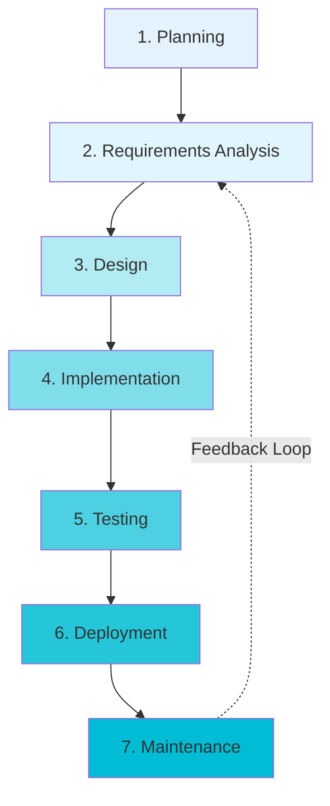

### Phase Overview Table

| Phase | Primary Question | Key Activities | Duration (Typical) |
|-------|-----------------|----------------|-------------------|
| **1. Planning** | Why build this? | Feasibility, budgeting, scheduling | 1-2 weeks |
| **2. Requirements** | What to build? | Gathering, documenting, validating needs | 2-4 weeks |
| **3. Design** | How to build it? | Architecture, UI/UX, database design | 2-6 weeks |
| **4. Implementation** | Building it | Coding, code reviews, integration | 8-20 weeks |
| **5. Testing** | Does it work? | Unit, integration, system, UAT | 2-6 weeks |
| **6. Deployment** | Release to users | Installation, configuration, go-live | 1-2 weeks |
| **7. Maintenance** | Keep it working | Bug fixes, updates, enhancements | Ongoing |

---

## 📋 Phase 1: Planning

### Purpose
Establish project viability and create a roadmap for success.

### Key Question
**"Should we build this software? Is it feasible and worth the investment?"**

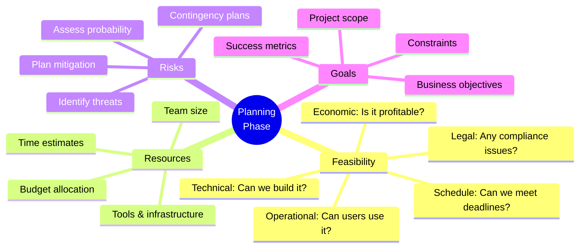

### Core Activities

#### 1. Feasibility Study

**Technical Feasibility:**
- Do we have the technical expertise?
- Is the technology mature enough?
- Can it integrate with existing systems?

**Economic Feasibility:**
- Cost-Benefit Analysis
- Return on Investment (ROI)
- Total Cost of Ownership (TCO)

**Example - School Management System:**

| Cost Category | Amount | Benefit Category | Value/Year |
|---------------|--------|------------------|------------|
| Development | $150,000 | Admin time saved | $45,000 |
| Infrastructure | $20,000 | Teacher efficiency | $35,000 |
| Training | $10,000 | Parent satisfaction | $12,000 |
| **Total Cost** | **$180,000** | **Total Benefit** | **$92,000** |
| | | **ROI (2 years)** | **2.3% positive** |

#### 2. Project Charter Development

A project charter typically includes:

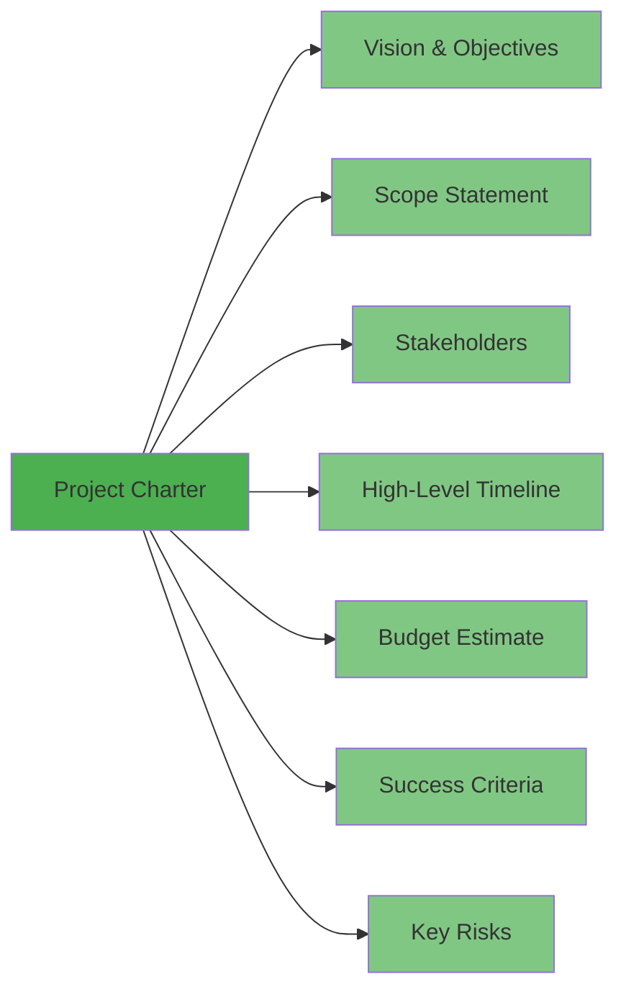

#### 3. Stakeholder Identification

**Example Stakeholder Map:**

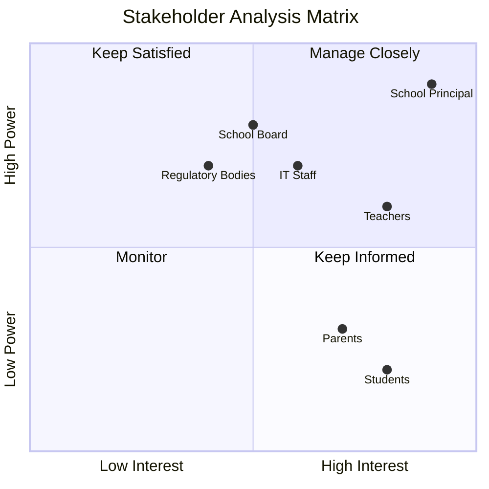

### Deliverables

- ✅ Project Charter
- ✅ Feasibility Study Report
- ✅ Preliminary Budget
- ✅ High-Level Timeline
- ✅ Stakeholder Register
- ✅ Initial Risk Register

### Real-World Example

**Spotify's Planning Phase (2006):**
- **Vision:** Legal music streaming service
- **Feasibility:** Secured music label agreements (biggest risk)
- **Budget:** $10M initial funding
- **Timeline:** 18 months to launch
- **Success Metric:** 1M users in first year
- **Result:** Launched April 2008, achieved goal by 2009

---

## 📊 Phase 2: Requirements Analysis

### Purpose
Define WHAT the software must do (not HOW).

### Key Question
**"What exactly do users need the system to do?"**

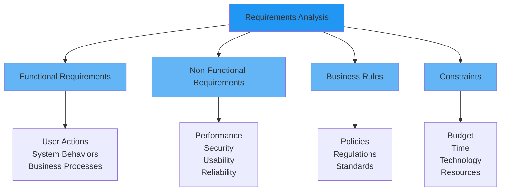

### Core Activities

#### 1. Requirements Elicitation Techniques

| Technique | Best For | Example |
|-----------|----------|---------|
| **Interviews** | In-depth understanding from key stakeholders | One-on-one with school principal |
| **Surveys/Questionnaires** | Gathering input from many users | Survey 100+ teachers |
| **Workshops** | Collaborative requirement definition | Day-long session with teachers |
| **Observation** | Understanding actual work processes | Shadow teachers for a day |
| **Document Analysis** | Understanding existing processes | Review current paper forms |
| **Prototyping** | Validating UI/UX concepts | Clickable mockup of dashboard |

#### 2. Functional vs. Non-Functional Requirements

**Functional Requirements (What the system does):**

**School Management System Examples:**

| ID | Requirement | Priority |
|----|-------------|----------|
| FR-01 | System shall allow teachers to take attendance | Must Have |
| FR-02 | System shall calculate final grades automatically | Must Have |
| FR-03 | System shall send email notifications to parents | Should Have |
| FR-04 | System shall generate report cards in PDF format | Must Have |
| FR-05 | System shall allow students to view their grades | Should Have |
| FR-06 | System shall track student behavior incidents | Could Have |

**Non-Functional Requirements (How well the system performs):**

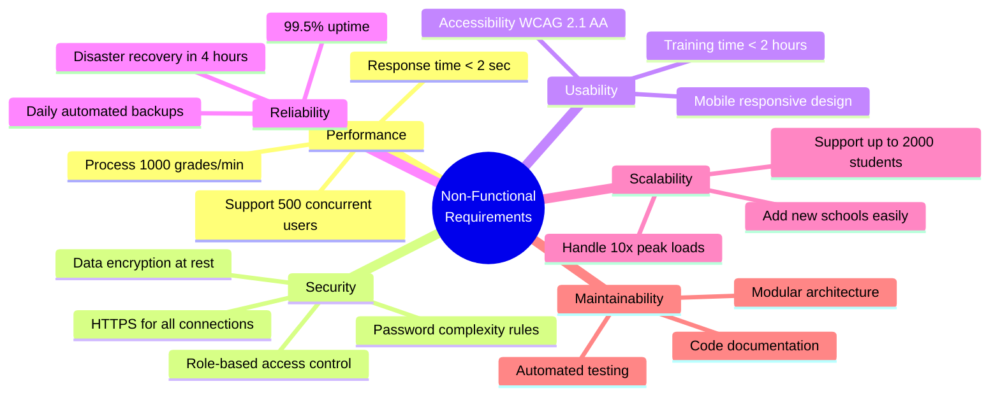

#### 3. Requirements Documentation

**User Story Format (Agile Approach):**

```
As a [role]
I want [feature]
So that [benefit]

Acceptance Criteria:
- Given [context]
- When [action]
- Then [outcome]
```

**Example User Story:**

```
US-019: Take Attendance

As a teacher
I want to quickly record student attendance for my class
So that I can track attendance patterns and parents stay informed

Acceptance Criteria:
- Given I am viewing my class roster
- When I mark students as present/absent/late
- Then the system saves attendance with timestamp
- And parents receive notification for absences within 1 hour
- And attendance is visible in student records immediately
- And I can edit attendance for up to 24 hours after recording
```

#### 4. Requirements Prioritization (MoSCoW Method)

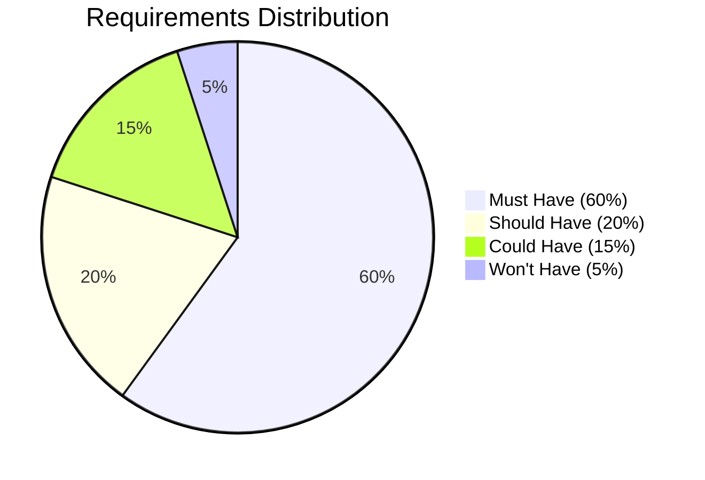

**Criteria for Prioritization:**
1. **Business Value:** Impact on core objectives
2. **Risk:** Technical or business risk reduction
3. **Dependencies:** Required for other features
4. **User Impact:** Number of users affected
5. **Regulatory:** Compliance requirements

### Deliverables

- ✅ Software Requirements Specification (SRS)
- ✅ User Stories with Acceptance Criteria
- ✅ Use Case Diagrams (detailed in Chapter 3)
- ✅ Requirements Traceability Matrix
- ✅ Glossary of Terms
- ✅ Data Dictionary

### Common Pitfalls

❌ **Ambiguous Requirements:**
- Bad: "System should be fast"
- Good: "System should load dashboard in < 2 seconds for 95% of requests"

❌ **Gold Plating:**
- Adding features users didn't ask for
- "Nice to have" becomes "must have"

❌ **Scope Creep:**
- Uncontrolled changes to requirements
- No formal change control process

---

## 🎨 Phase 3: Design

### Purpose
Define HOW the system will work to meet the requirements.

### Key Question
**"How will we structure and build this system?"**

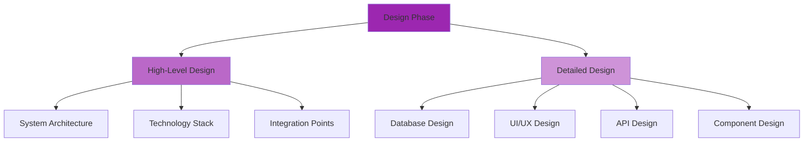

### Core Activities

#### 1. System Architecture Design

**Three-Tier Architecture Example (School Management System):**

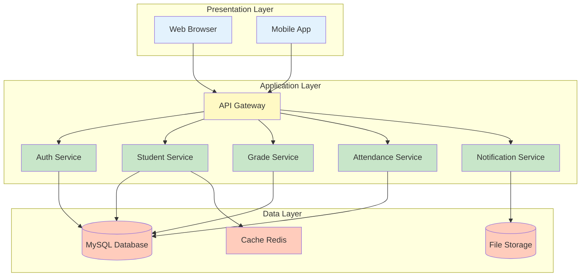

#### 2. Technology Stack Selection

**Example Technology Stack:**

| Layer | Technology | Justification |
|-------|------------|---------------|
| **Frontend** | React.js | Component-based, large community, fast |
| **Backend** | Node.js + Express | JavaScript full-stack, scalable, async |
| **Database** | MySQL | Relational data, ACID compliance, mature |
| **Cache** | Redis | Fast, simple, supports sessions |
| **File Storage** | AWS S3 | Scalable, reliable, cost-effective |
| **Authentication** | JWT + bcrypt | Stateless, secure, industry standard |
| **API Style** | RESTful | Standard, well-understood, tooling |

#### 3. Database Design

**Entity-Relationship Diagram Example:**

```mermaid
erDiagram
    STUDENT ||--o{ ENROLLMENT : "enrolls in"
    TEACHER ||--o{ CLASS : "teaches"
    CLASS ||--o{ ENROLLMENT : "has"
    ENROLLMENT ||--o{ ATTENDANCE : "tracks"
    ENROLLMENT ||--o{ GRADE : "earns"
    STUDENT ||--o{ PARENT_LINK : "linked to"
    PARENT ||--o{ PARENT_LINK : "linked to"
    
    STUDENT {
        int student_id PK
        string first_name
        string last_name
        date date_of_birth
        string email
        date enrollment_date
    }
    
    TEACHER {
        int teacher_id PK
        string first_name
        string last_name
        string email
        string department
    }
    
    CLASS {
        int class_id PK
        string class_name
        string section
        int teacher_id FK
        int academic_year
        string semester
    }
    
    ENROLLMENT {
        int enrollment_id PK
        int student_id FK
        int class_id FK
        date enrollment_date
    }
    
    ATTENDANCE {
        int attendance_id PK
        int enrollment_id FK
        date attendance_date
        string status
        time recorded_at
    }
    
    GRADE {
        int grade_id PK
        int enrollment_id FK
        string category
        decimal score
        decimal max_score
        date recorded_date
    }
```

#### 4. User Interface Design

**Wireframe Example - Teacher Dashboard:**

```mermaid
graph TD
    A[Header: School Logo | Teacher Name | Logout]
    B[Navigation: Classes | Attendance | Grades | Reports]
    C[Main Content: My Classes Grid]
    D[Card 1: Math 101-A<br/>25 Students<br/>Quick Actions]
    E[Card 2: Math 102-B<br/>28 Students<br/>Quick Actions]
    F[Card 3: Algebra-C<br/>22 Students<br/>Quick Actions]
    G[Sidebar: Quick Stats<br/>Today's Schedule<br/>Recent Activity]
    
    A --> B
    B --> C
    C --> D
    C --> E
    C --> F
    C --> G
    
    style A fill:#2196f3
    style B fill:#64b5f6
    style C fill:#e3f2fd
    style D fill:#bbdefb
    style E fill:#bbdefb
    style F fill:#bbdefb
    style G fill:#90caf9
```

#### 5. API Design

**RESTful API Endpoint Structure:**

```mermaid
graph LR
    A[API Gateway<br/>api.school.com] --> B[/auth/*]
    A --> C[/students/*]
    A --> D[/teachers/*]
    A --> E[/classes/*]
    A --> F[/attendance/*]
    A --> G[/grades/*]
    
    B --> B1[POST /login<br/>POST /logout<br/>POST /reset-password]
    C --> C1[GET /students<br/>GET /students/:id<br/>POST /students<br/>PUT /students/:id]
    F --> F1[POST /attendance<br/>GET /attendance/class/:id<br/>PUT /attendance/:id]
    
    style A fill:#4caf50
    style B fill:#81c784
    style C fill:#81c784
    style D fill:#81c784
    style E fill:#81c784
    style F fill:#81c784
    style G fill:#81c784
```

**Example API Specification:**

```
Endpoint: POST /api/attendance
Description: Record attendance for a class session
Authentication: Required (JWT token)
Authorization: Teacher role, assigned to the class

Request Body:
{
  "class_id": 101,
  "attendance_date": "2025-11-10",
  "records": [
    {"student_id": 1001, "status": "present"},
    {"student_id": 1002, "status": "absent"},
    {"student_id": 1003, "status": "late"}
  ]
}

Response (200 OK):
{
  "success": true,
  "attendance_id": 5678,
  "recorded_at": "2025-11-10T09:15:30Z",
  "notifications_sent": 1
}

Error Response (403 Forbidden):
{
  "success": false,
  "error": "Not authorized to record attendance for this class"
}
```

### Deliverables

- ✅ System Architecture Document
- ✅ Database Schema (ERD + SQL scripts)
- ✅ UI/UX Wireframes and Mockups
- ✅ API Specification
- ✅ Component Design Documents
- ✅ Design Patterns Documentation
- ✅ Security Design Document

### Design Principles

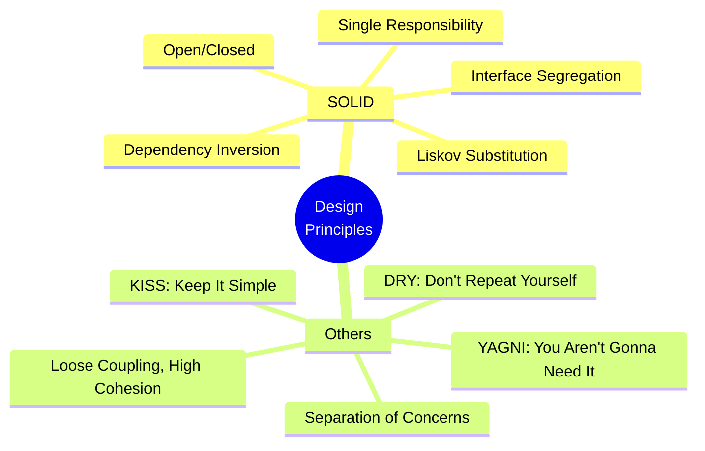

---

## 💻 Phase 4: Implementation (Development)

### Purpose
Transform design into working software through coding.

### Key Question
**"Let's build it!"**

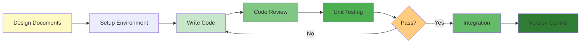

### Core Activities

#### 1. Development Environment Setup

**Typical Setup Checklist:**

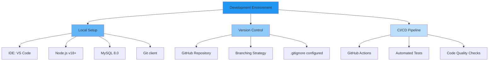

#### 2. Coding Standards

**Example Code Structure:**

```
school-management-system/
├── frontend/
│   ├── src/
│   │   ├── components/
│   │   ├── pages/
│   │   ├── services/
│   │   ├── utils/
│   │   └── App.js
│   └── package.json
├── backend/
│   ├── src/
│   │   ├── controllers/
│   │   ├── models/
│   │   ├── routes/
│   │   ├── middleware/
│   │   ├── services/
│   │   └── server.js
│   └── package.json
├── database/
│   ├── migrations/
│   ├── seeds/
│   └── schema.sql
├── docs/
└── README.md
```

#### 3. Version Control Workflow (Git Flow)

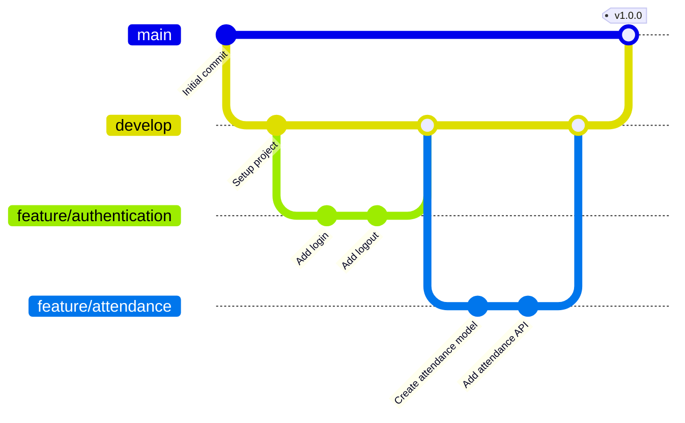

#### 4. Code Review Process

**Code Review Checklist:**

| Category | Check Points |
|----------|--------------|
| **Functionality** | ✓ Meets requirements<br/>✓ Handles edge cases<br/>✓ Error handling present |
| **Code Quality** | ✓ Follows style guide<br/>✓ DRY principle applied<br/>✓ Proper naming conventions |
| **Testing** | ✓ Unit tests included<br/>✓ Test coverage >80%<br/>✓ Tests pass |
| **Security** | ✓ Input validation<br/>✓ SQL injection prevention<br/>✓ Authentication checked |
| **Performance** | ✓ No N+1 queries<br/>✓ Appropriate caching<br/>✓ Async operations used |
| **Documentation** | ✓ Code comments<br/>✓ API docs updated<br/>✓ README updated |

### Deliverables

- ✅ Source Code (in version control)
- ✅ Unit Tests
- ✅ Code Documentation
- ✅ Build Scripts
- ✅ API Documentation (updated)
- ✅ Developer Guide

### Development Best Practices

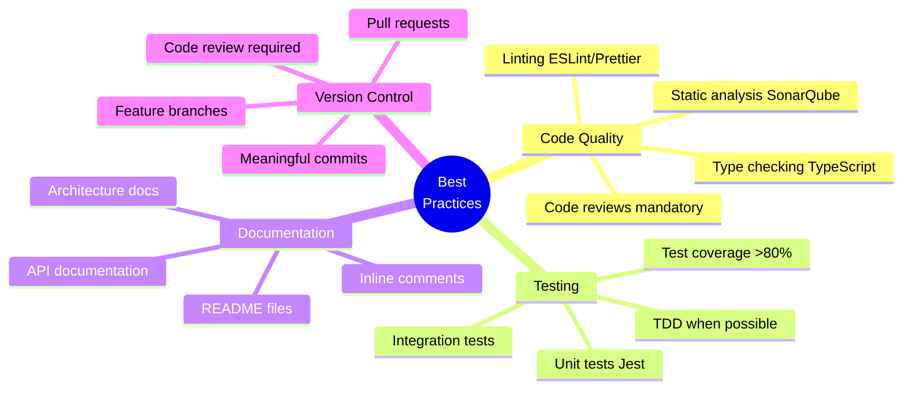

---

## 🧪 Phase 5: Testing

### Purpose
Verify the software works correctly and meets requirements.

### Key Question
**"Does it work as expected? Are there any bugs?"**

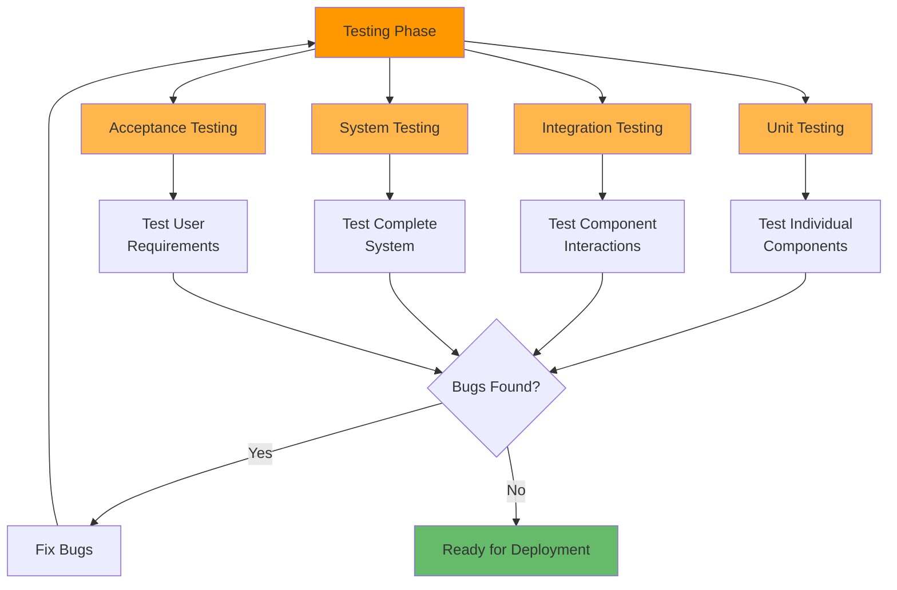

### Testing Levels

#### 1. Unit Testing

**Purpose:** Test individual functions/methods in isolation

**Example Unit Test (Jest/JavaScript):**

```javascript
// Function to test
function calculateFinalGrade(grades, weights) {
  let totalScore = 0;
  let totalWeight = 0;
  
  for (let i = 0; i < grades.length; i++) {
    totalScore += grades[i] * weights[i];
    totalWeight += weights[i];
  }
  
  return totalScore / totalWeight;
}

// Unit test
describe('calculateFinalGrade', () => {
  test('calculates weighted average correctly', () => {
    const grades = [90, 85, 95];
    const weights = [0.3, 0.3, 0.4];
    const result = calculateFinalGrade(grades, weights);
    expect(result).toBeCloseTo(90);
  });
  
  test('handles single grade', () => {
    const grades = [95];
    const weights = [1.0];
    const result = calculateFinalGrade(grades, weights);
    expect(result).toBe(95);
  });
});
```

#### 2. Integration Testing

**Purpose:** Test how components work together

**Example Scenarios:**
- Test attendance API endpoint with database
- Test authentication middleware with protected routes
- Test grade calculation with notification service

#### 3. System Testing

**Purpose:** Test the complete, integrated system

**Test Types:**

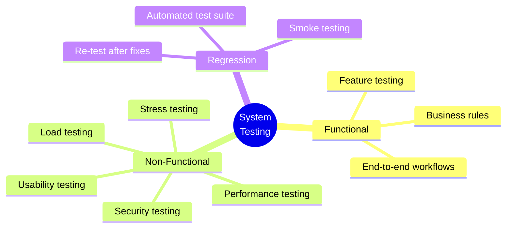

#### 4. User Acceptance Testing (UAT)

**Purpose:** Validate system meets business requirements

**UAT Process:**

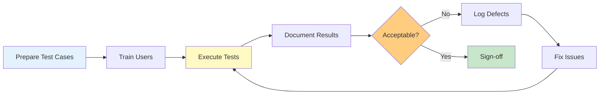

### Testing Metrics

**Key Metrics to Track:**

| Metric | Target | Purpose |
|--------|--------|---------|
| **Code Coverage** | >80% | Ensure adequate testing |
| **Defect Density** | <5 per KLOC | Measure code quality |
| **Test Pass Rate** | >95% | Track testing effectiveness |
| **Defect Detection %** | >90% | Testing efficiency |
| **Mean Time to Detect** | <2 days | Bug identification speed |
| **Mean Time to Fix** | <5 days | Bug resolution speed |

### Deliverables

- ✅ Test Plans and Test Cases
- ✅ Test Scripts (automated)
- ✅ Test Reports
- ✅ Defect Reports
- ✅ Test Coverage Reports
- ✅ UAT Sign-off Document

---

## 🚀 Phase 6: Deployment

### Purpose
Release the software to production environment for end users.

### Key Question
**"How do we safely release this to users?"**

```mermaid
graph TD
    A[Deployment Ready] --> B[Pre-Deployment]
    B --> C[Deployment]
    C --> D[Post-Deployment]
    
    B --> B1[Backup Production]
    B --> B2[Final Testing]
    B --> B3[User Notification]
    B --> B4[Rollback Plan]
    
    C --> C1[Deploy to Production]
    C --> C2[Database Migration]
    C --> C3[Configure Systems]
    C --> C4[Smoke Testing]
    
    D --> D1[Monitor Systems]
    D --> D2[User Support]
    D --> D3[Performance Check]
    D --> D4[Document Issues]
    
    style A fill:#4caf50
    style B fill:#81c784
    style C fill:#ffb74d
    style D fill:#64b5f6
```

### Deployment Strategies

#### 1. Blue-Green Deployment

```mermaid
graph LR
    A[Load Balancer] --> B[Blue Environment<br/>Current Version]
    A -.Switch.-> C[Green Environment<br/>New Version]
    
    D[Users] --> A
    
    B --> E[(Database)]
    C --> E
    
    style B fill:#2196f3
    style C fill:#4caf50
    style A fill:#ff9800
```

**Advantages:**
- Zero downtime
- Easy rollback (just switch back)
- Full testing in production environment

#### 2. Rolling Deployment

```mermaid
graph TD
    A[Start: All Servers v1.0] --> B[Update Server 1 to v2.0]
    B --> C[Test Server 1]
    C --> D{Working?}
    D -->|Yes| E[Update Server 2 to v2.0]
    D -->|No| F[Rollback Server 1]
    E --> G[Update Server 3 to v2.0]
    G --> H[All Servers v2.0]
    
    style A fill:#2196f3
    style H fill:#4caf50
    style F fill:#f44336
```

#### 3. Canary Deployment

**Phase Rollout:**

```mermaid
pie title User Distribution During Canary Deployment
    "Old Version" : 90
    "New Version (Canary)" : 10
```

**Process:**
1. Deploy to 10% of users
2. Monitor for issues (24 hours)
3. If stable, deploy to 50%
4. Monitor for issues (24 hours)
5. If stable, deploy to 100%

### Deployment Checklist

**Pre-Deployment:**
- [ ] All tests passed
- [ ] UAT sign-off obtained
- [ ] Backup completed
- [ ] Rollback plan documented
- [ ] Deployment runbook prepared
- [ ] Stakeholders notified
- [ ] Support team briefed
- [ ] Maintenance window scheduled

**During Deployment:**
- [ ] Follow deployment runbook
- [ ] Execute database migrations
- [ ] Deploy application code
- [ ] Update configuration
- [ ] Run smoke tests
- [ ] Monitor system metrics

**Post-Deployment:**
- [ ] Verify core functionality
- [ ] Check system performance
- [ ] Monitor error rates
- [ ] Review user feedback
- [ ] Document any issues
- [ ] Send completion notification

### Deliverables

- ✅ Deployment Plan
- ✅ Release Notes
- ✅ User Documentation
- ✅ Training Materials
- ✅ System Administration Guide
- ✅ Rollback Procedures
- ✅ Post-Deployment Report

---

## 🔧 Phase 7: Maintenance

### Purpose
Keep the system running smoothly and evolving with user needs.

### Key Question
**"How do we keep this system healthy and improving?"**

```mermaid
mindmap
  root((Maintenance<br/>Phase))
    Corrective
      Bug fixes
      Error corrections
      Performance issues
    Adaptive
      OS updates
      Database upgrades
      API changes
      Compliance updates
    Perfective
      Feature enhancements
      UI improvements
      Performance optimization
      Refactoring
    Preventive
      Code cleanup
      Documentation updates
      Security patches
      Dependency updates
```

### Types of Maintenance

#### 1. Corrective Maintenance (Bug Fixes)

**Bug Priority System:**

| Priority | Response Time | Resolution Time | Example |
|----------|--------------|-----------------|---------|
| **Critical (P0)** | 1 hour | 4 hours | System down, data loss |
| **High (P1)** | 4 hours | 24 hours | Major feature broken |
| **Medium (P2)** | 1 day | 1 week | Minor feature issue |
| **Low (P3)** | 1 week | Next release | Cosmetic issues |

#### 2. Adaptive Maintenance (Environment Changes)

**Example Adaptive Changes:**
- Update to new React version
- Migrate from MySQL 5.7 to 8.0
- Adapt to new browser security policies
- Comply with new data privacy regulations

#### 3. Perfective Maintenance (Improvements)

**Enhancement Request Process:**

```mermaid
graph LR
    A[User Request] --> B[Log Ticket]
    B --> C[Prioritize]
    C --> D[Estimate Effort]
    D --> E{Approved?}
    E -->|Yes| F[Add to Backlog]
    E -->|No| G[Decline with Reason]
    F --> H[Plan for Sprint]
    H --> I[Implement]
    I --> J[Deploy]
    
    style A fill:#e3f2fd
    style E fill:#fff9c4
    style I fill:#c8e6c9
    style J fill:#81c784
```

#### 4. Preventive Maintenance (Future-proofing)

**Monthly Maintenance Tasks:**
- Security patches
- Dependency updates
- Database optimization
- Log file cleanup
- Performance monitoring review
- Backup verification
- Documentation updates

### Maintenance Metrics

**Key Performance Indicators:**

```mermaid
graph TD
    A[Maintenance KPIs] --> B[System Uptime<br/>Target: 99.5%]
    A --> C[Mean Time to Repair<br/>Target: <4 hours]
    A --> D[User Satisfaction<br/>Target: >4.0/5.0]
    A --> E[Response Time<br/>Target: <2 seconds]
    A --> F[Bug Recurrence Rate<br/>Target: <5%]
    
    style A fill:#2196f3
    style B fill:#4caf50
    style C fill:#4caf50
    style D fill:#4caf50
    style E fill:#4caf50
    style F fill:#4caf50
```

### Support Structure

**Three-Tier Support Model:**

| Tier | Role | Responsibilities | Escalation Time |
|------|------|------------------|-----------------|
| **Tier 1** | Help Desk | Answer basic questions, password resets | 30 min if unresolved |
| **Tier 2** | Technical Support | Debug issues, workarounds, minor fixes | 2 hours if unresolved |
| **Tier 3** | Development Team | Code fixes, system issues, architecture | Varies by priority |

### Deliverables (Ongoing)

- ✅ Bug Fix Releases
- ✅ Maintenance Reports
- ✅ Performance Reports
- ✅ Update Documentation
- ✅ User Feedback Analysis
- ✅ Enhancement Proposals

---

## 🔄 Phase Interactions and Dependencies

### How Phases Connect

```mermaid
graph TD
    A[Planning] -->|Project Charter| B[Requirements]
    B -->|SRS Document| C[Design]
    C -->|Design Specs| D[Implementation]
    D -->|Source Code| E[Testing]
    E -->|Test Results| D
    E -->|Quality Approved| F[Deployment]
    F -->|Production System| G[Maintenance]
    G -->|Change Requests| B
    G -->|Bug Reports| D
    
    style A fill:#e3f2fd
    style B fill:#e1f5fe
    style C fill:#b2ebf2
    style D fill:#80deea
    style E fill:#4dd0e1
    style F fill:#26c6da
    style G fill:#00bcd4
```

### Critical Handoffs

**Key Documents Between Phases:**

| From Phase | To Phase | Document | Purpose |
|------------|----------|----------|---------|
| Planning | Requirements | Project Charter | Scope and objectives |
| Requirements | Design | SRS Document | What to build |
| Design | Implementation | Design Specifications | How to build |
| Implementation | Testing | Source Code + Docs | What to test |
| Testing | Deployment | Test Reports | Quality verification |
| Deployment | Maintenance | System Docs | How to support |

---

## 🎓 Hands-On Activity: Phase Mapping

### Activity: "Where Does This Belong?"

**Time:** 15 minutes  
**Format:** Individual or pairs

**Instructions:**
For each activity below, identify which SDLC phase it belongs to:

| Activity | SDLC Phase | Deliverable |
|----------|------------|-------------|
| Creating wireframes | | |
| Fixing a production bug | | |
| Conducting stakeholder interviews | | |
| Writing unit tests | | |
| Performing load testing | | |
| Calculating project ROI | | |
| Writing JavaScript code | | |
| Updating user documentation | | |
| Creating database schema | | |
| Deploying to production servers | | |
| Prioritizing feature requests | | |
| Code review session | | |

**Answers at end of Section 1.10**

---

## 🔑 Key Concepts Summary

### Critical Points to Remember

1. **Seven phases make up SDLC:** Planning, Requirements, Design, Implementation, Testing, Deployment, Maintenance

2. **Each phase has distinct objectives:**
   - Planning: Should we build this?
   - Requirements: What should we build?
   - Design: How should we build it?
   - Implementation: Build it!
   - Testing: Does it work?
   - Deployment: Release it!
   - Maintenance: Keep it working!

3. **Phases are interdependent:** Each phase builds on the previous one

4. **Documentation is critical:** Each phase produces deliverables used by subsequent phases

5. **Feedback loops exist:** Issues found in later phases may require revisiting earlier phases

6. **Not always strictly sequential:** Modern methodologies (Agile) may iterate through phases multiple times

### Phase Duration Distribution (Typical)

```mermaid
pie title Time Allocation by Phase (%)
    "Planning" : 5
    "Requirements" : 10
    "Design" : 15
    "Implementation" : 40
    "Testing" : 20
    "Deployment" : 5
    "Maintenance" : 5
```

*Note: Maintenance continues long-term, so its percentage represents initial setup*

---

## ✅ Self-Check Questions

Test your understanding:

1. What are the seven phases of SDLC in order?
2. Which phase answers "What should we build?" vs. "How should we build it?"
3. What is the difference between corrective and preventive maintenance?
4. Why is it important to create documentation in each phase?
5. In which phase would you create an Entity-Relationship Diagram?
6. What happens if requirements are poorly defined in Phase 2?
7. Name three types of testing that occur in the Testing phase.
8. What is the purpose of a rollback plan in the Deployment phase?

**Answers at the end of Section 1.10**

---

## 🚀 What's Next?

Now that you understand the fundamental phases of SDLC, the next section explores different SDLC models—various ways to organize and execute these phases. You'll learn about traditional models like Waterfall, Spiral, and V-Model.

**Next Section:** [1.3 Traditional SDLC Models →](./1.3-traditional-models.md)

---

## 📚 Additional Resources

**For Deeper Learning:**
- IEEE Standard 12207 (Systems and Software Engineering - Software Life Cycle Processes)
- ISO/IEC/IEEE 15288 (Systems and Software Engineering - System Life Cycle Processes)
- SWEBOK (Software Engineering Body of Knowledge) - Chapter on Software Process

**Recommended Reading:**
- "Software Engineering" by Ian Sommerville - Chapters 2-4
- "The Pragmatic Programmer" by Hunt & Thomas - Process sections

---

[← Previous: 1.1 Why SDLC Matters](./1.1-why-sdlc-matters.md) | [Back to README](./chapter-01-README.md) | [Next: 1.3 Traditional Models →](./1.3-traditional-models.md)

---

*Last Updated: November 2025*  
*Version: 1.0*
