# 1.4 Agile Methodologies

[← Previous: 1.3 Traditional Models](./1.3-traditional-models.md) | [Back to README](./chapter-01-README.md) | [Next: 1.5 Scrum Deep Dive →](./1.5-scrum-deep-dive.md)

---

## 📖 Introduction

In the late 1990s, software developers were frustrated. Traditional methods like Waterfall worked for building bridges and buildings, but software was different—requirements changed constantly, technology evolved rapidly, and customers wanted to see results quickly. This frustration led to a revolution: **Agile**.

Agile isn't just a methodology; it's a mindset. It represents a fundamental shift from rigid, plan-driven approaches to flexible, value-driven development. In this section, you'll learn why Agile emerged, what makes it different, and the most popular Agile frameworks used today.

**Reading Time:** 35 minutes  
**Activity Time:** 15 minutes

---

## 🎯 Learning Objectives

By the end of this section, you will be able to:

1. Explain the history and motivation behind the Agile movement
2. Describe the four values and twelve principles of the Agile Manifesto
3. Compare traditional and Agile approaches
4. Understand the core concepts of Scrum, Kanban, and XP
5. Identify when Agile is appropriate (and when it's not)
6. Apply Agile principles to real-world scenarios

---

## 🌟 The Birth of Agile

### The Problem with Traditional Methods (1990s)

**Industry Pain Points:**

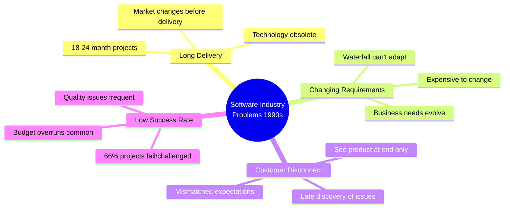

### The Snowbird Meeting (February 2001)

**Historic Context:**
17 software developers met at a ski resort in Snowbird, Utah to discuss lightweight development methods.

**The Participants:**
- Kent Beck (Extreme Programming)
- Martin Fowler (Refactoring expert)
- Jeff Sutherland (Scrum co-creator)
- Ken Schwaber (Scrum co-creator)
- And 13 other thought leaders

**The Outcome:** The Agile Manifesto

---

## 📜 The Agile Manifesto

### Four Core Values

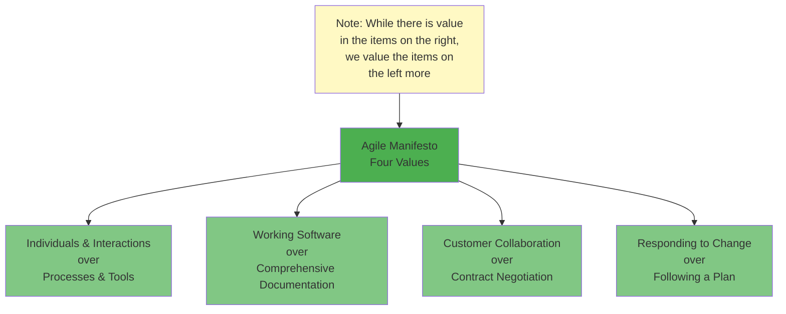

### Understanding Each Value

#### Value 1: Individuals and Interactions > Processes and Tools

**Traditional Approach:**
- Heavy reliance on documentation and tools
- Rigid processes must be followed
- Communication through formal channels
- Tools dictate workflow

**Agile Approach:**
- Face-to-face communication preferred
- Processes adapted to team needs
- Collaboration and teamwork emphasized
- Tools serve the team, not vice versa

**Example:**

| Scenario | Traditional | Agile |
|----------|-------------|-------|
| **Requirement Clarification** | Write formal change request, wait for approval meeting in 2 weeks | Walk to Product Owner's desk, discuss in 5 minutes |
| **Code Review** | Submit formal review request, wait for written feedback | Pair programming or immediate peer review |
| **Problem Solving** | Follow escalation process, create ticket, wait for response | Team huddles, solves together in 15 minutes |

#### Value 2: Working Software > Comprehensive Documentation

**Traditional Approach:**
- Hundreds of pages of documentation
- Complete specs before coding
- Documentation primary deliverable
- Working software comes last

**Agile Approach:**
- Working software is primary measure of progress
- Documentation created as needed
- "Just enough" documentation
- Code and tests are documentation

**What This Doesn't Mean:**
- ❌ No documentation at all
- ❌ Poor quality acceptable
- ❌ Ignore architecture

**What It Does Mean:**
- ✅ Prioritize working software
- ✅ Documentation serves working software
- ✅ Focus on value delivery

**School System Example:**

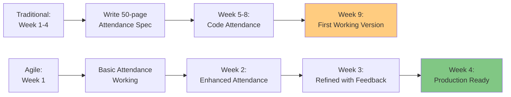

#### Value 3: Customer Collaboration > Contract Negotiation

**Traditional Approach:**
- Detailed contract defines everything
- Changes require renegotiation
- Customer involvement at start and end only
- Adversarial relationship

**Agile Approach:**
- Customer is part of the team
- Continuous collaboration
- Flexibility in scope
- Partnership relationship

**Collaboration Model:**

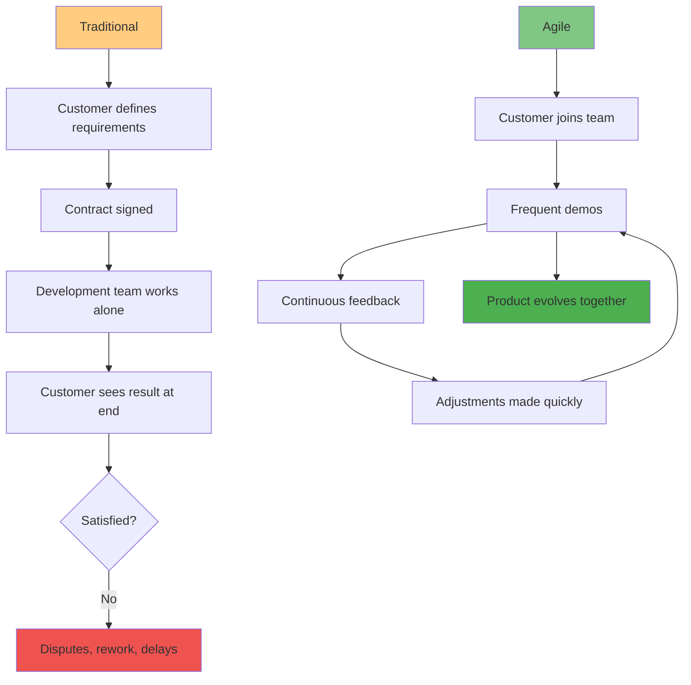

#### Value 4: Responding to Change > Following a Plan

**Traditional Approach:**
- Plan created at start
- Changes are problems to avoid
- Change control board gatekeeps
- Plan adherence is success metric

**Agile Approach:**
- Plans are guidelines, not contracts
- Change is expected and embraced
- Adapt quickly to new information
- Customer value is success metric

**Change Response Timeline:**

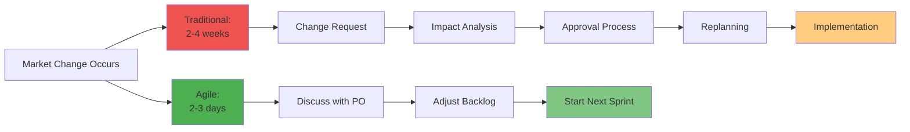

---

## 🎯 The Twelve Agile Principles

Beyond the four values, the Agile Manifesto includes twelve guiding principles:

### Principles Organized by Theme

#### Theme 1: Customer Satisfaction

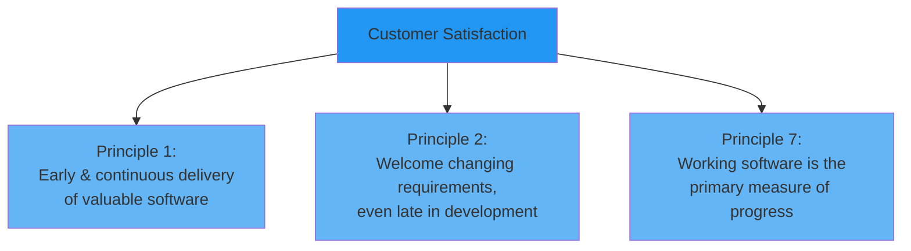

**Principle 1:** "Our highest priority is to satisfy the customer through early and continuous delivery of valuable software."

**In Practice:**
- Deploy working software every 2 weeks (Scrum sprint)
- Release features as soon as ready
- Don't wait for everything to be perfect

**Principle 2:** "Welcome changing requirements, even late in development. Agile processes harness change for the customer's competitive advantage."

**In Practice:**
- Product backlog is constantly refined
- Can add/remove features each sprint
- Market changes inform priorities

---

#### Theme 2: Delivery Frequency

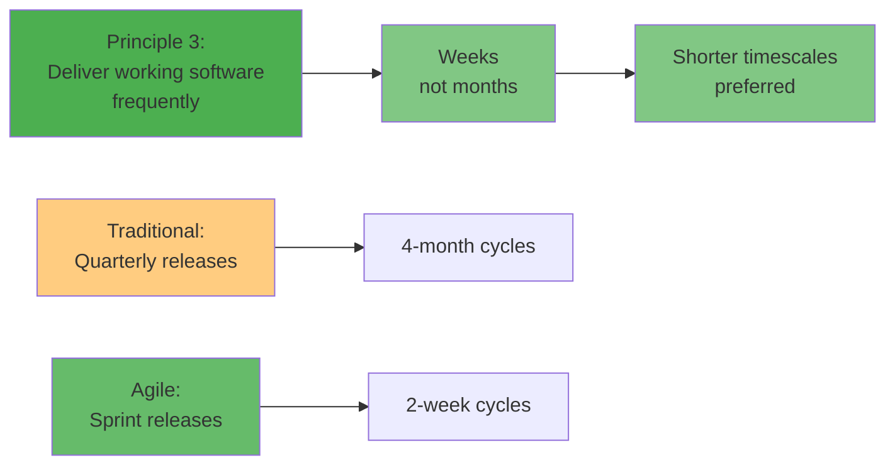

**Principle 3:** "Deliver working software frequently, from a couple of weeks to a couple of months, with a preference to the shorter timescale."

**School System Example:**

| Week | Deliverable | User Value |
|------|-------------|------------|
| Week 2 | Basic login & student list | Admins can access system |
| Week 4 | Attendance tracking | Teachers save 15 min/class |
| Week 6 | Grade entry | Teachers enter grades digitally |
| Week 8 | Parent portal | Parents see real-time updates |

---

#### Theme 3: Collaboration

**Principle 4:** "Business people and developers must work together daily throughout the project."

**Daily Collaboration Model:**

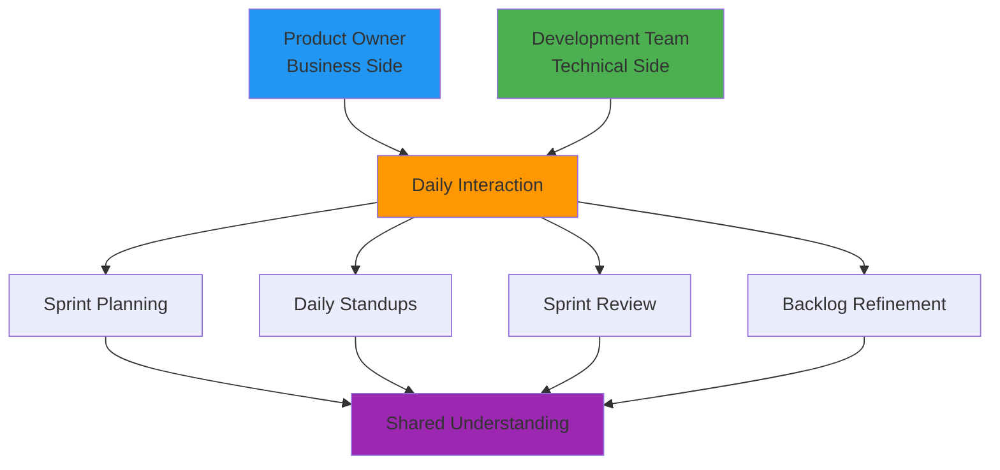

---

#### Theme 4: Motivation and Environment

**Principle 5:** "Build projects around motivated individuals. Give them the environment and support they need, and trust them to get the job done."

**Trust-Based Model:**

| Traditional | Agile |
|-------------|-------|
| Micromanagement | Self-organization |
| Time tracking | Outcome tracking |
| Command & control | Servant leadership |
| Individual accountability | Team accountability |
| Process compliance | Value delivery |

**Principle 6:** "The most efficient and effective method of conveying information to and within a development team is face-to-face conversation."

**Communication Effectiveness:**

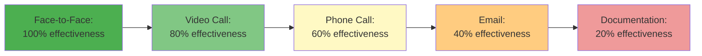

---

#### Theme 5: Technical Excellence

**Principle 8:** "Agile processes promote sustainable development. The sponsors, developers, and users should be able to maintain a constant pace indefinitely."

**Sustainable Pace:**

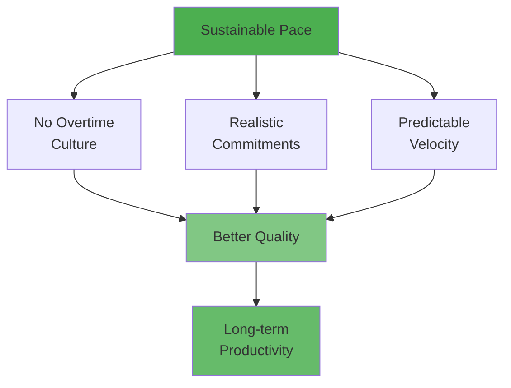

**Anti-Pattern (Death March):**
- Working 60-80 hours per week
- Unrealistic deadlines
- Burnout and turnover
- Declining code quality

**Agile Pattern:**
- 40-hour work weeks
- Sustainable commitments
- Team longevity
- Consistent quality

**Principle 9:** "Continuous attention to technical excellence and good design enhances agility."

**Technical Practices:**
- Automated testing (80%+ coverage)
- Continuous integration
- Code reviews
- Refactoring
- Clean code principles
- Design patterns

---

#### Theme 6: Simplicity

**Principle 10:** "Simplicity—the art of maximizing the amount of work not done—is essential."

**YAGNI Principle:** You Aren't Gonna Need It

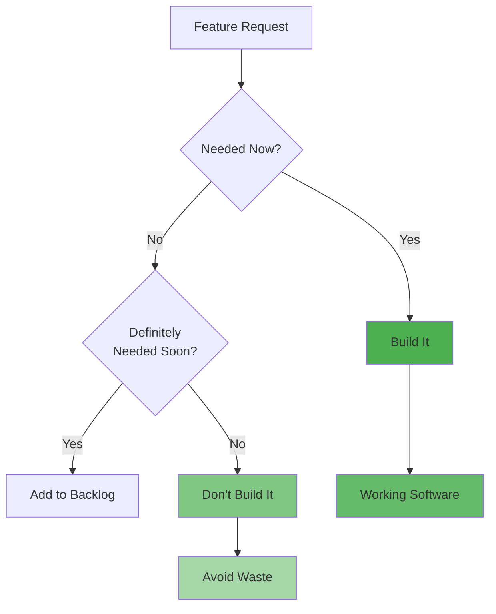

**Example - School System:**

**Over-Engineering (Traditional):**
```
Build attendance system that:
- Supports 50 different attendance statuses
- Integrates with 20 different third-party systems
- Has configurable workflows for every scenario
- Supports unlimited customization
Result: 6 months development, complex, hard to maintain
```

**Simplicity (Agile):**
```
Build attendance system that:
- Supports 4 attendance statuses (Present, Absent, Late, Excused)
- Sends email notifications
- Has one standard workflow
- Configurable only where needed
Result: 2 weeks development, simple, maintainable
```

---

#### Theme 7: Self-Organization

**Principle 11:** "The best architectures, requirements, and designs emerge from self-organizing teams."

**Self-Organizing Team Model:**

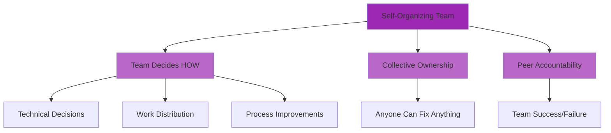

**Traditional (Command & Control):**
- Manager assigns tasks
- Individual work items
- Blame culture

**Agile (Self-Organizing):**
- Team pulls work from backlog
- Collective ownership
- Team accountability

---

#### Theme 8: Reflection

**Principle 12:** "At regular intervals, the team reflects on how to become more effective, then tunes and adjusts its behavior accordingly."

**Continuous Improvement Cycle:**

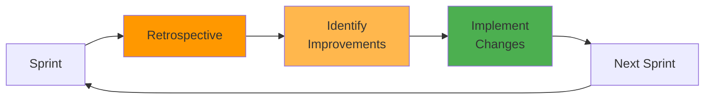

**Retrospective Questions:**
1. What went well?
2. What didn't go well?
3. What should we improve?

---

## 🆚 Traditional vs. Agile: Key Differences

### Fundamental Mindset Shift

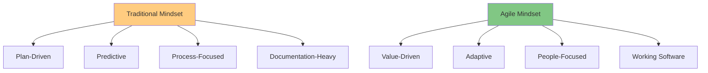

### Comparative Analysis

| Aspect | Traditional (Waterfall) | Agile |
|--------|------------------------|-------|
| **Development** | Sequential phases | Iterative & incremental |
| **Requirements** | Fixed at start | Evolving throughout |
| **Planning** | Extensive upfront | Progressive elaboration |
| **Customer Role** | Sign-off at milestones | Continuous involvement |
| **Delivery** | Single delivery at end | Frequent incremental delivery |
| **Change** | Resisted, expensive | Welcome, manageable |
| **Measurement** | Plan conformance | Working software |
| **Team Structure** | Specialized roles | Cross-functional |
| **Documentation** | Comprehensive | Just enough |
| **Risk** | Managed through planning | Managed through iteration |
| **Success Criteria** | On time, on budget | Customer value delivered |

### Project Timeline Comparison

**Traditional Project (12 months):**

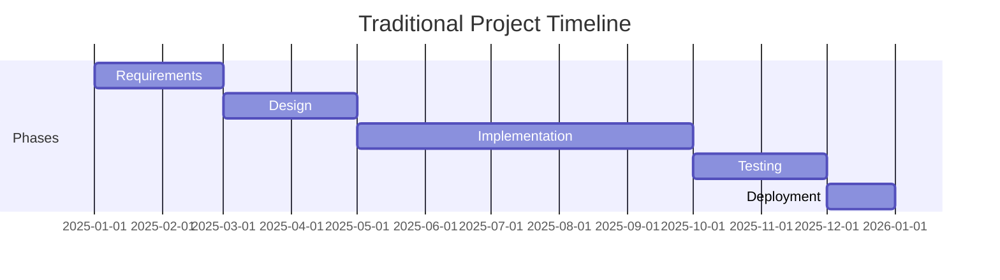

**User sees working software:** Month 12

---

**Agile Project (12 months):**

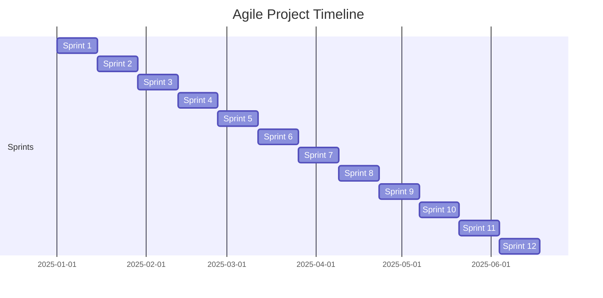

**User sees working software:** Every 2 weeks (24 deployments)

---

### Requirements Handling

**Traditional Approach:**

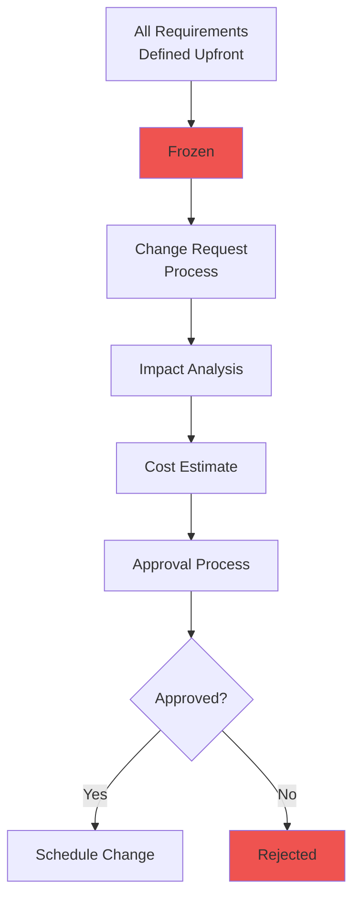

**Agile Approach:**

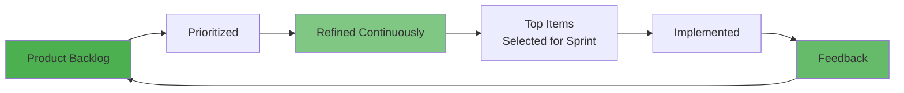

---

## 🏃 Popular Agile Frameworks

### The Agile Family

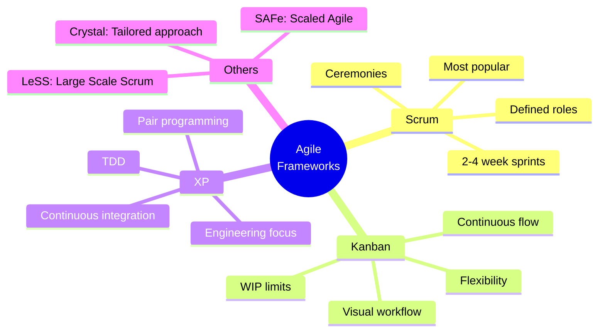

---

## 🏉 Scrum Overview (Brief Introduction)

**Note:** Detailed Scrum coverage in Section 1.5

### What is Scrum?

Scrum is the most widely used Agile framework. It provides structure through roles, events, and artifacts while maintaining Agile principles.

**Origin:** Developed by Jeff Sutherland and Ken Schwaber in early 1990s  
**Name:** From rugby term for team working together

### Scrum Framework at a Glance

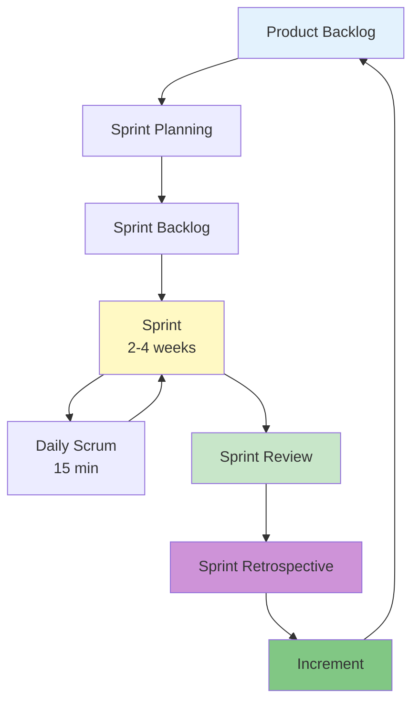

### Three Scrum Roles

```mermaid
graph LR
    A[Product Owner] --> D[Scrum Team]
    B[Scrum Master] --> D
    C[Development Team] --> D
    
    A --> E[WHAT to build<br/>Prioritization<br/>ROI focus]
    B --> F[HOW team works<br/>Remove impediments<br/>Coach process]
    C --> G[HOW to build<br/>Cross-functional<br/>Self-organizing]
    
    style A fill:#2196f3
    style B fill:#ff9800
    style C fill:#4caf50
```

### Five Scrum Events

| Event | Duration | Purpose |
|-------|----------|---------|
| **Sprint** | 2-4 weeks | Timebox for creating increment |
| **Sprint Planning** | 4-8 hours | Plan sprint work |
| **Daily Scrum** | 15 minutes | Daily synchronization |
| **Sprint Review** | 2-4 hours | Demo and feedback |
| **Sprint Retrospective** | 1.5-3 hours | Team improvement |

### Key Benefits of Scrum

```mermaid
graph TD
    A[Scrum Benefits] --> B[Transparency<br/>Everyone sees progress]
    A --> C[Inspection<br/>Regular reviews]
    A --> D[Adaptation<br/>Continuous improvement]
    
    B --> E[Trust]
    C --> E
    D --> E
    
    E --> F[High Performance<br/>Teams]
    
    style A fill:#4caf50
    style E fill:#81c784
    style F fill:#66bb6a
```

**Statistics:**
- 75% of Agile teams use Scrum or Scrum hybrid
- 2x higher success rate than Waterfall
- 58% of organizations report improved productivity

---

## 📊 Kanban Overview

### What is Kanban?

Kanban is a visual workflow management method that emphasizes continuous flow and limiting work in progress.

**Origin:** Developed by Toyota for manufacturing (1940s), adapted for software (2000s)  
**Name:** Japanese for "visual card" or "signboard"

### Kanban Board

```mermaid
graph LR
    A[Backlog] --> B[To Do<br/>WIP: 5]
    B --> C[In Progress<br/>WIP: 3]
    C --> D[Code Review<br/>WIP: 2]
    D --> E[Testing<br/>WIP: 2]
    E --> F[Done]
    
    style A fill:#e3f2fd
    style B fill:#fff9c4
    style C fill:#ffcc80
    style D fill:#ce93d8
    style E fill:#90caf9
    style F fill:#81c784
```

### Kanban Principles

**1. Visualize Work**
- Make all work visible on a board
- See bottlenecks immediately
- Understand work distribution

**2. Limit Work in Progress (WIP)**

```mermaid
graph TD
    A[WIP Limits] --> B[Forces Focus]
    A --> C[Prevents Overload]
    A --> D[Reveals Bottlenecks]
    
    B --> E[Faster Delivery]
    C --> E
    D --> E
    
    style A fill:#ff9800
    style E fill:#4caf50
```

**Example WIP Limits:**

| Column | WIP Limit | Why |
|--------|-----------|-----|
| To Do | 10 | Don't over-commit |
| In Progress | 3 | Focus on completing, not starting |
| Code Review | 2 | Reviews happen quickly |
| Testing | 2 | Test as you go |

**3. Manage Flow**
- Track cycle time (start to finish)
- Optimize for throughput
- Identify and remove delays

**4. Make Policies Explicit**
- Define "ready" criteria
- Define "done" criteria
- Document workflow rules

**5. Continuous Improvement**
- Regular retrospectives
- Measure and optimize
- Kaizen philosophy

### Scrum vs. Kanban

| Aspect | Scrum | Kanban |
|--------|-------|--------|
| **Cadence** | Fixed sprints (2-4 weeks) | Continuous flow |
| **Roles** | Defined (PO, SM, Team) | No required roles |
| **Ceremonies** | Required events | Optional meetings |
| **Commitment** | Sprint commitment | No commitments |
| **Change** | During sprint planning | Anytime |
| **Metrics** | Velocity | Cycle time, throughput |
| **Board** | Reset each sprint | Continuous |
| **Best For** | Feature development | Maintenance, support |

### When to Use Kanban

✅ **Ideal Scenarios:**
- Support and maintenance teams
- Continuous delivery environments
- Variable work items (sizes differ greatly)
- No clear sprint boundaries
- Operations teams
- Marketing/content teams

---

## 💡 Extreme Programming (XP)

### What is XP?

Extreme Programming focuses on engineering excellence through technical practices.

**Origin:** Created by Kent Beck (1990s)  
**Philosophy:** Take good practices to the "extreme"

### XP Core Values

```mermaid
mindmap
  root((XP<br/>Values))
    Communication
      Pair programming
      Daily standup
      Collective ownership
    Simplicity
      Do simplest thing
      YAGNI principle
      Refactor constantly
    Feedback
      TDD
      Short iterations
      Continuous integration
    Courage
      Refactor code
      Throw away code
      Tell truth about progress
    Respect
      Team members
      Work-life balance
      Quality code
```

### XP Technical Practices

#### 1. Pair Programming

```mermaid
graph LR
    A[Developer 1<br/>Driver] --> C[One Computer]
    B[Developer 2<br/>Navigator] --> C
    
    C --> D[Better Code Quality]
    C --> E[Knowledge Sharing]
    C --> F[Fewer Bugs]
    
    style C fill:#4caf50
    style D fill:#81c784
    style E fill:#81c784
    style F fill:#81c784
```

**Benefits:**
- Real-time code review
- Knowledge transfer
- Better design decisions
- Reduced debugging time

**Roles rotate:**
- Driver: Types code
- Navigator: Reviews, thinks ahead, suggests improvements

#### 2. Test-Driven Development (TDD)

**TDD Cycle (Red-Green-Refactor):**

```mermaid
graph LR
    A[Write Test<br/>RED] --> B[Write Code<br/>GREEN]
    B --> C[Refactor<br/>CLEAN]
    C --> A
    
    style A fill:#ef5350
    style B fill:#4caf50
    style C fill:#2196f3
```

**Example TDD Process:**

```javascript
// 1. RED - Write failing test
test('calculateFinalGrade should return weighted average', () => {
  const grades = [90, 85, 95];
  const weights = [0.3, 0.3, 0.4];
  expect(calculateFinalGrade(grades, weights)).toBe(90);
});
// Test fails - function doesn't exist yet

// 2. GREEN - Write minimal code to pass
function calculateFinalGrade(grades, weights) {
  return 90; // Hardcoded to pass test
}
// Test passes

// 3. REFACTOR - Implement properly
function calculateFinalGrade(grades, weights) {
  let totalScore = 0;
  let totalWeight = 0;
  for (let i = 0; i < grades.length; i++) {
    totalScore += grades[i] * weights[i];
    totalWeight += weights[i];
  }
  return totalScore / totalWeight;
}
// Test still passes, code is proper
```

#### 3. Continuous Integration (CI)

```mermaid
graph LR
    A[Developer<br/>Commits Code] --> B[Automated Build]
    B --> C[Run Tests]
    C --> D{All Tests<br/>Pass?}
    D -->|Yes| E[Deploy to Staging]
    D -->|No| F[Notify Team<br/>Fix Immediately]
    
    style E fill:#4caf50
    style F fill:#ef5350
```

**CI Rules:**
- Integrate code multiple times per day
- Every commit triggers build
- Keep build time under 10 minutes
- Fix broken builds immediately

#### 4. Refactoring

**Continuous Code Improvement:**

```mermaid
graph TD
    A[Working Code] --> B[Identify Code Smell]
    B --> C[Refactor]
    C --> D[Run Tests]
    D --> E{Tests Pass?}
    E -->|Yes| F[Improved Code]
    E -->|No| G[Revert Changes]
    G --> A
    
    style F fill:#4caf50
    style G fill:#ef5350
```

**Common Refactorings:**
- Extract method
- Rename variables for clarity
- Remove duplication
- Simplify conditionals
- Improve naming

#### 5. Collective Code Ownership

```mermaid
graph TD
    A[Collective Ownership] --> B[Anyone Can<br/>Edit Any Code]
    A --> C[No Code Silos]
    A --> D[Team Responsibility]
    
    B --> E[Knowledge<br/>Distribution]
    C --> E
    D --> E
    
    E --> F[Reduced Risk]
    E --> G[Faster Development]
    
    style A fill:#9c27b0
    style E fill:#ba68c8
    style F fill:#ce93d8
    style G fill:#ce93d8
```

**Benefits:**
- No single point of failure
- Anyone can fix any bug
- Knowledge spreads naturally
- No code "ownership" battles

### XP Practices Summary

| Practice | Benefit | Challenge |
|----------|---------|-----------|
| **Pair Programming** | Quality, knowledge sharing | Resource intensive |
| **TDD** | Fewer bugs, better design | Learning curve |
| **CI** | Fast feedback, less integration pain | Setup effort |
| **Refactoring** | Clean code, maintainability | Time investment |
| **Collective Ownership** | Flexibility, resilience | Requires discipline |
| **Simple Design** | Maintainability, agility | Avoid over-simplification |
| **Coding Standards** | Consistency | Agreement needed |

---

## ✅ When to Use Agile (and When Not To)

### Agile Works Best When

```mermaid
mindmap
  root((Use Agile<br/>When))
    Requirements
      Unclear initially
      Expected to change
      Customer available
      Innovation needed
    Project
      Complex problem
      High uncertainty
      Evolving solution
      Rapid delivery needed
    Team
      Co-located or well-connected
      Experienced members
      Self-motivated
      Cross-functional
    Organization
      Open to change
      Trusts teams
      Values collaboration
      Customer-focused
```

### Agile May Not Work When

❌ **Avoid or Adapt Agile When:**

```mermaid
graph TD
    A[Consider Carefully] --> B[Fixed Requirements]
    A --> C[Fixed Price Contract]
    A --> D[Regulatory Environment]
    A --> E[Distributed Team Issues]
    A --> F[Inexperienced Team]
    
    B --> G[Hybrid: Agile + Waterfall]
    C --> G
    D --> G
    
    E --> H[Invest in Tools<br/>& Processes]
    F --> H
    
    style A fill:#ff9800
    style G fill:#2196f3
    style H fill:#9c27b0
```

**Specific Scenarios:**

| Scenario | Why Agile Struggles | Alternative |
|----------|---------------------|-------------|
| **Safety-Critical Systems** | Requires extensive documentation | V-Model or hybrid |
| **Fixed-Price Contracts** | Scope must be locked | Waterfall or detailed upfront |
| **Compliance-Heavy** | Audit trail required | Agile with strong documentation |
| **Geographically Distributed** | Communication challenges | Invest in collaboration tools |
| **Very Large Teams (50+)** | Coordination complexity | SAFe or LeSS frameworks |

---

## 🎓 Hands-On Activity: Agile Simulation

### Activity: "The Paper Airplane Factory"

**Time:** 15 minutes  
**Format:** Groups of 4-5

**Scenario:**
Your team runs a paper airplane factory. Compare traditional vs. Agile approaches.

#### Round 1: Waterfall Approach (5 minutes)

**Instructions:**
1. Spend 2 minutes planning how to make perfect paper airplanes
2. Document your process (write down steps)
3. Spend 3 minutes building as many airplanes as possible
4. Test all airplanes at once at the end
5. Count successful flights

**Measure:**
- Airplanes built: _____
- Airplanes that fly: _____
- Planning time: _____
- Testing time: _____

#### Round 2: Agile Approach (5 minutes)

**Instructions:**
1. Build one airplane (30 seconds)
2. Test it immediately
3. Quick retrospective: What to improve? (15 seconds)
4. Build next batch incorporating learnings
5. Repeat: build → test → improve
6. Continue for remaining time

**Measure:**
- Airplanes built: _____
- Airplanes that fly: _____
- Number of improvements made: _____
- Time to first working airplane: _____

#### Reflection Questions:

1. Which approach produced more working airplanes?
2. Which approach adapted to feedback faster?
3. How did planning time affect outcomes?
4. When did you discover problems in each approach?
5. Which felt more stressful? Why?

**Expected Insights:**
- Agile: Faster feedback, more improvements, better results
- Waterfall: More planning, later testing, less adaptation
- Agile allows learning through doing

---

## 🔑 Key Concepts Summary

### Critical Points to Remember

1. **Agile is a mindset**, not just a process
   - Values and principles guide decisions
   - Flexibility over rigidity
   - People over processes

2. **Four Agile Values:**
   - Individuals & interactions > processes & tools
   - Working software > comprehensive documentation
   - Customer collaboration > contract negotiation
   - Responding to change > following a plan

3. **Three Main Frameworks:**
   - **Scrum**: Structured sprints, defined roles
   - **Kanban**: Continuous flow, visual management
   - **XP**: Engineering excellence, technical practices

4. **Agile ≠ No Planning**
   - Planning happens continuously
   - Plans adapt to reality
   - "Plan-Do-Check-Adjust" cycle

5. **Not Always Appropriate**
   - Requires right environment
   - Team maturity matters
   - Some domains need traditional approaches

### Agile Success Factors

```mermaid
mindmap
  root((Agile<br/>Success))
    People
      Team collaboration
      Customer involvement
      Trust & respect
      Self-organization
    Process
      Regular feedback
      Short iterations
      Continuous improvement
      Transparency
    Technology
      Automated testing
      CI/CD pipeline
      Good tools
      Technical practices
    Culture
      Embrace change
      Learn from failure
      Sustainable pace
      Value delivery focus
```

---

## ✅ Self-Check Questions

Test your understanding:

1. Name the four values of the Agile Manifesto.
2. What does "working software over comprehensive documentation" mean?
3. How does Agile handle changing requirements differently than Waterfall?
4. What is the main difference between Scrum and Kanban?
5. What is TDD and why is it important in XP?
6. Name three scenarios where traditional methods might be better than Agile.
7. What does "self-organizing team" mean?
8. How often should working software be delivered in Agile?

**Answers at the end of Section 1.10**

---

## 🚀 What's Next?

You now understand the Agile mindset, values, and popular frameworks. In the next section, we'll dive deep into Scrum—the most widely used Agile framework. You'll learn the detailed mechanics of sprints, ceremonies, roles, and artifacts.

**Next Section:** [1.5 Scrum Deep Dive →](./1.5-scrum-deep-dive.md)

---

## 📚 Additional Resources

**For Deeper Learning:**
- **Original Document:** [Agile Manifesto](https://agilemanifesto.org) - Read the original
- **Book:** "Agile Estimating and Planning" by Mike Cohn
- **Book:** "Extreme Programming Explained" by Kent Beck
- **Video:** "Introduction to Scrum" by Mountain Goat Software (YouTube)
- **Certification:** Professional Scrum Master I (PSM I) by Scrum.org

**Case Studies:**
- Spotify Engineering Culture (video series)
- ING Bank Agile Transformation
- Amazon's Two-Pizza Teams

---

[← Previous: 1.3 Traditional Models](./1.3-traditional-models.md) | [Back to README](./chapter-01-README.md) | [Next: 1.5 Scrum Deep Dive →](./1.5-scrum-deep-dive.md)

---

*Last Updated: November 2025*  
*Version: 1.0*
