# 1.5 Scrum Deep Dive

[← Previous: 1.4 Agile Methodologies](./1.4-agile-methodologies.md) | [Back to README](./chapter-01-README.md) | [Next: 1.6 Case Study →](./1.6-school-system-case-study.md)

---

## 📖 Introduction

Scrum is the most popular Agile framework in the world. According to the 2023 State of Agile report, 87% of Agile teams use Scrum or a Scrum hybrid. But Scrum is often misunderstood—many teams say they "do Scrum" but only follow parts of it.

In this section, we'll explore Scrum in depth: its structure, roles, events, artifacts, and practices. You'll learn not just WHAT Scrum is, but WHY it works and HOW to apply it effectively.

**Reading Time:** 40 minutes  
**Activity Time:** 20 minutes

---

## 🎯 Learning Objectives

By the end of this section, you will be able to:

1. Explain the complete Scrum framework in detail
2. Describe the responsibilities of each Scrum role
3. Facilitate all five Scrum ceremonies
4. Create and manage Scrum artifacts
5. Estimate work using story points and planning poker
6. Calculate and track team velocity
7. Apply Scrum to real-world projects
8. Identify and address common Scrum anti-patterns

---

## 🏉 What is Scrum?

### Definition

**Scrum** is a lightweight framework for developing, delivering, and sustaining complex products through iterative and incremental practices.

**Key Characteristics:**
- Timeboxed iterations called "Sprints"
- Cross-functional, self-organizing teams
- Regular inspection and adaptation
- Focus on delivering working software
- Empirical process control

### Scrum Theory: Three Pillars


#### Transparency
- All work is visible to everyone
- Common definition of "Done"
- Shared understanding of work items
- Open communication

#### Inspection
- Sprint Review: Inspect product increment
- Sprint Retrospective: Inspect process
- Daily Scrum: Inspect daily progress
- Backlog Refinement: Inspect requirements

#### Adaptation
- Adjust plan based on inspection
- Change approach if not working
- Continuous improvement
- Respond to feedback quickly

---

## 🎭 Scrum Roles

### The Three Roles


---

### Product Owner (PO)

#### Core Responsibility
**Maximize the value of the product and the work of the Development Team.**

#### Key Activities


#### Detailed Responsibilities

**1. Product Backlog Management**
- Create and maintain the Product Backlog
- Clearly express Product Backlog items
- Order items to best achieve goals
- Optimize value of Development Team's work
- Ensure backlog is visible, transparent, and clear

**Example - School Management System:**

```
Product Owner's Prioritization:
1. Authentication (Must Have) - No system without login
2. Attendance Tracking (Must Have) - Core daily operation
3. Grade Entry (Must Have) - Essential academic function
4. Parent Portal (Should Have) - Important but system works without
5. Advanced Analytics (Could Have) - Nice enhancement
```

**2. Stakeholder Management**


**Why Single Product Owner?**
- Avoids conflicting priorities
- Clear decision-making
- Accountability for outcomes
- Consistent vision

**3. Acceptance Criteria Definition**

**Example User Story with Acceptance Criteria:**

```
User Story: US-019 Record Attendance

As a teacher
I want to quickly record student attendance
So that I can track attendance patterns

Acceptance Criteria:
✓ Teacher can see list of students in their class
✓ Teacher can mark students as Present, Absent, Late, or Excused
✓ Bulk selection available (e.g., "Mark all present")
✓ Changes save immediately
✓ Attendance timestamp recorded automatically
✓ Parents notified of absences within 1 hour
✓ Teacher can edit attendance for up to 24 hours
✓ System prevents duplicate attendance records
✓ Works on both desktop and tablet
✓ Complete workflow takes less than 2 minutes for 30 students
```

#### Product Owner Anti-Patterns

❌ **Common Mistakes:**

| Anti-Pattern | Problem | Solution |
|--------------|---------|----------|
| **Unavailable PO** | Team blocked waiting for decisions | Dedicated PO, 20+ hours/week |
| **PO by Committee** | Multiple people acting as PO | Single accountable PO |
| **Proxy PO** | PO doesn't have authority | Empower PO to make decisions |
| **Tech Lead as PO** | Technical focus over business value | Business-focused PO |
| **Micromanaging** | Tells team HOW to build | Focus on WHAT and WHY |

#### Product Owner Skills

**Essential Skills:**


---

### Scrum Master (SM)

#### Core Responsibility
**Ensure the Scrum Team understands and enacts Scrum theory, practices, and rules.**

#### Key Activities


#### Detailed Responsibilities

**1. Serving the Development Team**
- Coach in self-organization and cross-functionality
- Remove impediments to progress
- Facilitate Scrum events
- Coach the team on organizational environments where Scrum is not fully adopted

**Impediment Removal Example:**


**2. Serving the Product Owner**
- Help find techniques for effective Product Backlog management
- Understand product planning in an empirical environment
- Ensure the Product Owner knows how to arrange the Product Backlog to maximize value
- Facilitate Scrum events as requested

**3. Serving the Organization**
- Lead and coach the organization in its Scrum adoption
- Plan Scrum implementations within the organization
- Help employees and stakeholders understand Scrum
- Cause change that increases productivity

#### Scrum Master vs. Project Manager


| Aspect | Project Manager | Scrum Master |
|--------|----------------|--------------|
| **Authority** | Hierarchical power | No authority over team |
| **Task Assignment** | Assigns tasks to individuals | Team self-organizes |
| **Focus** | On-time, on-budget delivery | Team effectiveness |
| **Relationship** | Boss | Servant leader |
| **Success Metric** | Project completion | Team health & productivity |
| **Scope** | Project-specific | Process improvement |

#### Scrum Master Anti-Patterns

❌ **Common Mistakes:**

| Anti-Pattern | Problem | Correct Approach |
|--------------|---------|------------------|
| **Admin/Secretary** | Only schedules meetings | Active facilitator and coach |
| **Team Boss** | Tells team what to do | Enables self-organization |
| **Part-Time SM** | Not available when needed | Dedicated role (1-2 teams max) |
| **Passive Facilitator** | Doesn't address issues | Actively improves team |
| **Process Police** | Rigid rule enforcement | Adapt Scrum to context |

#### Scrum Master Daily Activities

**Typical Day:**


---

### Development Team

#### Core Responsibility
**Turn Product Backlog items into a potentially shippable Increment of product.**

#### Team Characteristics


#### Optimal Team Size

**3-9 People (Scrum Guide)**


**Why 3-9?**
- **Minimum 3:** Need diversity of skills
- **Maximum 9:** Communication complexity grows exponentially
- **Sweet Spot 5-7:** Most effective size

**Communication Channels Formula:**
```
Channels = n(n-1)/2
3 people = 3 channels
5 people = 10 channels
7 people = 21 channels
9 people = 36 channels
15 people = 105 channels (too many!)
```

#### Cross-Functional Skills

**School System Development Team Example:**


**T-Shaped Skills:**


#### Development Team Responsibilities

**1. Deliver Increment**
- Build working software each sprint
- Meet Definition of Done
- Quality is non-negotiable
- No "undone" work carried over

**2. Self-Organization**
- Decide HOW to do the work
- Choose technical approaches
- Distribute tasks among themselves
- Manage their own work

**3. Cross-Train**
- Share knowledge continuously
- Pair programming
- Code reviews
- Documentation

**4. Participate in All Events**
- Sprint Planning: Commit to sprint goal
- Daily Scrum: Synchronize work
- Sprint Review: Demo increment
- Sprint Retrospective: Improve process

#### Development Team Anti-Patterns

❌ **Common Mistakes:**

| Anti-Pattern | Problem | Solution |
|--------------|---------|----------|
| **Siloed Specialists** | "Not my job" mentality | Encourage T-shaped skills |
| **Hero Culture** | One person knows everything | Knowledge sharing, pairing |
| **No Shared Ownership** | Individual code ownership | Collective code ownership |
| **Cherry Picking** | Only taking easy tasks | Team commits together |
| **Quality Shortcuts** | Technical debt accumulates | Maintain Definition of Done |

---

## 📅 Scrum Events (Ceremonies)

### The Five Events


---

### Event 1: The Sprint

#### Overview

**The Sprint** is a timebox during which a "Done", usable, and potentially releasable product Increment is created.

**Key Characteristics:**
- Fixed duration (2-4 weeks, typically 2 weeks)
- New Sprint starts immediately after previous one
- No gaps between Sprints
- No changes that endanger Sprint Goal

#### Sprint Timebox


#### Sprint Structure

**School System Sprint Example:**


#### Sprint Cancellation

**When to Cancel:**
- Sprint Goal becomes obsolete
- Market conditions change dramatically
- Organization changes direction

**Who Can Cancel:**
- Only the Product Owner
- Rare occurrence (should be exceptional)

**Impact:**
- Completed work reviewed for acceptance
- Incomplete work re-estimated and put back on backlog
- Time and resources wasted

---

### Event 2: Sprint Planning

#### Purpose
**Plan the work to be performed in the Sprint.**

#### Duration
- **2-week sprint:** 4 hours maximum
- **4-week sprint:** 8 hours maximum
- **Formula:** Sprint length (weeks) × 2 hours

#### Two-Part Agenda


#### Part 1: What Can Be Done?

**Inputs:**
- Product Backlog (prioritized)
- Latest product Increment
- Projected capacity of Development Team
- Past performance (velocity)

**Activities:**

**1. Review Top Backlog Items**

```
Product Owner presents top items:
1. US-019: Record attendance (8 points)
2. US-020: View attendance history (5 points)
3. US-021: Edit attendance (5 points)
4. US-022: Attendance reports (8 points)
5. US-023: Student view attendance (3 points)
```

**2. Determine Team Capacity**

```mermaid
graph LR
    A[Team of 7] --> B[14 days available]
    B --> C[Minus holidays: 1 day]
    C --> D[Minus training: 0.5 day]
    D --> E[12.5 days × 7 people]
    E --> F[87.5 person-days]
    
    F --> G[Historical velocity:<br/>40 story points]
    
    style G fill:#4caf50
```



**3. Select Items**

Team discusses each item and selects based on:
- Priority (PO guidance)
- Capacity (velocity)
- Dependencies
- Sprint Goal alignment

**4. Create Sprint Goal**

**Good Sprint Goals:**
- ✅ "Enable teachers to track and manage attendance"
- ✅ "Parents can view their child's grades in real-time"
- ✅ "Complete user authentication and authorization"

**Bad Sprint Goals:**
- ❌ "Complete 40 story points"
- ❌ "Work on high-priority items"
- ❌ "Fix bugs and add features"

**Why Sprint Goals Matter:**


#### Part 2: How Will Work Get Done?

**Activities:**

**1. Decompose User Stories into Tasks**

```
US-019: Record Attendance (8 points)

Tasks:
□ Design attendance UI mockup (4 hours)
□ Create database table for attendance (2 hours)
□ Build API endpoint POST /attendance (6 hours)
□ Implement frontend form (8 hours)
□ Add validation logic (4 hours)
□ Integrate with notification service (4 hours)
□ Write unit tests (6 hours)
□ Write integration tests (4 hours)
□ Update API documentation (2 hours)
Total: 40 hours
```

**2. Identify Technical Approaches**

Team discusses:
- Which technologies to use
- Design patterns to apply
- Testing strategy
- Integration points

**3. Identify Dependencies**


**4. Create Definition of Done Checklist**

```
Definition of Done for US-019:
□ Code written following style guide
□ Unit tests pass (>80% coverage)
□ Integration tests pass
□ Code reviewed and approved
□ No critical bugs
□ API documentation updated
□ Deployed to staging environment
□ Product Owner acceptance obtained
□ Meets all acceptance criteria
```

#### Sprint Planning Output

**Sprint Backlog Created:**

| User Story | Story Points | Tasks | Owner | Status |
|-----------|--------------|-------|-------|--------|
| US-019 | 8 | 9 tasks | Team | To Do |
| US-020 | 5 | 6 tasks | Team | To Do |
| US-021 | 5 | 5 tasks | Team | To Do |
| US-023 | 3 | 4 tasks | Team | To Do |
| **Total** | **21** | **24 tasks** | | |

**Sprint Goal:** "Enable teachers to track and manage daily attendance"

---

### Event 3: Daily Scrum (Daily Standup)

#### Purpose
**Inspect progress toward Sprint Goal and adapt Sprint Backlog as necessary.**

#### Format

```mermaid
graph TD
    A[Daily Scrum<br/>15 Minutes<br/>Same Time & Place] --> B[Each Team Member<br/>Answers:]
    
    B --> C[1. What did I do<br/>yesterday?]
    B --> D[2. What will I do<br/>today?]
    B --> E[3. Are there any<br/>impediments?]
    
    C --> F[Transparency]
    D --> F
    E --> F
    
    F --> G[Synchronization<br/>& Planning]
    
    style A fill:#ffcc80
    style G fill:#4caf50
```

#### Rules

**Do's:**
- ✅ Start on time, end on time
- ✅ Stand up (keeps it short)
- ✅ Focus on Sprint Goal
- ✅ Be specific and concise
- ✅ Raise impediments

**Don'ts:**
- ❌ Solve problems (take offline)
- ❌ Status report to Scrum Master
- ❌ Discuss unrelated topics
- ❌ Let it exceed 15 minutes
- ❌ Skip if people are absent

#### Example Daily Scrum

**Developer 1 (Frontend):**
```
Yesterday: Completed attendance UI mockup and got PO approval
Today: Start implementing attendance form in React
Impediments: None
```

**Developer 2 (Backend):**
```
Yesterday: Created database schema for attendance, started API endpoint
Today: Finish API endpoint, write unit tests
Impediments: None
```

**Developer 3 (Full-Stack):**
```
Yesterday: Worked on authentication integration
Today: Continue integration, then help with attendance validation
Impediments: Waiting for email service API key from IT
```

**Scrum Master:** *Notes impediment, will follow up with IT*

#### Common Anti-Patterns

| Anti-Pattern | Problem | Solution |
|--------------|---------|----------|
| **Status Report** | Talking to Scrum Master, not team | Focus on team synchronization |
| **Problem Solving** | Spending 30 minutes debugging | Take detailed discussions offline |
| **Manager Interrogation** | Manager asks probing questions | Manager observes silently |
| **Missing Team Members** | Not everyone attends | Make attendance mandatory |
| **No Preparation** | People don't know what to say | Review work before standup |

#### Virtual Daily Scrum

**Remote Team Best Practices:**

```mermaid
graph LR
    A[Virtual Daily Scrum] --> B[Video On]
    A --> C[Screen Share<br/>Sprint Board]
    A --> D[Use Timer]
    A --> E[Record for<br/>Absent Members]
    
    style A fill:#2196f3
    style B fill:#64b5f6
    style C fill:#64b5f6
    style D fill:#64b5f6
    style E fill:#64b5f6
```

---

### Event 4: Sprint Review

#### Purpose
**Inspect the Increment and adapt the Product Backlog if needed.**

#### Duration
- **2-week sprint:** 2 hours maximum
- **4-week sprint:** 4 hours maximum

#### Participants
- Scrum Team (PO, SM, Dev Team)
- Key stakeholders
- Anyone interested

#### Agenda Structure

```mermaid
graph TD
    A[Sprint Review<br/>2 Hours] --> B[Product Owner:<br/>Backlog Status<br/>15 min]
    B --> C[Development Team:<br/>Demo Increment<br/>45 min]
    C --> D[All:<br/>Discussion<br/>45 min]
    D --> E[Product Owner:<br/>Next Sprint Preview<br/>15 min]
    
    style A fill:#c8e6c9
    style C fill:#81c784
```

#### Detailed Flow

**1. Product Owner Opens (15 minutes)**
- Reviews Sprint Goal
- States what was completed/not completed
- Shows updated Product Backlog
- Discusses market conditions if relevant

**2. Development Team Demos (45 minutes)**

**Demo Best Practices:**

```mermaid
graph LR
    A[Good Demo] --> B[Show Working<br/>Software]
    A --> C[Use Real Data]
    A --> D[Show User<br/>Workflows]
    A --> E[Highlight<br/>Value]
    
    F[Bad Demo] --> G[PowerPoint<br/>Slides]
    F --> H[Technical<br/>Details]
    F --> I[Unfinished<br/>Work]
    
    style A fill:#4caf50
    style F fill:#ef5350
```

**Example Demo Script:**

```
"In this sprint, our goal was to enable teachers to track attendance.
Let me show you what we built:

[Screen: Teacher Dashboard]
1. As Mrs. Smith, I log in and see my classes
2. I click on 'Math 101-A' and see today's class roster
3. I quickly mark attendance:
   - Present (green checkmark)
   - Absent (red X)
   - Late (yellow clock)
4. I click 'Save' and it's recorded immediately
5. [Switch to parent view] Mr. Jones receives instant notification
6. [Show attendance history] Teachers can view past attendance

This took us from 20 minutes per class to under 2 minutes.
Teachers have saved 18 minutes per class this week."
```

**3. Stakeholder Discussion (45 minutes)**

Questions to facilitate:
- What do you like about this increment?
- What could be improved?
- What's missing?
- What should we prioritize next?
- Any market changes we should consider?

**4. Product Owner Previews Next Sprint (15 minutes)**
- Likely backlog items for next sprint
- Any priority changes
- Updated release plan

#### Sprint Review Outcomes

```mermaid
graph TD
    A[Sprint Review] --> B[Updated Product<br/>Backlog]
    A --> C[Revised Release<br/>Plan]
    A --> D[Budget Changes]
    A --> E[Market Insights]
    
    B --> F[Better Next<br/>Sprint Planning]
    C --> F
    D --> F
    E --> F
    
    style A fill:#c8e6c9
    style F fill:#4caf50
```

#### Sprint Review Anti-Patterns

| Anti-Pattern | Problem | Solution |
|--------------|---------|----------|
| **No Stakeholders** | Missing feedback opportunity | Actively invite stakeholders |
| **Lecture Not Demo** | Talking about work vs. showing | Demo working software |
| **Not Done = Demo** | Showing incomplete work | Only demo "Done" items |
| **No Discussion** | One-way presentation | Engage stakeholders actively |
| **Blame Session** | Finger-pointing about unmet goals | Focus on learning |

---

### Event 5: Sprint Retrospective

#### Purpose
**Inspect how the last Sprint went and create a plan for improvements.**

#### Duration
- **2-week sprint:** 1.5 hours maximum
- **4-week sprint:** 3 hours maximum

#### Participants
- Scrum Team only (PO, SM, Dev Team)
- Safe environment, no outsiders

#### The Three Questions

```mermaid
graph TD
    A[Sprint Retrospective] --> B[What Went Well?<br/>Celebrate Successes]
    A --> C[What Didn't Go Well?<br/>Identify Problems]
    A --> D[What Will We Improve?<br/>Action Items]
    
    B --> E[Continue These<br/>Practices]
    C --> F[Address These<br/>Issues]
    D --> G[Concrete Actions<br/>for Next Sprint]
    
    style A fill:#ce93d8
    style G fill:#4caf50
```

#### Retrospective Techniques

**1. Start-Stop-Continue**

| Start | Stop | Continue |
|-------|------|----------|
| Pair programming on complex tasks | Working overtime | Daily code reviews |
| Automated integration tests | Meetings after 4pm | Team lunches |
| Tech talks (1 hour/week) | Skipping test writing | Documentation updates |

**2. Mad-Sad-Glad**

```mermaid
graph LR
    A[Mad<br/>Frustrations] --> B[Bug caused<br/>production incident]
    A --> C[Unclear requirements<br/>caused rework]
    
    D[Sad<br/>Disappointments] --> E[Couldn't complete<br/>all sprint items]
    
    F[Glad<br/>Celebrations] --> G[Great teamwork<br/>during crunch]
    F --> H[New developer<br/>onboarded well]
    
    style A fill:#ef5350
    style D fill:#ff9800
    style F fill:#4caf50
```

**3. 4Ls (Liked, Learned, Lacked, Longed For)**

**Example School System Sprint Retrospective:**

```
LIKED:
- Sprint planning was efficient (1 hour under time)
- Product Owner very responsive to questions
- Good collaboration between frontend and backend

LEARNED:
- Database indexing significantly improves query performance
- Writing tests first (TDD) actually saves time
- Breaking large stories into smaller ones helps

LACKED:
- Clear definition of "Done" caused confusion
- Staging environment was unstable
- Documentation was outdated

LONGED FOR:
- Automated deployment pipeline
- Better test data in staging
- More pair programming opportunities
```

#### Creating Action Items

**SMART Action Items:**

```mermaid
graph TD
    A[Action Item] --> B[Specific:<br/>Clear description]
    A --> C[Measurable:<br/>Know when done]
    A --> D[Assignable:<br/>Someone owns it]
    A --> E[Realistic:<br/>Can be done]
    A --> F[Time-bound:<br/>By next retro]
    
    style A fill:#9c27b0
    style B fill:#ba68c8
    style C fill:#ba68c8
    style D fill:#ba68c8
    style E fill:#ba68c8
    style F fill:#ba68c8
```

**Good Action Items:**
- ✅ "John will document Definition of Done by Wednesday"
- ✅ "Team will do mob programming session on Friday for complex bug"
- ✅ "Sarah will set up automated tests in CI pipeline by end of sprint"

**Bad Action Items:**
- ❌ "We should communicate better" (not specific)
- ❌ "Fix the deployment process" (no owner)
- ❌ "Be more agile" (not measurable)

#### Example Retrospective Action Items

```
Sprint 4 Retrospective Action Items:

1. [John] Create and share Definition of Done checklist by Wednesday
   Status: Open | Due: Jan 10

2. [Sarah] Set up automated deployment to staging by end of sprint
   Status: Open | Due: Jan 17

3. [Team] Hold 30-minute mob programming session Friday for complex bugs
   Status: Open | Recurring: Every Friday 2pm

4. [Mike] Schedule training on React hooks for team
   Status: Open | Due: Jan 15

5. [Scrum Master] Add "Review last retro actions" to next Sprint Planning agenda
   Status: Open | Due: Next sprint planning
```

#### Retrospective Prime Directive

**Read at start of every retrospective:**

> "Regardless of what we discover, we understand and truly believe that everyone did the best job they could, given what they knew at the time, their skills and abilities, the resources available, and the situation at hand."
> — Norm Kerth

**Why This Matters:**
- Creates psychological safety
- Focuses on learning, not blame
- Encourages honesty
- Builds trust

#### Retrospective Anti-Patterns

| Anti-Pattern | Problem | Solution |
|--------------|---------|----------|
| **Skip Retrospective** | Miss improvement opportunity | Never skip, it's mandatory |
| **No Actions** | Just talk, no change | Always create 1-3 action items |
| **Same Issues Every Time** | Not following through | Review previous actions |
| **Blame Game** | Focus on individuals | Focus on process/system |
| **Management Present** | Team not honest | Scrum Team only |
| **Too Many Actions** | Nothing gets done | Limit to 1-3 most important |

---

## 📦 Scrum Artifacts

### The Three Artifacts

```mermaid
graph TD
    A[Scrum Artifacts] --> B[Product Backlog]
    A --> C[Sprint Backlog]
    A --> D[Increment]
    
    B --> E[All future work<br/>Prioritized list]
    C --> F[Current sprint work<br/>Plan for sprint]
    D --> G[Working software<br/>Potentially shippable]
    
    style A fill:#9c27b0
    style B fill:#2196f3
    style C fill:#ff9800
    style D fill:#4caf50
```

---

### Artifact 1: Product Backlog

#### Definition
**An ordered list of everything that is known to be needed in the product.**

#### Characteristics

```mermaid
mindmap
  root((Product<br/>Backlog))
    Dynamic
      Constantly evolving
      Never complete
      Refined regularly
    Ordered
      Highest value first
      Priority-based
      Single order
    Detailed
      Near-term: Detailed
      Future: Vague
      Emergent clarity
    Estimated
      Story points
      Relative sizing
      Team estimates
```

#### Product Backlog Item (PBI) Structure

**User Story Format:**

```
ID: US-024
Title: Parent Notification for Absences

As a parent
I want to receive immediate notification when my child is absent
So that I can verify if the absence is legitimate

Priority: High
Story Points: 5
Sprint: Unassigned

Acceptance Criteria:
- Parent receives SMS within 15 minutes of absence recorded
- Parent receives email within 15 minutes
- Notification includes date, time, class name
- Parent can click link to see full attendance history
- System handles cases where parent has multiple children
- Notifications work for all absence types (unexcused, sick, etc.)

Dependencies:
- US-019 (Record Attendance) must be complete
- Email service must be configured
- SMS gateway must be set up

Technical Notes:
- Use queue for notifications (don't block attendance recording)
- Retry logic for failed notifications
- Log all notification attempts

Definition of Ready:
✓ Acceptance criteria defined
✓ Estimated by team
✓ Dependencies identified
✓ Testable
✓ Small enough for one sprint
```

#### Backlog Refinement (Grooming)

**Purpose:** Ensure top items are ready for upcoming sprints

```mermaid
graph LR
    A[Product Backlog] --> B[Refinement Session<br/>1-2 hours/week]
    B --> C[Review Items]
    C --> D[Add Details]
    D --> E[Estimate]
    E --> F[Split if Too Large]
    F --> G[Clarify Dependencies]
    G --> H[Ready for Sprint]
    
    style B fill:#fff9c4
    style H fill:#4caf50
```

**Refinement Activities:**
1. Review upcoming stories
2. Add missing details
3. Estimate or re-estimate
4. Split large stories
5. Clarify acceptance criteria
6. Identify dependencies
7. Answer team questions

**Time Investment:** ~10% of Development Team's time

#### Definition of Ready (DoR)

**Checklist for backlog items:**

```
A Product Backlog Item is Ready when:
□ User story clearly written
□ Acceptance criteria defined
□ Estimated by Development Team
□ Dependencies identified and managed
□ Fits within one sprint
□ Testable
□ Value clear to Product Owner
□ No external blockers
□ Design/mockups available (if needed)
□ Technical approach discussed
```

---

### Artifact 2: Sprint Backlog

#### Definition
**The set of Product Backlog items selected for the Sprint, plus a plan for delivering them.**

#### Structure

```mermaid
graph TD
    A[Sprint Backlog] --> B[Selected User Stories]
    A --> C[Sprint Goal]
    A --> D[Tasks]
    
    B --> E[US-019: 8 points]
    B --> F[US-020: 5 points]
    B --> G[US-021: 5 points]
    
    D --> H[Task 1: Design UI]
    D --> I[Task 2: API endpoint]
    D --> J[Task 3: Testing]
    D --> K[40+ tasks total]
    
    style A fill:#ff9800
    style C fill:#ffb74d
```

#### Sprint Backlog Board (Kanban)

```mermaid
graph LR
    A[To Do] --> B[In Progress]
    B --> C[Code Review]
    C --> D[Testing]
    D --> E[Done]
    
    A --> A1[US-020<br/>US-021<br/>15 tasks]
    B --> B1[US-019<br/>5 tasks]
    C --> C1[Task: API endpoint<br/>1 task]
    D --> D1[Task: UI design<br/>2 tasks]
    E --> E1[3 tasks<br/>completed]
    
    style A fill:#e3f2fd
    style B fill:#fff9c4
    style C fill:#ce93d8
    style D fill:#90caf9
    style E fill:#81c784
```

#### Sprint Burndown Chart

**Tracking Progress:**

```mermaid
graph LR
    A[Start of Sprint<br/>40 story points] --> B[Day 2:<br/>38 points]
    B --> C[Day 5:<br/>30 points]
    C --> D[Day 8:<br/>20 points]
    D --> E[Day 10:<br/>15 points]
    E --> F[Day 13:<br/>5 points]
    F --> G[End of Sprint:<br/>0 points]
    
    style A fill:#ef5350
    style D fill:#ff9800
    style G fill:#4caf50
```

**Ideal vs. Actual:**

| Day | Ideal Remaining | Actual Remaining | Notes |
|-----|-----------------|------------------|-------|
| 0 | 40 | 40 | Sprint start |
| 1 | 38 | 40 | Planning day |
| 2 | 36 | 38 | Getting started |
| 3 | 34 | 35 | Good progress |
| 4 | 32 | 32 | On track |
| 5 | 30 | 30 | On track |
| 6 | 28 | 28 | Weekend |
| 7 | 26 | 28 | Weekend |
| 8 | 24 | 25 | Slight delay |
| 9 | 22 | 20 | Great progress! |
| 10 | 20 | 15 | Ahead of schedule |
| 11 | 18 | 12 | Still ahead |
| 12 | 16 | 8 | Almost done |
| 13 | 14 | 5 | Final push |
| 14 | 0 | 0 | Sprint complete! |

---

### Artifact 3: Increment

#### Definition
**The sum of all Product Backlog items completed during a Sprint plus all previous Sprints.**

#### Characteristics

```mermaid
graph TD
    A[Increment] --> B[Done<br/>Meets DoD]
    A --> C[Working<br/>Functional]
    A --> D[Tested<br/>Quality Assured]
    A --> E[Potentially Releasable<br/>Could Deploy]
    
    B --> F[Production<br/>Ready]
    C --> F
    D --> F
    E --> F
    
    style A fill:#4caf50
    style F fill:#66bb6a
```

**Key Points:**
- Must meet Definition of Done
- Working software, not just code
- Tested and integrated
- Potentially shippable (PO decides if/when to release)
- Builds on previous increments

#### Definition of Done (DoD)

**Example DoD for School Management System:**

```
An Increment is Done when:

CODE QUALITY:
□ Code follows team style guide
□ No compiler warnings
□ No linting errors
□ Code reviewed and approved by peer
□ Complexity metrics within acceptable range

TESTING:
□ Unit tests written and passing
□ Unit test coverage > 80%
□ Integration tests passing
□ No critical or high-priority bugs
□ Manual testing completed
□ Acceptance criteria met

DOCUMENTATION:
□ Code comments for complex logic
□ API documentation updated
□ User documentation updated (if user-facing)
□ README updated if needed

DEPLOYMENT:
□ Deployed to staging environment
□ Smoke tests pass on staging
□ Database migrations successful
□ Configuration documented

ACCEPTANCE:
□ Product Owner reviewed
□ Product Owner accepted
□ No known defects
```

#### Increment Building Over Sprints

```mermaid
graph LR
    A[Sprint 1<br/>Login +<br/>User Mgmt] --> B[Sprint 2<br/>+ Classes +<br/>Enrollment]
    B --> C[Sprint 3<br/>+ Attendance<br/>Tracking]
    C --> D[Sprint 4<br/>+ Grade<br/>Entry]
    D --> E[Sprint 5<br/>+ Parent<br/>Portal]
    
    style A fill:#e3f2fd
    style B fill:#bbdefb
    style C fill:#90caf9
    style D fill:#64b5f6
    style E fill:#2196f3
```

Each sprint adds to previous work, creating increasingly complete product.

---

## 📏 Estimation in Scrum

### Why Estimate?

```mermaid
graph TD
    A[Estimation] --> B[Planning<br/>How much work<br/>fits in sprint?]
    A --> C[Forecasting<br/>When will<br/>features be ready?]
    A --> D[Prioritization<br/>Effort vs.<br/>value trade-offs]
    A --> E[Tracking<br/>Monitor<br/>velocity]
    
    style A fill:#9c27b0
```

### Story Points

#### What Are Story Points?

**Story Points** are a unit of measure for expressing the relative effort required to implement a user story.

**Story Points Consider:**
- **Complexity:** How hard is it?
- **Effort:** How much work?
- **Uncertainty:** How clear is it?
- **Risk:** What could go wrong?

```mermaid
graph TD
    A[Story Points] --> B[Complexity<br/>Technical difficulty]
    A --> C[Effort<br/>Amount of work]
    A --> D[Uncertainty<br/>Unknowns]
    A --> E[Risk<br/>What could go wrong]
    
    B --> F[Relative<br/>Estimate]
    C --> F
    D --> F
    E --> F
    
    style A fill:#ff9800
    style F fill:#4caf50
```

#### Modified Fibonacci Sequence

**Common Scale:** 0, 1, 2, 3, 5, 8, 13, 20, 40, 100

**Why Fibonacci?**
- Reflects increasing uncertainty
- Forces meaningful distinctions
- Prevents false precision

```mermaid
graph LR
    A[1 point<br/>Trivial] --> B[2 points<br/>Simple]
    B --> C[3 points<br/>Moderate]
    C --> D[5 points<br/>Average]
    D --> E[8 points<br/>Complex]
    E --> F[13 points<br/>Very Complex]
    F --> G[20+ points<br/>Too Large<br/>Split It!]
    
    style A fill:#c8e6c9
    style D fill:#fff9c4
    style G fill:#ef5350
```

#### Reference Stories

**School System Reference Stories:**

| Points | Story | Rationale |
|--------|-------|-----------|
| **1** | Change button color | Simple CSS change, 15 minutes |
| **2** | Add new validation rule | Straightforward logic, well-understood |
| **3** | Add search filter | Standard feature, known patterns |
| **5** | Create new dashboard widget | Medium complexity, some unknowns |
| **8** | Implement attendance tracking | Complex business logic, integration |
| **13** | Build grade calculation engine | Very complex, multiple rules, testing |
| **20** | Complete reporting module | Too large, should be split |

### Planning Poker

#### The Process

```mermaid
graph TD
    A[1. Product Owner<br/>Reads Story] --> B[2. Team Asks<br/>Questions]
    B --> C[3. Team Discusses<br/>Briefly]
    C --> D[4. Everyone Selects<br/>Card Privately]
    D --> E[5. Reveal<br/>Simultaneously]
    E --> F{Consensus?}
    F -->|Yes| G[Record Estimate]
    F -->|No| H[High & Low<br/>Explain Reasoning]
    H --> I[Brief Discussion]
    I --> D
    
    style A fill:#e3f2fd
    style D fill:#fff9c4
    style F fill:#ff9800
    style G fill:#4caf50
```

#### Planning Poker Example

**Story:** US-024 Parent Notification for Absences

**Round 1:**
- Developer 1: Shows **5**
- Developer 2: Shows **8**
- Developer 3: Shows **5**
- Developer 4: Shows **13**

**Developer 4 (13) explains:**
"I'm concerned about the SMS gateway integration. We've never done that before, and there might be complications with retry logic and error handling."

**Developer 2 (8) explains:**
"The notification part is straightforward—we already have email working. But I agree SMS adds complexity."

**Team Discussion:** 
Clarify that SMS gateway is already set up (DevOps confirmed). Team now better understands scope.

**Round 2:**
- Developer 1: Shows **5**
- Developer 2: Shows **5**
- Developer 3: Shows **5**
- Developer 4: Shows **5**

**Consensus:** 5 points ✓

#### Planning Poker Benefits

```mermaid
mindmap
  root((Planning<br/>Poker))
    Engages Everyone
      All team members participate
      No dominant voices
      Quiet members speak up
    Uncovers Assumptions
      Vastly different estimates
      Trigger important discussions
      Reveal hidden complexity
    Quick Consensus
      Usually 1-2 rounds
      Fun and engaging
      Efficient process
    Shared Understanding
      Everyone learns from discussion
      Knowledge spreads
      Better estimates over time
```

### Velocity

#### What is Velocity?

**Velocity** is the amount of work a team completes in a sprint, measured in story points.

```mermaid
graph LR
    A[Sprint 1:<br/>35 points] --> B[Sprint 2:<br/>38 points]
    B --> C[Sprint 3:<br/>42 points]
    C --> D[Sprint 4:<br/>40 points]
    D --> E[Average Velocity:<br/>38.75 points]
    
    style E fill:#4caf50
```

#### Calculating Velocity

**Example School System:**

| Sprint | Committed | Completed | Velocity |
|--------|-----------|-----------|----------|
| Sprint 1 | 40 | 35 | 35 |
| Sprint 2 | 40 | 38 | 38 |
| Sprint 3 | 42 | 42 | 42 |
| Sprint 4 | 45 | 40 | 40 |
| Sprint 5 | 43 | 43 | 43 |
| **Average** | | | **39.6** |

**Use Average Velocity for Planning:**
- Sprint 6 commitment: 38-42 points (safe range)

#### Velocity Trends

```mermaid
graph TD
    A[Velocity Trends] --> B[Increasing<br/>Team improving,<br/>learning domain]
    A --> C[Stable<br/>Predictable,<br/>sustainable pace]
    A --> D[Decreasing<br/>Technical debt,<br/>quality issues]
    A --> E[Volatile<br/>Unstable estimates,<br/>external disruptions]
    
    style B fill:#4caf50
    style C fill:#81c784
    style D fill:#ef5350
    style E fill:#ff9800
```

#### Using Velocity for Forecasting

**Remaining Backlog:** 200 story points  
**Average Velocity:** 40 points/sprint  
**Forecast:** 200 ÷ 40 = **5 sprints** (10 weeks)

**Release Planning:**

```mermaid
gantt
    title Release Plan Based on Velocity
    dateFormat YYYY-MM-DD
    section Completed
    Sprint 1-5 Complete    :done, s1, 2025-01-01, 10w
    section Forecasted
    Sprint 6              :s6, 2025-03-12, 2w
    Sprint 7              :s7, after s6, 2w
    Sprint 8              :s8, after s7, 2w
    Sprint 9              :s9, after s8, 2w
    Sprint 10 - Release   :crit, s10, after s9, 2w
```

#### Velocity Anti-Patterns

❌ **Don't:**

| Anti-Pattern | Why It's Bad | Correct Approach |
|--------------|--------------|------------------|
| **Compare Team Velocities** | Different contexts, scales | Each team has own velocity |
| **Pressure to Increase** | Gaming system, quality drops | Focus on sustainable pace |
| **Count Incomplete Work** | Inflates velocity artificially | Only count Done items |
| **Performance Metric** | Creates perverse incentives | Use for planning only |
| **Expect Instant Stability** | Takes 3-5 sprints to stabilize | Allow learning period |

---

## 🎓 Hands-On Activity: Sprint Planning Simulation

### Activity: "Plan Your First Sprint"

**Time:** 20 minutes  
**Format:** Small groups (4-5 people)

**Scenario:**
You're the Scrum Team for the School Management System. Plan Sprint 4.

#### Given Information

**Team:**
- 5 developers
- Historical velocity: 38-42 points (average 40)
- 2-week sprint

**Product Backlog (Top 10 Items):**

| ID | User Story | Points | Priority |
|----|------------|--------|----------|
| US-026 | Teachers can enter grades | 8 | Must Have |
| US-027 | Define grading categories with weights | 5 | Must Have |
| US-028 | Edit previously entered grades | 3 | Should Have |
| US-029 | Calculate final grades automatically | 8 | Must Have |
| US-030 | View grade distribution analytics | 5 | Should Have |
| US-031 | Students view current grades | 5 | Should Have |
| US-032 | Generate report cards | 8 | Should Have |
| US-033 | Parent view child's grades | 5 | Must Have |
| US-034 | Parent view attendance | 3 | Could Have |
| US-035 | Email grade notifications | 5 | Could Have |

#### Your Tasks

**1. Create Sprint Goal (5 minutes)**

Write a compelling Sprint Goal that:
- Focuses on user value
- Provides coherence
- Allows flexibility

Your Sprint Goal: ________________________________

**2. Select User Stories (10 minutes)**

Based on:
- Velocity (40 points capacity)
- Priority
- Sprint Goal alignment
- Dependencies

Selected Stories:
- [ ] US-___ (__ points)
- [ ] US-___ (__ points)
- [ ] US-___ (__ points)
- [ ] US-___ (__ points)
Total: ___ points

**3. Identify Risks/Dependencies (5 minutes)**

What could go wrong?
1. ________________________________
2. ________________________________
3. ________________________________

What dependencies exist?
1. ________________________________
2. ________________________________

#### Debrief Questions

1. How did you decide which stories to include?
2. Did you stay within velocity? Why or why not?
3. How does the Sprint Goal help with selection?
4. What would you do if the PO insists on adding one more story (8 points)?

**Suggested Answer in Section 1.10**

---

## 🔑 Key Concepts Summary

### Critical Points to Remember

**1. Scrum Framework:**
- 3 roles, 5 events, 3 artifacts
- Empirical process (inspect & adapt)
- Timeboxed iterations (sprints)

**2. Roles:**
- **Product Owner:** Maximizes value, manages backlog
- **Scrum Master:** Servant leader, removes impediments
- **Development Team:** Cross-functional, self-organizing

**3. Events:**
- **Sprint:** 2-4 week timebox
- **Sprint Planning:** Plan the sprint (4-8 hours)
- **Daily Scrum:** Daily synchronization (15 minutes)
- **Sprint Review:** Demo & feedback (2-4 hours)
- **Sprint Retrospective:** Process improvement (1.5-3 hours)

**4. Artifacts:**
- **Product Backlog:** Ordered list of all work
- **Sprint Backlog:** Sprint plan
- **Increment:** Working software

**5. Estimation:**
- Story points (relative sizing)
- Planning poker (team estimation)
- Velocity (average points per sprint)

### Scrum Success Factors

```mermaid
mindmap
  root((Scrum<br/>Success))
    Commitment
      All roles present
      Events attended
      Artifacts maintained
      Rules followed
    Collaboration
      Team works together
      PO available
      Stakeholders engaged
      Open communication
    Transparency
      Work visible
      Progress clear
      Impediments known
      Honest discussion
    Continuous Improvement
      Inspect & adapt
      Retrospectives acted on
      Metrics tracked
      Learning culture
```

---

## ✅ Self-Check Questions

Test your understanding:

1. What are the three Scrum roles and their primary responsibilities?
2. How long should a Daily Scrum last? What are the three questions?
3. What's the difference between Sprint Review and Sprint Retrospective?
4. Who can cancel a Sprint and why would they?
5. What is velocity and how is it calculated?
6. Explain the concept of story points vs. hours.
7. What is Definition of Done and why does it matter?
8. How does the Sprint Backlog differ from the Product Backlog?

**Answers at the end of Section 1.10**

---

## 🚀 What's Next?

You now have a deep understanding of Scrum—the most popular Agile framework. Next, we'll apply everything you've learned to our School Management System case study, seeing how Scrum works in practice with a real project.

**Next Section:** [1.6 School System Case Study →](./1.6-school-system-case-study.md)

---

## 📚 Additional Resources

**For Deeper Learning:**
- **Official Guide:** [Scrum Guide](https://scrumguides.org) by Ken Schwaber & Jeff Sutherland
- **Certification:** Professional Scrum Master (PSM I) - Scrum.org
- **Book:** "Scrum: The Art of Doing Twice the Work in Half the Time" by Jeff Sutherland
- **Book:** "User Stories Applied" by Mike Cohn
- **Video:** "Scrum in Under 10 Minutes" (YouTube)

**Tools:**
- Jira (most popular)
- Azure DevOps
- Trello (simple)
- Monday.com
- ClickUp

---

[← Previous: 1.4 Agile Methodologies](./1.4-agile-methodologies.md) | [Back to README](./chapter-01-README.md) | [Next: 1.6 Case Study →](./1.6-school-system-case-study.md)

---

*Last Updated: November 2025*  
*Version: 1.0*
