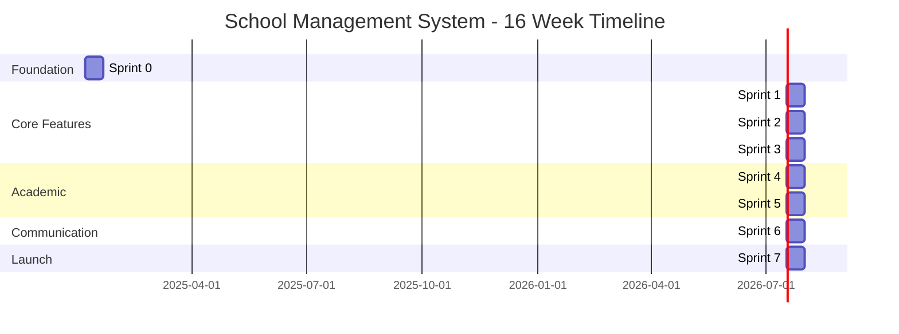
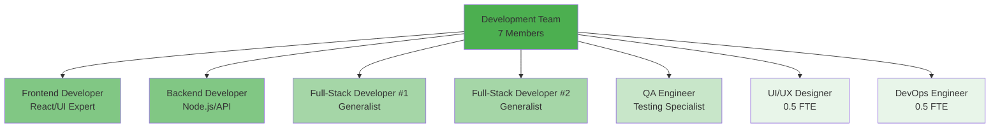
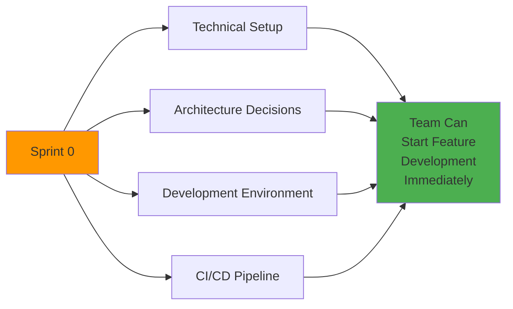
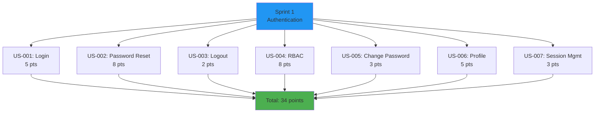
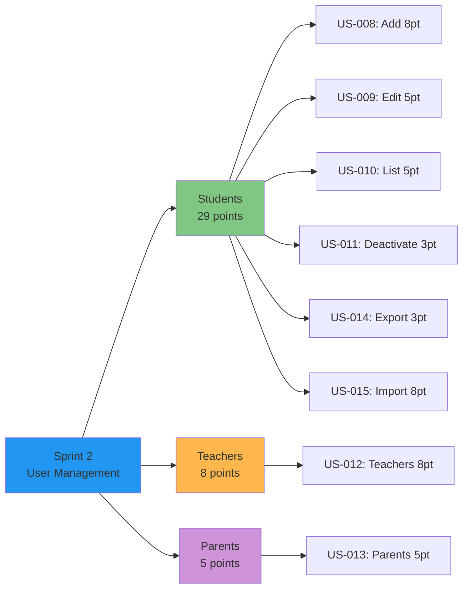
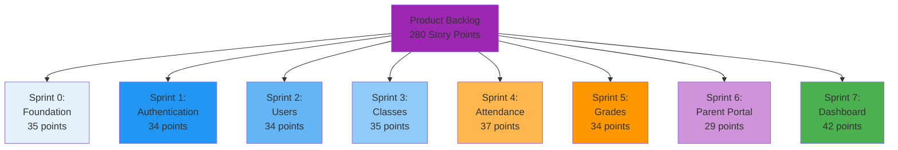
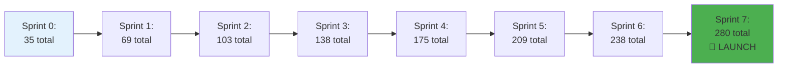

# 1.7 Sprint Planning Workshop

[← Previous: 1.6 Case Study](./1.6-school-system-case-study.md) | [Back to README](./chapter-01-README.md) | [Next: 1.8 Tools & Practices →](./1.8-tools-and-practices.md)

---

## 📖 Introduction

You've learned the theory of sprint planning, and you understand our School Management System project. Now it's time to see how theory becomes practice. In this section, we'll plan the entire 16-week development project, sprint by sprint.

You'll see exactly how to break down a real project, estimate user stories, create sprint goals, and build a realistic delivery timeline. This is the blueprint that guides the development team from concept to production.

**Reading Time:** 35 minutes  
**Activity Time:** 20 minutes

---

## 🎯 Learning Objectives

By the end of this section, you will be able to:

1. Break down a project into sprint-sized increments
2. Write effective user stories with acceptance criteria
3. Estimate user stories using story points
4. Create meaningful sprint goals
5. Sequence work to manage dependencies
6. Balance must-have vs. nice-to-have features
7. Plan for technical infrastructure and non-functional work
8. Create a realistic product backlog

---

## 📊 Project Overview

### Timeline and Structure



### Project Parameters

| Parameter | Value | Justification |
|-----------|-------|---------------|
| **Sprint Duration** | 2 weeks | Standard Scrum cadence, good feedback loop |
| **Team Size** | 7 people | Optimal Scrum team size |
| **Expected Velocity** | 40 points/sprint | Based on team capacity and experience |
| **Total Sprints** | 7 (+1 Sprint 0) | 16 weeks to production launch |
| **Total Story Points** | ~280 points | 7 sprints × 40 points |
| **Buffer** | 10% | Sprint 7 includes buffer for unknowns |

### Development Team Composition



---

## 🛠️ Sprint 0: Foundation & Setup

### Sprint Goal
**"Establish development infrastructure and architectural foundation for rapid feature development."**

### Duration
2 weeks (Jan 6-17, 2025)

### Why Sprint 0?

Sprint 0 is not standard Scrum, but it's pragmatic for new projects:



### Sprint 0 Activities

#### Technical Infrastructure (20 points)

```
STORY: Setup Development Environment
Story Points: 5
Priority: Must Have

Tasks:
- Setup GitHub repository with branching strategy
- Configure ESLint and Prettier
- Create project structure (frontend/backend/database)
- Document development setup guide
- Setup local development databases

Acceptance Criteria:
✓ All team members can clone and run project locally
✓ Code style automatically enforced
✓ README with setup instructions complete
✓ Git workflow documented
```

```
STORY: CI/CD Pipeline Configuration
Story Points: 8
Priority: Must Have

Tasks:
- Setup GitHub Actions workflows
- Configure automated testing on PR
- Setup staging environment deployment
- Configure environment variables
- Setup database migrations pipeline

Acceptance Criteria:
✓ Every PR triggers automated tests
✓ Merges to main deploy to staging automatically
✓ Build status visible in GitHub
✓ Deployment takes < 5 minutes
✓ Rollback procedure documented
```

```
STORY: Database Design and Schema
Story Points: 5
Priority: Must Have

Tasks:
- Create Entity-Relationship diagram
- Design normalized database schema
- Write initial migration scripts
- Setup database seeding for development
- Document database structure

Acceptance Criteria:
✓ ER diagram reviewed and approved
✓ Database supports all Phase 1 features
✓ Migration scripts run successfully
✓ Development seed data populates correctly
✓ Database documentation complete
```

```
STORY: API Architecture and Standards
Story Points: 3
Priority: Must Have

Tasks:
- Define RESTful API conventions
- Setup API documentation framework (Swagger)
- Create authentication middleware
- Define error handling standards
- Create API response format standards

Acceptance Criteria:
✓ API standards documented and shared
✓ Swagger documentation auto-generated
✓ Sample endpoints demonstrate standards
✓ Team trained on standards
```

#### Design System (15 points)

```
STORY: UI Component Library Setup
Story Points: 8
Priority: Must Have

Tasks:
- Choose and setup component library (Material-UI/Shadcn)
- Define color palette and typography
- Create reusable component templates
- Setup Storybook for component development
- Create design system documentation

Acceptance Criteria:
✓ Component library installed and configured
✓ Design tokens defined (colors, spacing, typography)
✓ 10+ reusable components available
✓ Storybook running with examples
✓ Design guide shared with team
```

```
STORY: Responsive Layout Templates
Story Points: 5
Priority: Must Have

Tasks:
- Create dashboard layout template
- Create form layout template
- Create list view template
- Test responsive breakpoints (mobile, tablet, desktop)
- Document layout patterns

Acceptance Criteria:
✓ 3 layout templates created
✓ Responsive on all device sizes
✓ Consistent navigation structure
✓ Templates reusable across features
```

```
STORY: Wireframes and User Flows
Story Points: 2
Priority: Should Have

Tasks:
- Create wireframes for main screens
- Define user navigation flows
- Get stakeholder feedback
- Document screen specifications

Acceptance Criteria:
✓ Wireframes for 10+ key screens
✓ User flow diagrams created
✓ Product Owner approval obtained
✓ Developers understand intended UX
```

### Sprint 0 Summary

| Category | Story Points | Stories |
|----------|--------------|---------|
| Technical Infrastructure | 20 | 4 stories |
| Design System | 15 | 3 stories |
| **Total** | **35** | **7 stories** |

**Deliverables:**
- ✅ Working development environment
- ✅ CI/CD pipeline operational
- ✅ Database schema created
- ✅ Design system established
- ✅ Team ready to build features

---

## 🔐 Sprint 1: Authentication & Authorization

### Sprint Goal
**"Users can securely log in and access the system based on their roles."**

### Duration
2 weeks (Jan 20 - Feb 2, 2025)

### User Stories

```
US-001: User Login
Story Points: 5
Priority: Must Have

As a user
I want to log in with my username and password
So that I can access the system securely

Acceptance Criteria:
✓ Login form with username and password fields
✓ Form validation (required fields, format checking)
✓ Invalid credentials show clear error message
✓ Successful login redirects to appropriate dashboard
✓ JWT token generated and stored securely
✓ Session expires after 30 minutes of inactivity
✓ "Remember me" option (optional 7-day token)
✓ Password masked while typing
✓ Works on desktop and mobile

Technical Notes:
- Use bcrypt for password hashing
- JWT with 30-minute expiration
- HTTP-only cookies for token storage
- Rate limiting: 5 failed attempts = 15 min lockout

Dependencies:
- Database schema (Sprint 0)
- API framework (Sprint 0)
```

```
US-002: Password Reset
Story Points: 8
Priority: Must Have

As a user
I want to reset my forgotten password via email
So that I can regain access to my account

Acceptance Criteria:
✓ "Forgot Password" link on login page
✓ User enters email address
✓ System sends password reset email within 1 minute
✓ Email contains time-limited reset link (1 hour expiration)
✓ Reset link opens password creation page
✓ New password validation (8+ chars, mixed case, number)
✓ Password strength indicator visible
✓ Success confirmation and auto-redirect to login
✓ Old password reset links become invalid
✓ Reset attempts logged for security

Technical Notes:
- Use email service (SendGrid/AWS SES)
- Generate secure random token
- Store token hash in database with expiration
- Email template professional and branded

Dependencies:
- US-001 (Login functionality)
- Email service configured
```

```
US-003: Logout
Story Points: 2
Priority: Must Have

As a user
I want to log out of the system
So that I can ensure my account is secure

Acceptance Criteria:
✓ Logout button visible in header/navigation
✓ Clicking logout clears session
✓ User redirected to login page
✓ Attempting to access protected pages shows login
✓ JWT token invalidated
✓ "Are you sure?" confirmation (optional)

Technical Notes:
- Clear client-side token
- Add token to blacklist (if needed)
- Clear any local storage data

Dependencies:
- US-001 (Login functionality)
```

```
US-004: Role-Based Access Control
Story Points: 8
Priority: Must Have

As an admin
I want users to have different access levels
So that data is protected and users see relevant features

Roles:
- Super Admin (full system access)
- School Admin (school-level management)
- Teacher (class and student management)
- Parent (read-only access to own children)
- Student (read-only access to own data)

Acceptance Criteria:
✓ User assigned one role during creation
✓ System enforces role permissions on all routes
✓ Unauthorized access attempts show 403 error
✓ Navigation menu adapts to user role
✓ API endpoints validate role authorization
✓ Admin can view and modify user roles
✓ Role changes take effect immediately

Technical Notes:
- Middleware validates JWT and checks role
- Route guards on frontend
- Database stores user roles
- Permission matrix documented

Permissions Matrix:
| Feature | Super Admin | School Admin | Teacher | Parent | Student |
|---------|-------------|--------------|---------|--------|---------|
| Manage Users | ✓ | ✓ (school) | ✗ | ✗ | ✗ |
| Manage Classes | ✓ | ✓ | ✓ (assigned) | ✗ | ✗ |
| Take Attendance | ✓ | ✓ | ✓ (assigned) | ✗ | ✗ |
| Enter Grades | ✓ | ✓ | ✓ (assigned) | ✗ | ✗ |
| View Grades | ✓ | ✓ (all) | ✓ (classes) | ✓ (children) | ✓ (own) |

Dependencies:
- US-001 (Login functionality)
```

```
US-005: Change Password
Story Points: 3
Priority: Should Have

As a user
I want to change my password while logged in
So that I can maintain account security

Acceptance Criteria:
✓ "Change Password" option in user profile menu
✓ Form requires: current password, new password, confirm
✓ Current password validated before allowing change
✓ New password validated (8+ chars, mixed case, number)
✓ Password strength indicator visible
✓ Success message after change
✓ User remains logged in after change
✓ All other sessions invalidated (optional)

Technical Notes:
- Verify current password with bcrypt
- Hash new password before storing
- Update password_updated_at timestamp

Dependencies:
- US-001 (Login functionality)
```

```
US-006: User Profile Management
Story Points: 5
Priority: Should Have

As a user
I want to view and edit my profile information
So that my contact details are current

Acceptance Criteria:
✓ Profile page shows current user information
✓ User can edit: email, phone, display name
✓ Email changes require re-verification
✓ Form validation on all fields
✓ Success message after save
✓ Profile photo upload (optional for Sprint 1)
✓ Changes reflected immediately in UI

Fields:
- First Name, Last Name (read-only, admin changes)
- Email (editable, requires verification)
- Phone (editable)
- Display Name (editable)
- Profile Photo (future)

Technical Notes:
- Email verification sends confirmation link
- Phone format validation
- Profile changes logged for audit

Dependencies:
- US-001 (Login functionality)
- US-004 (Role-based access)
```

```
US-007: Session Management
Story Points: 3
Priority: Should Have

As a user
I want my session to timeout after inactivity
So that my account remains secure

Acceptance Criteria:
✓ Session expires after 30 minutes of inactivity
✓ Warning shown 2 minutes before expiration
✓ User can extend session from warning
✓ Expired session redirects to login
✓ Login preserves intended destination (redirect after login)
✓ Activity detection (mouse move, keyboard, clicks)

Technical Notes:
- Track last activity timestamp
- Frontend timer checks expiration
- "Extend session" refreshes JWT token
- Preserve redirect URL in session

Dependencies:
- US-001 (Login functionality)
```

### Sprint 1 Summary



| Category | Story Points | Stories |
|----------|--------------|---------|
| Core Auth | 15 | US-001, US-002, US-003 |
| Authorization | 8 | US-004 |
| User Management | 11 | US-005, US-006, US-007 |
| **Total** | **34** | **7 stories** |

**Sprint 1 Velocity:** 34 points (within expected range)

---

## 👥 Sprint 2: User Management

### Sprint Goal
**"Administrators can manage students, teachers, and parents in the system."**

### Duration
2 weeks (Feb 3-16, 2025)

### User Stories

```
US-008: Add New Student
Story Points: 8
Priority: Must Have

As a school administrator
I want to add new students to the system
So that we can manage student records digitally

Acceptance Criteria:
✓ Form with all required student fields
✓ Auto-generate unique student ID
✓ Validation on all fields (required, format)
✓ Date picker for date of birth
✓ Grade level dropdown (K-12)
✓ Emergency contact information
✓ Medical notes field (optional)
✓ Success confirmation with student ID
✓ Automatically create student user account
✓ Send welcome email to parent/guardian
✓ Duplicate detection (warn if similar student exists)

Student Fields:
- First Name, Last Name (required)
- Date of Birth (required)
- Gender (optional)
- Grade Level (required)
- Student ID (auto-generated)
- Email (optional for younger students)
- Phone (optional)
- Address (required)
- Parent/Guardian Info (name, email, phone)
- Emergency Contact (name, phone)
- Medical Notes (optional)
- Enrollment Date (auto-set to today)

Technical Notes:
- Student ID format: STU-YYYY-NNNN (e.g., STU-2025-0001)
- Email validation if provided
- Phone format validation
- Duplicate check on name + DOB combination

Dependencies:
- US-004 (Role-based access - only admins)
```

```
US-009: Edit Student Information
Story Points: 5
Priority: Must Have

As a school administrator
I want to edit existing student information
So that records stay current and accurate

Acceptance Criteria:
✓ Search and select student to edit
✓ Form pre-populated with current data
✓ All fields editable except Student ID
✓ Change history/audit log maintained
✓ Confirmation before saving changes
✓ Success message after save
✓ Changes reflected immediately in system
✓ Email notification to parent if contact info changes

Technical Notes:
- Audit log tracks: who changed what, when
- Soft delete (deactivate) rather than hard delete
- Version history of changes

Dependencies:
- US-008 (Add student functionality)
```

```
US-010: Student List with Search
Story Points: 5
Priority: Must Have

As a school administrator
I want to view and search all students
So that I can quickly find student records

Acceptance Criteria:
✓ Paginated list of all students (25 per page)
✓ Sortable columns (name, grade, ID, enrollment date)
✓ Search by name, student ID, or grade
✓ Filter by grade level, enrollment status
✓ Click student to view full profile
✓ Bulk actions: export to CSV, print list
✓ Student count displayed
✓ Fast search (< 1 second response)

Display Columns:
- Student ID
- Full Name
- Grade Level
- Enrollment Date
- Status (Active/Inactive)
- Actions (View, Edit)

Technical Notes:
- Implement server-side pagination
- Indexed database search for performance
- Export includes all filtered results

Dependencies:
- US-008 (Students exist in system)
```

```
US-011: Deactivate/Reactivate Student
Story Points: 3
Priority: Must Have

As a school administrator
I want to deactivate students who leave
So that the system reflects current enrollment

Acceptance Criteria:
✓ "Deactivate" button on student profile
✓ Confirmation dialog (prevent accidents)
✓ Reason for deactivation recorded
✓ Deactivation date auto-recorded
✓ Deactivated students hidden from default views
✓ Filter to view inactive students
✓ "Reactivate" option for inactive students
✓ Deactivated students cannot log in
✓ Historical data preserved

Deactivation Reasons:
- Graduated
- Transferred to another school
- Moved away
- Expelled
- Other (with note)

Technical Notes:
- Soft delete: is_active flag, not physical deletion
- Deactivation cascades to enrollment records
- Preserve all historical grades and attendance

Dependencies:
- US-008 (Student records exist)
```

```
US-012: Add Teacher Profile
Story Points: 8
Priority: Must Have

As a school administrator
I want to add teacher accounts
So that teachers can use the system

Acceptance Criteria:
✓ Form with teacher details
✓ Auto-generate teacher ID
✓ Specify department/subject area
✓ Set hire date
✓ Create login credentials
✓ Assign "Teacher" role automatically
✓ Welcome email sent with login instructions
✓ Teacher can set password on first login

Teacher Fields:
- First Name, Last Name (required)
- Email (required, becomes username)
- Phone (required)
- Department (dropdown: Math, Science, English, etc.)
- Subject Areas (multi-select)
- Hire Date
- Employee ID (optional, from HR)
- Teacher ID (auto-generated: TCH-NNNN)
- Bio/Qualifications (optional)

Technical Notes:
- Email must be unique
- Initial password randomly generated, sent via email
- Force password change on first login
- Teacher ID format: TCH-NNNN (e.g., TCH-0001)

Dependencies:
- US-004 (Role-based access)
```

```
US-013: Parent Account Creation
Story Points: 5
Priority: Must Have

As a school administrator
I want to create parent accounts
So that parents can access their children's information

Acceptance Criteria:
✓ Create parent account from student record
✓ Link parent to one or more students
✓ Parent email becomes username
✓ Auto-generate initial password
✓ Welcome email with login instructions
✓ Parent can set password on first login
✓ One parent account can link to multiple children
✓ Multiple parents can link to same child

Parent Fields:
- First Name, Last Name (required)
- Email (required, becomes username)
- Phone (required)
- Relationship to student (dropdown)
- Secondary Email (optional)

Relationships:
- Mother, Father, Guardian, Grandparent, Other

Technical Notes:
- Many-to-many relationship: parents ↔ students
- Email must be unique
- Send welcome email with credentials

Dependencies:
- US-008 (Students exist)
- US-004 (Role-based access)
```

```
US-014: Export Student Data
Story Points: 3
Priority: Should Have

As a school administrator
I want to export student data to CSV
So that I can use it in other systems

Acceptance Criteria:
✓ "Export" button on student list page
✓ Export current filtered/searched results
✓ Option to export all students
✓ CSV includes all student fields
✓ File downloads immediately
✓ Filename includes date: students_YYYY-MM-DD.csv
✓ Large exports (>500 students) processed async

CSV Columns:
- Student ID, First Name, Last Name, DOB, Grade
- Email, Phone, Address, Parent Contact, Enrollment Date, Status

Technical Notes:
- Stream data for large exports
- Include header row
- Proper CSV escaping for special characters

Dependencies:
- US-010 (Student list exists)
```

```
US-015: Bulk Student Import
Story Points: 8
Priority: Could Have

As a school administrator
I want to import multiple students from CSV
So that initial setup is faster

Acceptance Criteria:
✓ Upload CSV file with student data
✓ Validation before import
✓ Show preview of students to be imported
✓ Identify and skip duplicates
✓ Error report for invalid rows
✓ Success summary after import
✓ Option to rollback import (1 hour window)
✓ Send welcome emails after import (optional)

Import Process:
1. Upload CSV file
2. Validate format and data
3. Show preview with validation results
4. Confirm import
5. Process import (create students)
6. Show success/error summary

Technical Notes:
- CSV template provided for download
- Required columns: firstName, lastName, dateOfBirth, grade
- Batch processing for large files
- Transaction rollback on critical errors

Dependencies:
- US-008 (Add student functionality)
```

### Sprint 2 Summary



| Category | Story Points | Stories |
|----------|--------------|---------|
| Student Management | 29 | 6 stories (US-008 to US-011, US-014, US-015) |
| Teacher Management | 8 | 1 story (US-012) |
| Parent Management | 5 | 1 story (US-013) |
| **Total** | **42** | **8 stories** |

**Note:** This sprint is slightly over velocity (42 vs 40). Team can:
- Option A: Move US-015 (Bulk Import, 8 points) to backlog
- Option B: Commit to 42 and work efficiently
- Option C: Reduce scope of US-015 to 5 points

**Recommended:** Move US-015 to Sprint 3 or later (nice-to-have feature)

**Adjusted Total:** 34 points (removed US-015)

---

## 📚 Sprint 3: Class Management

### Sprint Goal
**"Classes can be created, students enrolled, and teachers assigned."**

### Duration
2 weeks (Feb 17 - Mar 2, 2025)

### User Stories

```
US-016: Create Class
Story Points: 5
Priority: Must Have

As a school administrator
I want to create classes
So that students and teachers can be organized

Acceptance Criteria:
✓ Form to create new class
✓ Required fields: name, section, grade level, subject, academic year, semester
✓ Auto-generate class code (e.g., MATH-101-A-2025)
✓ Set class capacity (max students)
✓ Set class schedule (days, time, room)
✓ Success confirmation with class code
✓ Duplicate class detection (warn if similar exists)

Class Fields:
- Class Name (e.g., "Algebra 1")
- Section (e.g., "A", "B")
- Grade Level (9-12)
- Subject Area (Math, Science, English, etc.)
- Academic Year (2024-2025)
- Semester (Fall, Spring, Full Year)
- Class Code (auto-generated)
- Room Number
- Schedule (Days: MTWRF, Time: start-end)
- Capacity (max students, default 30)
- Description (optional)

Technical Notes:
- Class code format: SUBJECT-LEVEL-SECTION-YEAR
- Schedule stored as JSON: {days: [1,3,5], start: "09:00", end: "10:30"}
- Validate time conflicts for room assignments

Dependencies:
- US-012 (Teachers exist to assign)
```

```
US-017: Assign Teacher to Class
Story Points: 3
Priority: Must Have

As a school administrator
I want to assign teachers to classes
So that teachers know which classes they teach

Acceptance Criteria:
✓ Select class and assign teacher
✓ One primary teacher per class
✓ Optional co-teacher assignment
✓ Teacher can only teach classes in their subject area
✓ Warn if teacher schedule conflict
✓ Teacher sees assigned classes immediately
✓ Update notification sent to teacher

Technical Notes:
- Many-to-many relationship: teachers ↔ classes
- Primary teacher flag in junction table
- Schedule conflict check using class schedules

Dependencies:
- US-016 (Classes exist)
- US-012 (Teachers exist)
```

```
US-018: Enroll Students in Class
Story Points: 8
Priority: Must Have

As a school administrator
I want to enroll students in classes
So that students can attend and receive grades

Acceptance Criteria:
✓ Search and select class
✓ View available students for enrollment
✓ Multi-select students to enroll
✓ Check class capacity before enrollment
✓ Warn if student schedule conflict
✓ Prevent duplicate enrollments
✓ Enrollment date auto-recorded
✓ Success message with enrolled count
✓ Bulk enrollment option (enroll entire grade)

Enrollment Rules:
- Student grade level matches class grade
- Class not at capacity
- Student not already enrolled
- No schedule conflicts

Technical Notes:
- Junction table: student_enrollments
- Fields: student_id, class_id, enrollment_date, status
- Enrollment status: Active, Dropped, Completed

Dependencies:
- US-016 (Classes exist)
- US-008 (Students exist)
```

```
US-019: View Class Roster
Story Points: 3
Priority: Must Have

As a teacher
I want to view my class roster
So that I know which students are in my class

Acceptance Criteria:
✓ List of all my assigned classes
✓ Click class to view student roster
✓ Student list with photos (if available)
✓ Sortable by name, student ID
✓ Student count displayed
✓ Export roster to PDF/CSV
✓ Print-friendly format

Roster Display:
- Student photo (thumbnail)
- Full name
- Student ID
- Grade level
- Enrollment date
- Contact info toggle

Technical Notes:
- Only show classes assigned to logged-in teacher
- Query optimized for fast loading
- PDF generation uses template

Dependencies:
- US-017 (Teacher assigned to class)
- US-018 (Students enrolled)
```

```
US-020: Manage Class Schedule
Story Points: 5
Priority: Must Have

As a school administrator
I want to set class schedules
So that everyone knows when classes meet

Acceptance Criteria:
✓ Define class meeting days (M, T, W, R, F)
✓ Set class start and end times
✓ Assign room/location
✓ Detect and warn about conflicts
✓ View master schedule (all classes)
✓ Filter schedule by teacher, room, time
✓ Export schedule to PDF

Schedule Features:
- Recurring schedule (weekly pattern)
- Time slots (e.g., Period 1: 8:00-8:50)
- Room assignments
- Conflict detection (room double-booking)

Conflict Checks:
- Room not double-booked
- Teacher not teaching two classes simultaneously
- Student not enrolled in conflicting classes

Technical Notes:
- Schedule stored as structured data
- Conflict checking algorithm
- Master schedule view uses grid layout

Dependencies:
- US-016 (Classes exist)
- US-017 (Teachers assigned)
```

```
US-021: Drop Student from Class
Story Points: 3
Priority: Must Have

As a school administrator
I want to drop students from classes
So that class rosters stay accurate

Acceptance Criteria:
✓ "Drop" button on class roster
✓ Confirmation dialog with reason
✓ Drop date auto-recorded
✓ Student status changed to "Dropped"
✓ Student and parent notified
✓ Historical grades and attendance preserved
✓ Student can be re-enrolled if needed

Drop Reasons:
- Schedule conflict resolved
- Changed classes
- Failed prerequisite
- Student request
- Behavioral issues
- Other

Technical Notes:
- Soft delete: status = 'Dropped', not physical deletion
- Preserve enrollment record with dates
- Cannot drop after 80% of semester elapsed

Dependencies:
- US-018 (Students enrolled in classes)
```

```
US-022: Academic Year/Semester Management
Story Points: 5
Priority: Must Have

As a school administrator
I want to manage academic years and semesters
So that classes are organized by time period

Acceptance Criteria:
✓ Create academic year (e.g., 2024-2025)
✓ Define semesters within year
✓ Set semester start and end dates
✓ Mark current active semester
✓ Archive previous semesters
✓ Classes associated with specific semester
✓ Cannot delete semester with active classes

Academic Year Structure:
- Name (e.g., "2024-2025")
- Start Date, End Date
- Semesters:
  - Fall Semester (Aug-Dec)
  - Spring Semester (Jan-May)
  - Summer (optional)

Technical Notes:
- Current semester flag (only one active)
- System-wide semester context
- Reports filter by semester

Dependencies:
- US-016 (Classes need semester assignment)
```

```
US-023: Class List and Search
Story Points: 3
Priority: Must Have

As a school administrator
I want to view and search all classes
So that I can manage classes efficiently

Acceptance Criteria:
✓ List all classes (paginated)
✓ Search by class name, code, teacher, subject
✓ Filter by grade, subject, semester
✓ Sort by various columns
✓ View class details (students, teacher, schedule)
✓ Quick actions (edit, delete, view roster)
✓ Class count displayed

Display Columns:
- Class Code
- Class Name
- Teacher
- Grade Level
- Enrolled / Capacity
- Schedule
- Actions

Technical Notes:
- Server-side pagination
- Indexed search for performance
- Efficient query with joins

Dependencies:
- US-016 (Classes exist)
```

### Sprint 3 Summary

| Category | Story Points | Stories |
|----------|--------------|---------|
| Class Creation & Management | 13 | US-016, US-022, US-023 |
| Teacher & Student Assignment | 14 | US-017, US-018, US-021 |
| Scheduling & Roster | 8 | US-019, US-020 |
| **Total** | **35** | **7 stories** |

---

## ⏰ Sprint 4: Attendance Tracking

### Sprint Goal
**"Teachers can efficiently track daily attendance with automatic parent notifications."**

### Duration
2 weeks (Mar 3-16, 2025)

### User Stories Summary

(Due to length constraints, providing abbreviated format)

```
US-024: Take Attendance (8 points)
- Quick attendance entry interface
- Mark Present, Absent, Late, Excused
- Bulk select options
- Auto-save
- Edit window (24 hours)

US-025: View Attendance History (5 points)
- Class attendance report
- Date range filter
- Individual student attendance view
- Attendance percentage calculation
- Export to CSV/PDF

US-026: Parent Absence Notification (5 points)
- Auto-notify parents of absences
- SMS + Email within 15 minutes
- Notification includes: date, class, time
- Parent can click to view full attendance

US-027: Attendance Reports (8 points)
- Daily attendance summary
- Weekly/monthly reports
- Chronic absenteeism alerts
- Truancy tracking
- Export capabilities

US-028: Edit Past Attendance (3 points)
- Admin can correct attendance errors
- Audit log of changes
- Reason for correction required
- Teacher notified of changes

US-029: Student Attendance View (3 points)
- Student sees own attendance
- Percentage by class
- Trend visualization
- Compare to class average

US-030: Attendance Dashboard (5 points)
- Real-time attendance rate
- Missing attendance alerts
- Today's absences list
- Historical trends chart
```

**Sprint 4 Total:** 37 points (7 stories)

---

## 📊 Sprint 5: Grade Management

### Sprint Goal
**"Teachers can enter grades, calculate finals automatically, and students can view progress."**

### Duration
2 weeks (Mar 17-30, 2025)

### User Stories Summary

```
US-031: Enter Grades (8 points)
- Grade entry interface by class
- Multiple grading categories
- Points or percentage-based
- Quick entry for multiple students
- Auto-save

US-032: Grading Categories & Weights (5 points)
- Define categories (Homework, Tests, Projects)
- Set weights (e.g., Tests 40%, HW 30%)
- Per-class configuration
- Standard templates available

US-033: Automatic Grade Calculation (8 points)
- Calculate weighted average automatically
- Update in real-time
- Handle missing/excused assignments
- Final letter grade assignment
- GPA calculation

US-034: Grade History & Editing (3 points)
- View all grades entered
- Edit grades with reason
- Audit log maintained
- Students see grade changes immediately

US-035: Student Grade View (5 points)
- Students see current grades
- By class and category
- What-if calculator
- Trend over time

US-036: Teacher Grade Dashboard (5 points)
- All classes grade overview
- Grade distribution charts
- Students at risk alerts
- Progress compared to previous year

US-037: Grade Reports (8 points)
- Generate report cards
- Progress reports (mid-term)
- PDF generation
- Email to parents
- Print batch capability
```

**Sprint 5 Total:** 42 points (7 stories)

**Adjustment:** Move US-037 to Sprint 6 or reduce scope
**Adjusted Total:** 34 points

---

## 👪 Sprint 6: Parent Portal & Communication

### Sprint Goal
**"Parents have full visibility into their children's academic progress with real-time updates."**

### Duration
2 weeks (Mar 31 - Apr 13, 2025)

### User Stories Summary

```
US-038: Parent Dashboard (5 points)
- Overview of all children
- Recent grades and attendance
- Upcoming assignments
- Important announcements

US-039: View Child's Grades (5 points)
- All classes and current grades
- Grade breakdown by category
- Historical grade reports
- Download report cards

US-040: View Child's Attendance (3 points)
- Attendance by class
- Attendance percentage
- Absence history
- Calendar view

US-041: Parent-Teacher Messaging (8 points)
- Send message to teacher
- Teacher can reply
- Message history
- Email notification of new messages

US-042: Email Notifications (8 points)
- Weekly progress summary
- Grade threshold alerts
- Absence notifications
- Upcoming events

US-043: Link Multiple Children (5 points)
- One parent account → multiple students
- Switch between children
- Aggregate view option
- Individual notifications

US-044: Parent Communication Preferences (3 points)
- Email vs SMS choice
- Notification frequency
- What to be notified about
- Language preference
```

**Sprint 6 Total:** 37 points (7 stories)

**Adjustment:** Move US-042 or reduce scope of US-041
**Adjusted Total:** 29 points (moved US-042 to Sprint 7)

---

## 📈 Sprint 7: Dashboard, Analytics & Launch Prep

### Sprint Goal
**"Launch-ready system with admin dashboards, reports, and final polish."**

### Duration
2 weeks (Apr 14-27, 2025)

### User Stories Summary

```
US-045: Admin Dashboard (8 points)
- School-wide KPIs
- Enrollment stats
- Attendance rate
- Grade distribution
- Active users metrics

US-046: Custom Reports (8 points)
- Report builder interface
- Pre-defined report templates
- Schedule automated reports
- Export to multiple formats

US-047: Analytics & Insights (8 points)
- Trend analysis
- Predictive insights
- At-risk student identification
- Teacher performance metrics

US-048: System Administration (5 points)
- School settings configuration
- User role management
- System logs view
- Backup management

US-049: Bug Fixes & Polish (13 points)
- Address Sprint 1-6 bugs
- UI/UX refinements
- Performance optimization
- Security hardening

US-050: Documentation & Training (5 points)
- User manuals
- Video tutorials
- Admin guides
- Training materials

US-051: Deployment & Go-Live (5 points)
- Production deployment
- Data migration
- Smoke testing
- Go-live support
```

**Sprint 7 Total:** 52 points (7 stories)

**Note:** Sprint 7 is intentionally over-committed because:
- US-049 (Bug Fixes) is flexible scope
- Team velocity should be established
- Buffer for unknowns
- Some stories may be partially complete

**Realistic Commitment:** 40-45 points with US-049 as flex scope

---

## 📋 Complete Product Backlog

### Product Backlog Summary



### Release Roadmap

| Sprint | Dates | Focus | Story Points | Cumulative |
|--------|-------|-------|--------------|------------|
| **Sprint 0** | Jan 6-17 | Foundation | 35 | 35 |
| **Sprint 1** | Jan 20 - Feb 2 | Authentication | 34 | 69 |
| **Sprint 2** | Feb 3-16 | User Management | 34 | 103 |
| **Sprint 3** | Feb 17 - Mar 2 | Class Management | 35 | 138 |
| **Sprint 4** | Mar 3-16 | Attendance | 37 | 175 |
| **Sprint 5** | Mar 17-30 | Grades | 34 | 209 |
| **Sprint 6** | Mar 31 - Apr 13 | Parent Portal | 29 | 238 |
| **Sprint 7** | Apr 14-27 | Dashboard & Launch | 42 | 280 |

### Burn-Up Chart



---

## 🎓 Hands-On Activity: Create Your Sprint Plan

### Activity: "Plan Your Own Sprint"

**Time:** 20 minutes  
**Format:** Individual or small groups

**Scenario:**
You're planning Sprint 8 (post-launch enhancements). The Product Owner has these requests:

**Requested Features:**
1. Mobile app (native iOS/Android)
2. Automated report card generation
3. Grade trending and analytics
4. Student behavior tracking
5. Library management integration
6. Payment processing for fees
7. Advanced scheduling (block schedules)
8. Teacher evaluation module

**Your Constraints:**
- Team velocity: 40 points/sprint
- Sprint duration: 2 weeks
- Must prioritize based on value and dependencies

**Your Tasks:**

**Step 1: Estimate Each Feature (5 minutes)**

| Feature | Complexity | Uncertainty | Estimated Points |
|---------|------------|-------------|------------------|
| Mobile app | | | ___ |
| Report cards | | | ___ |
| Grade analytics | | | ___ |
| Behavior tracking | | | ___ |
| Library integration | | | ___ |
| Payment processing | | | ___ |
| Advanced scheduling | | | ___ |
| Teacher evaluation | | | ___ |

**Step 2: Prioritize (5 minutes)**

Use MoSCoW method:
- Must Have: _______________
- Should Have: _______________
- Could Have: _______________
- Won't Have (this sprint): _______________

**Step 3: Create Sprint Goal (5 minutes)**

Write a compelling sprint goal:
________________________________
________________________________

**Step 4: Select Stories (5 minutes)**

Which features will you include to stay within 40 points?

Selected for Sprint 8:
1. _________________ (__ points)
2. _________________ (__ points)
3. _________________ (__ points)
4. _________________ (__ points)

Total: ___ points

**Debrief Questions:**
1. How did you decide what to include/exclude?
2. What dependencies did you consider?
3. How does your Sprint Goal guide selection?
4. What would you tell the Product Owner about the features you didn't include?

---

## 🔑 Key Concepts Summary

### Critical Sprint Planning Principles

1. **Sprint Goals Drive Selection**
   - Not just "complete X points"
   - Meaningful, cohesive objective
   - Guides daily decisions

2. **Story Points Are Relative**
   - 5 points means ~5x effort of 1 point story
   - Team-specific scale
   - Includes all work (code, test, review, deploy)

3. **Dependencies Matter**
   - Can't do grades without users
   - Can't do parent portal without grades
   - Sequence thoughtfully

4. **Velocity Stabilizes Over Time**
   - Sprint 1-2: Learning, establishing baseline
   - Sprint 3-5: Velocity stabilizes
   - Sprint 6+: Predictable capacity

5. **Buffer Is Essential**
   - 10-20% buffer for unknowns
   - Sprint 7 intentionally flexible
   - Better to under-promise, over-deliver

### Sprint Planning Checklist

```
Before Sprint Planning:
□ Product Backlog refined and prioritized
□ Top stories have acceptance criteria
□ Technical dependencies identified
□ Team capacity known (holidays, vacations)
□ Sprint goal ideas prepared

During Sprint Planning:
□ Sprint goal defined and agreed
□ Stories selected based on goal and velocity
□ Each story estimated and understood
□ Tasks identified for complex stories
□ Dependencies and risks discussed
□ Definition of Done reviewed
□ Team commits to Sprint Backlog

After Sprint Planning:
□ Sprint Backlog created and visible
□ Sprint goal communicated to stakeholders
□ First stories ready to start
□ Daily Scrum scheduled
□ Sprint Review and Retro scheduled
```

---

## ✅ Self-Check Questions

Test your understanding:

1. Why did we start with Sprint 0 (Foundation) before feature development?
2. What is the Sprint Goal for Sprint 3 and how does it guide story selection?
3. Why is Sprint 2 slightly over-committed (42 points), and what should the team do?
4. How many total story points are planned across all 7 sprints?
5. Which sprint delivers the most critical user-facing value? Why?
6. What is the purpose of making Sprint 7 flexible/over-committed?
7. Why must US-018 (Enroll Students) come after US-016 (Create Classes)?
8. How does the burn-up chart help track project progress?

**Answers at the end of Section 1.10**

---

## 🚀 What's Next?

You now have a complete sprint plan for building the School Management System. Next, we'll explore the tools and practices that make this plan executable—version control, project management software, CI/CD pipelines, and collaboration platforms.

**Next Section:** [1.8 Tools and Practices →](./1.8-tools-and-practices.md)

---

[← Previous: 1.6 Case Study](./1.6-school-system-case-study.md) | [Back to README](./chapter-01-README.md) | [Next: 1.8 Tools & Practices →](./1.8-tools-and-practices.md)

---

*Last Updated: November 2025*  
*Version: 1.0*
