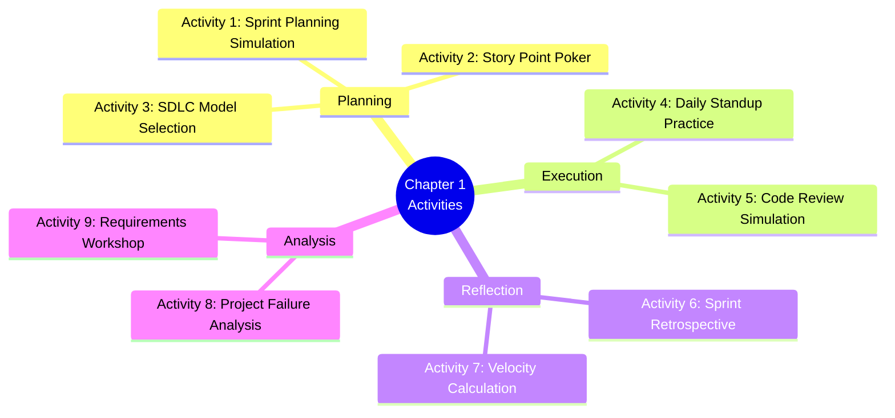
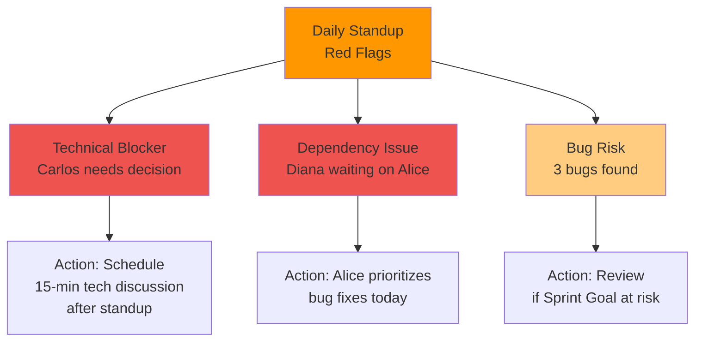
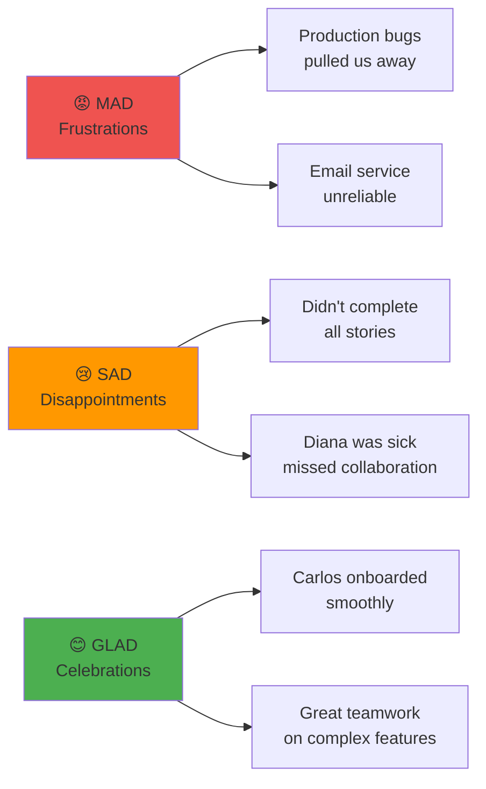
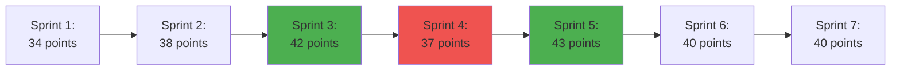

# 1.9 Hands-on Activities

[← Previous: 1.8 Tools & Practices](./1.8-tools-and-practices.md) | [Back to README](./chapter-01-README.md) | [Next: 1.10 Summary →](./1.10-chapter-summary.md)

---

## 📖 Introduction

Theory becomes practical skill through practice. This section contains hands-on activities that simulate real-world software development scenarios. These exercises are designed for classroom use, self-study, or team training sessions.

Each activity includes clear instructions, time estimates, templates, and debrief questions to maximize learning. You'll practice the skills that professional developers use daily—from sprint planning to retrospectives to SDLC selection.

**Total Activity Time:** 2-3 hours (can be spread across multiple sessions)

---

## 🎯 Activities Overview



---

## 🎮 Activity 1: Sprint Planning Simulation

### Objective
Practice conducting a complete sprint planning session using the School Management System case study.

### Duration
45 minutes

### Group Size
4-7 people (simulating a Scrum team)

### Materials Needed
- User story cards (printed or digital)
- Story point reference guide
- Sprint planning template
- Timer

### Setup

**Assign Roles:**
```
Product Owner: 1 person
Scrum Master: 1 person (facilitator)
Development Team: Remaining participants
```

**Given Information:**
```
Team Velocity: 40 story points (average from previous sprints)
Sprint Duration: 2 weeks
Sprint Number: 5
Sprint Goal: Enable grade management for teachers
Team Availability: Full team, no holidays
```

### User Stories Available

```
US-031: Enter Grades (8 points)
As a teacher, I want to enter grades for students
So that I can track student performance

US-032: Grading Categories & Weights (5 points)
As a teacher, I want to define grading categories with weights
So that final grades are calculated correctly

US-033: Automatic Grade Calculation (8 points)
As a teacher, I want final grades calculated automatically
So that I don't make calculation errors

US-034: Edit Previous Grades (3 points)
As a teacher, I want to edit grades I entered previously
So that I can correct mistakes

US-035: Student Grade View (5 points)
As a student, I want to view my current grades
So that I know where I stand in each class

US-036: Grade Distribution Analytics (5 points)
As a teacher, I want to see grade distribution for my class
So that I can identify struggling students

US-037: Report Card Generation (8 points)
As an admin, I want to generate report cards
So that we can send progress reports to parents

US-038: Grade Export (3 points)
As a teacher, I want to export grades to CSV
So that I can analyze data in Excel

US-039: Grade History (5 points)
As a teacher, I want to view grade history
So that I can track student improvement

US-040: Parent Grade Notifications (5 points)
As a parent, I want to receive notifications of new grades
So that I stay informed of my child's progress
```

### Activity Steps

#### Part 1: Sprint Goal Definition (10 minutes)

**Instructions:**
1. Product Owner presents the vision for Sprint 5
2. Team discusses what value should be delivered
3. Collaboratively create a Sprint Goal

**Template:**
```
Sprint Goal: _________________________________

This sprint goal should:
□ Be achievable in 2 weeks
□ Provide clear user value
□ Guide daily decisions
□ Allow flexibility in implementation
```

**Example Good Sprint Goals:**
- ✅ "Teachers can enter and manage grades with automatic calculations"
- ✅ "Complete grade management system with student visibility"

**Example Bad Sprint Goals:**
- ❌ "Complete 40 story points"
- ❌ "Work on grade features"

#### Part 2: Story Selection (20 minutes)

**Instructions:**
1. Product Owner presents each user story (2 min per story)
2. Development Team asks clarifying questions
3. Team discusses technical approach
4. Consider dependencies and risks
5. Select stories that fit velocity (40 points)
6. Ensure selection aligns with Sprint Goal

**Selection Template:**

| Story ID | Title | Points | Include? | Reason |
|----------|-------|--------|----------|--------|
| US-031 | Enter Grades | 8 | Yes/No | |
| US-032 | Categories & Weights | 5 | Yes/No | |
| US-033 | Auto Calculation | 8 | Yes/No | |
| US-034 | Edit Grades | 3 | Yes/No | |
| US-035 | Student View | 5 | Yes/No | |
| US-036 | Analytics | 5 | Yes/No | |
| US-037 | Report Cards | 8 | Yes/No | |
| US-038 | Export | 3 | Yes/No | |

**Total Selected:** ___ points

#### Part 3: Task Breakdown (15 minutes)

**Instructions:**
For 1-2 selected stories, break down into technical tasks.

**Example: US-031 Enter Grades (8 points)**

```
Tasks:
□ Design grade entry UI (4 hours) - Frontend Dev
□ Create grades database table (2 hours) - Backend Dev
□ Build POST /api/grades endpoint (6 hours) - Backend Dev
□ Implement frontend form with validation (8 hours) - Frontend Dev
□ Add category dropdown (2 hours) - Frontend Dev
□ Write unit tests (6 hours) - All Devs
□ Write integration tests (4 hours) - QA
□ Update API documentation (2 hours) - Backend Dev

Total Estimated Hours: 34 hours
Team Capacity: 80 hours/week × 2 weeks = 160 hours
```

### Debrief Questions (10 minutes)

1. **Sprint Goal:**
   - Is your Sprint Goal specific and valuable?
   - How will it guide daily decisions?
   - What would you do if halfway through you realize the goal is at risk?

2. **Story Selection:**
   - Did you stay within velocity? Why or why not?
   - What made certain stories higher priority?
   - What dependencies did you identify?

3. **Challenges:**
   - What was hardest about sprint planning?
   - What surprised you?
   - What would you do differently next time?

4. **Real-World Application:**
   - How would this change with a remote team?
   - What if the Product Owner wasn't available?
   - How would you handle mid-sprint scope changes?

### Success Criteria

```
Good Sprint Plan:
✓ Clear, valuable Sprint Goal
✓ Story points within velocity (38-42 acceptable range)
✓ Stories align with Sprint Goal
✓ Dependencies identified
✓ At least one story broken into tasks
✓ Team understands what to build
✓ Risks identified and discussed
```

---

## 🃏 Activity 2: Story Point Poker

### Objective
Practice estimating user stories using Planning Poker technique.

### Duration
30 minutes

### Group Size
3-7 people

### Materials Needed
- Planning Poker cards (printed or app)
- User stories to estimate
- Reference stories

### Setup

**Planning Poker Cards:**
```
Card Values: 0, 1, 2, 3, 5, 8, 13, 20, 40, 100, ?, ☕
```

**Reference Stories (for calibration):**
```
1 point: Add a simple field to a form
2 points: Add client-side validation to a form
3 points: Create a simple list page with search
5 points: Create a complex form with multiple sections
8 points: Implement authentication with JWT
13 points: Build a complete CRUD module with relationships
```

### Stories to Estimate

```
Story 1: Teacher Dashboard
As a teacher, I want a dashboard showing my classes
So that I can see today's schedule at a glance

Contains:
- List of today's classes
- Quick attendance link
- Recent grades entered
- Upcoming assignments

Story 2: Bulk Email to Parents
As an admin, I want to send bulk emails to all parents
So that I can communicate important announcements

Contains:
- Email composition interface
- Parent list selection
- Email template system
- Send confirmation

Story 3: Student Photo Upload
As a student, I want to upload my profile photo
So that teachers can recognize me

Contains:
- Photo upload interface
- Image cropping
- File size validation
- Photo approval workflow (admin)

Story 4: Attendance QR Code Scanning
As a teacher, I want students to scan QR codes for attendance
So that attendance is faster

Contains:
- QR code generation per class session
- Student mobile scanning interface
- Attendance auto-recording
- Late threshold setting

Story 5: Data Privacy Consent Management
As an admin, I want to manage parent consent for data sharing
So that we comply with privacy regulations

Contains:
- Consent form management
- Digital signature
- Consent tracking
- Audit trail
```

### Estimation Process

**Round 1: Story 1 - Teacher Dashboard**

```
Step 1: Product Owner reads story (2 min)
- Read user story
- Read acceptance criteria
- Answer clarification questions

Step 2: Team discusses briefly (2 min)
- Technical approach
- Similar stories
- Unknowns and risks

Step 3: Everyone selects card privately (30 sec)
- Think independently
- Don't show card yet

Step 4: Reveal simultaneously (5 sec)

Step 5: Discuss differences (3 min)
- Highest and lowest explain reasoning
- Team discusses
- Identify what's unclear

Step 6: Re-estimate if needed
- Repeat until consensus (typically 1-2 rounds)

Step 7: Record estimate
```

**Estimation Template:**

| Story | Round 1 Votes | Discussion Points | Final Estimate |
|-------|---------------|-------------------|----------------|
| Teacher Dashboard | Dev1: 5, Dev2: 8, Dev3: 5, Dev4: 8 | Dev2 & 4 concerned about complexity | 5 points |
| Bulk Email | | | |
| Photo Upload | | | |
| QR Code Scanning | | | |
| Privacy Consent | | | |

### Special Cards Explained

```
?: "I don't understand this story"
   → Triggers discussion to clarify

☕: "This is too large to estimate"
   → Story needs to be broken down

0: "This is already done"
   → Confirm with team

100: "This is impossibly large"
   → Epic-level, must split
```

### Common Estimation Mistakes

```
❌ DON'T:
- Estimate in hours during poker
- Let one person dominate
- Pressure for consensus too quickly
- Estimate stories you don't understand
- Use non-Fibonacci numbers

✅ DO:
- Estimate relative to reference stories
- Listen to all perspectives
- Ask clarifying questions
- Break down stories that are too large
- Re-estimate if new information emerges
```

### Debrief Questions

1. What caused the biggest estimation differences?
2. Which stories were hardest to estimate? Why?
3. How did discussion change your initial estimate?
4. What information would help you estimate more accurately?
5. How would you handle persistent disagreement?

---

## 🏃 Activity 3: Daily Standup Simulation

### Objective
Practice conducting effective daily standups with common scenarios.

### Duration
20 minutes

### Group Size
4-7 people

### Setup

**Roles:**
```
Scrum Master: Facilitator (timekeeper)
Development Team: All participants
Product Owner: Optional (observer)
```

**Current Sprint Context:**
```
Sprint: 4 (Attendance Tracking)
Sprint Goal: Teachers can track attendance with parent notifications
Days Remaining: 7 days
Sprint Backlog: 37 points committed, 18 points completed
```

**Team Member Assignments:**
```
Alice (Frontend): US-024 (Take Attendance) - In Progress
Bob (Backend): US-025 (View History) - Testing
Carlos (Full-Stack): US-026 (Parent Notifications) - Blocked
Diana (QA): Testing US-024 - Found bugs
```

### Scenario: Normal Standup

**Instructions:** Each team member answers three questions in 1-2 minutes:

**Alice (Frontend Developer):**
```
Yesterday: Completed the attendance UI mockup, got Product Owner approval
Today: Starting implementation of the attendance form in React
Blockers: None
```

**Bob (Backend Developer):**
```
Yesterday: Finished attendance history API endpoint, writing tests
Today: Complete testing, then pair with Diana on integration tests
Blockers: None
```

**Carlos (Full-Stack Developer):**
```
Yesterday: Started parent notification service, hit technical issue
Today: Need to discuss notification architecture with team
Blockers: ⚠️ Not sure if we should use real-time websockets or email queue
```

**Diana (QA Engineer):**
```
Yesterday: Testing attendance feature, found 3 bugs in bulk selection
Today: Document bugs, retest after fixes, start automation tests
Blockers: ⚠️ Waiting for Alice to fix bugs before proceeding
```

### Red Flags to Notice



### Anti-Pattern Scenarios

**Scenario 1: The Status Report**
```
❌ BAD:
Carlos: "I worked on the notification service yesterday. 
I spent 2 hours debugging the email integration, then 
1 hour setting up the queue system, and another hour 
writing documentation. Today I'll continue with..."

[Goes on for 5 minutes, loses team's attention]

✅ GOOD:
Carlos: "Yesterday: Made progress on notifications but hit 
a technical decision point. Today: Need 15 minutes after 
standup to discuss architecture. Blocker: Need team input 
on websockets vs email queue."
```

**Scenario 2: Problem Solving**
```
❌ BAD:
[During standup]
Carlos: "I can't decide between websockets and email queue"
Alice: "Well, websockets are real-time but..."
Bob: "But email is more reliable because..."
[30 minutes later, still discussing]

✅ GOOD:
Scrum Master: "That's important but let's take it offline. 
Carlos, Alice, Bob - can you stay for 15 minutes after? 
Let's continue the standup."
```

**Scenario 3: The Absent Member**
```
❌ BAD:
Scrum Master: "Anyone heard from Diana?"
[Crickets]
[Move on, Diana's work unknown]

✅ GOOD:
Scrum Master: "Diana is out today. Bob, you paired with 
her yesterday - can you give her update?"
Bob: "She was testing US-024, found 3 bugs, logged them. 
She'll retest when Alice fixes them."
```

### Debrief Questions

1. What made the standup effective or ineffective?
2. How did the Scrum Master keep it on track?
3. What actions emerged from the standup?
4. Which impediments needed immediate attention?
5. How would you handle a team member who consistently goes over time?

---

## 🔄 Activity 4: Sprint Retrospective Workshop

### Objective
Practice facilitating a sprint retrospective using multiple techniques.

### Duration
45 minutes

### Group Size
4-8 people

### Setup

**Sprint Context:**
```
Sprint: 4 (just completed)
Sprint Goal: Teachers can track attendance with parent notifications
Committed: 37 points
Completed: 34 points (3 stories carried over)
Velocity: Below average (usual 40 points)
```

**Sprint Events:**
```
Positive:
- New team member (Carlos) onboarded quickly
- Great collaboration between Alice and Bob
- Product Owner very responsive

Negative:
- Email service outage on Day 8 blocked notifications (2 days lost)
- 3 urgent production bugs pulled team away for 1 day
- Diana sick for 2 days
- Technical debt in authentication slowed development

Neutral:
- First time using new testing framework
- Experimented with mob programming (mixed results)
```

### Technique 1: Start-Stop-Continue (15 minutes)

**Instructions:**
1. Each person writes items on sticky notes (5 min)
2. Group similar items (3 min)
3. Discuss and vote on top items (5 min)
4. Create action items (2 min)

**Template:**

| START Doing | STOP Doing | CONTINUE Doing |
|-------------|------------|----------------|
| Pair programming on complex features | Working overtime to meet commitments | Daily code reviews |
| Automated integration tests | Skipping code review for "quick fixes" | Team lunches on Fridays |
| Slack DND hours for focus time | Accepting stories without clear criteria | Sprint retrospectives |

**Action Items Created:**
```
1. [Alice] Schedule mob programming session weekly (Fridays 2-4pm)
2. [Scrum Master] Create Definition of Ready checklist by Wednesday
3. [Team] Set Slack DND hours: 9am-11am and 2pm-4pm for deep work
4. [Bob] Research and recommend automated testing tools by next sprint
```

### Technique 2: Mad-Sad-Glad (15 minutes)

**Instructions:**
1. Draw three columns: Mad, Sad, Glad
2. Team members add items (anonymous sticky notes)
3. Read aloud and group themes
4. Discuss action items



**Discussion:**
```
MAD - Production bugs:
Team: Why did we have so many production bugs?
Alice: We rushed Sprint 3 to meet deadline
Bob: We skipped code review for "quick fixes"
Action: No more skipping code review, even for "quick" fixes

MAD - Email service:
Team: Email service unreliable, blocked notifications
Carlos: Should we have backup email provider?
Action: Research backup email service, present options next sprint

GLAD - Carlos onboarding:
Team: Carlos productive quickly!
Carlos: Thanks! Onboarding doc was really helpful
Action: Continue improving onboarding documentation
```

### Technique 3: Sailboat Retrospective (15 minutes)

**Visual Metaphor:**
```
🚢 Boat = Team
⛵ Wind = What helped us (propelled forward)
⚓ Anchor = What slowed us (held back)
🏝️ Island = Sprint Goal (destination)
🌊 Rocks = Risks ahead (dangers to avoid)
```

**Instructions:**
1. Draw sailboat diagram
2. Team adds items to each category
3. Discuss patterns and actions

**Example:**

```
⛵ WIND (Helping):
- Product Owner responsiveness
- Clear acceptance criteria
- Pair programming success
- Good test coverage

⚓ ANCHOR (Slowing):
- Production bugs (interruptions)
- Email service unreliable
- Technical debt in auth module
- New framework learning curve

🏝️ ISLAND (Goal):
- Reached 34/37 points (92%)
- Attendance tracking working
- Parent notifications working (mostly)
- Quality good despite issues

🌊 ROCKS (Risks Ahead):
- Email service still unstable
- Growing technical debt
- Holiday season coming (reduced availability)
- Integration with new payment system next sprint
```

**Actions From Sailboat:**
```
1. Address email service: Research alternatives this week
2. Plan tech debt sprint: Dedicate 20% of next sprint to refactoring
3. Holiday planning: Update capacity for Sprint 5 planning
4. Payment integration: Research and create spike story
```

### Creating SMART Action Items

```
❌ BAD Action Items:
- "Communicate better"
- "Fix technical debt"
- "Improve code quality"
- "Be more agile"

✅ GOOD Action Items (SMART):
- [Carlos] Research 3 backup email providers by Wednesday, present options
- [Team] Dedicate 8 story points (20%) of Sprint 5 to refactoring auth module
- [Alice] Create code review checklist and share by Tuesday
- [Scrum Master] Block calendar for daily focus time (9-11am, 2-4pm)
```

**SMART Criteria:**
```
Specific: What exactly will be done?
Measurable: How will we know it's complete?
Assignable: Who owns it?
Realistic: Can it actually be done?
Time-bound: By when?
```

### Debrief Questions

1. Which retrospective technique was most effective? Why?
2. How did visualization (sailboat) help discussion?
3. Were action items specific enough?
4. How would you ensure action items are actually completed?
5. What makes a retrospective feel "safe" for honest feedback?

---

## 🎲 Activity 5: SDLC Model Selection Game

### Objective
Practice selecting appropriate SDLC models for different project scenarios.

### Duration
30 minutes

### Format
Individual or teams (2-3 people)

### Instructions

For each scenario, select the most appropriate SDLC model and justify your choice.

**Available Models:**
- Waterfall
- V-Model
- Spiral
- Incremental
- Scrum (Agile)
- Kanban

### Scenarios

**Scenario 1: Medical Device Pacemaker Software**
```
Context:
- Controls heart pacemaker device
- FDA approval required
- Requirements well-defined and stable
- Zero tolerance for errors
- Complete documentation mandatory
- Development team: 15 people
- Timeline: 18 months
- Budget: $5 million

Constraints:
- Must meet FDA regulatory requirements
- Comprehensive testing at every stage
- Full traceability from requirements to testing
- Cannot deploy with any critical defects

Your Selection: _______________
Justification: _______________
```

**Scenario 2: Startup Social Media App**
```
Context:
- New social media concept
- Requirements unclear, will evolve
- Need to launch MVP quickly
- Competitive market
- User feedback critical
- Development team: 5 people
- Timeline: Need MVP in 3 months
- Budget: $200K

Constraints:
- Time to market critical
- Need to pivot based on user feedback
- Features will change based on market response
- Small team needs flexibility

Your Selection: _______________
Justification: _______________
```

**Scenario 3: Bank Core System Replacement**
```
Context:
- Replacing 20-year-old mainframe system
- Requirements well understood (maintain existing functionality)
- Hundreds of existing business rules
- Cannot have any downtime
- Regulatory compliance essential
- Development team: 50 people across 3 locations
- Timeline: 24 months
- Budget: $20 million

Constraints:
- Must maintain exact functionality
- Extensive documentation required
- Audit trail essential
- Parallel run with old system for 6 months

Your Selection: _______________
Justification: _______________
```

**Scenario 4: E-commerce Website for Small Business**
```
Context:
- Local retail store going online
- Basic requirements: product catalog, shopping cart, checkout
- Owner wants to see progress regularly
- Budget limited
- Timeline flexible
- Development team: 3 people
- Features prioritized: must-have first, nice-to-have later

Constraints:
- Need working website quickly
- Can add features incrementally
- Owner wants to test each feature before next one built

Your Selection: _______________
Justification: _______________
```

**Scenario 5: AI Research Project**
```
Context:
- Exploring new machine learning algorithm
- Requirements unknown (research project)
- High technical risk
- Many unknowns
- Proof of concept needed
- Development team: 8 researchers
- Timeline: 12 months
- Budget: $1 million

Constraints:
- Experiment-driven development
- Requirements will emerge through research
- High probability of multiple pivots
- Need to demonstrate progress to funders quarterly

Your Selection: _______________
Justification: _______________
```

**Scenario 6: IT Support Ticketing System**
```
Context:
- Internal IT department tracking tool
- Continuous stream of feature requests
- No fixed release dates
- Team handles both new features and support issues
- Development team: 4 people
- Work items vary greatly in size
- Need to respond to urgent requests quickly

Constraints:
- Unpredictable work stream
- Mix of features, bugs, and improvements
- Need flexibility to reprioritize
- No sprints or fixed commitments

Your Selection: _______________
Justification: _______________
```

### Decision Matrix Template

| Scenario | Model Selected | Key Factors | Alternative Considered | Why Not Alternative |
|----------|----------------|-------------|------------------------|---------------------|
| 1. Pacemaker | | | | |
| 2. Startup App | | | | |
| 3. Bank System | | | | |
| 4. E-commerce | | | | |
| 5. AI Research | | | | |
| 6. Ticketing | | | | |

### Suggested Answers (Debrief)

```
1. Pacemaker: V-Model
   - Safety-critical: Extensive testing required
   - Regulatory: FDA needs complete documentation
   - Stable requirements: Well-defined scope
   - Quality focus: Testing emphasis of V-Model

2. Startup App: Scrum
   - Unknown requirements: Will evolve with feedback
   - Fast iterations: Need quick feedback loops
   - Small team: Perfect for Scrum
   - Time to market: Sprints deliver incremental value

3. Bank System: Waterfall or Incremental
   - Fixed requirements: Maintain existing functionality
   - Large team: Need structure and coordination
   - Documentation: Regulatory compliance needs
   - Risk averse: Proven methodology

4. E-commerce: Incremental or Scrum
   - Clear priorities: Must-have first
   - Budget conscious: Deliver value early
   - Flexible timeline: Can add features later
   - Small team: Agile works well

5. AI Research: Spiral
   - High risk: Unknown if algorithm will work
   - Prototype-driven: Build, test, learn, repeat
   - Evolving requirements: Emerges through research
   - Quarterly demos: Natural spiral cadence

6. Ticketing: Kanban
   - Continuous flow: No sprints needed
   - Variable work: Different size tasks
   - Flexible priorities: Respond to urgent issues
   - Support + development: Kanban handles both
```

### Debrief Discussion

1. What factors most influenced your SDLC selection?
2. Were there scenarios where multiple models could work?
3. How do regulatory requirements affect model choice?
4. When is Agile inappropriate?
5. Can you combine models (hybrid approach)?

---

## 📊 Activity 6: Velocity Calculation Exercise

### Objective
Practice calculating team velocity and forecasting project completion.

### Duration
20 minutes

### Materials
- Calculator
- Velocity tracking template

### Scenario

**Project:** School Management System  
**Team:** 7 developers  
**Sprint Length:** 2 weeks

### Historical Data

| Sprint | Committed | Completed | Notes |
|--------|-----------|-----------|-------|
| Sprint 1 | 38 | 34 | New team, learning curve |
| Sprint 2 | 40 | 38 | Team improving |
| Sprint 3 | 42 | 42 | Great sprint! |
| Sprint 4 | 45 | 37 | Production bugs interrupted |
| Sprint 5 | 43 | 43 | Back on track |
| Sprint 6 | 40 | 40 | Consistent |
| Sprint 7 | 42 | 40 | Holiday week impact |

### Exercises

**Exercise 1: Calculate Average Velocity**

```
Formula: Sum of completed points ÷ Number of sprints

Calculation:
Sprint 1: 34
Sprint 2: 38
Sprint 3: 42
Sprint 4: 37
Sprint 5: 43
Sprint 6: 40
Sprint 7: 40

Total: _____ points
Sprints: 7
Average Velocity: _____ points per sprint
```

**Exercise 2: Calculate Stable Velocity**

Exclude Sprint 1 (ramp-up) and Sprint 4 (anomaly):

```
Sprints 2, 3, 5, 6, 7:
38 + 42 + 43 + 40 + 40 = _____
Divided by 5 = _____ points per sprint

Stable Velocity: _____ points per sprint
```

**Exercise 3: Forecast Project Completion**

```
Remaining Product Backlog: 160 story points
Average Velocity: 40 points per sprint
Sprint Duration: 2 weeks

Calculation:
Sprints needed: 160 ÷ 40 = _____
Weeks needed: _____ sprints × 2 weeks = _____
Expected completion date: _____

With 10% buffer:
Weeks with buffer: _____ × 1.10 = _____
Expected completion (with buffer): _____
```

**Exercise 4: Velocity Trend Analysis**



**Analysis Questions:**

1. Is velocity increasing, decreasing, or stable?
   Answer: _______________

2. What caused the Sprint 4 dip?
   Answer: _______________

3. Should we commit to 43 points next sprint?
   Answer: _______________

4. What's a safe commitment range?
   Answer: _______________

**Exercise 5: Sprint Planning with Velocity**

```
Next Sprint: Sprint 8
Stable Velocity: 40 points
Available Stories:

US-050: Admin Dashboard (8 points)
US-051: Custom Reports (8 points)
US-052: Analytics & Insights (8 points)
US-053: System Administration (5 points)
US-054: Bug Fixes (13 points - variable)
US-055: Documentation (5 points)
US-056: Performance Optimization (8 points)

Task: Select stories for Sprint 8 (target 40 points)

Selected Stories:
1. _______________
2. _______________
3. _______________
4. _______________

Total Points: _____
Rationale: _______________
```

### Debrief Questions

1. How does velocity help with sprint planning?
2. Why is average velocity sometimes misleading?
3. Should you try to increase velocity every sprint?
4. What factors can affect velocity?
5. How do you account for team changes in velocity?

---

## 🎯 Activity 7: Requirements Workshop

### Objective
Practice eliciting and documenting requirements from stakeholders.

### Duration
30 minutes

### Setup

**Roles:**
- Stakeholder: Teacher (1 person)
- Business Analyst: Requirements gatherer (1 person)
- Observers: Take notes (remaining participants)

### Scenario

**Context:**
You're gathering requirements for a new "Assignment Management" feature for the School Management System.

**Stakeholder Profile:**
```
Name: Ms. Jennifer Martinez
Role: 8th Grade English Teacher
Experience: 15 years teaching
Tech Comfort: Medium
Current Process: Paper-based assignment tracking
Pain Points: Loses assignments, unclear due dates, no parent visibility
```

### Interview Script

**Business Analyst Tasks:**
1. Understand current process
2. Identify pain points
3. Elicit requirements
4. Clarify ambiguity
5. Prioritize needs

**Sample Questions:**
```
Process Understanding:
- "Walk me through how you currently assign homework"
- "How do students submit assignments?"
- "How do you grade and return assignments?"

Pain Point Discovery:
- "What's most frustrating about the current process?"
- "How much time do you spend managing assignments weekly?"
- "What do students complain about most?"

Requirements Elicitation:
- "What would make assignment management easier?"
- "How would you like to communicate due dates?"
- "What information do parents need to see?"

Prioritization:
- "If you could only have three features, what would they be?"
- "What's absolutely essential vs. nice-to-have?"
```

### Stakeholder Responses (Script)

```
Current Process:
"I write assignments on the board, students copy them down. 
Half the students forget or lose the information. Parents 
have no idea what's due until report cards. I collect paper 
assignments, which often get lost in my bag. Grading takes 
forever because I have to track down missing work."

Pain Points:
"I spend 5 hours per week just tracking assignments - who 
turned in what, who's late, contacting parents about missing 
work. Students claim they 'didn't know' about assignments. 
Parents email me asking what's due. I have no automated way 
to handle this."

Dream Features:
"I want to post assignments online with due dates. Students 
should see what's due, what they've submitted, their grades. 
Parents should get notifications about upcoming due dates 
and missing work. I want to grade electronically and return 
feedback quickly."
```

### Requirements Documentation Template

**Functional Requirements:**
```
FR-1: Create Assignment
As a teacher, I want to create assignments with details
So that students know what work is required

Details:
- Title, description, due date
- Point value
- Attachments (optional)
- Class selection

FR-2: Student Assignment View
As a student, I want to see all my assignments
So that I know what work I need to complete

Details:
- List of assignments by class
- Due dates visible
- Submission status
- Grades (when available)

FR-3: Parent Assignment Visibility
As a parent, I want to see my child's assignments
So that I can help them stay organized

Details:
- Upcoming assignments
- Missing assignments alert
- Grade on completed assignments

FR-4: Assignment Submission
As a student, I want to submit assignments online
So that I don't lose paper copies

Details:
- File upload
- Text submission
- Submission timestamp
- Confirmation message

FR-5: Grading Interface
As a teacher, I want to grade submissions efficiently
So that I can provide timely feedback

Details:
- List of submissions
- Inline grading
- Rubric support
- Feedback comments
- Return to student
```

**Non-Functional Requirements:**
```
NFR-1: Usability
- Teacher can create assignment in < 3 minutes
- Students can find assignments intuitively
- Mobile-responsive design

NFR-2: Performance
- Assignment list loads in < 2 seconds
- File uploads complete in < 30 seconds (for 10MB files)
- Support 500 students accessing simultaneously

NFR-3: Notifications
- Students notified 48 hours before due date
- Parents notified of missing assignments weekly
- Email and/or SMS delivery
```

**User Stories Created:**
```
US-060: Create Assignment (5 points)
US-061: Student Assignment Dashboard (5 points)
US-062: Parent Assignment View (3 points)
US-063: Submit Assignment (8 points)
US-064: Grade Submissions (8 points)
US-065: Late Work Management (5 points)
US-066: Assignment Notifications (8 points)
```

### Debrief Questions

1. What requirements gathering techniques were most effective?
2. What assumptions did you make that needed clarification?
3. How did you distinguish between needs and wants?
4. What was ambiguous that needed clarification?
5. How would you prioritize these requirements?

---

## ✅ Activity Completion Checklist

Track your progress through all activities:

```
□ Activity 1: Sprint Planning Simulation (45 min)
□ Activity 2: Story Point Poker (30 min)
□ Activity 3: Daily Standup Simulation (20 min)
□ Activity 4: Sprint Retrospective Workshop (45 min)
□ Activity 5: SDLC Model Selection Game (30 min)
□ Activity 6: Velocity Calculation Exercise (20 min)
□ Activity 7: Requirements Workshop (30 min)

Total Time Invested: _____
Activities Completed: _____/7
```

---

## 🎓 Learning Outcomes

After completing these activities, you should be able to:

```
✓ Conduct a sprint planning session
✓ Estimate user stories using planning poker
✓ Facilitate an effective daily standup
✓ Run a productive sprint retrospective
✓ Select appropriate SDLC models for different contexts
✓ Calculate and interpret team velocity
✓ Gather and document requirements from stakeholders
✓ Create SMART action items from retrospectives
✓ Identify and address team impediments
✓ Apply Scrum practices in real scenarios
```

---

## 🔑 Key Takeaways

1. **Practice Makes Perfect**
   - Reading about Scrum ≠ Doing Scrum
   - Repetition builds muscle memory
   - Mistakes in practice are learning opportunities

2. **Facilitation is a Skill**
   - Keeping meetings on track is hard
   - Timeboxing is essential
   - Everyone's voice should be heard

3. **Estimation is Team Sport**
   - Diverse perspectives improve estimates
   - Discussion reveals assumptions
   - Consensus beats individual estimates

4. **Retrospectives Drive Improvement**
   - Without retrospectives, you repeat mistakes
   - Action items must be specific
   - Follow-up ensures accountability

5. **Context Matters for SDLC**
   - No one-size-fits-all methodology
   - Consider project constraints
   - Adapt practices to your situation

---

## 🚀 What's Next?

You've completed all the hands-on activities for Chapter 1! In the final section, we'll summarize everything you've learned, provide answers to all self-check questions, and prepare you for Chapter 2.

**Next Section:** [1.10 Chapter Summary →](./1.10-chapter-summary.md)

---

[← Previous: 1.8 Tools & Practices](./1.8-tools-and-practices.md) | [Back to README](./chapter-01-README.md) | [Next: 1.10 Summary →](./1.10-chapter-summary.md)

---

*Last Updated: November 2025*  
*Version: 1.0*
