# Chapter 1: Introduction to Software Development Lifecycle

**Course:** Software Analysis and Design  
**Target Audience:** Software Development Diploma Students  
**Chapter Duration:** 3.5-4 hours  
**Prerequisites:** Basic programming knowledge

---

## 📋 Chapter Overview

Welcome to Chapter 1! This chapter establishes the foundation for understanding how software projects are planned, executed, and delivered. You'll learn why structured approaches matter, explore different development methodologies, and see how these concepts apply to real-world projects.

By the end of this chapter, you'll understand:
- Why software projects fail without proper planning
- The complete software development lifecycle phases
- Different SDLC methodologies and when to use them
- How to apply Agile/Scrum in practice
- How to plan and execute a real software project

---

## 🎯 Learning Objectives

By completing this chapter, you will be able to:

1. **Explain** the importance of SDLC in software development
2. **Identify** the key phases of the software development lifecycle
3. **Compare** traditional and agile methodologies
4. **Select** appropriate SDLC models for different project contexts
5. **Apply** Scrum framework to project planning
6. **Analyze** project risks and create mitigation strategies
7. **Create** sprint plans with user stories and estimates
8. **Use** industry-standard tools for project management

---

## 📚 Chapter Contents

### Core Content Sections

| Section | Title | Pages | Time | Topics |
|---------|-------|-------|------|--------|
| **[1.1](./1.1-why-sdlc-matters.md)** | Why SDLC Matters | 4 | 25 min | Software failures, costs, success factors |
| **[1.2](./1.2-sdlc-phases.md)** | SDLC Phases Explained | 4 | 30 min | Planning, Analysis, Design, Implementation, Testing, Deployment, Maintenance |
| **[1.3](./1.3-traditional-models.md)** | Traditional SDLC Models | 5 | 35 min | Waterfall, V-Model, Spiral, Incremental |
| **[1.4](./1.4-agile-methodologies.md)** | Agile Methodologies | 5 | 35 min | Agile Manifesto, Scrum, Kanban, XP |
| **[1.5](./1.5-scrum-deep-dive.md)** | Scrum Deep Dive | 5 | 40 min | Roles, ceremonies, artifacts, practices |
| **[1.6](./1.6-school-system-case-study.md)** | School System Case Study | 4 | 30 min | Business context, requirements, planning |
| **[1.7](./1.7-sprint-planning.md)** | Sprint Planning Workshop | 4 | 35 min | User stories, estimation, sprint roadmap |
| **[1.8](./1.8-tools-and-practices.md)** | Tools and Practices | 3 | 20 min | Git, Jira, CI/CD, collaboration tools |
| **[1.9](./1.9-hands-on-activities.md)** | Hands-on Activities | 4 | 45 min | Exercises, simulations, practice |
| **[1.10](./1.10-chapter-summary.md)** | Summary & Assessment | 3 | 25 min | Recap, quiz, assignments, next steps |

**Total:** ~41 pages | ~4 hours

---

## 🗺️ Learning Path

```mermaid
graph LR
    A[1.1: Why SDLC<br/>Matters] --> B[1.2: SDLC<br/>Phases]
    B --> C[1.3: Traditional<br/>Models]
    C --> D[1.4: Agile<br/>Methodologies]
    D --> E[1.5: Scrum<br/>Deep Dive]
    E --> F[1.6: Case Study<br/>Context]
    F --> G[1.7: Sprint<br/>Planning]
    G --> H[1.8: Tools &<br/>Practices]
    H --> I[1.9: Hands-on<br/>Activities]
    I --> J[1.10: Summary &<br/>Assessment]
    
    style A fill:#e3f2fd
    style B fill:#e3f2fd
    style C fill:#fff3e0
    style D fill:#e8f5e9
    style E fill:#e8f5e9
    style F fill:#fce4ec
    style G fill:#fce4ec
    style H fill:#f3e5f5
    style I fill:#fff9c4
    style J fill:#e0f2f1
```

---

## 📖 How to Use This Chapter

### For Students

1. **Read Sequentially**: Follow the sections in order for best comprehension
2. **Take Notes**: Each section has key concepts worth documenting
3. **Try Activities**: Hands-on practice reinforces learning
4. **Use Diagrams**: Visual learners benefit from the many diagrams provided
5. **Check Understanding**: Use self-assessment questions at the end

### For Instructors

1. **Flexible Delivery**: Can be taught in 2 × 2-hour sessions or 1 × 4-hour session
2. **Interactive Elements**: Each section has discussion prompts
3. **Real Examples**: Use the case study throughout to maintain continuity
4. **Assessment Ready**: Quiz and assignments included
5. **Adaptable**: Adjust depth based on student background

---

## ⏱️ Suggested Teaching Schedule

### **Session 1: Foundations (2 hours)**
- **0:00-0:25** - Section 1.1: Why SDLC Matters (include discussion)
- **0:25-0:55** - Section 1.2: SDLC Phases (with examples)
- **0:55-1:05** - *Break*
- **1:05-1:40** - Section 1.3: Traditional Models (compare and contrast)
- **1:40-2:00** - Quick recap + Q&A

### **Session 2: Agile & Practice (2 hours)**
- **0:00-0:35** - Section 1.4: Agile Methodologies
- **0:35-1:15** - Section 1.5: Scrum Deep Dive (with demos)
- **1:15-1:25** - *Break*
- **1:25-1:45** - Section 1.6 & 1.7: Case Study & Sprint Planning
- **1:45-2:00** - Section 1.8: Tools Overview

### **Session 3: Application (1 hour - can be homework)**
- Section 1.9: Hands-on Activities
- Section 1.10: Summary & Assessment

---

## 🎓 Prerequisites Check

Before starting this chapter, ensure you understand:

- [ ] Basic programming concepts (variables, functions, loops)
- [ ] What software applications are and how they work
- [ ] Basic understanding of databases
- [ ] Familiarity with team collaboration

**New to these?** That's okay! This chapter assumes minimal prior knowledge, but having programmed before helps with understanding examples.

---

## 🛠️ Required Tools

You'll need access to:

1. **Free Accounts** (create before class):
   - GitHub account (for version control examples)
   - Trello or Jira free account (for project management)
   - Draw.io or Lucidchart (for diagrams)

2. **Browser**: Modern web browser (Chrome, Firefox, Edge)

3. **Optional**:
   - Git installed locally
   - Text editor (VS Code recommended)

---

## 📦 Downloadable Resources

All materials available in this chapter:

- ✅ Complete chapter markdown files (all sections)
- ✅ Mermaid diagram source files
- ✅ Activity worksheets (PDF format)
- ✅ Case study documentation
- ✅ Sample sprint planning templates
- ✅ Assessment quiz with answers
- ✅ Presentation slides (optional)

---

## 🎯 Chapter Outcomes & Assessment

### Knowledge Assessment
After completing this chapter, you will be assessed on:

1. **Multiple Choice Quiz** (20 questions, 20%)
   - SDLC phases and terminology
   - Methodology selection
   - Scrum framework knowledge

2. **Case Study Analysis** (30%)
   - Select appropriate SDLC model for given scenario
   - Justify your selection with reasoning
   - Identify potential risks

3. **Practical Exercise** (50%)
   - Create a sprint plan for a small project
   - Write 5 user stories with acceptance criteria
   - Estimate story points
   - Create a sprint backlog

### Portfolio Deliverable
**Deliverable:** SDLC Methodology Comparison Report
- Compare 3 methodologies
- Provide real-world examples
- Include diagrams
- 3-5 pages

---

## 🔗 Quick Navigation

**Start Learning:**
- 👉 **[Begin with Section 1.1: Why SDLC Matters](./1.1-why-sdlc-matters.md)**

**Jump to Specific Topics:**
- [SDLC Phases](./1.2-sdlc-phases.md) - Understanding the lifecycle
- [Traditional Models](./1.3-traditional-models.md) - Waterfall, Spiral, V-Model
- [Agile Methods](./1.4-agile-methodologies.md) - Modern approaches
- [Scrum Framework](./1.5-scrum-deep-dive.md) - Most popular agile method
- [Case Study](./1.6-school-system-case-study.md) - Real-world application
- [Activities](./1.9-hands-on-activities.md) - Practice exercises

**Resources:**
- [Tools & Practices](./1.8-tools-and-practices.md)
- [Summary & Quiz](./1.10-chapter-summary.md)

---

## 💡 Learning Tips

**For Visual Learners:**
- Focus on the many diagrams throughout each section
- Draw your own versions of the diagrams
- Create mind maps connecting concepts

**For Reading/Writing Learners:**
- Take detailed notes
- Write summaries in your own words
- Complete all written exercises

**For Kinesthetic Learners:**
- Do the hands-on activities
- Act out Scrum ceremonies with classmates
- Create physical story cards

**For Auditory Learners:**
- Discuss concepts with classmates
- Explain diagrams out loud
- Participate in group activities

---

## ❓ FAQ

**Q: Do I need to memorize all the SDLC models?**
A: No, focus on understanding when to use each one rather than memorizing every detail.

**Q: Is Agile always better than Waterfall?**
A: No! Each methodology has appropriate use cases. You'll learn to select based on project context.

**Q: How technical is this chapter?**
A: This chapter is more conceptual than technical. It focuses on process and planning rather than coding.

**Q: Will we code in this chapter?**
A: Very minimal. The focus is on understanding methodology and planning. Coding comes in later chapters.

**Q: How does this relate to my career?**
A: Employers expect developers to understand SDLC. This knowledge helps you work effectively in teams and understand project workflows.

---

## 🚀 Ready to Begin?

You're about to learn fundamental concepts that professional developers use every day. This knowledge will help you:
- Understand how software projects really work
- Communicate effectively with team members
- Plan and estimate your own projects
- Avoid common pitfalls that cause project failures

**Let's get started!**

### 👉 **[Proceed to Section 1.1: Why SDLC Matters →](./1.1-why-sdlc-matters.md)**

---

## 📊 Progress Tracker

Track your progress through the chapter:

- [ ] 1.1 - Why SDLC Matters
- [ ] 1.2 - SDLC Phases Explained
- [ ] 1.3 - Traditional SDLC Models
- [ ] 1.4 - Agile Methodologies
- [ ] 1.5 - Scrum Deep Dive
- [ ] 1.6 - School System Case Study
- [ ] 1.7 - Sprint Planning Workshop
- [ ] 1.8 - Tools and Practices
- [ ] 1.9 - Hands-on Activities
- [ ] 1.10 - Chapter Summary & Assessment

**Completion Status:** 0/10 sections

---

**Next:** [1.1 Why SDLC Matters →](./1.1-why-sdlc-matters.md)

**Course Home:** [Back to Course Overview](../README.md)

---

*Last Updated: November 2025*  
*Version: 1.0*
