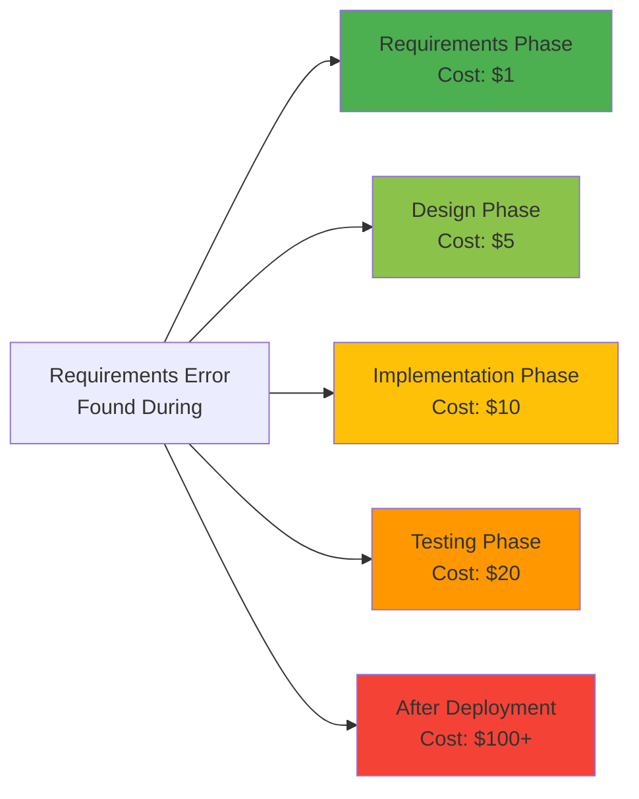
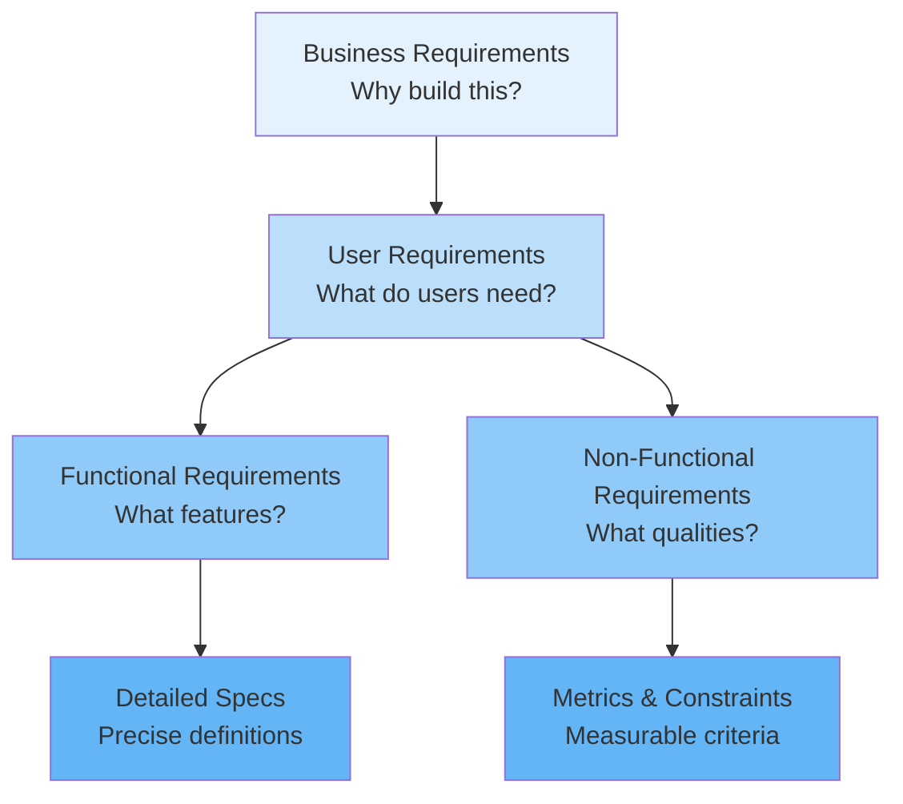
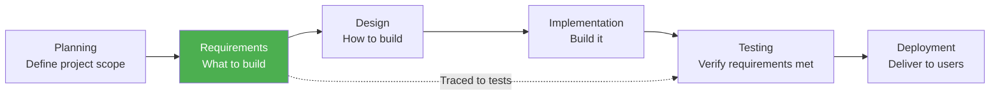

# 2.1 Requirements Fundamentals

**Learning Objectives:**
- Understand what requirements are and why they matter
- Distinguish requirements from design and implementation
- Identify characteristics of good requirements
- Recognize common requirements failures and how to avoid them

**Estimated Time:** 30 minutes

---

## What Are Requirements?

### Definition

**Requirements** are descriptions of what a system must do, the services it must provide, and the constraints under which it must operate.

Think of requirements as the **contract** between stakeholders (who want the system) and developers (who build the system). They answer the fundamental question: **"What should this software do?"**

### A Simple Example

Let's compare a vague request with a proper requirement:

**❌ Vague Request:**
"We need a system to manage student grades."

**✅ Proper Requirement:**
"The system shall allow teachers to enter, edit, and delete grades for students in their assigned classes. Grade entries must include: student ID, assignment name, score (0-100), and submission date. Teachers can only modify grades for their own classes."

**What's the difference?**
- The requirement is **specific** - we know exactly what features are needed
- It's **testable** - we can verify if teachers can perform these actions
- It has **clear boundaries** - teachers can't modify other teachers' grades
- It's **unambiguous** - there's no confusion about what's needed

---

## Why Requirements Matter

### The Cost of Getting It Wrong



**Key Insight:** An error that costs $1 to fix during requirements analysis costs $100+ to fix after deployment!

### Real-World Failure: Healthcare.gov (2013)

**The Problem:**
The U.S. government's healthcare website failed spectacularly at launch, costing $1.7 billion.

**Requirements Failures:**
- Multiple stakeholder groups with conflicting requirements
- No clear prioritization - tried to build everything at once
- Requirements changed constantly without proper control
- Unclear non-functional requirements (how many users? how fast?)
- Late integration revealed massive incompatibilities

**The Result:**
- Website crashed on launch day
- Only 6 people successfully signed up on day one
- Months of delays and emergency fixes
- Massive political and financial consequences
- Could have been prevented with proper requirements engineering

### Success Story: WhatsApp

**The Requirements:**
WhatsApp's initial requirements were crystal clear:
1. **Functional:** Send text messages between mobile phones
2. **Non-Functional:** Must work like SMS - simple, reliable, fast
3. **Constraint:** Must work on old/cheap phones with poor connectivity

**The Result:**
- Clear requirements led to focused development
- 450 million users with only 50 engineers
- Sold to Facebook for $19 billion
- Simple, well-defined requirements = massive success

---

## Requirements vs. Design vs. Implementation

Many people confuse these concepts. Here's the distinction:

| Aspect | Requirements | Design | Implementation |
|--------|--------------|--------|----------------|
| **Focus** | WHAT the system must do | HOW the system will do it | ACTUALLY building it |
| **Level** | User/business perspective | System architecture | Code and deployment |
| **Example** | "Users must log in securely" | "Use OAuth 2.0 with JWT tokens" | `class AuthService { ... }` |
| **Who?** | Business analysts, stakeholders | System architects, designers | Developers, programmers |

### Example Breakdown: Student Login

**Requirement (WHAT):**
```
FR-001: The system shall authenticate students using their 
student ID and password before granting access to their academic 
records. Failed login attempts shall be logged. After 3 failed 
attempts, the account shall be locked for 15 minutes.
```

**Design (HOW):**
```
- Use bcrypt for password hashing (cost factor: 12)
- Store login attempts in Redis cache with 15-minute TTL
- Implement rate limiting at API gateway
- Use session tokens (JWT) with 1-hour expiration
- Database: users table with columns (id, student_id, password_hash, 
  locked_until, failed_attempts)
```

**Implementation (BUILD):**
```python
class AuthenticationService:
    def login(self, student_id: str, password: str) -> Token:
        user = self.db.find_user(student_id)
        if user.is_locked():
            raise AccountLockedException()
        if not bcrypt.verify(password, user.password_hash):
            self.handle_failed_login(user)
            raise InvalidCredentialsException()
        return self.create_token(user)
```

**Key Point:** Requirements describe the WHAT without prescribing the HOW. This gives developers flexibility in choosing the best technical solution.

---

## Types of Requirements

### 1. Business Requirements

**Definition:** High-level objectives of the organization or stakeholders.

**Example - School Management System:**
- "Reduce administrative overhead by 30%"
- "Improve parent-teacher communication"
- "Increase student engagement with digital tools"
- "Ensure compliance with FERPA education privacy regulations"

**Characteristics:**
- Strategic and goal-oriented
- Often quantified with metrics
- Drive the project's existence
- May evolve slowly over time

### 2. User Requirements

**Definition:** Tasks that users should be able to accomplish with the system.

**Example - School Management System:**
- "Teachers need to record attendance quickly during class"
- "Parents want to see their child's grades anytime"
- "Students need to submit homework electronically"
- "Administrators need to generate report cards efficiently"

**Characteristics:**
- Written in natural language
- From user's perspective
- Focus on user goals and tasks
- Often become user stories in Agile

### 3. Functional Requirements (System Requirements)

**Definition:** Specific behaviors, features, and functions the system must provide.

**Example - School Management System:**
```
FR-045: The system shall allow teachers to mark students as 
Present, Absent, Tardy, or Excused for each class session.

FR-046: The system shall automatically calculate each student's 
attendance percentage based on days present divided by total 
school days.

FR-047: The system shall send automated email notifications to 
parents when a student is marked absent for 3 or more consecutive 
days.
```

**Characteristics:**
- Detailed and specific
- Testable and verifiable
- Written in "shall" statements
- Numbered for traceability

### 4. Non-Functional Requirements (Quality Attributes)

**Definition:** Constraints and quality characteristics the system must have.

**Example - School Management System:**
```
NFR-012: The system shall respond to user clicks within 2 seconds 
under normal load (500 concurrent users).

NFR-018: The system shall be available 99.9% of the time during 
school hours (7 AM - 6 PM local time).

NFR-025: The system shall encrypt all student data using AES-256 
encryption both in transit and at rest.
```

**Characteristics:**
- Define quality attributes
- Often measurable (performance, security, usability)
- Critical to user satisfaction
- Sometimes called "-ilities" (reliability, scalability, etc.)

### Requirements Hierarchy



---

## Characteristics of Good Requirements

Good requirements follow the **SMART+** principle:

### 1. Specific (Clear and Unambiguous)

**❌ Bad:**
"The system should be fast."

**✅ Good:**
"The system shall load the student dashboard within 2 seconds of login on a 10 Mbps connection."

**Why it matters:** Everyone interprets "fast" differently. 2 seconds is measurable.

### 2. Measurable (Testable and Verifiable)

**❌ Bad:**
"The system should have good security."

**✅ Good:**
"The system shall enforce passwords with minimum 8 characters, including uppercase, lowercase, numbers, and special characters. Failed login attempts shall be logged with timestamp and IP address."

**Why it matters:** You can test whether this security measure is implemented.

### 3. Achievable (Feasible)

**❌ Bad:**
"The system shall predict student performance with 100% accuracy."

**✅ Good:**
"The system shall provide performance predictions based on historical data with 80% accuracy for students with at least 5 graded assignments."

**Why it matters:** 100% accuracy is impossible. 80% is realistic and valuable.

### 4. Relevant (Necessary)

**❌ Bad:**
"The system shall display the current weather on the homepage."

**✅ Good:**
"The system shall display upcoming assignment due dates on the student homepage."

**Why it matters:** Weather isn't relevant to school management. Due dates are critical.

### 5. Traceable (Linked to Source)

**✅ Good:**
```
[Business Need BN-003]: Improve parent engagement
    ↓
[User Requirement UR-012]: Parents need visibility into student progress
    ↓
[Functional Requirement FR-045]: System shall email parents weekly 
grade summaries
    ↓
[Test Case TC-089]: Verify parent receives email with correct grades
```

**Why it matters:** You can trace each requirement back to a business need and forward to tests.

### 6. Additional Critical Characteristics

**Complete:**
- All necessary information is included
- No ambiguity or missing details

**Consistent:**
- No contradictions with other requirements
- Uses standard terminology

**Prioritized:**
- Marked as Must/Should/Could/Won't have
- Business value is clear

**Atomic:**
- One requirement per statement
- Can be implemented independently

---

## Common Requirements Mistakes

### Mistake #1: The Vague Requirement

**❌ Example:**
"The system should be user-friendly."

**Problem:** What does "user-friendly" mean? It's subjective and untestable.

**✅ Fix:**
"The system shall allow teachers to record attendance for a class of 30 students in under 2 minutes. 90% of teachers shall successfully complete the attendance task without training."

### Mistake #2: The Gold Plating

**❌ Example:**
"The system shall use artificial intelligence to automatically grade essays, provide personalized learning recommendations, generate custom curriculum, and predict college acceptance rates."

**Problem:** Over-ambitious for initial release. Complexity leads to delays and failures.

**✅ Fix:**
"Version 1.0: Teachers shall manually enter grades. 
Version 2.0: System may provide grade suggestions based on rubrics (future consideration)."

### Mistake #3: The Design Disguised as Requirement

**❌ Example:**
"The system shall use a MySQL database with three normalized tables..."

**Problem:** This is design, not a requirement. Requirements describe WHAT, not HOW.

**✅ Fix:**
"The system shall store and retrieve student records reliably, with data integrity maintained even during system failures."

### Mistake #4: The Moving Target

**❌ Example:**
Week 1: "Students can view grades."
Week 2: "Students can view grades and comments."
Week 3: "Students can view grades, comments, and revision history."
Week 4: "Students can view everything plus compare with class average..."

**Problem:** Uncontrolled changes lead to scope creep and missed deadlines.

**✅ Fix:**
Use formal change control process (covered in Section 2.9).

### Mistake #5: The Assumption

**❌ Example:**
"The system shall export reports to Excel."

**Problem:** Assumption that everyone has Excel. What about Mac users? Mobile users?

**✅ Fix:**
"The system shall export reports in CSV format, compatible with Excel, Google Sheets, and other spreadsheet applications."

---

## Requirements in the SDLC

### Where Requirements Fit



### Requirements in Waterfall vs. Agile

| Aspect | Waterfall | Agile |
|--------|-----------|-------|
| **When?** | All upfront (weeks/months) | Iteratively (each sprint) |
| **Detail** | Comprehensive SRS document | User stories + acceptance criteria |
| **Changes** | Formal change control | Welcome changes, adapt |
| **Who writes?** | Business analysts | Product Owner + Team |
| **Format** | IEEE 830 SRS | User story cards, backlog |

**Key Insight:** Both approaches need good requirements - the difference is timing and format!

---

## School Management System: Requirements Context

Let's preview the requirements we'll develop throughout this chapter:

### Business Requirements
- **BN-001:** Reduce administrative time spent on manual processes by 30%
- **BN-002:** Improve parent access to student information
- **BN-003:** Ensure FERPA compliance for student data privacy

### Sample User Requirements
- **UR-001:** Teachers need to record attendance quickly
- **UR-002:** Parents want to view grades anytime
- **UR-003:** Students need to submit assignments electronically

### Sample Functional Requirements
- **FR-001:** System shall authenticate users via student/staff ID and password
- **FR-002:** System shall allow teachers to record attendance (Present/Absent/Tardy/Excused)
- **FR-003:** System shall calculate GPA automatically based on entered grades

### Sample Non-Functional Requirements
- **NFR-001:** System shall respond within 2 seconds for 95% of requests
- **NFR-002:** System shall support 1,000 concurrent users
- **NFR-003:** System shall maintain 99.9% uptime during school hours

**We'll develop these fully in upcoming sections!**

---

## Key Takeaways

✅ **Requirements define WHAT, not HOW**
- Focus on the problem, not the solution
- Leave technical decisions to designers/developers

✅ **Good requirements are SMART+**
- Specific, Measurable, Achievable, Relevant, Traceable
- Plus: Complete, Consistent, Prioritized, Atomic

✅ **Requirements failures are expensive**
- Fixing requirements errors late costs 100x more
- Healthcare.gov: $1.7B failure due to poor requirements
- WhatsApp: $19B success with clear requirements

✅ **Requirements come in multiple types**
- Business (why), User (who/what), Functional (features), Non-functional (quality)
- All types are important and interconnected

✅ **Avoid common mistakes**
- Vague requirements, gold plating, design as requirements
- Uncontrolled changes, hidden assumptions

---

## Self-Check Questions

Test your understanding:

1. **What is the main difference between requirements and design?**
   <details>
   <summary>Click to reveal answer</summary>
   Requirements describe WHAT the system must do (user needs), while design describes HOW the system will do it (technical solution).
   </details>

2. **Why does it cost 100x more to fix a requirements error after deployment?**
   <details>
   <summary>Click to reveal answer</summary>
   Because by then, you've already designed, built, tested, and deployed based on the wrong requirement. You must redo all phases, plus handle user impact and potential data migration.
   </details>

3. **Which is a better requirement and why?**
   - A) "The system should be secure"
   - B) "The system shall encrypt all data using AES-256 and require passwords with 8+ characters"
   
   <details>
   <summary>Click to reveal answer</summary>
   B is better because it's specific, measurable, and testable. A is too vague - everyone interprets "secure" differently.
   </details>

4. **Is this a requirement or design decision?**
   "The system shall use React for the frontend framework."
   
   <details>
   <summary>Click to reveal answer</summary>
   This is a DESIGN decision, not a requirement. A proper requirement would be: "The system shall provide a responsive web interface accessible from desktop and mobile browsers."
   </details>

5. **Give an example of a non-functional requirement for the School Management System.**
   <details>
   <summary>Click to reveal answer</summary>
   Example: "The grade entry page shall load within 2 seconds for teachers on a standard school network connection (10 Mbps)."
   </details>

---

## Practice Exercise

**Scenario:** A coffee shop wants an online ordering system.

**Task:** Categorize these statements as Business (B), User (U), Functional (FR), Non-Functional (NFR), or Design (D):

1. ___ "Increase online orders by 40% within 6 months"
2. ___ "Customers want to customize their drink orders"
3. ___ "System shall allow customers to select size, milk type, and add-ons"
4. ___ "Use MongoDB for the database"
5. ___ "System shall process payment within 3 seconds"
6. ___ "Customer wants to save favorite orders for quick reordering"

<details>
<summary>Click for answers</summary>

1. **B** - Business requirement (measurable goal)
2. **U** - User requirement (user need)
3. **FR** - Functional requirement (specific feature)
4. **D** - Design decision (technical choice)
5. **NFR** - Non-functional requirement (performance)
6. **U** - User requirement (user convenience need)

</details>

---

## What's Next?

Now that you understand what requirements are and why they matter, we'll learn:

**Section 2.2:** How to identify and analyze stakeholders - who do we gather requirements from?

**Section 2.3:** Elicitation techniques - how do we actually gather requirements?

**Section 2.4-2.5:** How to write excellent functional and non-functional requirements

**Section 2.6:** How to prioritize requirements when you can't build everything

**Section 2.7:** How to document requirements professionally in an SRS

---

## 📚 Additional Reading

**Books:**
- "Software Requirements" by Karl Wiegers - Industry bible
- "Mastering the Requirements Process" by Suzanne Robertson

**Articles:**
- IEEE 830 Standard (Guide to Software Requirements Specifications)
- "The Mythical Man-Month" by Fred Brooks - Classic on software project failures

**Videos:**
- Search "Requirements Engineering" on YouTube for intro videos
- Look for case studies on famous software failures

---

**Previous:** [← Chapter 2 Overview](./chapter-02-README.md)

**Next:** [Section 2.2: Stakeholder Analysis →](./2_2-stakeholder-analysis.md)

**Course Home:** [Back to Course Overview](../README.md)

---

*Last Updated: November 2025*  
*Estimated Reading Time: 30 minutes*  
*Prerequisites: Chapter 1 (SDLC basics)*
