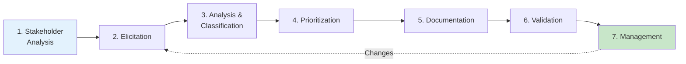

# 2.11 Chapter Summary and Assessment

[← Previous: 2.10 Hands-On Activities](./2_10-hands-on-activities.md) | [Back to Chapter 2 README](./chapter-02-README.md) | [Next: Chapter 3 - Use Case Modeling →](../chapter-03/README.md)

---

## 📖 Chapter Overview

Congratulations on completing Chapter 2: Requirements Gathering and Analysis! This chapter covered the complete requirements engineering process, from identifying stakeholders to managing requirement changes.

---

## 🎯 Learning Objectives Review

### What You've Learned

✅ **Stakeholder Analysis**
- Identify all stakeholder types (primary, secondary, key)
- Create stakeholder profiles and communication plans
- Use Power/Interest grid and RACI matrix

✅ **Elicitation Techniques**
- Conduct effective interviews (preparation, questioning, follow-up)
- Design and distribute questionnaires
- Facilitate requirements workshops
- Apply observation and document analysis

✅ **Functional Requirements**
- Write clear "shall" statements
- Create user stories with acceptance criteria
- Organize requirements by feature or user role
- Ensure traceability

✅ **Non-Functional Requirements**
- Apply URPS+ categories (Usability, Reliability, Performance, Supportability)
- Write measurable NFRs with specific metrics
- Balance conflicting quality attributes

✅ **Prioritization**
- Apply MoSCoW method effectively
- Use Kano model for user satisfaction
- Create Value/Effort matrices
- Facilitate prioritization workshops

✅ **Documentation**
- Structure SRS using IEEE 830 standard
- Write professional requirements documentation
- Implement version control

✅ **Validation and Change Management**
- Validate requirements through reviews and prototypes
- Process change requests with impact analysis
- Manage requirements baselines

---

## 📊 Key Concepts Summary

### Requirements Engineering Process

### Quick Reference Table

| Topic | Key Points |
|-------|------------|
| **Stakeholders** | Identify all, analyze power/interest, manage communication |
| **Elicitation** | Interviews + Surveys + Workshops + Observation + Documents |
| **Functional Reqs** | WHAT the system does, "shall" statements, user stories |
| **Non-Functional Reqs** | HOW WELL it performs, URPS+ categories, metrics |
| **Prioritization** | MoSCoW (Must/Should/Could/Won't), Kano model |
| **SRS Document** | IEEE 830 structure, complete and traceable |
| **Validation** | Reviews, prototypes, stakeholder sign-off |
| **Change Mgmt** | CR process, impact analysis, CCB approval, baselines |

---

## 📝 Chapter Quiz (30 Questions)

### Section A: Stakeholder Analysis (5 questions)

**1.** Which stakeholder type has the highest power AND highest interest in a school system project?
- A) Students
- B) IT Support Staff
- C) Principal
- D) Cafeteria Manager

**2.** What does the "A" in RACI stand for?
- A) Assigned
- B) Accountable
- C) Approved
- D) Available

**3.** A stakeholder who is affected by the project outcome but doesn't use the system directly is:
- A) Primary stakeholder
- B) Secondary stakeholder
- C) Key stakeholder
- D) Non-stakeholder

**4.** According to the Power/Interest grid, stakeholders with HIGH power but LOW interest should be:
- A) Managed closely
- B) Kept satisfied
- C) Kept informed
- D) Monitored

**5.** True or False: A RACI matrix can have multiple people "Accountable" for a single task.

### Section B: Elicitation Techniques (5 questions)

**6.** Which elicitation technique is BEST for gathering requirements from 200 geographically distributed users?
- A) Individual interviews
- B) Questionnaires
- C) Workshops
- D) Observation

**7.** During an interview, what percentage of time should the analyst spend listening vs. talking?
- A) 50% listening, 50% talking
- B) 80% listening, 20% talking
- C) 20% listening, 80% talking
- D) 100% listening

**8.** Which technique reveals what users actually DO vs. what they SAY they do?
- A) Interviews
- B) Surveys
- C) Observation
- D) Document analysis

**9.** JAD stands for:
- A) Just Another Discussion
- B) Joint Application Development
- C) Junior Analyst Designation
- D) Joint Approval Document

**10.** True or False: You should rely on a single elicitation technique for most projects.

### Section C: Functional Requirements (5 questions)

**11.** Which word indicates a MANDATORY requirement in formal requirements documents?
- A) Should
- B) May
- C) Shall
- D) Could

**12.** The user story format is:
- A) "When [action], the system [result]"
- B) "As a [role], I want [feature] so that [benefit]"
- C) "The system shall [capability]"
- D) "If [condition], then [action]"

**13.** Which is a properly written functional requirement?
- A) "The system shall be user-friendly"
- B) "The system shall be built using Python"
- C) "The system shall allow teachers to enter numeric grades (0-100)"
- D) "The system shall be fast"

**14.** Acceptance criteria using Given-When-Then format is called:
- A) User story
- B) Use case
- C) Gherkin syntax
- D) Requirement specification

**15.** True or False: A functional requirement describes HOW WELL the system performs.

### Section D: Non-Functional Requirements (5 questions)

**16.** Which category does "page load time < 2 seconds" belong to?
- A) Usability
- B) Performance
- C) Reliability
- D) Security

**17.** FERPA compliance is an example of which NFR category?
- A) Performance
- B) Usability
- C) Compliance
- D) Reliability

**18.** 99.9% availability allows approximately how much downtime per month?
- A) 0 minutes
- B) 43 minutes
- C) 7 hours
- D) 1 day

**19.** Which is a MEASURABLE non-functional requirement?
- A) "System shall be secure"
- B) "System shall encrypt data using AES-256"
- C) "System shall be reliable"
- D) "System shall be easy to use"

**20.** True or False: Non-functional requirements don't need to be tested.

### Section E: Prioritization (5 questions)

**21.** In MoSCoW, what percentage of requirements should typically be "Must Have"?
- A) 10-20%
- B) 30-40%
- C) 60-70%
- D) 80-90%

**22.** In the Kano model, which feature type causes dissatisfaction when ABSENT but neutral satisfaction when present?
- A) Delighter
- B) Performance
- C) Basic
- D) Indifferent

**23.** In a Value/Effort matrix, "Quick Wins" are:
- A) High value, high effort
- B) High value, low effort
- C) Low value, low effort
- D) Low value, high effort

**24.** When stakeholders have conflicting priorities, you should:
- A) Always side with the most senior stakeholder
- B) Reject both requirements
- C) Facilitate resolution through discussion or design solutions
- D) Implement both exactly as requested

**25.** True or False: "Won't Have" means the requirement will never be implemented.

### Section F: Documentation & Management (5 questions)

**26.** The IEEE standard for SRS documents is:
- A) IEEE 729
- B) IEEE 830
- C) IEEE 1012
- D) IEEE 12207

**27.** Which is NOT a typical section in an SRS document?
- A) Introduction
- B) Overall Description
- C) Source Code
- D) Specific Requirements

**28.** Validation answers which question?
- A) "Are we building the product right?"
- B) "Are we building the right product?"
- C) "Are we building on time?"
- D) "Are we within budget?"

**29.** A formal, approved version of requirements is called a:
- A) Draft
- B) Baseline
- C) Prototype
- D) Template

**30.** True or False: Changes to baselined requirements should require formal approval.

---

## 📋 Quiz Answer Key

Click to reveal answers

| # | Answer | Explanation |
|---|--------|-------------|
| 1 | C | Principal has decision authority and is directly affected |
| 2 | B | Accountable - the person ultimately answerable (only one per task) |
| 3 | B | Secondary stakeholders are affected but don't use system directly |
| 4 | B | High power/low interest = keep satisfied (don't bore them, but keep them happy) |
| 5 | False | Only ONE person can be Accountable per task |
| 6 | B | Questionnaires scale to large, distributed groups |
| 7 | B | 80/20 rule - listen more than talk |
| 8 | C | Observation reveals actual vs. stated behavior |
| 9 | B | Joint Application Development - collaborative workshop |
| 10 | False | Multiple techniques catch different insights |
| 11 | C | "Shall" indicates mandatory requirement |
| 12 | B | As a [role], I want [feature] so that [benefit] |
| 13 | C | Clear, specific, testable feature |
| 14 | C | Gherkin syntax (Given-When-Then) |
| 15 | False | Functional = WHAT; Non-functional = HOW WELL |
| 16 | B | Performance - response time metric |
| 17 | C | Compliance - regulatory requirement |
| 18 | B | 99.9% = 0.1% downtime = ~43 min/month |
| 19 | B | Specific encryption standard is measurable |
| 20 | False | NFRs require testing (performance, security, usability tests) |
| 21 | B | 30-40% should be Must Have |
| 22 | C | Basic needs are expected - absence disappoints |
| 23 | B | Quick Wins = high value, low effort - do first |
| 24 | C | Facilitate resolution, find compromise or design solution |
| 25 | False | Won't Have means not THIS release, may be future |
| 26 | B | IEEE 830-1998 is the SRS standard |
| 27 | C | Source code is not in SRS (that's implementation) |
| 28 | B | Validation = right product; Verification = product right |
| 29 | B | Baseline is approved, frozen version |
| 30 | True | Baseline changes require CCB approval |

**Scoring:**
- 27-30: Excellent (A)
- 24-26: Good (B)
- 21-23: Satisfactory (C)
- 18-20: Needs Improvement (D)
- Below 18: Review chapter content

---

## ✅ Self-Assessment Checklist

Rate your confidence (1-5) on each skill:

| Skill | 1 | 2 | 3 | 4 | 5 |
|-------|---|---|---|---|---|
| Identify and analyze stakeholders | ☐ | ☐ | ☐ | ☐ | ☐ |
| Conduct stakeholder interviews | ☐ | ☐ | ☐ | ☐ | ☐ |
| Design effective questionnaires | ☐ | ☐ | ☐ | ☐ | ☐ |
| Facilitate requirements workshops | ☐ | ☐ | ☐ | ☐ | ☐ |
| Write functional requirements | ☐ | ☐ | ☐ | ☐ | ☐ |
| Write measurable NFRs | ☐ | ☐ | ☐ | ☐ | ☐ |
| Apply MoSCoW prioritization | ☐ | ☐ | ☐ | ☐ | ☐ |
| Create SRS documents | ☐ | ☐ | ☐ | ☐ | ☐ |
| Validate requirements | ☐ | ☐ | ☐ | ☐ | ☐ |
| Manage requirement changes | ☐ | ☐ | ☐ | ☐ | ☐ |

**If any skill is below 3:** Review that section and complete the related activity.

---

## 📋 Chapter Assignment

### Assignment: Create a Mini-SRS

**Objective:** Apply chapter concepts to create a partial Software Requirements Specification.

**Deliverable:** A 5-7 page document containing:

1. **Stakeholder Analysis** (1 page)
   - Identify 4 stakeholder types for a project of your choice
   - Create Power/Interest grid placement
   - Define communication approach for each

2. **Functional Requirements** (2 pages)
   - Write 10 functional requirements using "shall" statements
   - Include 2 user stories with acceptance criteria
   - Organize by feature category

3. **Non-Functional Requirements** (1 page)
   - Write 6 NFRs covering: Performance, Security, Usability, Reliability
   - Include specific metrics for each

4. **Prioritization** (1 page)
   - Prioritize your 16 requirements using MoSCoW
   - Justify Must Have selections

5. **Traceability Matrix** (1 page)
   - Link 5 requirements to stakeholder sources
   - Include status column

### Grading Criteria

| Criterion | Points |
|-----------|--------|
| Stakeholder analysis completeness | 15 |
| Functional requirements quality | 25 |
| NFR measurability | 20 |
| Prioritization justification | 15 |
| Traceability accuracy | 15 |
| Professional formatting | 10 |
| **Total** | **100** |

---

## 🔮 Preview: Chapter 3 - Use Case Modeling

In Chapter 3, you'll learn to:
- Create use case diagrams showing actor-system interactions
- Write detailed use case descriptions
- Model alternative and exception flows
- Connect use cases to requirements
- Transform user stories into use cases

**Preparation:**
- Review Chapter 2 functional requirements
- Think about actor-system interactions in School System
- Install UML diagramming tool (Lucidchart, Draw.io)

---

## 🎉 Congratulations!

You've completed Chapter 2: Requirements Gathering and Analysis!

**You now have skills to:**
- Gather requirements professionally from stakeholders
- Document requirements clearly and completely
- Prioritize requirements for maximum value delivery
- Manage requirements throughout a project

These are core skills for Business Analysts, Product Managers, and Software Developers. Apply them in your projects and portfolio!

---

[← Previous: 2.10 Hands-On Activities](./2_10-hands-on-activities.md) | [Back to Chapter 2 README](./chapter-02-README.md) | [Next: Chapter 3 - Use Case Modeling →](../chapter-03/README.md)
