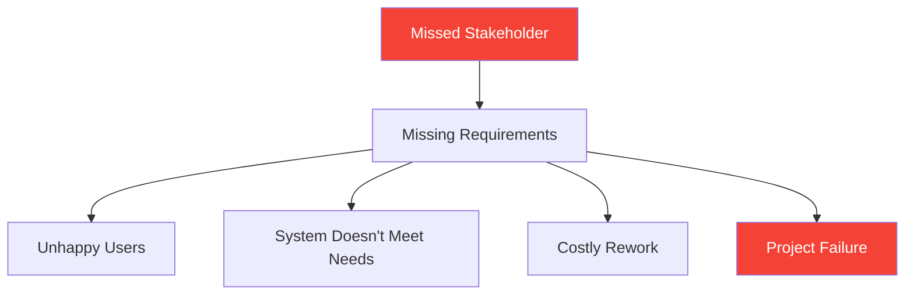
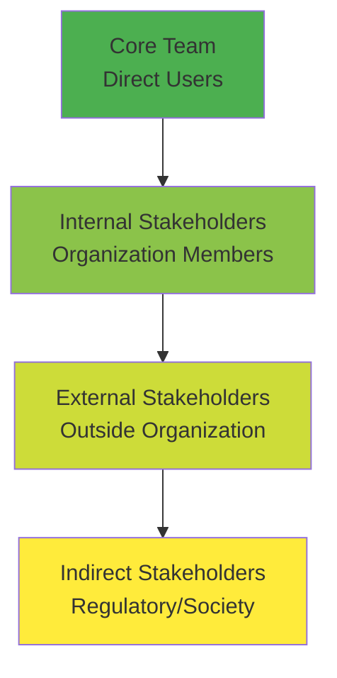
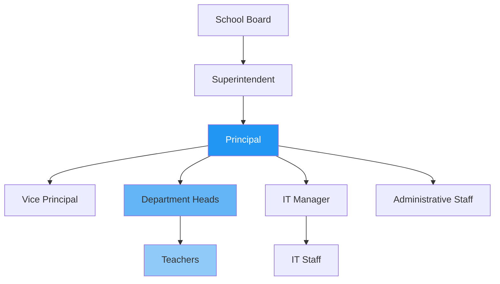
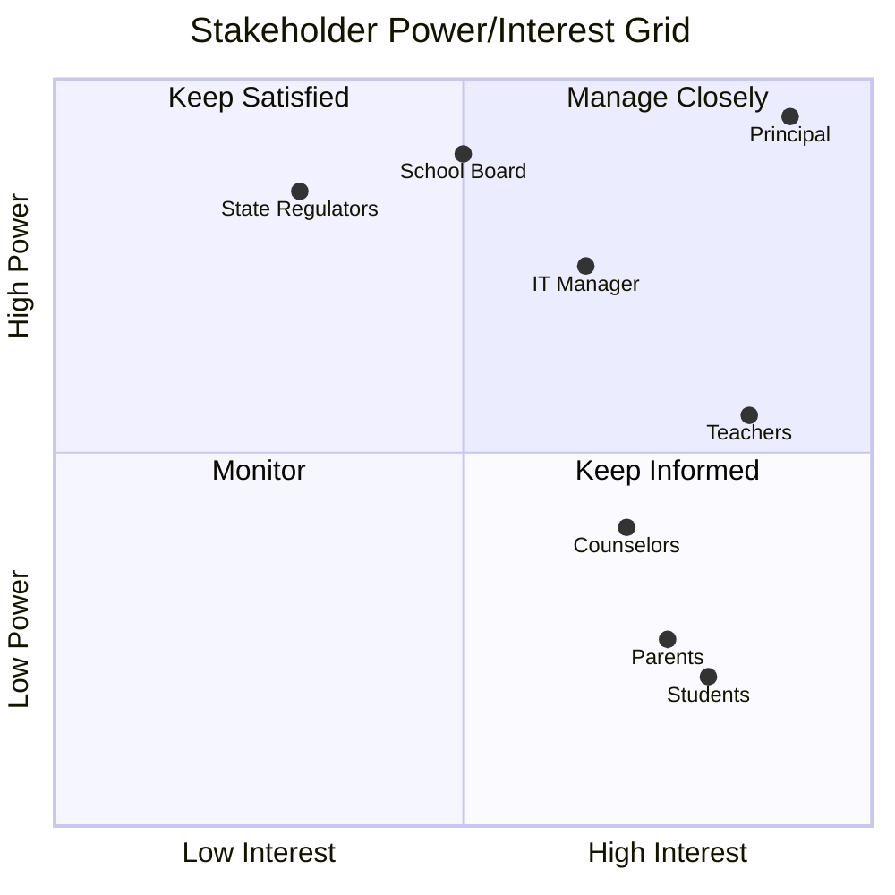
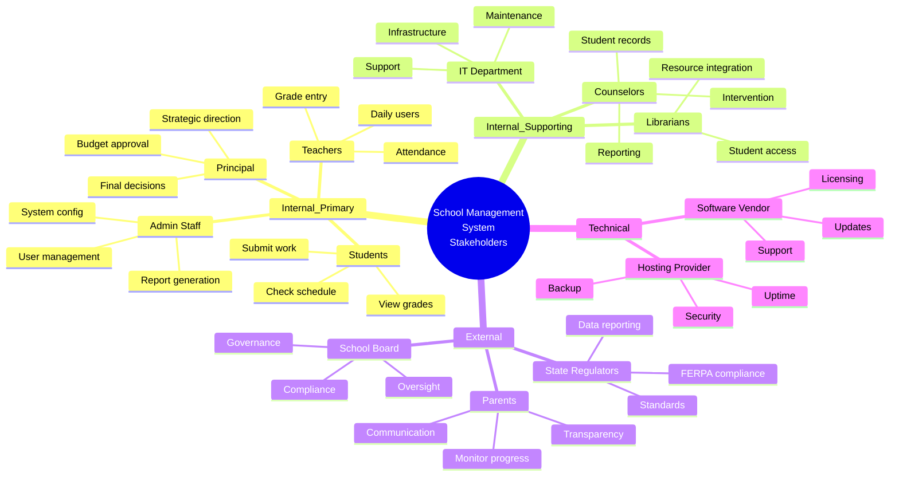

# 2.2 Stakeholder Analysis

**Learning Objectives:**
- Identify all relevant stakeholders for a software project
- Analyze stakeholder power and interest using proven frameworks
- Create RACI matrices for stakeholder responsibilities
- Develop stakeholder communication plans
- Manage conflicting stakeholder needs

**Estimated Time:** 35 minutes

---

## What is a Stakeholder?

### Definition

A **stakeholder** is anyone who:
- Has an interest in the project
- Will be affected by the project
- Can influence the project's success or failure
- Provides resources (time, money, information)

**Important:** Stakeholders aren't just the people who requested the system. They include anyone impacted by it!

### Why Stakeholder Analysis Matters



**Real Example:** A hospital built a patient scheduling system but forgot to involve **nurses**. The system worked great for administrators but made nurses' jobs harder. Result: Nurses refused to use it, forcing a complete redesign costing $2M.

---

## Stakeholder Identification

### The Onion Model

Stakeholders exist in layers, like an onion:



### School Management System Example

#### Layer 1: Core Team (Direct Users)
- **Teachers** - Primary users, enter grades and attendance daily
- **Students** - View their grades, submit assignments
- **Parents** - Monitor student progress
- **School Administrators** - Generate reports, manage users

#### Layer 2: Internal Stakeholders
- **IT Department** - Maintains and supports the system
- **Principal** - Approves budget, sets policies
- **School Board** - Governance and oversight
- **Counselors** - Access student records for guidance
- **Librarians** - May integrate with library system

#### Layer 3: External Stakeholders
- **Parents** (also in Layer 1, but represent external perspective)
- **Software Vendor** - If buying not building
- **Payment Processor** - For online fee payments
- **Internet Service Provider** - Infrastructure dependency

#### Layer 4: Indirect Stakeholders
- **State Education Department** - Regulatory compliance
- **FERPA (Federal Law)** - Privacy requirements
- **Community** - Public school reputation
- **Future Students** - System longevity matters

### Identification Techniques

#### 1. Brainstorming Sessions

Ask these questions:
- Who will **use** the system?
- Who will **benefit** from the system?
- Who will be **negatively impacted**?
- Who **pays** for the system?
- Who **maintains** the system?
- Who has **authority** over the project?
- Who can **stop** the project?

#### 2. Organizational Chart Review



**Tip:** Don't just look at the top! Often the most important stakeholders are mid-level users.

#### 3. Process Mapping

Map current processes and identify everyone involved:

**Example: Grade Entry Process**
1. Teacher calculates grade (Teacher = stakeholder)
2. Teacher enters in gradebook (System = requirement)
3. Counselor reviews for probation (Counselor = stakeholder)
4. Parent receives notification (Parent = stakeholder)
5. Student views grade (Student = stakeholder)
6. IT backs up data (IT = stakeholder)

#### 4. Interview Current Stakeholders

Ask: "Who else should I talk to about this system?"

**Snowball technique:** Each stakeholder recommends other stakeholders.

---

## Power/Interest Grid Analysis

Not all stakeholders are equal. Prioritize them using the **Power/Interest Grid**:



### The Four Quadrants

#### Quadrant 1: Manage Closely (High Power, High Interest)
**Example:** Principal, IT Manager

**Strategy:**
- Involve in all major decisions
- Regular status updates
- Seek approval on key requirements
- Address concerns immediately
- Weekly or bi-weekly meetings

**Why:** They have both the power to stop the project and high interest in its success.

#### Quadrant 2: Keep Satisfied (High Power, Low Interest)
**Example:** School Board, State Regulators

**Strategy:**
- Keep informed of progress
- Don't overwhelm with details
- Ensure their high-level needs are met
- Monthly updates or as needed
- Formal reporting

**Why:** They can influence the project but aren't involved daily. Don't annoy them with minutiae.

#### Quadrant 3: Monitor (Low Power, Low Interest)
**Example:** Future students, community members

**Strategy:**
- Minimal communication
- Inform of major milestones
- Generic announcements
- Consider their needs but don't over-invest time

**Why:** Limited impact on project. Don't ignore completely, but don't spend excessive time.

#### Quadrant 4: Keep Informed (Low Power, High Interest)
**Example:** Teachers, Students, Parents, Counselors

**Strategy:**
- Regular communication
- Detailed updates
- Gather their requirements carefully
- Beta testing and feedback sessions
- They're your actual USERS!

**Why:** They'll use the system daily! High interest but may lack organizational power. Their satisfaction = project success.

### School Management System - Complete Stakeholder Analysis

| Stakeholder | Power | Interest | Quadrant | Strategy |
|-------------|-------|----------|----------|----------|
| **Principal** | Very High | Very High | Manage Closely | Weekly meetings, approval needed |
| **IT Manager** | High | High | Manage Closely | Technical decisions, regular collaboration |
| **School Board** | Very High | Medium | Keep Satisfied | Monthly reports, major milestone approvals |
| **Teachers** | Medium | Very High | Keep Informed | Workshops, beta testing, frequent updates |
| **Students** | Low | High | Keep Informed | Student council feedback, usability testing |
| **Parents** | Low | Medium-High | Keep Informed | Surveys, parent portal demos |
| **Counselors** | Medium | Medium | Keep Informed | Requirement sessions, feature demos |
| **IT Staff** | Medium | High | Keep Informed | Technical requirements, training |
| **State Regulators** | High | Low | Keep Satisfied | Compliance documentation |
| **Vendors** | Low | Medium | Monitor | Contract management |

---

## RACI Matrix

**RACI** defines roles and responsibilities:
- **R**esponsible - Does the work
- **A**ccountable - Ultimately answerable (only ONE per task)
- **C**onsulted - Provides input
- **I**nformed - Kept updated

### School System Requirements - RACI Example

| Activity | Principal | IT Manager | Teachers | BA | Developers | Students |
|----------|-----------|------------|----------|-----|------------|----------|
| **Approve Project** | A | C | I | I | I | - |
| **Gather Requirements** | C | C | C | R, A | I | C |
| **Prioritize Features** | A | C | C | R | I | I |
| **Design Database** | I | C | I | C | R, A | - |
| **Develop Code** | I | C | - | - | R, A | - |
| **User Acceptance Testing** | C | C | R | C | C | R |
| **Approve Go-Live** | A | C | C | I | I | I |
| **Training Users** | C | R | A | C | C | - |

**Key Insights:**
- Principal is **Accountable** for major decisions (approve project, prioritize features, approve go-live)
- Business Analyst is **Responsible** for gathering requirements (does the work)
- Teachers are **Responsible** for user testing (they test it)
- Developers are **Responsible** for technical work
- Students are **Consulted** during requirements (their needs matter)

### Common RACI Mistakes

❌ **Multiple Accountable (A) per task**
- Only ONE person can be accountable
- Accountability can't be shared

❌ **No one Accountable**
- Every task needs an owner
- If no A, task falls through cracks

❌ **Too many Consulted (C)**
- Consult only those whose input truly matters
- Too many cooks spoil the broth

---

## Stakeholder Profiles

Create detailed profiles for key stakeholders:

### Example: Teacher Profile

```
Name: Ms. Maria Rodriguez
Role: 8th Grade Math Teacher
Department: Mathematics
Experience: 12 years teaching
Tech Comfort: Medium (uses email, basic Office)
Age: 38

Current Process:
- Records grades in Excel spreadsheet
- Manually emails parents for missing homework
- Paper attendance taken each class
- Spends ~5 hours/week on administrative tasks

Pain Points:
- Excel crashes lose data
- Forgetting to email parents
- No easy way to track trends
- Difficult to share info with counselors

Goals with New System:
- Reduce admin time to 2 hours/week
- Automatic parent notifications
- Easy attendance tracking
- Visual dashboards for student progress

Requirements Priority:
- MUST: Quick grade entry (she has 150+ students)
- SHOULD: Attendance integration
- COULD: Analytics and trends
- WON'T: Complex statistical analysis

Communication Preferences:
- Email for updates
- In-person for training
- Availability: After school 3-4 PM
- Prefer visual demos over written docs
```

### Why Profiles Matter

Profiles help you:
- **Empathize** with stakeholders
- **Tailor** communication
- **Prioritize** requirements
- **Design** better solutions
- **Avoid** assumptions

---

## Stakeholder Communication Plan

Different stakeholders need different communication:

### Communication Matrix

| Stakeholder | Frequency | Method | Content | Who Sends |
|-------------|-----------|--------|---------|-----------|
| **Principal** | Weekly | In-person meeting | Progress, blockers, decisions needed | Project Manager |
| **IT Manager** | Twice weekly | Email + Slack | Technical issues, infrastructure | Tech Lead |
| **Teachers** | Bi-weekly | Email newsletter | Feature updates, training dates | BA |
| **School Board** | Monthly | Written report | Milestones, budget, risks | Principal |
| **Parents** | As needed | Email/Portal | New features, downtime | Communications |
| **Students** | As needed | In-app messages | Tips, new features | Support Team |

### Communication Best Practices

#### 1. Tailor the Message

**To Principal (Executive):**
"The new system will reduce administrative costs by 30%, saving $50K annually. We're on track for January launch."

**To Teachers (Users):**
"The grade entry screen now has keyboard shortcuts! Press 'A' for absent, 'P' for present. This should cut entry time in half."

**To School Board (Governance):**
"Project is proceeding according to approved timeline. Phase 1 complete. Budget: 95% of allocated funds used. Risk: Low."

#### 2. Use the Right Channel

- **Urgent Issues:** Phone call or in-person
- **Status Updates:** Email
- **Collaborative Work:** Workshops or meetings
- **FYI Information:** Newsletter or portal

#### 3. Timing Matters

- **Before Decisions:** Consult stakeholders early
- **During Development:** Regular updates build trust
- **Before Launch:** Extra communication reduces anxiety
- **After Launch:** Gather feedback immediately

---

## Managing Conflicting Stakeholder Needs

Stakeholders often want different things. How do you handle it?

### Example Conflict: Grade Visibility

**Teachers want:** 
- Ability to hide grades until entire assignment is graded
- Don't want parents seeing draft grades

**Parents want:**
- Real-time access to all grades
- Immediate visibility when grades are entered

**Students want:**
- See grades as soon as teachers enter them
- Compare with class average

### Resolution Techniques

#### 1. Find the Underlying Need

Don't just hear the **position**, understand the **interest**:

- Teachers don't want parents calling about incomplete gradebooks
- Parents want to help students stay on track
- Students want feedback quickly

#### 2. Create Win-Win Solutions

**Solution:**
- Teachers can mark grades as "Draft" or "Final"
- Only "Final" grades visible to parents/students
- System shows "Assignment being graded - check back [date]"
- Teachers commit to finalizing within 7 days

**Result:**
- Teachers control visibility ✅
- Parents get timely updates ✅
- Students get feedback quickly ✅

#### 3. Use Data and Metrics

Research shows:
- Students who see grades within 48 hours perform 15% better
- Parent involvement increases when they have visibility
- Teacher stress decreases with clear workflows

**Decision:** Favor solution that benefits student learning (primary mission).

#### 4. Escalate When Necessary

If stakeholders can't agree:
1. Document both positions
2. Present to decision-maker (Principal/Board)
3. Include recommendation with reasoning
4. Accept final decision

---

## Stakeholder Register Template

Create a stakeholder register to track everyone:

| ID | Name | Role | Organization | Power | Interest | Quadrant | Contact | Notes |
|----|------|------|--------------|-------|----------|----------|---------|-------|
| SH-001 | Dr. Sarah Johnson | Principal | Lincoln High | High | High | Manage Closely | sjohnson@school.edu | Final approver |
| SH-002 | James Chen | Head Teacher | Lincoln High | Med | High | Keep Informed | jchen@school.edu | Represents teachers |
| SH-003 | David Kumar | IT Manager | School District | High | High | Manage Closely | dkumar@district.edu | Technical decisions |
| SH-004 | Maria Rodriguez | Teacher (Math) | Lincoln High | Med | High | Keep Informed | mrodriguez@school.edu | Heavy user |
| SH-005 | Jennifer Williams | Parent Rep | PTA | Low | Med | Keep Informed | jen.williams@email.com | Parent perspective |

---

## School Management System - Complete Stakeholder Map



---

## Key Takeaways

✅ **Stakeholders are anyone affected by or affecting the project**
- Don't just think "users" - include everyone in the ecosystem

✅ **Use the Power/Interest Grid**
- Manage Closely: High power, high interest (Principal, IT Manager)
- Keep Satisfied: High power, low interest (School Board)
- Keep Informed: Low power, high interest (Teachers, Users)
- Monitor: Low power, low interest (General community)

✅ **RACI clarifies responsibilities**
- Responsible: Does the work
- Accountable: Ultimately answerable (only one per task)
- Consulted: Provides input
- Informed: Kept updated

✅ **Create stakeholder profiles**
- Understanding background helps you gather better requirements
- Tailor communication to their preferences

✅ **Conflicts are normal**
- Find underlying needs, not just stated positions
- Create win-win solutions when possible
- Use data to make objective decisions

---

## Self-Check Questions

1. **Who should be included as stakeholders?**
   <details>
   <summary>Answer</summary>
   Anyone who: uses the system, is affected by it, can influence its success/failure, provides resources, or has regulatory authority over it.
   </details>

2. **What's the difference between Power and Interest in stakeholder analysis?**
   <details>
   <summary>Answer</summary>
   Power = ability to influence the project (authority, resources, veto power). Interest = how much they care about the project outcome (daily impact on their work).
   </details>

3. **Can multiple people be Accountable (A) in RACI for the same task?**
   <details>
   <summary>Answer</summary>
   No! Only ONE person can be accountable per task. Accountability cannot be shared - someone must ultimately own the outcome.
   </details>

4. **A teacher wants to see detailed analytics, but the principal says it's too expensive. How do you resolve this?**
   <details>
   <summary>Answer</summary>
   Options: (1) Prioritize basic reporting for v1.0, advanced analytics for v2.0. (2) Show ROI of analytics (teacher time saved). (3) Find free/low-cost analytics tools. (4) Let principal (higher power) make final call with full information.
   </details>

---

## Practice Exercise

**Scenario:** A local gym wants a membership management system.

**Task:** Identify at least 8 stakeholders and classify them:

| Stakeholder | Power (H/M/L) | Interest (H/M/L) | Quadrant | Why? |
|-------------|---------------|------------------|----------|------|
| 1. | | | | |
| 2. | | | | |
| 3. | | | | |

<details>
<summary>Sample Answer</summary>

| Stakeholder | Power | Interest | Quadrant | Why? |
|-------------|-------|----------|----------|------|
| Gym Owner | High | High | Manage Closely | Final decisions, pays for system |
| Front Desk Staff | Low | High | Keep Informed | Daily users, check-ins |
| Personal Trainers | Low | Med | Keep Informed | Track client sessions |
| Members | Low | Med | Keep Informed | Use mobile app, book classes |
| Accountant | Med | Med | Keep Informed | Financial reporting |
| IT Contractor | Med | High | Manage Closely | Builds/maintains system |
| Payment Processor | Med | Low | Keep Satisfied | Credit card transactions |
| Health Department | High | Low | Keep Satisfied | Regulatory compliance |

</details>

---

## What's Next?

Now that you know WHO to gather requirements from, let's learn HOW:

**Section 2.3:** Elicitation Techniques - interviews, surveys, workshops, observation, and more!

---

**Previous:** [← Section 2.1: Requirements Fundamentals](./2_1-requirements-fundamentals.md)

**Next:** [Section 2.3: Elicitation Techniques →](./2_3-elicitation-techniques.md)

**Chapter Home:** [Chapter 2 Overview](./chapter-02-README.md)

---

*Last Updated: November 2025*  
*Estimated Reading Time: 35 minutes*
