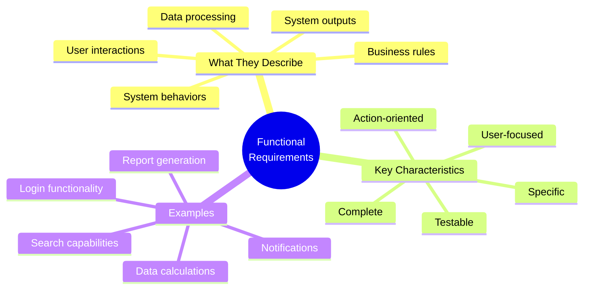
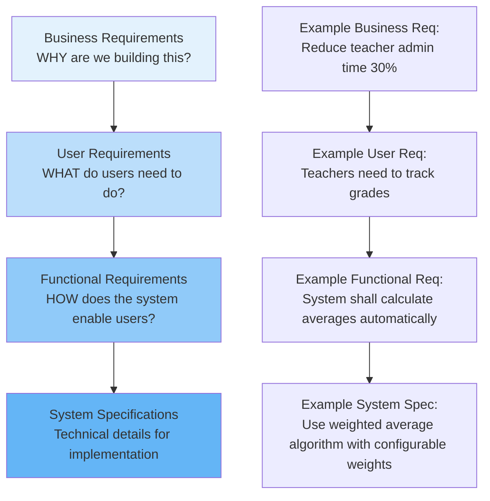
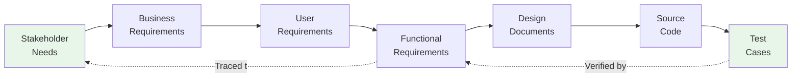

# 2.4 Functional Requirements

[← Previous: 2.3 Elicitation Techniques](./2_3-elicitation-techniques.md) | [Back to Chapter 2 README](./chapter-02-README.md) | [Next: 2.5 Non-Functional Requirements →](./2_5-non-functional-requirements.md)

---

## 📖 Introduction

Functional requirements are the backbone of any software system—they define **what the system must do**. Unlike non-functional requirements that describe quality attributes, functional requirements specify the actual features, behaviors, and capabilities that users need to accomplish their tasks.

Writing clear, complete, and testable functional requirements is one of the most critical skills for any software professional. Poor functional requirements lead to systems that don't meet user needs, expensive rework, and project failures.

**Reading Time:** 35 minutes  
**Activity Time:** 20 minutes

---

## 🎯 Learning Objectives

By the end of this section, you will be able to:

1. Define functional requirements and distinguish them from non-functional requirements
2. Write well-formed functional requirements using multiple formats
3. Create user stories with proper acceptance criteria
4. Identify and avoid common functional requirements mistakes
5. Organize functional requirements into logical categories
6. Create traceability links between requirements and other artifacts

---

## 📋 What Are Functional Requirements?

### Definition

**Functional Requirements (FRs)** describe **what the system must do**—the specific behaviors, functions, and capabilities that the software must provide to meet user needs.



### Functional vs. Non-Functional: Quick Comparison

| Aspect | Functional Requirements | Non-Functional Requirements |
|--------|------------------------|----------------------------|
| **Focus** | WHAT the system does | HOW WELL it performs |
| **Question** | "Can the system do X?" | "How fast/secure/reliable is X?" |
| **Example** | "System shall allow grade entry" | "Grade entry shall complete in < 2 seconds" |
| **Testing** | Functional testing (does feature work?) | Performance/security/usability testing |
| **User Impact** | Features they can use | Quality of experience |

### The Functional Requirements Hierarchy



---

## ✍️ Writing Functional Requirements

### Format Option 1: Traditional "Shall" Statements

The traditional format uses "shall" to indicate mandatory requirements:

**Structure:** `The [system/component] shall [action verb] [specific capability]`

**Examples for School Management System:**

```
FR-001: The system shall allow teachers to create new assignments with 
        name, description, due date, and maximum points.

FR-002: The system shall calculate student grades based on weighted 
        categories (tests, quizzes, homework, participation).

FR-003: The system shall generate PDF report cards for each student 
        at the end of each grading period.

FR-004: The system shall send email notifications to parents when 
        grades are posted or fall below 70%.

FR-005: The system shall maintain a complete audit trail of all 
        grade changes including user, timestamp, and old/new values.
```

**Key Words and Their Meanings:**

| Word | Meaning | Use When |
|------|---------|----------|
| **Shall** | Mandatory requirement | Core functionality |
| **Should** | Recommended but not mandatory | Important enhancements |
| **May** | Optional | Nice-to-have features |
| **Will** | Statement of fact, not requirement | Describing system behavior |

### Format Option 2: User Stories

User stories are the Agile approach to capturing requirements:

**Structure:** `As a [role], I want [capability] so that [benefit]`

**Examples for School Management System:**

```
US-001: As a teacher, I want to enter grades for my students 
        so that I can track their academic progress.

US-002: As a parent, I want to view my child's grades online 
        so that I can stay informed without contacting the teacher.

US-003: As an administrator, I want to generate attendance reports 
        so that I can comply with state reporting requirements.

US-004: As a student, I want to see my assignment due dates 
        so that I can manage my homework effectively.

US-005: As a teacher, I want to copy assignments between classes 
        so that I don't have to recreate common assignments.
```

### Format Option 3: Use Case Style

Use cases describe interactions between actors and the system:

**Example: Enter Student Grade**

```
Use Case: UC-003 Enter Student Grade

Primary Actor: Teacher
Preconditions: 
  - Teacher is logged into the system
  - Teacher is assigned to the course
  - Assignment exists in the system

Main Success Scenario:
  1. Teacher selects a course from their course list
  2. System displays list of students enrolled in course
  3. Teacher selects an assignment to grade
  4. System displays grade entry form with student list
  5. Teacher enters numeric grade (0-100) for each student
  6. Teacher clicks "Save Grades"
  7. System validates all entries
  8. System saves grades and displays confirmation

Alternative Flows:
  3a. No assignments exist for course
      3a1. System displays message "No assignments yet"
      3a2. System offers option to create new assignment
  
  7a. Invalid grade entered (negative or > max points)
      7a1. System highlights invalid entry in red
      7a2. System displays error message with valid range
      7a3. Teacher corrects grade and resubmits

Postconditions:
  - Grades are saved to database
  - Audit log entry created
  - Parent notification triggered if grade < 70%
```

---

## 📝 Acceptance Criteria

### What Are Acceptance Criteria?

Acceptance criteria define the specific conditions that must be met for a requirement to be considered complete. They make requirements testable.

**Structure (Given-When-Then / Gherkin Format):**

```gherkin
Given [initial context/precondition]
When [action is performed]
Then [expected result occurs]
```

### School System Examples with Acceptance Criteria

**User Story:**
```
US-010: As a teacher, I want to calculate final grades automatically 
        so that I don't have to manually compute averages.
```

**Acceptance Criteria:**
```gherkin
Scenario 1: Calculate simple average
Given a student has grades [85, 90, 78, 92] for assignments
When the teacher views the student's grade summary
Then the system displays the average as 86.25

Scenario 2: Calculate weighted average
Given the course has weighted categories:
  | Category      | Weight |
  | Tests         | 40%    |
  | Quizzes       | 30%    |
  | Homework      | 20%    |
  | Participation | 10%    |
And the student has grades:
  | Category      | Average |
  | Tests         | 85      |
  | Quizzes       | 90      |
  | Homework      | 95      |
  | Participation | 100     |
When the teacher views the final grade
Then the system calculates: (85×0.4)+(90×0.3)+(95×0.2)+(100×0.1) = 89.0

Scenario 3: Handle missing grades
Given a student has not submitted an assignment
When the teacher views the grade summary
Then the system shows "Missing" for that assignment
And the system excludes missing assignments from average calculation
And the system displays warning "1 missing assignment"

Scenario 4: Extra credit handling
Given a student earned 5 extra credit points
When extra credit is applied to their grade
Then the grade increases by 5 points
And the grade does not exceed 100
```

---

## 🏫 School Management System: Complete Functional Requirements

### Category 1: User Authentication & Authorization

```
FR-AUTH-001: The system shall require users to authenticate with 
             username and password before accessing any functionality.

FR-AUTH-002: The system shall enforce password complexity rules 
             (minimum 8 characters, 1 uppercase, 1 number, 1 special character).

FR-AUTH-003: The system shall lock user accounts after 5 failed 
             login attempts for 30 minutes.

FR-AUTH-004: The system shall support four user roles: Administrator, 
             Teacher, Student, and Parent.

FR-AUTH-005: The system shall restrict grade editing to teachers 
             assigned to the specific course.

FR-AUTH-006: The system shall allow parents to view only their 
             own children's information.
```

### Category 2: Grade Management

```
FR-GRADE-001: The system shall allow teachers to create assignments 
              with name, description, due date, category, and maximum points.

FR-GRADE-002: The system shall allow teachers to enter numeric grades 
              (0-100) or letter grades (A-F) for each student per assignment.

FR-GRADE-003: The system shall automatically calculate course averages 
              based on configured weighted categories.

FR-GRADE-004: The system shall automatically convert numeric grades to 
              letter grades based on configurable grade scale.

FR-GRADE-005: The system shall support extra credit assignments that 
              can increase student grades beyond normal maximum.

FR-GRADE-006: The system shall allow teachers to drop the lowest 
              N grades in a category (configurable per category).

FR-GRADE-007: The system shall maintain complete history of all 
              grade changes with user, timestamp, and previous value.

FR-GRADE-008: The system shall allow bulk grade import from CSV files 
              with validation and error reporting.

FR-GRADE-009: The system shall display real-time grade statistics 
              (class average, median, grade distribution) to teachers.

FR-GRADE-010: The system shall flag students with grades below 
              configurable threshold (default 70%) for intervention.
```

### Category 3: Attendance Tracking

```
FR-ATT-001: The system shall allow teachers to record daily attendance 
            as Present, Absent, Tardy, or Excused.

FR-ATT-002: The system shall support bulk attendance entry 
            ("Mark all present" with exceptions).

FR-ATT-003: The system shall calculate attendance percentages 
            automatically for each student.

FR-ATT-004: The system shall generate attendance reports by 
            student, class, or school-wide.

FR-ATT-005: The system shall send automated notifications when 
            student absences exceed threshold (default: 3 consecutive days).
```

### Category 4: Communication

```
FR-COMM-001: The system shall send automated email notifications 
             to parents when new grades are posted.

FR-COMM-002: The system shall provide in-app messaging between 
             teachers and parents.

FR-COMM-003: The system shall allow teachers to send bulk 
             announcements to all parents in a class.

FR-COMM-004: The system shall generate and email progress reports 
             on configurable schedule (weekly, bi-weekly, monthly).

FR-COMM-005: The system shall maintain message history for 
             reference and audit purposes.
```

### Category 5: Reporting

```
FR-RPT-001: The system shall generate individual student report cards 
            in PDF format at end of grading period.

FR-RPT-002: The system shall generate class grade distribution reports 
            for teacher analysis.

FR-RPT-003: The system shall generate school-wide academic performance 
            reports for administrators.

FR-RPT-004: The system shall export data to state-required reporting 
            formats (specific format TBD based on state).

FR-RPT-005: The system shall provide customizable report templates 
            for different report types.
```

---

## 🔗 Requirements Traceability

### What Is Traceability?

Traceability links requirements to their sources, to each other, and to downstream artifacts (design, code, tests).



### Traceability Matrix Example

| Req ID | Requirement | Source | Design Ref | Test Case | Status |
|--------|-------------|--------|------------|-----------|--------|
| FR-GRADE-001 | Create assignments | Stakeholder Interview SI-003 | DD-4.2.1 | TC-GRADE-001 | Approved |
| FR-GRADE-002 | Enter numeric grades | Workshop WS-001 | DD-4.2.2 | TC-GRADE-002-005 | Approved |
| FR-GRADE-003 | Calculate averages | Questionnaire Q-015 | DD-4.3.1 | TC-GRADE-010-015 | In Review |
| FR-AUTH-001 | User authentication | FERPA Compliance | DD-3.1.1 | TC-AUTH-001-010 | Approved |
| FR-COMM-001 | Parent notifications | Parent Survey PS-042 | DD-5.1.1 | TC-COMM-001-003 | Draft |

---

## ⚠️ Common Mistakes and How to Avoid Them

### Mistake 1: Vague Requirements

❌ **Bad:** "The system shall be easy to use"  
✅ **Good:** "Teachers shall complete grade entry for a class of 30 students in under 10 minutes"

❌ **Bad:** "The system shall handle grades"  
✅ **Good:** "The system shall allow teachers to enter, edit, and delete numeric grades (0-100) for student assignments"

### Mistake 2: Implementation Specifications

❌ **Bad:** "The system shall use MySQL database to store grades"  
✅ **Good:** "The system shall persistently store all grade data with backup and recovery capabilities"

### Mistake 3: Untestable Requirements

❌ **Bad:** "The system shall be fast"  
✅ **Good:** "Grade calculation shall complete within 2 seconds for a class of 30 students"

### Mistake 4: Compound Requirements

❌ **Bad:** "The system shall allow teachers to enter grades and send notifications and generate reports"  
✅ **Good:** Split into three separate requirements (FR-001, FR-002, FR-003)

### Mistake 5: Missing Acceptance Criteria

❌ **Bad:** User story with no acceptance criteria  
✅ **Good:** User story with 3-5 specific acceptance criteria in Given-When-Then format

---

## 🔍 Requirements Quality Checklist

Use this checklist to validate each functional requirement:

### Clarity
- [ ] Is the requirement written in clear, simple language?
- [ ] Would all stakeholders interpret it the same way?
- [ ] Are all technical terms defined?

### Completeness
- [ ] Does the requirement describe a complete behavior?
- [ ] Are all inputs, outputs, and conditions specified?
- [ ] Are error conditions and edge cases addressed?

### Testability
- [ ] Can you write a test case for this requirement?
- [ ] Are success criteria measurable?
- [ ] Is there a clear pass/fail determination?

### Consistency
- [ ] Does this requirement conflict with other requirements?
- [ ] Is terminology used consistently throughout?
- [ ] Do related requirements align?

### Traceability
- [ ] Can you trace this to a business need or stakeholder request?
- [ ] Is the requirement uniquely identified (FR-XXX)?
- [ ] Is the source documented?

---

## ✅ Self-Check Questions

1. What distinguishes a functional requirement from a non-functional requirement?

2. Convert this vague requirement to a proper functional requirement: "Users need to manage their accounts"

3. Write a user story with acceptance criteria for: "Parents want to see when assignments are due"

4. What's wrong with this requirement? "The system shall store student data in a PostgreSQL database with 3 replicas"

5. Create three functional requirements for a "Student Schedule Viewing" feature.

<details>
<summary>Click to reveal answers</summary>

**Answer 1:** Functional requirements describe WHAT the system does (features, behaviors, capabilities). Non-functional requirements describe HOW WELL it performs (speed, security, usability, reliability).

**Answer 2:** 
- FR-USER-001: The system shall allow users to update their profile information (name, email, phone number).
- FR-USER-002: The system shall allow users to change their password with current password verification.
- FR-USER-003: The system shall allow users to configure notification preferences (email, SMS, in-app).

**Answer 3:**
```
User Story: As a parent, I want to see upcoming assignment due dates 
so that I can help my child plan their homework time.

Acceptance Criteria:
Given I am logged in as a parent
When I navigate to my child's dashboard
Then I see a list of upcoming assignments due within the next 14 days

Given assignments exist with due dates
When I view the assignment list
Then each assignment shows: name, course, due date, and current status

Given an assignment is due within 3 days
When I view the assignment list
Then that assignment is highlighted in yellow (warning)

Given an assignment is overdue
When I view the assignment list
Then that assignment is highlighted in red and marked "OVERDUE"
```

**Answer 4:** This is an implementation specification, not a functional requirement. It dictates HOW to build (specific database technology) rather than WHAT the system should do. Better: "The system shall persistently store student data with high availability and data redundancy for disaster recovery."

**Answer 5:**
- FR-SCHED-001: The system shall display the student's current class schedule showing course name, teacher, room number, and time for each class period.
- FR-SCHED-002: The system shall allow students to view their schedule in daily, weekly, or monthly calendar views.
- FR-SCHED-003: The system shall highlight schedule conflicts (overlapping classes) in red and display a warning message.

</details>

---

## 📝 Practice Exercise

**Exercise: Write Complete Functional Requirements**

For the School Management System "Assignment Submission" feature, write:

1. Five functional requirements using "shall" format
2. Two user stories with acceptance criteria
3. A requirements traceability entry linking to stakeholder need

**Context:** Students need to submit assignments electronically. Teachers need to receive, review, and grade submissions. Late submissions should be flagged.

Take 20 minutes to complete this exercise, then compare with sample solutions in the hands-on activities section.

---

## 📚 Key Takeaways

- **Functional requirements** define WHAT the system does—its features and capabilities
- Use clear formats: **"shall" statements**, **user stories**, or **use cases**
- Always include **acceptance criteria** to make requirements testable
- Organize requirements into **logical categories** (Authentication, Grades, Attendance, etc.)
- Maintain **traceability** from stakeholder needs through design and testing
- Avoid common mistakes: vague language, implementation details, compound requirements
- Use the **quality checklist** to validate every requirement

---

[← Previous: 2.3 Elicitation Techniques](./2_3-elicitation-techniques.md) | [Back to Chapter 2 README](./chapter-02-README.md) | [Next: 2.5 Non-Functional Requirements →](./2_5-non-functional-requirements.md)
