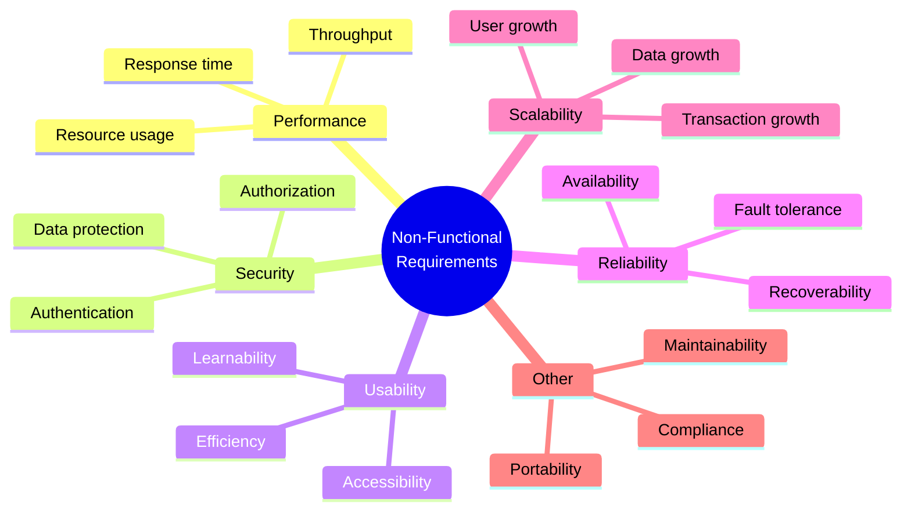
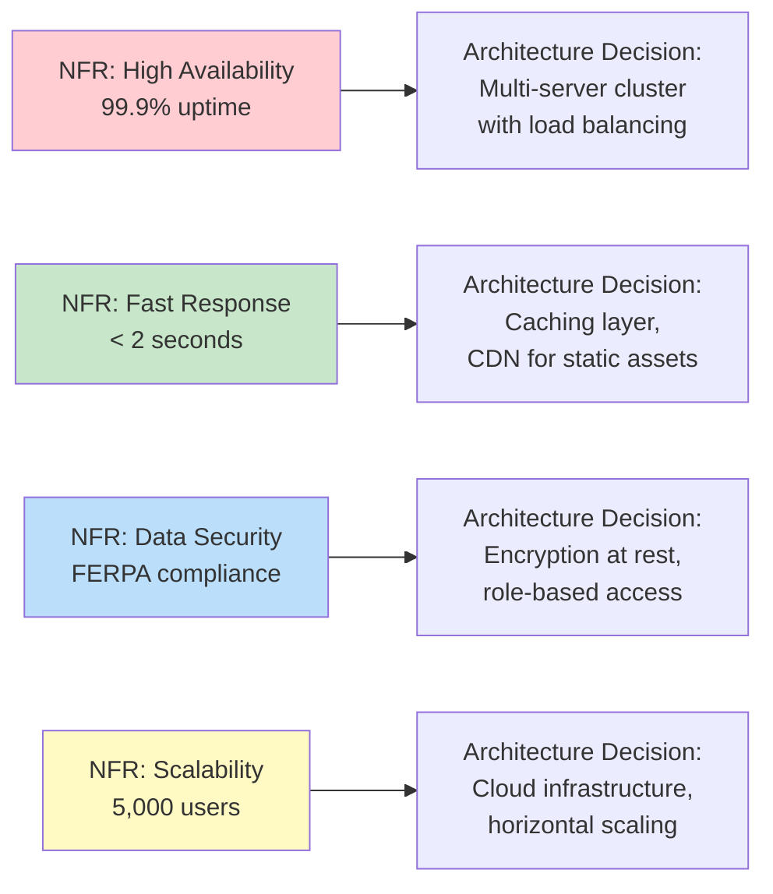

# 2.5 Non-Functional Requirements

[← Previous: 2.4 Functional Requirements](./2_4-functional-requirements.md) | [Back to Chapter 2 README](./chapter-02-README.md) | [Next: 2.6 Requirements Prioritization →](./2_6-requirements-prioritization.md)

---

## 📖 Introduction

While functional requirements define **what** a system does, non-functional requirements (NFRs) define **how well** it performs. NFRs are often called "quality attributes" or "the -ilities" (usability, reliability, scalability, etc.).

NFRs are frequently overlooked during requirements gathering, yet they're critical for user satisfaction and system success. A system that has all the right features but is too slow, insecure, or difficult to use will fail in the marketplace.

**Reading Time:** 35 minutes  
**Activity Time:** 20 minutes

---

## 🎯 Learning Objectives

By the end of this section, you will be able to:

1. Define non-functional requirements and explain their importance
2. Identify the major categories of NFRs (URPS+ and others)
3. Write measurable and testable NFRs with specific metrics
4. Distinguish between different quality attributes
5. Specify NFRs for the School Management System
6. Understand how NFRs affect architecture and design decisions

---

## 📋 What Are Non-Functional Requirements?

### Definition

**Non-Functional Requirements (NFRs)** define **quality attributes** and **constraints** on how the system performs its functions. They describe characteristics like performance, security, usability, and reliability.



### Why NFRs Matter

| Without NFRs | With NFRs |
|-------------|-----------|
| "System works but takes 30 seconds to load" | "Page loads in under 2 seconds" |
| "System was hacked, student data leaked" | "Data encrypted, access controlled" |
| "Teachers quit using it—too confusing" | "95% user satisfaction, 1-hour training" |
| "System crashes during peak registration" | "Handles 500 concurrent users" |
| "Can't add new schools without rewrite" | "Scales to 10,000 users with config changes" |

---

## 📊 NFR Categories: The URPS+ Model

The URPS+ model (from IBM Rational) organizes NFRs into logical categories:

```mermaid
graph TD
    A[URPS+ Model] --> U[Usability]
    A --> R[Reliability]
    A --> P[Performance]
    A --> S[Supportability]
    A --> Plus[+ Additional]
    
    U --> U1[Learnability]
    U --> U2[Efficiency]
    U --> U3[Accessibility]
    U --> U4[User satisfaction]
    
    R --> R1[Availability]
    R --> R2[Fault tolerance]
    R --> R3[Recoverability]
    R --> R4[Data integrity]
    
    P --> P1[Response time]
    P --> P2[Throughput]
    P --> P3[Resource utilization]
    P --> P4[Scalability]
    
    S --> S1[Maintainability]
    S --> S2[Testability]
    S --> S3[Configurability]
    S --> S4[Installability]
    
    Plus --> Plus1[Security]
    Plus --> Plus2[Compliance]
    Plus --> Plus3[Portability]
    Plus --> Plus4[Interoperability]
    
    style A fill:#4caf50
    style U fill:#81c784
    style R fill:#81c784
    style P fill:#81c784
    style S fill:#81c784
    style Plus fill:#81c784
```



---

## 🔍 Detailed NFR Categories

### 1. Performance Requirements

Performance NFRs specify how fast and efficiently the system operates.

**Sub-categories:**

| Attribute | Definition | Example Metric |
|-----------|------------|----------------|
| **Response Time** | Time to complete a user action | < 2 seconds for page load |
| **Throughput** | Transactions processed per unit time | 100 grade entries per minute |
| **Latency** | Delay before response begins | < 100ms initial response |
| **Resource Utilization** | CPU, memory, storage usage | < 70% CPU under peak load |

**School Management System Examples:**

```
NFR-PERF-001: The system shall display any page within 2 seconds 
              under normal load conditions (up to 200 concurrent users).

NFR-PERF-002: Grade calculations for a class of 30 students shall 
              complete within 1 second.

NFR-PERF-003: Report generation (PDF report cards) shall complete 
              within 30 seconds for a class of 30 students.

NFR-PERF-004: The system shall support processing 1,000 grade 
              entries per minute during peak periods.

NFR-PERF-005: Database queries shall return results within 500ms 
              for 95% of all requests.
```

### 2. Security Requirements

Security NFRs protect data and system from unauthorized access.

**Sub-categories:**

| Attribute | Definition | Example Metric |
|-----------|------------|----------------|
| **Authentication** | Verifying user identity | Multi-factor authentication required |
| **Authorization** | Controlling access rights | Role-based access control |
| **Confidentiality** | Protecting data privacy | AES-256 encryption at rest |
| **Integrity** | Preventing unauthorized changes | Audit trail for all modifications |
| **Non-repudiation** | Proving actions occurred | Digital signatures on submissions |

**School Management System Examples:**

```
NFR-SEC-001: The system shall require authentication for all 
              access using username and password.

NFR-SEC-002: Passwords shall be stored using bcrypt hashing 
              with minimum 12 rounds.

NFR-SEC-003: All data transmission shall use TLS 1.3 encryption.

NFR-SEC-004: Student data at rest shall be encrypted using 
              AES-256 encryption.

NFR-SEC-005: The system shall implement role-based access control 
              with four roles: Admin, Teacher, Student, Parent.

NFR-SEC-006: The system shall log all data access and modifications 
              with user ID, timestamp, IP address, and action performed.

NFR-SEC-007: The system shall automatically terminate sessions 
              after 30 minutes of inactivity.

NFR-SEC-008: The system shall comply with FERPA requirements for 
              student data privacy.
```

### 3. Usability Requirements

Usability NFRs ensure the system is easy to learn and use.

**Sub-categories:**

| Attribute | Definition | Example Metric |
|-----------|------------|----------------|
| **Learnability** | Time to become proficient | New users productive in 1 hour |
| **Efficiency** | Speed of task completion | Grade entry in < 3 clicks |
| **Memorability** | Ease of returning after absence | Resume use without retraining |
| **Error Rate** | Frequency of user errors | < 5% error rate on data entry |
| **Satisfaction** | User happiness with system | > 4.0/5.0 satisfaction rating |

**School Management System Examples:**

```
NFR-USE-001: New teachers shall complete basic training and 
              perform core tasks within 1 hour of training.

NFR-USE-002: Teachers shall complete grade entry for one 
              assignment (30 students) in under 5 minutes.

NFR-USE-003: Any function shall be reachable within 3 clicks 
              from the main dashboard.

NFR-USE-004: The system shall provide contextual help on 
              every screen accessible via help icon.

NFR-USE-005: Error messages shall clearly explain the problem 
              and suggest corrective action.

NFR-USE-006: The system shall achieve a System Usability Scale 
              (SUS) score of 70 or higher.

NFR-USE-007: The system shall comply with WCAG 2.1 Level AA 
              accessibility standards.
```

### 4. Reliability Requirements

Reliability NFRs specify system availability and fault tolerance.

**Sub-categories:**

| Attribute | Definition | Example Metric |
|-----------|------------|----------------|
| **Availability** | System uptime percentage | 99.9% during school hours |
| **Fault Tolerance** | Behavior during failures | Graceful degradation |
| **Recoverability** | Time to restore service | < 4 hours RTO |
| **Data Integrity** | Accuracy of stored data | Zero data corruption |

**School Management System Examples:**

```
NFR-REL-001: The system shall maintain 99.9% availability during 
              school hours (7 AM - 6 PM, Monday-Friday).

NFR-REL-002: The system shall maintain 99.0% availability during 
              non-school hours.

NFR-REL-003: The system shall perform automated backups every 
              6 hours with 30-day retention.

NFR-REL-004: In case of primary server failure, the system shall 
              failover to backup server within 5 minutes.

NFR-REL-005: The system shall recover from any failure within 
              4 hours (Recovery Time Objective).

NFR-REL-006: The system shall not lose more than 1 hour of data 
              in case of failure (Recovery Point Objective).

NFR-REL-007: The system shall validate all data inputs to prevent 
              data corruption.
```

### 5. Scalability Requirements

Scalability NFRs define the system's ability to handle growth.

**Sub-categories:**

| Attribute | Definition | Example Metric |
|-----------|------------|----------------|
| **User Scalability** | Supporting more users | Scale from 500 to 5,000 users |
| **Data Scalability** | Handling data growth | Support 10 years of historical data |
| **Transaction Scalability** | Processing growth | Handle 10x current transactions |

**School Management System Examples:**

```
NFR-SCALE-001: The system shall support 500 concurrent users 
               without performance degradation.

NFR-SCALE-002: The system shall scale to support 5,000 concurrent 
               users with infrastructure additions only.

NFR-SCALE-003: The system shall maintain performance with 
               10 years of historical grade data.

NFR-SCALE-004: The system shall support expansion to 50 schools 
               without architectural changes.

NFR-SCALE-005: Database size shall scale to 500GB without 
               performance degradation.
```

### 6. Supportability/Maintainability Requirements

Supportability NFRs define ease of maintenance and support.

**School Management System Examples:**

```
NFR-MAINT-001: The system shall be deployable to new environments 
               within 4 hours using automated scripts.

NFR-MAINT-002: Bug fixes shall be deployable to production 
               within 24 hours of development completion.

NFR-MAINT-003: The system shall provide comprehensive logging 
               for debugging and monitoring.

NFR-MAINT-004: Configuration changes (grade scales, categories) 
               shall not require code changes.

NFR-MAINT-005: The system shall support A/B testing for 
               new features before full rollout.
```

### 7. Compliance Requirements

Compliance NFRs ensure adherence to laws, regulations, and standards.

**School Management System Examples:**

```
NFR-COMP-001: The system shall comply with FERPA (Family 
              Educational Rights and Privacy Act) requirements.

NFR-COMP-002: The system shall comply with COPPA (Children's 
              Online Privacy Protection Act) for students under 13.

NFR-COMP-003: The system shall comply with ADA Section 508 
              accessibility requirements.

NFR-COMP-004: The system shall support data retention policies 
              as required by state education regulations.

NFR-COMP-005: The system shall provide audit trails sufficient 
              for compliance audits.
```

---

## ✍️ Writing Measurable NFRs

### The Problem with Vague NFRs

| ❌ Vague NFR | Why It's Bad |
|-------------|--------------|
| "System shall be fast" | Fast compared to what? |
| "System shall be secure" | What security measures? |
| "System shall be user-friendly" | How do you measure friendly? |
| "System shall be reliable" | What availability percentage? |
| "System shall handle growth" | How much growth? |

### The SMART NFR Framework

Apply SMART criteria to NFRs:

| Criterion | Question | Example |
|-----------|----------|---------|
| **Specific** | What exactly is being measured? | "Page load time" |
| **Measurable** | What is the metric? | "Under 2 seconds" |
| **Achievable** | Is this realistic? | Yes, with proper architecture |
| **Relevant** | Does this matter to stakeholders? | Yes, teachers hate slow systems |
| **Testable** | Can we verify this? | Yes, with performance testing |

### NFR Writing Template

```
NFR-[CATEGORY]-[NUMBER]: The system shall [achieve/maintain/support] 
[specific measurable metric] [under specified conditions] 
[measured by specific method].
```

**Example:**
```
NFR-PERF-001: The system shall load any page within 2 seconds 
(95th percentile) under normal load conditions (up to 200 
concurrent users), measured by automated performance tests 
using Apache JMeter.
```

---

## 📊 NFR Specification Table

| ID | Category | Requirement | Metric | Measurement Method | Priority |
|----|----------|-------------|--------|-------------------|----------|
| NFR-PERF-001 | Performance | Page load time | < 2 sec | JMeter tests | Must |
| NFR-PERF-002 | Performance | Concurrent users | 500 | Load testing | Must |
| NFR-SEC-001 | Security | Data encryption | AES-256 | Security audit | Must |
| NFR-SEC-002 | Security | Session timeout | 30 min | Functional test | Should |
| NFR-USE-001 | Usability | Training time | < 1 hour | User testing | Should |
| NFR-USE-002 | Usability | Task completion | < 3 clicks | UI review | Could |
| NFR-REL-001 | Reliability | Uptime | 99.9% | Monitoring | Must |
| NFR-REL-002 | Reliability | Backup frequency | Every 6 hrs | System logs | Must |
| NFR-SCALE-001 | Scalability | Max users | 5,000 | Load testing | Should |
| NFR-COMP-001 | Compliance | FERPA | Pass audit | External audit | Must |

---

## 🔗 NFRs and Architecture

NFRs significantly influence system architecture decisions:



---

## ⚠️ Common NFR Mistakes

### Mistake 1: Vague Requirements
❌ "System must be fast"  
✅ "Page load time shall be under 2 seconds for 95% of requests under normal load"

### Mistake 2: Unmeasurable Requirements
❌ "System must be secure"  
✅ "System shall encrypt all data at rest using AES-256 and in transit using TLS 1.3"

### Mistake 3: Unrealistic Requirements
❌ "System shall have 100% availability"  
✅ "System shall maintain 99.9% availability during school hours (allowing 43 minutes downtime per month)"

### Mistake 4: Conflicting Requirements
❌ "Maximum security" + "Instant response time" (encryption adds latency)  
✅ Balance trade-offs: "Security measures shall not increase response time by more than 200ms"

### Mistake 5: Missing NFRs
❌ Focusing only on functional requirements  
✅ Explicitly elicit NFRs using categories as checklist (URPS+)

---

## ✅ Self-Check Questions

1. What is the difference between functional and non-functional requirements? Give an example of each.

2. Why might "The system shall be user-friendly" be a problematic NFR? How would you improve it?

3. List three NFR categories and provide one measurable requirement for each.

4. How do NFRs affect system architecture decisions?

5. What does FERPA compliance mean for a school management system?

<details>
<summary>Click to reveal answers</summary>

**Answer 1:** 
- Functional requirements describe WHAT the system does (features, behaviors).
- Example FR: "Teachers can enter grades for students"
- Non-functional requirements describe HOW WELL the system performs (quality attributes).
- Example NFR: "Grade entry shall complete within 2 seconds"

**Answer 2:** 
"User-friendly" is vague and unmeasurable. How do you define "friendly"? How do you test it?

Improved versions:
- "New users shall complete basic training within 1 hour"
- "Any function shall be reachable within 3 clicks"
- "System shall achieve SUS score of 70 or higher"
- "User error rate shall be below 5% for data entry tasks"

**Answer 3:**
- **Performance:** "Page load time shall be under 2 seconds for 95% of requests"
- **Security:** "All passwords shall be hashed using bcrypt with minimum 12 rounds"
- **Reliability:** "System shall maintain 99.9% availability during school hours"

**Answer 4:** 
NFRs drive major architecture decisions:
- High availability → Requires redundant servers, load balancing, failover mechanisms
- Performance → Requires caching, CDN, optimized database queries
- Security → Requires encryption infrastructure, access control systems, audit logging
- Scalability → Requires cloud infrastructure, horizontal scaling capabilities

**Answer 5:**
FERPA (Family Educational Rights and Privacy Act) compliance for school systems means:
- Student education records are confidential
- Parents have right to access their child's records
- Data cannot be disclosed without consent (with exceptions)
- Students over 18 control their own records
- System must provide audit trails of data access
- Data must be protected from unauthorized access
- Breach notification requirements must be met

</details>

---

## 📝 Practice Exercise

**Exercise: Write NFRs for School System Mobile Access**

The School Management System needs mobile access for teachers and parents. Write measurable NFRs for:

1. **Performance:** Mobile page load requirements
2. **Usability:** Mobile-specific usability requirements
3. **Security:** Mobile-specific security requirements
4. **Reliability:** Mobile app availability requirements
5. **Compatibility:** Supported mobile platforms/versions

Use the NFR specification table format with ID, Category, Requirement, Metric, and Measurement Method.

**Time:** 20 minutes

---

## 📚 Key Takeaways

- **NFRs define HOW WELL** the system performs, not WHAT it does
- Use **URPS+ categories** to ensure complete NFR coverage: Usability, Reliability, Performance, Supportability, plus Security, Compliance, etc.
- NFRs must be **measurable and testable** with specific metrics
- NFRs **drive architecture decisions**—they're not afterthoughts
- **Avoid vague NFRs** like "fast," "secure," "user-friendly"
- **Balance trade-offs** between conflicting NFRs (security vs. performance)
- **Compliance NFRs** (FERPA, ADA) are often mandatory and non-negotiable

---

[← Previous: 2.4 Functional Requirements](./2_4-functional-requirements.md) | [Back to Chapter 2 README](./chapter-02-README.md) | [Next: 2.6 Requirements Prioritization →](./2_6-requirements-prioritization.md)
