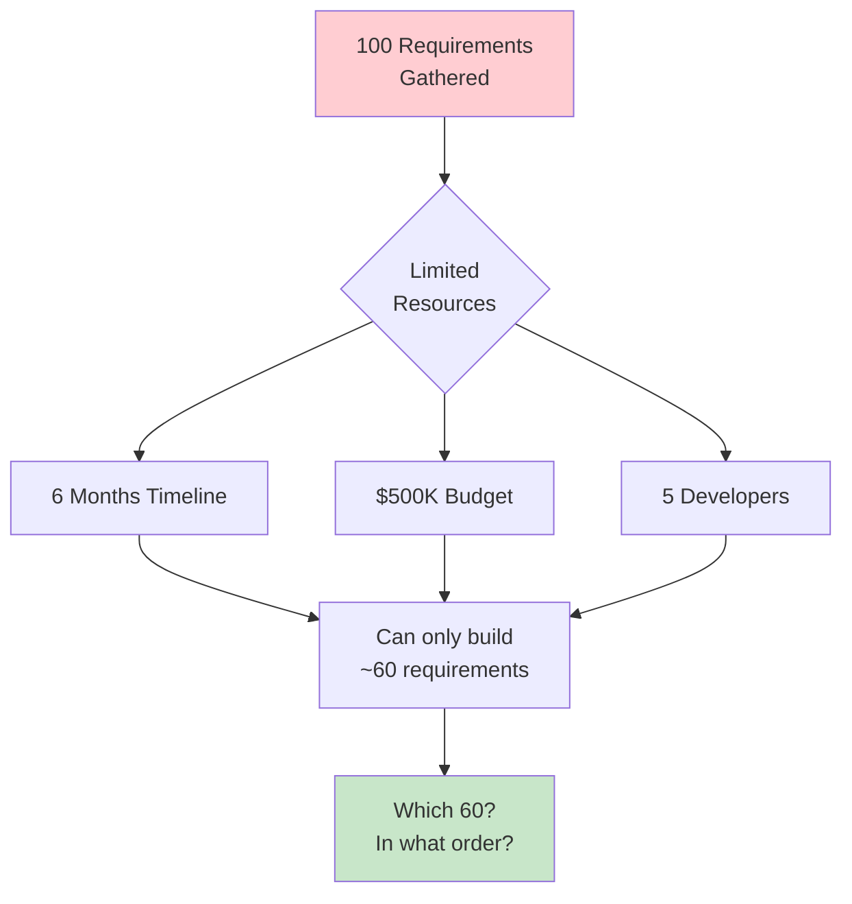
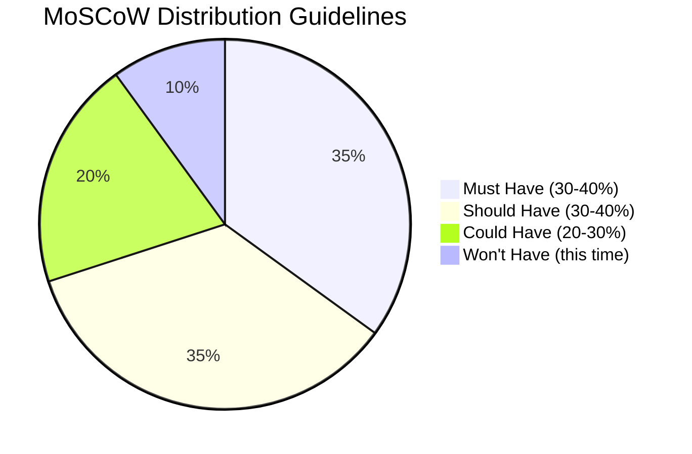
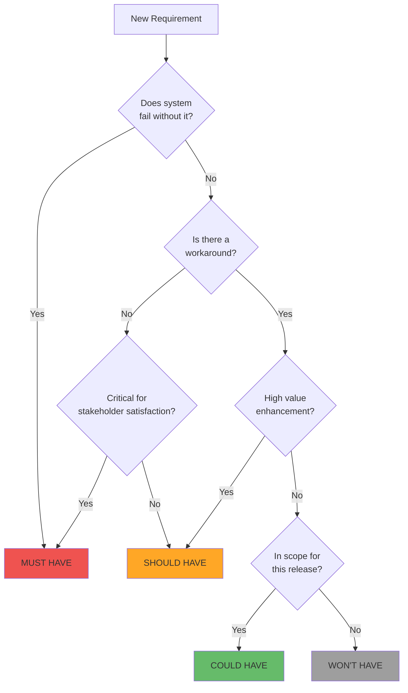
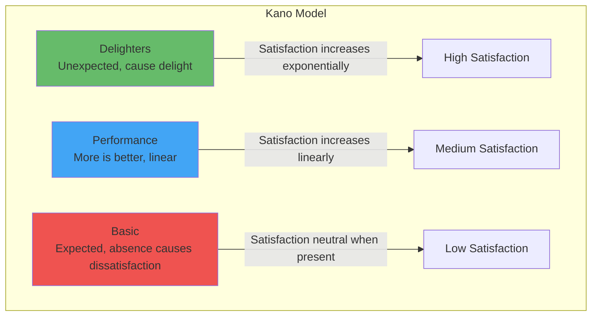
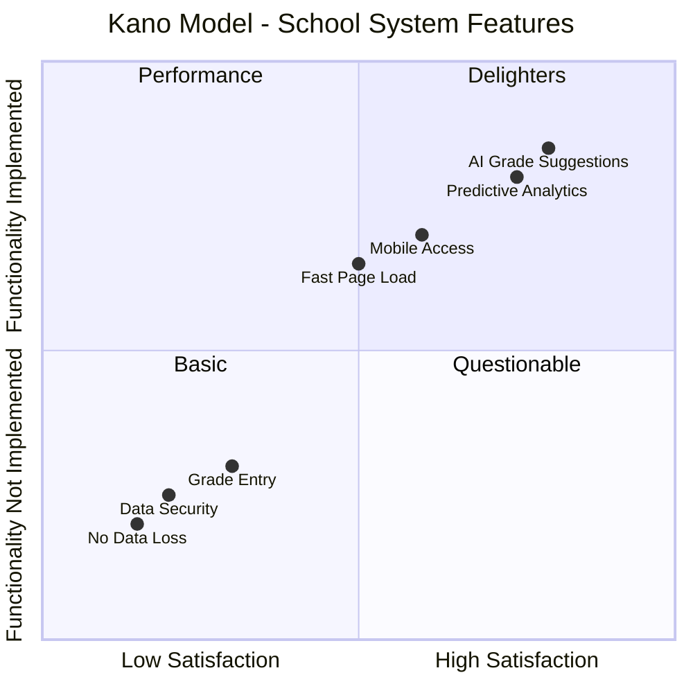
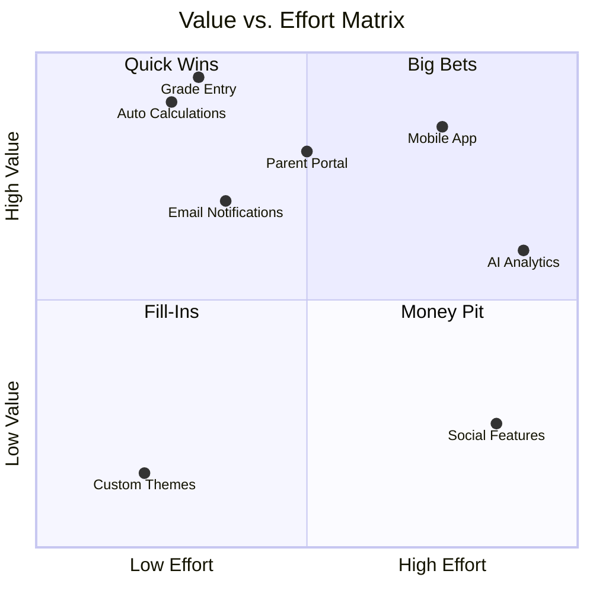
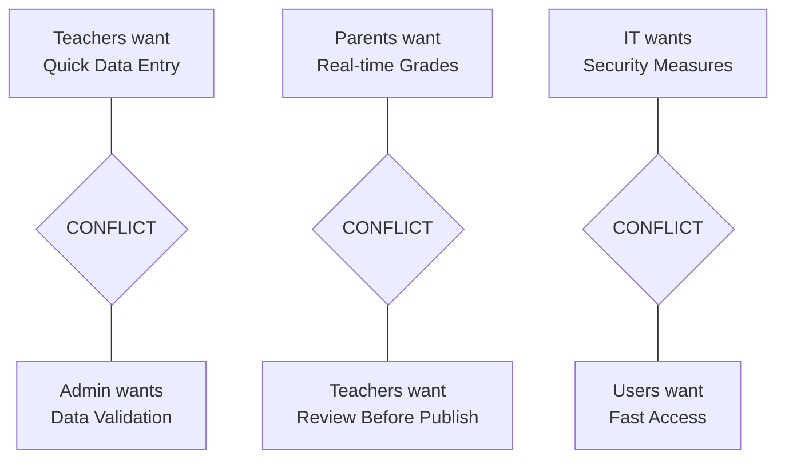
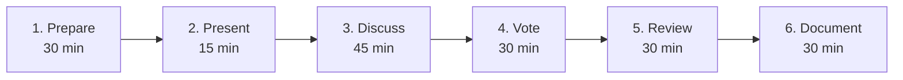

# 2.6 Requirements Prioritization

[← Previous: 2.5 Non-Functional Requirements](./2_5-non-functional-requirements.md) | [Back to Chapter 2 README](./chapter-02-README.md) | [Next: 2.7 SRS Documentation →](./2_7-srs-documentation.md)

---

## 📖 Introduction

You've gathered requirements, classified them as functional and non-functional, and documented them clearly. Now comes a critical challenge: **prioritization**. With limited time, budget, and resources, you cannot build everything at once. How do you decide what to build first?

Effective prioritization ensures you deliver maximum value early, satisfy key stakeholders, manage risk appropriately, and make rational decisions when trade-offs are necessary.

**Reading Time:** 35 minutes  
**Activity Time:** 20 minutes

---

## 🎯 Learning Objectives

By the end of this section, you will be able to:

1. Explain why requirements prioritization is essential
2. Apply the MoSCoW prioritization method effectively
3. Use the Kano model to identify delighters vs. basic needs
4. Create and use a Value vs. Effort matrix
5. Facilitate prioritization workshops with stakeholders
6. Handle conflicting priorities among stakeholder groups
7. Prioritize requirements for the School Management System

---

## ❓ Why Prioritization Matters

### The Prioritization Challenge



### What Happens Without Prioritization?

| Problem | Impact |
|---------|--------|
| Building wrong things first | Stakeholders see no value, lose confidence |
| Building everything equally | Nothing fully complete, no releasable product |
| Loudest stakeholder wins | Political decisions, not value-based |
| Hidden dependencies | Features built out of order, rework required |
| Scope creep | Everything is "Priority 1" |
| Late risk discovery | Technical problems found when too late to fix |

### Benefits of Prioritization

- **Deliver value early:** MVP first, enhancements later
- **Manage risk:** Tackle hard problems when you have time
- **Make trade-offs transparent:** Clear framework for cuts
- **Align stakeholders:** Collaborative decision-making builds buy-in
- **Guide Agile planning:** High-priority items fill early sprints
- **Enable negotiation:** If budget cuts, low-priority items deferred

---

## 🏷️ MoSCoW Prioritization Method

### What Is MoSCoW?

MoSCoW is a prioritization technique that categorizes requirements into four groups based on business necessity:



### MoSCoW Categories Explained

| Category | Meaning | Guideline | Example |
|----------|---------|-----------|---------|
| **Must Have** | Non-negotiable, system fails without it | 30-40% of requirements | Core grade entry functionality |
| **Should Have** | Important but has workarounds | 30-40% of requirements | Automated notifications |
| **Could Have** | Desirable enhancement, first to cut | 20-30% of requirements | Custom dashboard widgets |
| **Won't Have** | Out of scope for this release | Document for future | Social features, gamification |

### MoSCoW Decision Framework



### School System MoSCoW Example

**Must Have (Essential - Project fails without these):**
```
- FR-AUTH-001: User authentication
- FR-GRADE-001: Teachers enter grades
- FR-GRADE-003: Automatic grade calculations
- NFR-SEC-001: FERPA-compliant data security
- NFR-REL-001: 99.9% availability during school hours
```

**Should Have (Important - Has workarounds if needed):**
```
- FR-GRADE-004: Automated parent notifications
- FR-RPT-001: Report card generation
- FR-COMM-002: In-app messaging
- NFR-PERF-001: Page load under 2 seconds
- NFR-USE-001: Mobile device support
```

**Could Have (Desirable - Nice enhancements):**
```
- FR-GRADE-006: Drop lowest grade feature
- FR-COMM-003: Bulk announcements
- Customizable dashboard
- Advanced analytics
- Calendar integration
```

**Won't Have (This Release - Future consideration):**
```
- Social features (student discussions)
- Gamification (badges, leaderboards)
- Integration with cafeteria system
- Bus route tracking
- AI-powered grade predictions
```

---

## 🎨 Kano Model

### What Is the Kano Model?

The Kano model, developed by Professor Noriaki Kano, categorizes requirements based on their impact on customer satisfaction.



### Kano Categories

| Category | Description | If Present | If Absent | Example |
|----------|-------------|------------|-----------|---------|
| **Basic** | Expected, assumed | Neutral | Very dissatisfied | System doesn't lose data |
| **Performance** | More is better | Satisfied | Dissatisfied | Faster page loads |
| **Delighters** | Unexpected, surprise | Very satisfied | Neutral | AI suggests grades |
| **Indifferent** | Users don't care | Neutral | Neutral | Color theme options |
| **Reverse** | Some users dislike | Dissatisfied | Satisfied | Forced tutorials |

### School System Kano Analysis



**Basic (Must meet - table stakes):**
- System doesn't crash
- Data is secure and not lost
- Users can log in
- Basic grade entry works

**Performance (More is better - competitive advantage):**
- Faster page loads → happier users
- Easier grade entry → happier teachers
- Better reports → happier administrators

**Delighters (Unexpected - differentiation):**
- AI suggests grades based on rubrics
- Predictive analytics for at-risk students
- Beautiful, intuitive UI
- Personalized dashboards

---

## 📊 Value vs. Effort Matrix

### What Is the Value/Effort Matrix?

A prioritization tool that plots requirements based on business value and implementation effort.



### Matrix Quadrants and Strategy

| Quadrant | Characteristics | Strategy |
|----------|----------------|----------|
| **Quick Wins** | High value, low effort | Do first! |
| **Big Bets** | High value, high effort | Plan carefully, may need phasing |
| **Fill-Ins** | Low value, low effort | Do if time permits |
| **Money Pit** | Low value, high effort | Don't do (or deprioritize) |

### Scoring Value and Effort

**Value Factors (1-5 scale):**
- Strategic alignment (does it support business goals?)
- User impact (how many users benefit?)
- Revenue/cost impact (ROI potential)
- Competitive advantage (differentiation)
- Risk reduction (compliance, security)

**Effort Factors (1-5 scale):**
- Development time
- Technical complexity
- Dependencies on other features
- Testing requirements
- Integration complexity

**Priority Score = Value Score / Effort Score**

---

## 🤝 Handling Conflicting Priorities

### Common Conflicts



### Conflict Resolution Strategies

| Strategy | When to Use | Example |
|----------|-------------|---------|
| **Compromise** | Both sides can give something | Teachers get quick entry with optional validation |
| **Design Solution** | Technical solution satisfies both | "Draft" vs "Published" grade status |
| **Prioritize by Data** | Let usage data decide | Survey shows 80% prefer speed over validation |
| **Escalate** | Stakeholders can't agree | Product Owner or Sponsor decides |
| **Defer** | Decision can wait | Implement basic version, enhance based on feedback |

### Resolution Example: Grade Visibility Conflict

**Conflict:** Teachers want to control when parents see grades. Parents want immediate access.

**Resolution:** Design solution with multiple options:
1. Teachers mark grades as "Draft" or "Published"
2. Only "Published" grades visible to parents
3. Auto-publish after 48 hours if teacher doesn't act
4. Teachers can publish entire gradebook at once

**Result:** Both stakeholders satisfied through thoughtful design.

---

## 🎯 Prioritization Workshop

### Workshop Structure



### Workshop Agenda (3 hours)

| Time | Activity | Description |
|------|----------|-------------|
| 0:00-0:30 | Preparation | Set up materials, requirements list on cards |
| 0:30-0:45 | Introduction | Explain MoSCoW, ground rules, objectives |
| 0:45-1:30 | Discussion | Review each requirement, clarify if needed |
| 1:30-2:00 | Voting | Stakeholders assign MoSCoW category |
| 2:00-2:30 | Review & Adjust | Discuss disagreements, find consensus |
| 2:30-3:00 | Document & Close | Record decisions, next steps |

### Voting Techniques

**Dot Voting:**
- Each stakeholder gets 10 dots
- Place dots on most important requirements
- More dots = higher priority

**Planning Poker for Value:**
- Cards: 1, 2, 3, 5, 8, 13 (Fibonacci)
- Rate business value of each requirement
- Discuss outliers, re-vote until consensus

**100-Dollar Test:**
- Each stakeholder has $100 (imaginary)
- Distribute across requirements
- Higher investment = higher priority

---

## 🏫 School System Prioritization Exercise

### Complete Priority List

| ID | Requirement | MoSCoW | Kano | Value | Effort | Priority Score |
|----|-------------|--------|------|-------|--------|----------------|
| FR-AUTH-001 | User authentication | Must | Basic | 5 | 2 | 2.5 |
| FR-GRADE-001 | Enter grades | Must | Basic | 5 | 3 | 1.7 |
| FR-GRADE-003 | Auto calculations | Must | Performance | 5 | 2 | 2.5 |
| NFR-SEC-001 | Data encryption | Must | Basic | 5 | 3 | 1.7 |
| FR-COMM-001 | Parent notifications | Should | Performance | 4 | 2 | 2.0 |
| FR-RPT-001 | Report cards | Should | Performance | 4 | 3 | 1.3 |
| NFR-USE-007 | Mobile access | Should | Performance | 4 | 4 | 1.0 |
| FR-GRADE-006 | Drop lowest grade | Could | Delighter | 3 | 2 | 1.5 |
| Custom themes | Dashboard customization | Could | Indifferent | 2 | 2 | 1.0 |
| AI predictions | At-risk student alerts | Could | Delighter | 3 | 5 | 0.6 |
| Social features | Student discussions | Won't | Reverse? | 1 | 5 | 0.2 |

### Release Planning Based on Priority

**MVP Release (Month 1-3):**
All Must Haves = Core functionality
- Authentication, grade entry, calculations, security
- Stakeholders can start using system

**Release 1.1 (Month 4-5):**
High-priority Should Haves
- Parent notifications, report cards
- Major user satisfaction improvements

**Release 1.2 (Month 6):**
Remaining Should Haves + high-value Could Haves
- Mobile access, drop lowest grade
- Feature completeness

**Future Releases:**
Remaining Could Haves as resources permit
- Won't Haves evaluated for later roadmap

---

## ✅ Self-Check Questions

1. Why is it important to prioritize requirements? What happens without prioritization?

2. Explain the four MoSCoW categories with examples.

3. How does the Kano model differ from MoSCoW? When would you use each?

4. What is a "Quick Win" in the Value/Effort matrix? Why do these first?

5. How would you handle a conflict where teachers want quick grade entry but administrators want extensive validation?

<details>
<summary>Click to reveal answers</summary>

**Answer 1:** 
Prioritization is important because resources (time, budget, people) are limited. Without prioritization:
- Wrong features built first (no early value)
- Everything partially complete (nothing releasable)
- Political decisions dominate (loudest stakeholder wins)
- Scope creep (everything is "high priority")
- Late discovery of technical problems

**Answer 2:**
- **Must Have (30-40%):** Non-negotiable, system fails without it. Example: User authentication, core grade entry.
- **Should Have (30-40%):** Important but has workarounds. Example: Automated email notifications (teachers could manually email).
- **Could Have (20-30%):** Nice enhancement, first to cut. Example: Customizable dashboard.
- **Won't Have:** Out of scope for this release. Example: Social features, gamification.

**Answer 3:**
- **MoSCoW** categorizes by business necessity (must we build this?). Use for release planning and scope decisions.
- **Kano** categorizes by user satisfaction impact (how do users feel?). Use for competitive advantage and feature design.
- Combine both: Basic Kano features are often Must Have. Delighters are often Could Have but may justify higher priority for differentiation.

**Answer 4:**
Quick Wins are high value + low effort requirements. Do these first because:
- Deliver value immediately with minimal investment
- Build stakeholder confidence early
- Create momentum for the project
- Free up resources for bigger items
Example: Automated grade calculation (high value to teachers, relatively simple to implement)

**Answer 5:**
Resolution approaches:
1. **Design solution:** Create "Quick Entry" mode and "Full Validation" mode. Teachers choose per assignment.
2. **Compromise:** Required fields only (name, grade), optional fields (comments, rubric details).
3. **Tiered validation:** Critical fields validated immediately, non-critical validated overnight.
4. **Data-driven:** Survey teachers and admins, let majority preference guide default behavior.
5. **Configurable:** Let each school/administrator set validation strictness.

Best solution: Teachers get quick entry by default, Admin can configure required validation rules. Both stakeholders satisfied.

</details>

---

## 📝 Practice Exercise

**Exercise: Prioritize School System Features**

Given these 10 requirements, assign MoSCoW priority and justify each:

1. Teachers can view class roster
2. AI-powered grade prediction
3. Student attendance tracking
4. Integration with state reporting system
5. Gamification badges for students
6. Password reset functionality
7. Grade export to Excel
8. Parent-teacher video conferencing
9. Multi-language support (Spanish, Chinese)
10. Student self-grading for peer review

**Consider:**
- Business necessity
- User impact
- Implementation effort
- Regulatory requirements
- Competitive landscape

**Time:** 20 minutes

---

## 📚 Key Takeaways

- **Prioritization is essential** for delivering value within constraints
- **MoSCoW** categorizes by business necessity: Must, Should, Could, Won't
- **Kano model** reveals user satisfaction impact: Basic, Performance, Delighter
- **Value/Effort matrix** identifies Quick Wins (do first) vs. Money Pits (avoid)
- **Combine methods** for robust prioritization decisions
- **Handle conflicts** through design solutions, compromise, data, or escalation
- **Prioritization workshops** build stakeholder alignment and buy-in
- **Re-prioritize regularly** as circumstances change

---

[← Previous: 2.5 Non-Functional Requirements](./2_5-non-functional-requirements.md) | [Back to Chapter 2 README](./chapter-02-README.md) | [Next: 2.7 SRS Documentation →](./2_7-srs-documentation.md)
