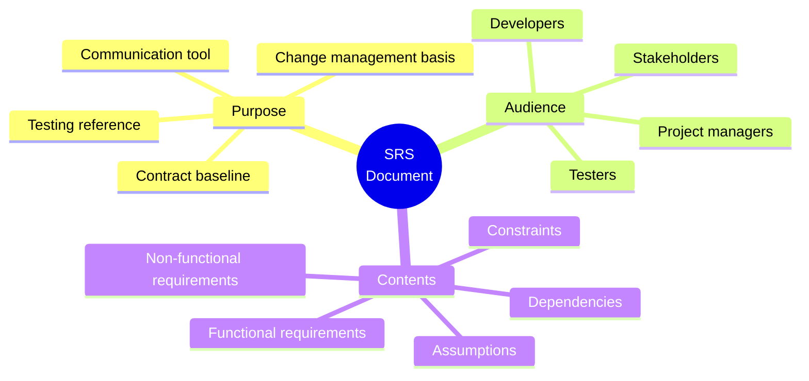
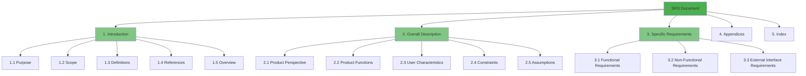
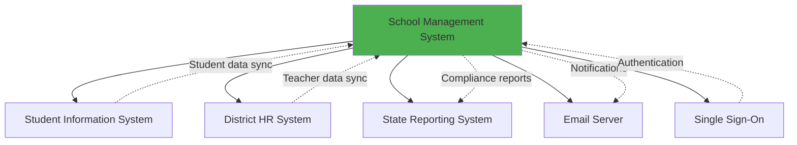

# 2.7 Software Requirements Specification (SRS) Documentation

[← Previous: 2.6 Requirements Prioritization](./2_6-requirements-prioritization.md) | [Back to Chapter 2 README](./chapter-02-README.md) | [Next: 2.8 Requirements Validation →](./2_8-requirements-validation.md)

---

## 📖 Introduction

All the requirements you've gathered need to be documented in a structured, professional format. The **Software Requirements Specification (SRS)** is the industry-standard document that captures all requirements for a software system.

A well-written SRS serves as the contract between stakeholders and the development team. It ensures everyone agrees on what will be built, provides a baseline for testing, and serves as a reference throughout the project lifecycle.

**Reading Time:** 40 minutes  
**Activity Time:** 25 minutes

---

## 🎯 Learning Objectives

By the end of this section, you will be able to:

1. Explain the purpose and importance of an SRS document
2. Describe the IEEE 830 standard structure for SRS
3. Write each section of an SRS effectively
4. Apply proper writing style for requirements documents
5. Implement version control for requirements
6. Create an SRS outline for the School Management System

---

## 📋 What Is an SRS?

### Definition

A **Software Requirements Specification (SRS)** is a comprehensive document that describes everything a software system must do. It serves as the definitive reference for what will be built.



### Why SRS Matters

| Without SRS | With SRS |
|-------------|----------|
| "I thought we were building X" | Everyone agrees on scope |
| Endless scope arguments | Clear baseline for changes |
| Can't verify if system is complete | Testable acceptance criteria |
| Knowledge lost when people leave | Documented for future reference |
| Different interpretations | Single source of truth |

---

## 📑 IEEE 830 Standard Structure

The IEEE 830-1998 standard provides a recommended structure for SRS documents:



---

## 📝 Section-by-Section Guide

### Section 1: Introduction

#### 1.1 Purpose
State what this document is for and who should read it.

**Example:**
> This Software Requirements Specification (SRS) describes the functional and non-functional requirements for the School Management System (SMS) version 1.0. This document is intended for stakeholders, developers, testers, and project managers involved in the development and deployment of SMS.

#### 1.2 Scope
Define what the system will and won't do.

**Example:**
> The School Management System will provide grade management, attendance tracking, and parent communication features for K-12 schools. The system will support teachers, students, parents, and administrators. Version 1.0 will NOT include cafeteria management, bus routing, or facility scheduling.

#### 1.3 Definitions, Acronyms, and Abbreviations

| Term | Definition |
|------|------------|
| SRS | Software Requirements Specification |
| SMS | School Management System |
| FERPA | Family Educational Rights and Privacy Act |
| NFR | Non-Functional Requirement |
| FR | Functional Requirement |
| GPA | Grade Point Average |
| SIS | Student Information System |

#### 1.4 References
List all documents referenced in the SRS.

**Example:**
- IEEE 830-1998: IEEE Recommended Practice for SRS
- FERPA Compliance Guide (Department of Education)
- School District Technology Standards v2.3
- State Education Reporting Requirements 2024

#### 1.5 Overview
Describe how the rest of the document is organized.

---

### Section 2: Overall Description

#### 2.1 Product Perspective
Where does this system fit in the larger context?



**Example:**
> The School Management System is a new development that will integrate with the existing Student Information System (SIS) for student enrollment data, the District HR System for teacher assignments, and the State Reporting System for compliance submissions.

#### 2.2 Product Functions (High-Level)
Summarize major functions without detailed requirements.

**Example:**
> Major functions include:
> - **Grade Management:** Create assignments, enter grades, calculate averages
> - **Attendance Tracking:** Daily attendance, reports, notifications
> - **Communication:** Parent notifications, messaging, announcements
> - **Reporting:** Report cards, progress reports, compliance reports

#### 2.3 User Characteristics

| User Type | Characteristics | Technical Proficiency |
|-----------|-----------------|----------------------|
| Teachers | 25-60 years old, primary users, daily use | Moderate, familiar with basic software |
| Students | 5-18 years old, view-only access | Variable, digital natives |
| Parents | 25-50 years old, occasional access | Low to moderate |
| Administrators | 30-60 years old, reporting focus | Moderate to high |
| IT Staff | Technical support and maintenance | High |

#### 2.4 Constraints

**Example:**
> - Budget: $500,000 development, $50,000/year maintenance
> - Timeline: MVP by August 2025 for school year start
> - Technology: Must run on existing school hardware (5-year-old computers)
> - Compliance: Must meet FERPA requirements
> - Integration: Must integrate with existing SIS (via REST API)
> - Accessibility: Must meet WCAG 2.1 Level AA

#### 2.5 Assumptions and Dependencies

**Assumptions:**
- Schools have reliable internet connectivity (10+ Mbps)
- Users have email addresses for notifications
- State reporting format won't change during development
- District IT will manage server infrastructure

**Dependencies:**
- SIS API must be available for student data sync
- District SSO service must support SAML 2.0
- Email server must accept SMTP connections

---

### Section 3: Specific Requirements

This is the largest and most important section—the detailed requirements.

#### 3.1 Functional Requirements

**Organization Options:**
- By feature/function
- By user role
- By use case
- By priority (MoSCoW)

**Example Organization by Feature:**

```
3.1.1 Grade Management
  FR-GRADE-001: Create assignments
  FR-GRADE-002: Enter grades
  FR-GRADE-003: Calculate averages
  ...

3.1.2 Attendance Tracking
  FR-ATT-001: Record attendance
  FR-ATT-002: Generate reports
  ...

3.1.3 Communication
  FR-COMM-001: Parent notifications
  FR-COMM-002: Messaging
  ...
```

**Detailed Requirement Example:**

```
FR-GRADE-003: Automatic Grade Calculation

Description: The system shall automatically calculate student course 
averages based on configured weighted categories.

Priority: Must Have

Inputs:
- Individual assignment grades (0-100)
- Category weights (sum to 100%)
- Dropped grade settings (optional)

Processing:
1. Group grades by category
2. Calculate category averages
3. Apply category weights
4. Apply dropped grade rules if configured
5. Round to 2 decimal places

Outputs:
- Course average (0.00-100.00)
- Letter grade (A-F based on grade scale)

Acceptance Criteria:
- AC1: Given grades [85, 90, 78] with equal weights, average = 84.33
- AC2: Given weighted categories, calculation matches weighted formula
- AC3: Dropped lowest grade excluded from calculation when configured

Source: Teacher Survey Q-015, Workshop WS-001
Trace: DD-4.3.1, TC-GRADE-010

Status: Approved
Version: 1.0
```

#### 3.2 Non-Functional Requirements

Organize by category (URPS+):

```
3.2.1 Performance Requirements
  NFR-PERF-001: Page load time
  NFR-PERF-002: Concurrent users
  ...

3.2.2 Security Requirements
  NFR-SEC-001: Authentication
  NFR-SEC-002: Data encryption
  ...

3.2.3 Usability Requirements
  NFR-USE-001: Training time
  NFR-USE-002: Accessibility
  ...
```

#### 3.3 External Interface Requirements

**User Interface Requirements:**
- Responsive design for desktop, tablet, mobile
- Consistent navigation across all modules
- Adherence to district branding guidelines

**Hardware Interfaces:**
- Barcode scanners for student ID cards (attendance)
- Printers for report cards

**Software Interfaces:**
- Student Information System (REST API, JSON)
- District SSO (SAML 2.0)
- Email server (SMTP with TLS)
- State reporting system (SFTP, CSV format)

**Communication Interfaces:**
- HTTPS for all web traffic
- TLS 1.3 minimum for encrypted connections

---

## ✍️ Writing Style Guidelines

### Do's and Don'ts

| ✅ Do | ❌ Don't |
|-------|---------|
| Use "shall" for mandatory requirements | Use "should," "may," or "might" |
| Be specific and measurable | Be vague or ambiguous |
| One requirement per statement | Combine multiple requirements |
| Use consistent terminology | Use different terms for same concept |
| Write in active voice | Write in passive voice |
| Include acceptance criteria | Leave requirements untestable |

### Requirement Writing Template

```
[ID]: [Requirement Title]

Description: The system shall [action verb] [specific capability]
[under conditions] [with constraints].

Priority: [Must/Should/Could/Won't]

Acceptance Criteria:
- AC1: Given [precondition], when [action], then [result]
- AC2: ...

Source: [Stakeholder/Document reference]
Trace: [Design doc, Test case references]
Status: [Draft/In Review/Approved/Implemented]
Version: [1.0]
```

---

## 🔄 Version Control for SRS

### Why Version Control?

Requirements change throughout a project. You need to:
- Track what changed, when, and why
- Know which version stakeholders approved
- Understand impact of changes
- Roll back if needed

### Version Control Table

| Version | Date | Author | Changes | Approved By |
|---------|------|--------|---------|-------------|
| 0.1 | 2025-01-15 | J. Smith | Initial draft | - |
| 0.2 | 2025-01-22 | J. Smith | Added NFRs per review feedback | - |
| 0.3 | 2025-02-01 | J. Smith | Incorporated stakeholder workshop results | - |
| 1.0 | 2025-02-15 | J. Smith | Baseline release for development | M. Johnson (Sponsor) |
| 1.1 | 2025-03-10 | J. Smith | Added mobile requirements (CR-005) | M. Johnson |

### Individual Requirement Versioning

Track changes to individual requirements:

```
FR-GRADE-003 v1.2

Change History:
- v1.0 (2025-02-15): Initial baseline
- v1.1 (2025-03-05): Added extra credit handling per CR-003
- v1.2 (2025-03-20): Modified rounding to 2 decimal places per CR-007
```

---

## 🏫 School System SRS Outline

### Complete Table of Contents

```
1. INTRODUCTION
   1.1 Purpose
   1.2 Scope
   1.3 Definitions, Acronyms, Abbreviations
   1.4 References
   1.5 Overview

2. OVERALL DESCRIPTION
   2.1 Product Perspective
   2.2 Product Functions Summary
   2.3 User Characteristics
   2.4 Constraints
   2.5 Assumptions and Dependencies

3. SPECIFIC REQUIREMENTS
   3.1 Functional Requirements
       3.1.1 Authentication and Authorization
       3.1.2 Grade Management
       3.1.3 Attendance Tracking
       3.1.4 Communication
       3.1.5 Reporting
       3.1.6 Administration
   3.2 Non-Functional Requirements
       3.2.1 Performance Requirements
       3.2.2 Security Requirements
       3.2.3 Usability Requirements
       3.2.4 Reliability Requirements
       3.2.5 Scalability Requirements
       3.2.6 Compliance Requirements
   3.3 External Interface Requirements
       3.3.1 User Interfaces
       3.3.2 Hardware Interfaces
       3.3.3 Software Interfaces
       3.3.4 Communication Interfaces

4. APPENDICES
   A. Stakeholder Interview Summaries
   B. Survey Results
   C. Use Case Diagrams
   D. Data Dictionary
   E. Glossary
   F. Change Request Log

5. INDEX
```

---

## 📊 SRS Review Checklist

Use this checklist before finalizing your SRS:

### Completeness
- [ ] All functional areas covered
- [ ] All NFR categories addressed
- [ ] All external interfaces specified
- [ ] All user types considered
- [ ] All constraints documented

### Consistency
- [ ] No conflicting requirements
- [ ] Terminology used consistently
- [ ] Format consistent throughout
- [ ] Numbering scheme followed

### Clarity
- [ ] No ambiguous terms
- [ ] Each requirement testable
- [ ] Clear acceptance criteria
- [ ] Proper use of "shall"

### Traceability
- [ ] Sources documented for all requirements
- [ ] Unique IDs assigned
- [ ] Cross-references complete

### Approval
- [ ] Stakeholders reviewed
- [ ] Technical review completed
- [ ] Sponsor approved baseline

---

## ✅ Self-Check Questions

1. What is the purpose of an SRS document?

2. List the three main sections of an IEEE 830 SRS.

3. Why should requirements use "shall" instead of "should" or "may"?

4. What should be included in the constraints section?

5. How do you manage versions of an SRS document?

<details>
<summary>Click to reveal answers</summary>

**Answer 1:**
The SRS serves as:
- Communication tool between stakeholders and developers
- Contract baseline defining what will be built
- Reference for testing (acceptance criteria)
- Change management basis (compare proposed changes to baseline)
- Documentation for future maintenance

**Answer 2:**
1. Introduction (purpose, scope, definitions, references)
2. Overall Description (product perspective, functions, users, constraints)
3. Specific Requirements (functional, non-functional, interfaces)

**Answer 3:**
"Shall" indicates a mandatory requirement that must be implemented. "Should" and "may" imply optional items, which creates ambiguity about what's really required. Using "shall" consistently makes requirements clear and testable.

**Answer 4:**
Constraints include:
- Budget limitations
- Timeline requirements
- Technology restrictions
- Regulatory/compliance requirements
- Integration requirements
- Resource constraints
- Political or organizational constraints

**Answer 5:**
Version control includes:
- Version history table (version, date, author, changes, approvals)
- Baseline marking for approved releases
- Change request tracking
- Individual requirement version tracking
- Document comparison capabilities
- Formal change approval process

</details>

---

## 📝 Practice Exercise

**Exercise: Create SRS Section 2 for School System**

Write Section 2 (Overall Description) for the School Management System:

1. **2.1 Product Perspective:** Describe how SMS fits with other systems
2. **2.2 Product Functions:** List 5 major function categories with brief descriptions
3. **2.3 User Characteristics:** Create a table for 4 user types
4. **2.4 Constraints:** List 5 constraints (budget, timeline, technology, compliance, integration)
5. **2.5 Assumptions:** List 5 assumptions about the environment

**Time:** 25 minutes

---

## 📚 Key Takeaways

- **SRS is the definitive source** for what will be built
- Follow **IEEE 830 structure** for professional, complete documentation
- **Write clearly:** Use "shall," be specific, include acceptance criteria
- **Organize logically:** By feature, user role, or priority
- **Version control** tracks changes and enables change management
- **Review thoroughly** before baseline approval
- SRS is a **living document** that evolves throughout the project

---

[← Previous: 2.6 Requirements Prioritization](./2_6-requirements-prioritization.md) | [Back to Chapter 2 README](./chapter-02-README.md) | [Next: 2.8 Requirements Validation →](./2_8-requirements-validation.md)
