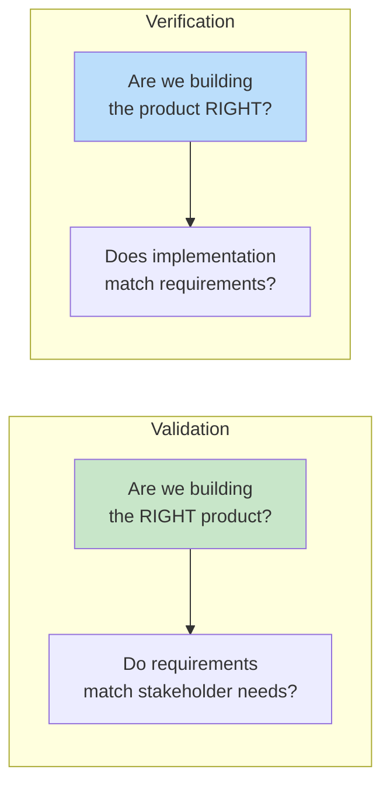
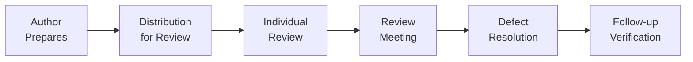
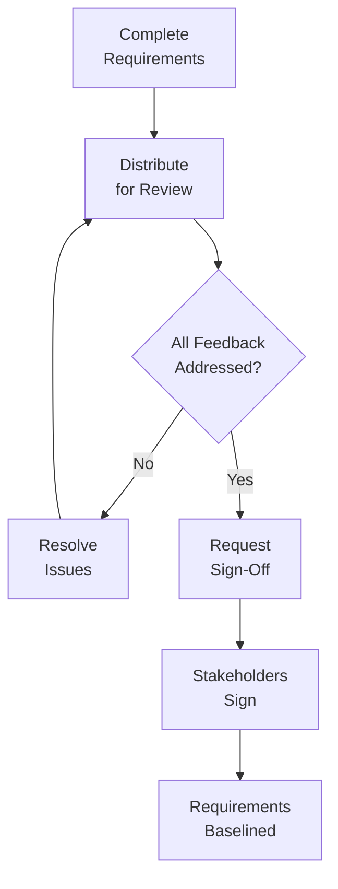

# 2.8 Requirements Validation

[← Previous: 2.7 SRS Documentation](./2_7-srs-documentation.md) | [Back to Chapter 2 README](./chapter-02-README.md) | [Next: 2.9 Change Management →](./2_9-change-management.md)

---

## 📖 Introduction

Requirements validation ensures that documented requirements are correct, complete, and accurately represent stakeholder needs. Validation catches errors before they become expensive defects in design or code.

**Reading Time:** 30 minutes  
**Activity Time:** 15 minutes

---

## 🎯 Learning Objectives

By the end of this section, you will be able to:

1. Distinguish between validation and verification
2. Apply multiple validation techniques (reviews, prototypes, checklists)
3. Conduct effective requirements walkthroughs
4. Use prototypes for requirements validation
5. Create and apply validation checklists
6. Obtain stakeholder sign-off effectively

---

## 🔍 Validation vs. Verification



| Aspect | Validation | Verification |
|--------|------------|--------------|
| **Question** | Are we building the right product? | Are we building the product right? |
| **Focus** | Requirements correctness | Implementation correctness |
| **When** | Before development starts | During/after development |
| **How** | Reviews, prototypes, stakeholder feedback | Testing, inspections, code review |
| **Who** | Stakeholders, business analysts | Developers, testers |

---

## 📋 Validation Techniques

### 1. Requirements Reviews



**Review Types:**

| Type | Participants | Duration | Formality |
|------|--------------|----------|-----------|
| **Peer Review** | 2-3 analysts | 1-2 hours | Low |
| **Walkthrough** | Team + stakeholders | 2-4 hours | Medium |
| **Formal Inspection** | Trained inspectors | 4-8 hours | High |

**Review Checklist Questions:**
- [ ] Is each requirement uniquely identified?
- [ ] Is the requirement clear and unambiguous?
- [ ] Is the requirement testable with specific criteria?
- [ ] Is the requirement consistent with other requirements?
- [ ] Is the requirement achievable within constraints?
- [ ] Is the source/origin documented?
- [ ] Are dependencies identified?

### 2. Prototyping

Prototypes help stakeholders visualize requirements before full development.

**Prototype Types:**

| Type | Description | When to Use | Effort |
|------|-------------|-------------|--------|
| **Paper Sketches** | Hand-drawn screens | Early exploration | 1-2 hours |
| **Wireframes** | Digital screen layouts | UI requirements | 1-2 days |
| **Clickable Mockups** | Interactive screens | Workflow validation | 3-5 days |
| **Functional Prototype** | Working subset | Complex features | 1-2 weeks |

**Prototype Validation Process:**
1. Build prototype based on requirements
2. Present to stakeholders
3. Observe usage and gather feedback
4. Identify requirement gaps or errors
5. Update requirements
6. Iterate as needed

### 3. Validation Workshops

Structured sessions where stakeholders validate requirements together.

**Workshop Agenda (2 hours):**

| Time | Activity |
|------|----------|
| 0:00-0:10 | Introduction and objectives |
| 0:10-0:30 | Present requirements overview |
| 0:30-1:15 | Walk through each requirement section |
| 1:15-1:30 | Break |
| 1:30-1:50 | Prototype demonstration |
| 1:50-2:00 | Action items and next steps |

### 4. Test Case Derivation

Writing test cases validates that requirements are testable.

**Example:**
```
Requirement: FR-GRADE-003
"The system shall calculate course averages using weighted categories."

Test Cases:
TC-001: Verify equal-weight calculation (3 assignments, equal weight)
TC-002: Verify weighted calculation (tests 40%, quizzes 30%, homework 30%)
TC-003: Verify handling of missing grades
TC-004: Verify dropped lowest grade calculation
TC-005: Verify rounding to 2 decimal places

If you can't write test cases, the requirement is not testable.
```

---

## ⚠️ Common Validation Errors Found

| Error Type | Example | Impact |
|------------|---------|--------|
| **Ambiguity** | "System should be responsive" | Different interpretations |
| **Incompleteness** | Missing error handling | Unexpected behavior |
| **Inconsistency** | FR-001 conflicts with FR-015 | Implementation confusion |
| **Infeasibility** | "100% availability" | Impossible to achieve |
| **Unverifiability** | "User-friendly interface" | Can't test |
| **Missing NFRs** | No performance requirements | Slow system |

---

## ✅ Stakeholder Sign-Off

### Sign-Off Process



### Sign-Off Document Template

```
REQUIREMENTS SIGN-OFF AGREEMENT

Project: School Management System
Document: Software Requirements Specification v1.0
Date: [Date]

By signing below, I confirm that:
1. I have reviewed the SRS document version 1.0
2. The requirements accurately represent my understanding of needs
3. I approve these requirements as the baseline for development
4. I understand changes after this date require formal change control

Stakeholder Signatures:

Name: _________________ Role: _____________ Date: _______
Name: _________________ Role: _____________ Date: _______
Name: _________________ Role: _____________ Date: _______

Project Sponsor Approval:
Name: _________________ Date: _______
```

---

## ✅ Self-Check Questions

1. What is the difference between validation and verification?
2. List three requirements validation techniques.
3. Why is prototyping useful for requirements validation?
4. What should a validation checklist include?
5. Why is stakeholder sign-off important?

<details>
<summary>Click to reveal answers</summary>

**Answer 1:** Validation asks "Are we building the right product?" (requirements match needs). Verification asks "Are we building the product right?" (implementation matches requirements).

**Answer 2:** Requirements reviews/walkthroughs, prototyping, test case derivation, validation workshops, checklist reviews.

**Answer 3:** Prototyping helps stakeholders visualize the system before it's built, making it easier to identify missing requirements, misunderstandings, and usability issues.

**Answer 4:** Clarity, completeness, consistency, testability, feasibility, traceability, unique identification, source documentation.

**Answer 5:** Sign-off creates a formal baseline, ensures stakeholder agreement, establishes accountability, and triggers change control for future modifications.

</details>

---

## 📚 Key Takeaways

- **Validate early** to catch errors before development
- Use **multiple techniques**: reviews, prototypes, checklists
- **Involve stakeholders** throughout validation
- Ensure all requirements are **testable**
- Obtain **formal sign-off** to baseline requirements
- Validation is **ongoing**, not a one-time event

---

[← Previous: 2.7 SRS Documentation](./2_7-srs-documentation.md) | [Back to Chapter 2 README](./chapter-02-README.md) | [Next: 2.9 Change Management →](./2_9-change-management.md)
