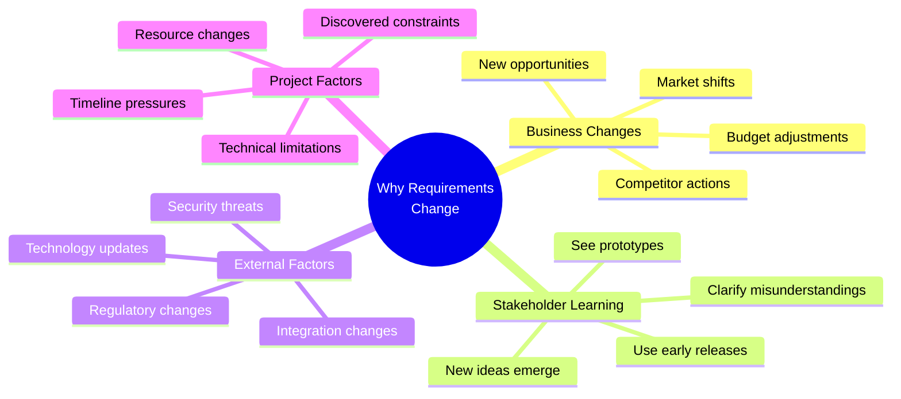
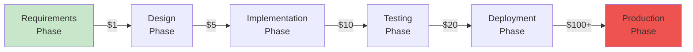
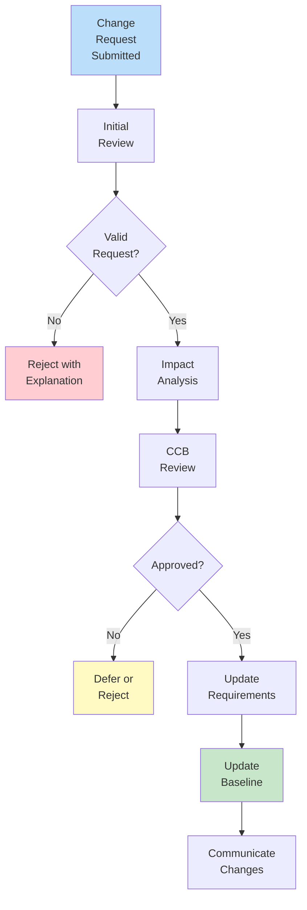
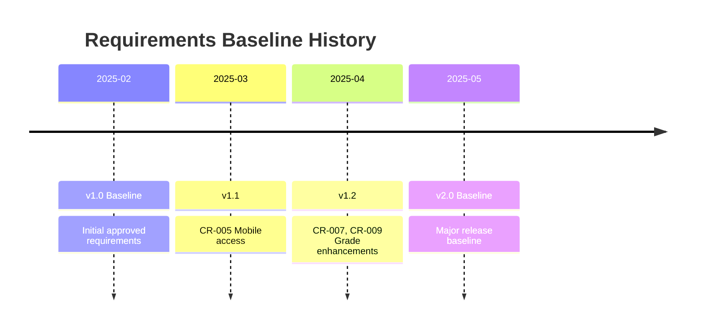

# 2.9 Requirements Change Management

[← Previous: 2.8 Requirements Validation](./2_8-requirements-validation.md) | [Back to Chapter 2 README](./chapter-02-README.md) | [Next: 2.10 Hands-On Activities →](./2_10-hands-on-activities.md)

---

## 📖 Introduction

Requirements change. It's inevitable. Market conditions shift, stakeholders learn more about their needs, regulations update, and technology evolves. The question isn't whether requirements will change, but how you'll manage those changes effectively.

**Reading Time:** 30 minutes  
**Activity Time:** 15 minutes

---

## 🎯 Learning Objectives

By the end of this section, you will be able to:

1. Explain why requirements change and the impact of uncontrolled changes
2. Implement a formal change request process
3. Conduct impact analysis for proposed changes
4. Manage requirements baselines and versions
5. Use a Change Control Board (CCB) effectively
6. Apply change management to the School Management System

---

## ❓ Why Requirements Change



### The Cost of Change



**Key Insight:** Changes cost more the later they're made. Catch changes during requirements phase ($1) rather than after deployment ($100+).

---

## 📋 Change Request Process

### Change Request Workflow



### Change Request Form

```
CHANGE REQUEST FORM

CR Number: CR-2025-007
Date Submitted: 2025-03-15
Requested By: Mrs. Johnson (Teacher)
Priority: Medium

CURRENT REQUIREMENT:
FR-GRADE-003: System calculates course averages using weighted categories.

PROPOSED CHANGE:
Add ability to exclude specific assignments from average calculation 
(e.g., diagnostic tests, practice quizzes).

REASON FOR CHANGE:
Teachers want to give formative assessments that don't count toward 
final grade. Currently must use workarounds.

AFFECTED REQUIREMENTS:
- FR-GRADE-003 (modification)
- FR-GRADE-008 (new requirement for exclude flag)
- NFR-USE-002 (UI must be intuitive)

IMPACT ANALYSIS:
- Development effort: 3 days
- Testing effort: 1 day  
- Documentation: 0.5 days
- Schedule impact: None if started in Sprint 5
- Risk: Low - isolated feature

RECOMMENDATION: Approve for Sprint 5

APPROVALS:
[ ] Product Owner: _____________ Date: _______
[ ] Technical Lead: _____________ Date: _______
[ ] Project Sponsor: ____________ Date: _______
```

---

## 🔍 Impact Analysis

Before approving any change, analyze its impact:

### Impact Analysis Checklist

| Area | Questions to Ask |
|------|------------------|
| **Schedule** | Will this delay milestones? How much time needed? |
| **Budget** | What's the cost to implement? Testing costs? |
| **Resources** | Who needs to work on this? Are they available? |
| **Scope** | Does this add new functionality? Remove anything? |
| **Quality** | Does this affect NFRs (performance, security)? |
| **Risk** | What could go wrong? Technical uncertainties? |
| **Dependencies** | What other requirements are affected? |
| **Testing** | What test cases need updating? |

### Impact Analysis Template

```
IMPACT ANALYSIS

CR Number: CR-2025-007
Analyst: J. Smith
Date: 2025-03-17

SUMMARY:
Add "exclude from average" flag for assignments.

SCHEDULE IMPACT:
- Development: 3 days
- Testing: 1 day
- Critical path: No
- Recommended Sprint: Sprint 5

BUDGET IMPACT:
- Development cost: $2,400 (3 days × $800/day)
- Testing cost: $600 (1 day × $600/day)
- Total: $3,000

RESOURCE IMPACT:
- Developer: 1 (any team member)
- Tester: 1 (functional testing)
- No additional resources required

TECHNICAL IMPACT:
- Database: Add boolean column to Assignments table
- API: Modify grade calculation endpoint
- UI: Add checkbox to assignment form
- Risk: Low - isolated change

AFFECTED ARTIFACTS:
- FR-GRADE-003 v1.0 → v1.1
- Database schema
- API specification
- UI mockups
- Test cases TC-GRADE-010 through TC-GRADE-015

RECOMMENDATION:
Approve. Low risk, high value, fits in planned Sprint.
```

---

## 👥 Change Control Board (CCB)

### CCB Purpose and Composition

The CCB is a group responsible for evaluating and approving change requests.

**Typical CCB Members:**

| Role | Responsibility |
|------|---------------|
| **Project Sponsor** | Final authority, budget approval |
| **Product Owner** | Business value assessment |
| **Technical Lead** | Technical feasibility |
| **Project Manager** | Schedule/resource impact |
| **QA Lead** | Testing impact |
| **Business Analyst** | Requirements impact |

### CCB Meeting Agenda

| Time | Activity |
|------|----------|
| 0:00-0:05 | Review approved changes from last meeting |
| 0:05-0:45 | Review new change requests (5-7 per meeting) |
| 0:45-0:55 | Discuss deferred items |
| 0:55-1:00 | Assign action items |

### CCB Decisions

| Decision | Meaning | Next Steps |
|----------|---------|------------|
| **Approved** | Proceed with change | Update requirements, schedule work |
| **Approved with modifications** | Approve reduced scope | Revise CR, then implement |
| **Deferred** | Good idea, not now | Revisit in future release |
| **Rejected** | Won't implement | Document reason, close CR |
| **More info needed** | Can't decide | Return to analyst for more data |

---

## 📊 Baseline Management

### What Is a Baseline?

A **baseline** is an approved, frozen version of requirements used as a reference point.



### Baseline Rules

1. **Only CCB can change baseline** - No unauthorized modifications
2. **All changes tracked** - CR number, date, approver for each change
3. **Previous versions preserved** - Can compare any versions
4. **Changes communicated** - Team notified of baseline updates

---

## 🏫 School System Change Scenario

### Scenario: Mid-Project Change Request

**Situation:** 
Three months into development, the state announces new reporting requirements effective next school year. The School Management System must now export attendance data in a new XML format.

**Change Request:**
```
CR-2025-012: State Reporting Format Change

Current: System exports attendance as CSV
Proposed: Add XML export matching State Format v3.0

Reason: Regulatory compliance (mandatory)

Impact Analysis:
- Schedule: +2 weeks
- Budget: +$8,000
- Risk: Medium (new format, testing with state system)
- Dependencies: FR-ATT-004, FR-RPT-004

Recommendation: Must approve (compliance requirement)
```

**CCB Decision:** Approved. Compliance is mandatory. Adjust timeline for Release 1.2.

---

## ✅ Self-Check Questions

1. Why do requirements change? List three common reasons.
2. What is the purpose of impact analysis?
3. Who typically sits on a Change Control Board?
4. What is a requirements baseline?
5. What happens if changes aren't controlled?

<details>
<summary>Click to reveal answers</summary>

**Answer 1:** Business changes (market shifts), stakeholder learning (see prototype, clarify needs), external factors (regulations, technology), project discoveries (technical constraints).

**Answer 2:** Impact analysis evaluates the effect of a proposed change on schedule, budget, resources, scope, quality, risk, and dependencies to enable informed decisions.

**Answer 3:** Project Sponsor, Product Owner, Technical Lead, Project Manager, QA Lead, Business Analyst.

**Answer 4:** A baseline is an approved, frozen version of requirements that serves as a reference point. Changes to the baseline require formal approval.

**Answer 5:** Scope creep (uncontrolled expansion), budget overruns, schedule delays, quality problems, stakeholder confusion, lost traceability, project failure.

</details>

---

## 📚 Key Takeaways

- **Change is inevitable** - Plan for it, don't fight it
- Use **formal change requests** to capture and evaluate changes
- **Impact analysis** informs decisions with data
- **CCB** ensures proper authority approves changes
- **Baselines** provide stable reference points
- **Document everything** - who, what, when, why
- **Communicate changes** to all affected parties

---

[← Previous: 2.8 Requirements Validation](./2_8-requirements-validation.md) | [Back to Chapter 2 README](./chapter-02-README.md) | [Next: 2.10 Hands-On Activities →](./2_10-hands-on-activities.md)
