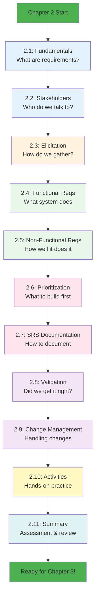

# Chapter 2: Requirements Gathering and Analysis - Quick Reference

## 📁 File Structure Overview

```
chapter-02/
│
├── chapter-02-README.md                          # Main chapter overview and navigation
├── chapter-02-MASTER-FILE-LIST.md               # This planning document
│
├── Core Content (11 files)                       # Main educational materials
│   ├── 2_1-requirements-fundamentals.md         # START HERE
│   ├── 2_2-stakeholder-analysis.md
│   ├── 2_3-elicitation-techniques.md
│   ├── 2_4-functional-requirements.md
│   ├── 2_5-non-functional-requirements.md
│   ├── 2_6-requirements-prioritization.md
│   ├── 2_7-srs-documentation.md
│   ├── 2_8-requirements-validation.md
│   ├── 2_9-change-management.md
│   ├── 2_10-hands-on-activities.md
│   └── 2_11-chapter-summary.md
│
├── Presentations (3 files)                       # Instructor presentation materials
│   ├── chapter-02-presentation-01.json          # Slides 1-20: Fundamentals & Elicitation
│   ├── chapter-02-presentation-02.json          # Slides 21-40: Requirements Writing
│   └── chapter-02-presentation-03.json          # Slides 41-60: Documentation & Management
│
├── Case Study (3 files)                          # School Management System examples
│   ├── 2_case-study-stakeholders.md             # Stakeholder profiles
│   ├── 2_case-study-interview-scripts.md        # Interview transcripts
│   └── 2_case-study-srs-example.md              # Complete SRS example
│
├── Templates (5 files)                           # Student worksheets and tools
│   ├── 2_template-srs.md                        # IEEE 830 SRS template
│   ├── 2_template-stakeholder-register.md       # Stakeholder analysis template
│   ├── 2_template-requirements-traceability-matrix.md
│   ├── 2_template-interview-guide.md            # Interview preparation guide
│   └── 2_template-change-request.md             # Change request form
│
├── Assessment (3 files)                          # Quizzes and assignments
│   ├── 2_quiz-requirements-engineering.md       # 30-question quiz
│   ├── 2_assignment-srs-creation.md             # Main assignment
│   └── 2_rubric-srs-grading.md                  # Grading criteria
│
└── Resources (3 files)                           # Additional learning materials
    ├── 2_glossary.md                            # Key terms and definitions
    ├── 2_additional-reading.md                  # Further resources
    └── 2_real-world-examples.md                 # Industry case studies

TOTAL: 29 files (~80-100 pages)
```

---

## 🎯 Chapter Learning Journey



---

## 📊 Content Breakdown by Type

| Content Type | Files | Pages | Purpose |
|--------------|-------|-------|---------|
| **Core Learning** | 11 | ~50 | Main instructional content |
| **Presentations** | 3 | 60 slides | Classroom delivery materials |
| **Case Studies** | 3 | ~25 | Real-world application examples |
| **Templates** | 5 | ~15 | Student tools and worksheets |
| **Assessment** | 3 | ~10 | Evaluation materials |
| **Resources** | 3 | ~8 | Supporting references |
| **Meta/Navigation** | 1 | ~10 | README and organization |
| **TOTAL** | **29** | **~100** | Complete chapter package |

---

## 🎓 Key Topics Coverage

### Requirements Fundamentals
- What requirements are and why they matter
- Types: functional, non-functional, business
- Characteristics of good requirements
- Common pitfalls and how to avoid them

### Stakeholder Management
- Identification techniques
- Analysis frameworks (Power/Interest, RACI)
- Communication planning
- Managing conflicting needs

### Elicitation Techniques
- **Interviews**: One-on-one with stakeholders
- **Surveys**: Gathering input from many users
- **Workshops**: Collaborative sessions (JAD)
- **Observation**: Job shadowing and task analysis
- **Document Analysis**: Existing systems review
- **Prototyping**: Visual validation

### Requirements Writing
- **Functional Requirements**: System features and behaviors
- **Non-Functional Requirements**: Quality attributes (URPS)
- Writing clear, unambiguous, testable requirements
- Acceptance criteria and definition of done
- Requirements traceability

### Prioritization Methods
- **MoSCoW**: Must/Should/Could/Won't have
- **Kano Model**: Basic/Performance/Excitement
- **Value vs. Effort**: ROI-based prioritization
- Handling stakeholder conflicts

### Documentation Standards
- **IEEE 830**: Industry standard SRS structure
- Professional documentation practices
- Version control and baseline management
- Review and approval processes

### Quality Assurance
- **Validation**: Are we building the right thing?
- **Verification**: Are we building it right?
- Review techniques and checklists
- Stakeholder sign-off

### Change Management
- Why requirements change
- Change request process
- Impact analysis
- Change control board (CCB)
- Maintaining traceability during changes

---

## 🏗️ School Management System Integration

Throughout Chapter 2, students will develop a complete SRS for:

**School Management System - Student Portal Module**

### Stakeholders Identified
1. **Principal** (Dr. Sarah Johnson) - Strategic oversight
2. **Head Teacher** (Mr. James Chen) - Operations management
3. **Teachers** (Ms. Maria Rodriguez) - Daily system users
4. **Parents** (Jennifer Williams) - Information access
5. **Students** (Alex Thompson) - Primary users
6. **IT Administrator** (David Kumar) - Technical support
7. **School Board** (Robert Martinez) - Governance

### Sample Functional Requirements
- **FR-001**: Teachers shall be able to record daily attendance
- **FR-002**: Students shall be able to view their grades
- **FR-003**: Parents shall receive email notifications for absences
- **FR-015**: System shall generate attendance reports by date range
- **FR-022**: Students shall be able to submit assignments electronically

### Sample Non-Functional Requirements
- **NFR-001**: System shall respond to user actions within 2 seconds
- **NFR-005**: System shall be available 99.9% during school hours
- **NFR-008**: System shall support 1,000 concurrent users
- **NFR-012**: System shall comply with FERPA regulations
- **NFR-015**: System shall work on devices 3+ years old

### Prioritization (MoSCoW)
- **Must Have**: Attendance tracking, grade viewing, secure login
- **Should Have**: Assignment submission, parent notifications
- **Could Have**: Performance analytics, mobile app
- **Won't Have** (this release): AI-powered tutoring, social features

---

## ⚡ Quick Start Guide

### For Students

1. **Start with README**: Read chapter-02-README.md for overview
2. **Work sequentially**: Follow sections 2.1 → 2.2 → 2.3... in order
3. **Use templates**: Download templates before starting exercises
4. **Do activities**: Complete hands-on exercises in section 2.10
5. **Create SRS**: Use the case study to build your own SRS document

### For Instructors

1. **Review all materials**: Read through core content files
2. **Load presentations**: Review the 3 presentation JSON files
3. **Prepare examples**: Familiarize yourself with School System case
4. **Set up tools**: Ensure students have access to required software
5. **Plan sessions**: Use suggested 4-session schedule from README

### For Self-Study

1. **Allocate 5-6 hours**: This is substantial material
2. **Practice elicitation**: Find someone to roleplay stakeholder interviews
3. **Write requirements**: For systems you use daily (apps, websites)
4. **Review examples**: Study the complete SRS example carefully
5. **Take the quiz**: Test your knowledge with the assessment

---

## 🔗 Dependencies and Prerequisites

### From Previous Chapters
- **Chapter 1**: Understanding of SDLC phases
- **Chapter 1**: Knowledge of where requirements fit in the process
- **Chapter 1**: Familiarity with School Management System business case

### For Next Chapters
- **Chapter 3**: Use cases will reference these requirements
- **Chapter 4**: Object-oriented analysis will transform requirements into classes
- **Chapter 5**: UML diagrams will model these requirements
- **All subsequent chapters**: Will trace back to requirements defined here

---

## 💡 Teaching Tips

### Make it Interactive
- **Roleplay exercises**: Students act as stakeholders and analysts
- **Live interviews**: Bring in guest "stakeholders" from other classes
- **Requirement writing workshop**: Write, review, rewrite in class
- **Prioritization debates**: Simulate stakeholder conflicts

### Use Real Examples
- **Show bad requirements**: "System should be fast" - discuss why it's poor
- **Show good requirements**: "Login page shall load in < 2 seconds on 3G connection"
- **Industry failures**: Healthcare.gov, Knight Capital - requirements failures
- **Industry successes**: WhatsApp, Dropbox - requirements done right

### Emphasize Practice
- Requirements writing is a SKILL that improves with practice
- First attempts will be poor - that's normal and expected
- Iterative refinement is part of the process
- Peer review helps catch ambiguities

### Connect to Careers
- Show actual job postings for Business Analysts
- Demonstrate how developers use requirements documents
- Explain how poor requirements cost companies millions
- Highlight salary ranges for requirements-related roles

---

## 📈 Success Metrics

Students successfully completing Chapter 2 will be able to:

✅ Identify all stakeholders for a given project  
✅ Conduct a professional stakeholder interview  
✅ Write 10+ clear, testable functional requirements  
✅ Write 5+ measurable non-functional requirements  
✅ Prioritize requirements using MoSCoW method  
✅ Create a complete IEEE 830 SRS document  
✅ Validate requirements with stakeholders  
✅ Manage requirement changes professionally  

**Assessment Target:** 80%+ of students achieve 75%+ on SRS assignment

---

## 🎯 Next Steps After Planning

1. **Approve this structure** - Confirm file list is complete and appropriate
2. **Begin development** - Start with 2_1-requirements-fundamentals.md
3. **Maintain consistency** - Use Chapter 1 quality standards
4. **Iterate as needed** - Adjust based on what works
5. **Review regularly** - Ensure alignment with learning objectives

**Ready to build?** Let's create outstanding requirements engineering education!

---

*Quick Reference Version: 1.0*  
*Created: November 2025*
