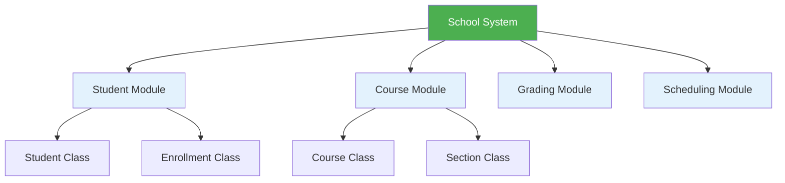

# 4.1 Object-Oriented Thinking

[← Back to Chapter 4 README](./chapter-04-README.md) | [Next: 4.2 Objects and Classes →](./4_2-objects-and-classes.md)

---

## 📖 Introduction

Imagine you're asked to design a software system for a university. Where do you start? One approach is to think about the **processes**: registering students, scheduling classes, recording grades. But there's another powerful way to think about it: what **things** exist in a university? Students, professors, courses, classrooms, grades, schedules...

These "things" are **objects**. Object-oriented analysis (OOA) is a way of understanding problems by identifying the objects in a system and how they interact with each other.

This approach mirrors how humans naturally think about the world—we see the world as a collection of objects with properties and behaviors, not as a series of procedures.

---

## 🎯 Learning Objectives

After completing this section, you will be able to:

- ✅ Explain what object-oriented analysis is and its purpose
- ✅ Contrast procedural thinking with object-oriented thinking
- ✅ Identify the benefits of OO approach in software development
- ✅ Understand the historical evolution of OO methodologies
- ✅ Apply OO thinking to real-world problem domains

---

## 🤔 What is Object-Oriented Analysis?

### Definition

> **Object-Oriented Analysis (OOA)**: A methodology for analyzing a problem domain by identifying and describing the objects and their relationships within that domain.

**Key Points:**
- OOA focuses on **WHAT** the system needs to do, not HOW it does it
- It produces a conceptual model of the problem domain
- Objects represent real-world entities and concepts
- The model captures structure (objects) and behavior (interactions)

### OOA vs. OOD vs. OOP

| Phase | Focus | Output |
|-------|-------|--------|
| **Object-Oriented Analysis (OOA)** | Understanding the problem | Domain model, conceptual classes |
| **Object-Oriented Design (OOD)** | Solving the problem | Design classes, architecture |
| **Object-Oriented Programming (OOP)** | Building the solution | Code, executables |

```
Requirements → [OOA] → Domain Model → [OOD] → Design Model → [OOP] → Working Software
```

**This chapter focuses on OOA**—the analysis phase where we model the problem before designing or coding solutions.

---

## 🔄 Procedural vs. Object-Oriented Thinking

Understanding the difference between these two paradigms is crucial.

### Procedural Thinking

**Focus:** What actions/steps need to happen?

**Example: Bank Account System (Procedural)**
```
1. Open account
2. Deposit money
3. Check balance
4. Withdraw money
5. Calculate interest
6. Close account
```

The system is organized around **functions/procedures** that operate on **data**.

**Problems with Procedural Approach:**
- Data and behavior are separate
- Changes to data structure affect many functions
- Hard to model complex real-world relationships
- Difficult to reuse and extend

### Object-Oriented Thinking

**Focus:** What things exist and what can they do?

**Example: Bank Account System (Object-Oriented)**

```
Objects:
- Account
  - accountNumber
  - balance
  - deposit()
  - withdraw()
  - calculateInterest()

- Customer
  - name
  - accounts[]
  - openAccount()
  - closeAccount()

- Transaction
  - date
  - amount
  - type
  - process()
```

The system is organized around **objects** that encapsulate both **data and behavior**.

### Side-by-Side Comparison

| Aspect | Procedural | Object-Oriented |
|--------|------------|-----------------|
| **Primary Focus** | Actions/Functions | Objects/Entities |
| **Data & Behavior** | Separate | Together (encapsulated) |
| **Thinking Style** | "What happens?" | "What things exist?" |
| **Organization** | By functionality | By real-world concepts |
| **Reusability** | Copy-paste functions | Inherit and extend |
| **Change Impact** | Wide-spread | Localized |

---

## 💡 Benefits of Object-Oriented Approach

### 1. **Natural Modeling**

Objects mirror real-world entities, making systems easier to understand.

**Example:**
Instead of thinking about "grade calculation procedures," we think about:
- A **Student** who receives grades
- A **Course** that has grading criteria
- A **Grade** that represents performance

Stakeholders can validate the model because it uses their language.

### 2. **Encapsulation**

Objects hide internal complexity and expose only what's needed.

```
╔═══════════════════════════════╗
║        BankAccount            ║
╠═══════════════════════════════╣
║ - balance     (hidden)        ║
║ - transactions (hidden)       ║
╠═══════════════════════════════╣
║ + deposit()   (accessible)    ║
║ + withdraw()  (accessible)    ║
║ + getBalance() (accessible)   ║
╚═══════════════════════════════╝
```

**Benefit:** Internal changes don't affect users of the object.

### 3. **Reusability**

Objects can be reused across projects and extended without modification.

**Example:**
A `Person` class defined once can be:
- Inherited by `Student`, `Instructor`, `Administrator`
- Reused in other systems (HR, Payroll, Library)
- Extended with new behaviors without changing original

### 4. **Maintainability**

Changes are localized to specific objects rather than scattered across the system.

**Scenario:** Grade calculation formula changes

| Approach | Impact |
|----------|--------|
| Procedural | Find and update every function that calculates grades |
| OO | Update the `Grade.calculate()` method in one place |

### 5. **Modularity**

Systems are composed of independent, interchangeable components.



Each module can be developed, tested, and updated independently.

### 6. **Better Communication**

Domain models serve as a common language between:
- Business stakeholders (who understand the domain)
- Developers (who build the system)
- Testers (who validate the system)

---

## 📜 Historical Context

Understanding how OO evolved helps appreciate its current form.

### Timeline

| Year | Milestone |
|------|-----------|
| 1967 | **Simula** - First OO language (Norway) |
| 1972 | **Smalltalk** - Pure OO language (Xerox PARC) |
| 1983 | **C++** - OO extension of C |
| 1988 | **OOA Methods** emerge (Coad, Yourdon, Booch) |
| 1991 | **UML predecessor methods** developed |
| 1995 | **Java** released - mainstream OO adoption |
| 1997 | **UML 1.0** standardized |
| 2000s | OO becomes dominant paradigm |
| 2017 | **UML 2.5** current standard |

### Key Contributors

- **Ivar Jacobson**: Use cases, OOSE methodology
- **Grady Booch**: Booch method, UML co-creator
- **James Rumbaugh**: OMT methodology, UML co-creator
- **Bertrand Meyer**: Design by Contract, Eiffel language
- **Robert C. Martin**: SOLID principles, Clean Code

### The Three Amigos

In 1994, Booch, Rumbaugh, and Jacobson joined forces at Rational Software to unify their methods, resulting in the **Unified Modeling Language (UML)**—the standard notation we use today.

---

## 🎓 OO Thinking in Practice

Let's apply OO thinking to analyze a familiar domain.

### Example: Coffee Shop System

**Scenario:** Design a system for a coffee shop that handles orders, tracks inventory, and processes payments.

**Procedural Approach Questions:**
- How do we take an order?
- How do we calculate the total?
- How do we process payment?
- How do we update inventory?

**Object-Oriented Approach Questions:**
- What things exist in a coffee shop?
- What does each thing know (attributes)?
- What can each thing do (methods)?
- How do things interact?

### Step-by-Step OO Analysis

**1. Identify Objects (Nouns)**

Reading the scenario, we find:
- Coffee Shop
- Order
- Customer
- Item (Coffee, Pastry, etc.)
- Payment
- Inventory
- Employee/Barista

**2. Identify Attributes (Properties)**

| Object | Attributes |
|--------|------------|
| Order | orderNumber, items, total, status, timestamp |
| Customer | name, phone, loyaltyPoints |
| Item | name, price, category, size |
| Payment | amount, method, status, transactionId |
| Inventory | items, quantities, reorderLevels |

**3. Identify Methods (Behaviors)**

| Object | Methods |
|--------|---------|
| Order | addItem(), removeItem(), calculateTotal(), submit() |
| Customer | placeOrder(), earnPoints(), redeemPoints() |
| Item | getPrice(), checkAvailability() |
| Payment | process(), refund(), validate() |
| Inventory | checkStock(), updateQuantity(), reorder() |

**4. Identify Relationships**

```
Customer ─── places ───→ Order
Order ─── contains ───→ Items
Order ─── paid by ───→ Payment
Inventory ─── tracks ───→ Items
```

**Result:** We have a conceptual model that:
- Uses business terminology
- Captures real-world structure
- Defines clear responsibilities
- Can be validated by stakeholders

---

## 🏫 School Management System Example

Applying OO thinking to our course project:

### Domain Analysis

**What things exist in a school?**

| Category | Objects |
|----------|---------|
| **People** | Student, Instructor, Administrator, Parent |
| **Academic** | Course, Section, Assignment, Grade |
| **Organization** | Department, Semester, Schedule |
| **Resources** | Classroom, Textbook, Equipment |
| **Administrative** | Enrollment, Attendance, Transcript |

### Sample Object Analysis: Student

```
╔════════════════════════════════════╗
║            Student                 ║
╠════════════════════════════════════╣
║ Attributes:                        ║
║  - studentId: String               ║
║  - name: String                    ║
║  - email: String                   ║
║  - dateOfBirth: Date               ║
║  - enrollmentDate: Date            ║
║  - gpa: Decimal                    ║
║  - status: EnrollmentStatus        ║
╠════════════════════════════════════╣
║ Behaviors:                         ║
║  - enroll(course): Boolean         ║
║  - drop(course): Boolean           ║
║  - submitAssignment(assignment)    ║
║  - viewGrades(): List<Grade>       ║
║  - calculateGPA(): Decimal         ║
║  - requestTranscript(): Transcript ║
╚════════════════════════════════════╝
```

### Relationship Preview

```
Student ─── enrolls in ───→ Course
Student ─── submits ───→ Assignment
Student ─── receives ───→ Grade
Course ─── taught by ───→ Instructor
Course ─── has ───→ Sections
```

We'll develop this model fully throughout the chapter.

---

## 🔑 Core OO Concepts Preview

The following concepts will be explored in detail in upcoming sections:

### Objects and Classes (Section 4.2)
- **Object**: A specific instance (e.g., "John Smith, student ID 12345")
- **Class**: A template/blueprint (e.g., "Student" as a concept)

### Encapsulation (Section 4.3)
- Bundling data and methods together
- Hiding internal details from outside

### Inheritance (Section 4.4)
- Creating new classes from existing ones
- "is-a" relationships (Student IS A Person)

### Polymorphism (Section 4.4)
- Same operation, different behaviors
- E.g., `calculateGPA()` works differently for graduate vs. undergraduate

### Relationships (Section 4.6)
- Association: "knows about"
- Aggregation: "has" (shared)
- Composition: "contains" (exclusive)

---

## 🧪 Self-Check Questions

Test your understanding:

### Question 1
What is the primary focus of Object-Oriented Analysis?
- A. Writing efficient code
- B. Designing user interfaces
- C. Understanding the problem domain through objects ✓
- D. Optimizing database queries

**Answer:** C. OOA focuses on modeling the problem domain by identifying objects and their relationships.

### Question 2
In OO thinking, which best describes an "object"?
- A. A function that performs an action
- B. A data structure with no behavior
- C. An entity with both data (attributes) and behavior (methods) ✓
- D. A database table

**Answer:** C. Objects encapsulate both data (attributes) and behavior (methods).

### Question 3
Which is a key benefit of the OO approach?
- A. Programs run faster
- B. Changes are localized to specific objects ✓
- C. Less code is needed
- D. No testing is required

**Answer:** B. Because data and behavior are encapsulated together, changes typically affect only specific objects.

---

## 💡 Key Takeaways

✅ **OOA models the problem domain by identifying objects and relationships**

✅ **Objects encapsulate both data (attributes) and behavior (methods)**

✅ **OO thinking mirrors how humans naturally perceive the world**

✅ **Benefits include reusability, maintainability, and natural modeling**

✅ **OOA produces domain models that bridge business and technical perspectives**

✅ **UML is the standard notation for representing OO models**

---

## 🌍 Real-World Impact

### Case Study: Netflix's Object-Oriented Architecture

Netflix's system is built around objects that represent their domain:

**Key Objects:**
- **Member**: Preferences, viewing history, subscription
- **Video**: Title, genre, cast, ratings
- **Recommendation**: Algorithm results, personalization
- **Streaming Session**: Quality, device, network conditions

**Benefits Realized:**
- **Scalability**: Each object type can scale independently
- **Personalization**: Member objects drive recommendations
- **Flexibility**: New features added without disrupting existing objects
- **Team Organization**: Teams own specific object domains

The OO approach allows Netflix to serve 200+ million members with personalized experiences, updating their system multiple times per day without downtime.

---

## ✏️ Practice Exercise

**Exercise: Apply OO Thinking**

For a **Library Management System**, answer:

1. List 5 objects you would identify:
   - ________________________________
   - ________________________________
   - ________________________________
   - ________________________________
   - ________________________________

2. For the "Book" object, list 3 attributes and 3 methods:
   
   Attributes:
   - ________________________________
   - ________________________________
   - ________________________________
   
   Methods:
   - ________________________________
   - ________________________________
   - ________________________________

3. Identify one relationship between two objects:
   - ________________________________

**Sample Answers:**

1. Objects: Book, Member, Loan, Author, Category, Librarian

2. Book:
   - Attributes: title, isbn, publicationYear
   - Methods: checkOut(), checkIn(), reserve()

3. Relationship: Member borrows Book

---

## 🚀 Next Steps

Now that you understand the OO mindset, let's dive deeper into the building blocks: **Objects and Classes**.

**Continue to:** [4.2 Objects and Classes →](./4_2-objects-and-classes.md)

---

[← Back to Chapter 4 README](./chapter-04-README.md) | [Next: 4.2 Objects and Classes →](./4_2-objects-and-classes.md)
