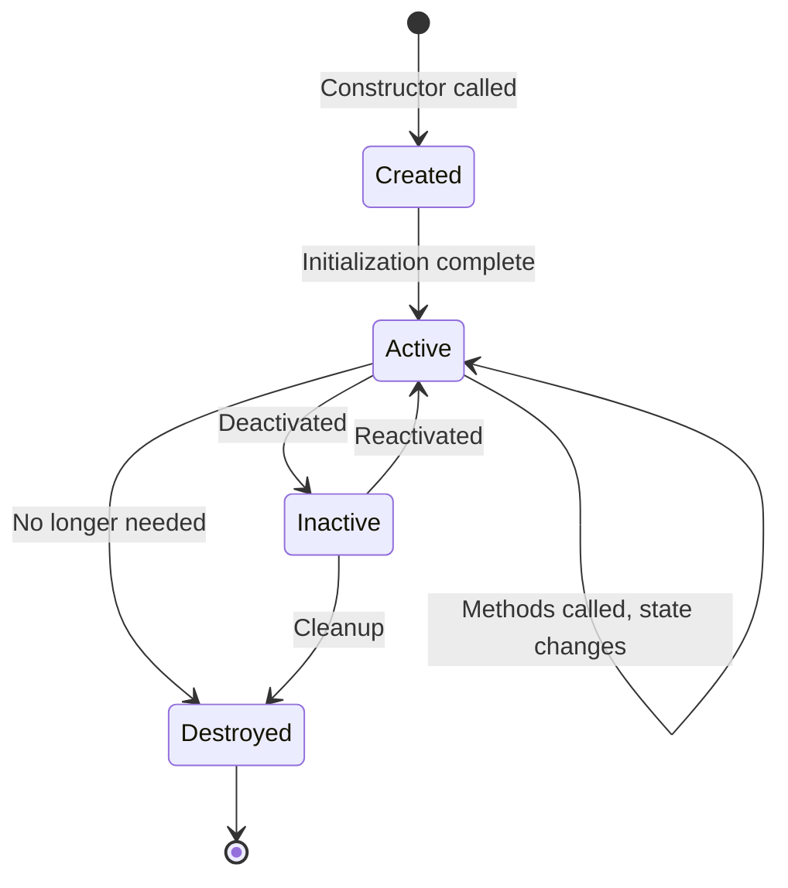

# 4.2 Objects and Classes

[← Back to Chapter 4 README](./chapter-04-README.md) | [Previous: 4.1 OO Thinking](./4_1-object-oriented-thinking.md) | [Next: 4.3 Encapsulation →](./4_3-encapsulation.md)

---

## 📖 Introduction

In the real world, we see individual things: **this specific student** named Sarah, **that particular course** called "Software Analysis," **this exact assignment** due on Friday. In object-oriented analysis, we call these individual things **objects**.

But we also recognize categories: **students** in general, **courses** as a concept, **assignments** as a type. These categories or templates are called **classes**.

Understanding the distinction between objects and classes is fundamental to object-oriented thinking.

---

## 🎯 Learning Objectives

After completing this section, you will be able to:

- ✅ Define what an object is and identify its components
- ✅ Explain the relationship between classes and objects
- ✅ Distinguish between attributes (state) and methods (behavior)
- ✅ Understand object identity, equality, and lifecycle
- ✅ Use UML notation to represent classes
- ✅ Apply these concepts to real-world scenarios

---

## 🎯 What is an Object?

### Definition

> **Object**: A distinct entity that has state (attributes), behavior (methods), and identity.

An object is a self-contained unit that represents something in the problem domain—it could be a physical thing, a concept, or an event.

### The Three Characteristics of Objects

Every object has three essential characteristics:

```
╔═══════════════════════════════════════════════════════════╗
║                       OBJECT                              ║
╠═══════════════════════════════════════════════════════════╣
║  1. STATE (Attributes/Properties)                         ║
║     What the object KNOWS                                 ║
║     - Data values that describe the object                ║
║     - Can change over time                                ║
║                                                           ║
║  2. BEHAVIOR (Methods/Operations)                         ║
║     What the object CAN DO                                ║
║     - Actions the object can perform                      ║
║     - Services it provides to other objects               ║
║                                                           ║
║  3. IDENTITY (Uniqueness)                                 ║
║     What makes the object UNIQUE                          ║
║     - Distinguishes it from all other objects             ║
║     - Remains constant throughout lifetime                ║
╚═══════════════════════════════════════════════════════════╝
```

### Example: A Specific Student Object

```
Object: student_12345 (Sarah Johnson)

STATE (What Sarah knows/has):
├── studentId = "12345"
├── name = "Sarah Johnson"
├── email = "sarah.j@university.edu"
├── gpa = 3.75
├── credits = 45
└── status = "Active"

BEHAVIOR (What Sarah can do):
├── enroll(course) → Add to course roster
├── submitAssignment(assignment) → Turn in work
├── viewGrades() → See academic record
├── calculateGPA() → Compute average
└── withdraw(course) → Drop a course

IDENTITY:
└── Unique reference that never changes (studentId: 12345)
```

---

## 📐 What is a Class?

### Definition

> **Class**: A blueprint, template, or specification that defines the common attributes and methods for a group of objects.

Think of a class as a cookie cutter—it defines the shape, but each cookie (object) cut from it is a separate entity.

### Class vs. Object Analogy

| Concept | Real-World Analogy | Software Example |
|---------|-------------------|------------------|
| **Class** | Blueprint for a house | Student class definition |
| **Object** | A specific house built from the blueprint | Sarah Johnson (student #12345) |
| **Class** | Recipe for chocolate cake | Course class definition |
| **Object** | The actual cake you baked | "CS101 - Intro to Programming" |

### UML Class Notation

In UML, a class is represented as a rectangle divided into three compartments:

```
┌─────────────────────────────────┐
│          ClassName              │  ← Name compartment
├─────────────────────────────────┤
│ - attribute1: Type              │  ← Attributes compartment
│ - attribute2: Type              │
│ + attribute3: Type              │
├─────────────────────────────────┤
│ + method1(): ReturnType         │  ← Methods compartment
│ + method2(param: Type): Type    │
│ - privateMethod(): void         │
└─────────────────────────────────┘
```

**Visibility Modifiers:**
- `+` Public (accessible from outside)
- `-` Private (internal only)
- `#` Protected (accessible to subclasses)
- `~` Package (accessible within package)

### Example: Student Class in UML

```
┌─────────────────────────────────────┐
│            Student                  │
├─────────────────────────────────────┤
│ - studentId: String                 │
│ - name: String                      │
│ - email: String                     │
│ - gpa: Decimal                      │
│ - credits: Integer                  │
│ - status: EnrollmentStatus          │
├─────────────────────────────────────┤
│ + enroll(course: Course): Boolean   │
│ + submitAssignment(a: Assignment)   │
│ + viewGrades(): List<Grade>         │
│ + calculateGPA(): Decimal           │
│ + withdraw(course: Course): Boolean │
└─────────────────────────────────────┘
```

---

## 📊 Attributes (State)

### What Are Attributes?

> **Attribute**: A named property of a class that describes a characteristic all objects of that class will have.

Attributes define what data an object stores. Each object has its own copy of these values.

### Attribute Characteristics

| Characteristic | Description | Example |
|----------------|-------------|---------|
| **Name** | Identifier for the attribute | `studentName` |
| **Type** | Data type of the value | String, Integer, Date |
| **Visibility** | Who can access it | Private (-), Public (+) |
| **Initial Value** | Default value (optional) | status = "Active" |
| **Multiplicity** | How many values | [0..1], [1], [*] |

### Types of Attributes

**1. Simple Attributes**
Basic data types
```
- name: String
- age: Integer
- isActive: Boolean
- balance: Decimal
```

**2. Reference Attributes**
References to other objects
```
- advisor: Instructor
- department: Department
```

**3. Derived Attributes**
Calculated from other attributes (marked with /)
```
- /age: Integer          [derived from dateOfBirth]
- /fullName: String      [derived from firstName + lastName]
- /totalCredits: Integer [derived from courses taken]
```

**4. Collection Attributes**
Multiple values
```
- courses: List<Course>
- grades: Map<Course, Grade>
- phoneNumbers: Set<String>
```

### Attribute Naming Conventions

| Convention | Example | Used In |
|------------|---------|---------|
| camelCase | `firstName`, `dateOfBirth` | Java, JavaScript, C# |
| snake_case | `first_name`, `date_of_birth` | Python, Ruby |
| PascalCase | `FirstName`, `DateOfBirth` | C# properties |

**Best Practices:**
- Use meaningful, descriptive names
- Avoid abbreviations unless universally understood
- Be consistent within the project
- Use nouns or noun phrases

---

## ⚡ Methods (Behavior)

### What Are Methods?

> **Method**: An operation or function that defines what an object can do.

Methods represent the behavior or services an object provides. They can:
- Query the object's state (getters)
- Modify the object's state (setters/mutators)
- Perform calculations
- Coordinate with other objects

### Method Characteristics

| Characteristic | Description | Example |
|----------------|-------------|---------|
| **Name** | Verb or verb phrase | `calculateTotal()` |
| **Parameters** | Input values | `(quantity: Integer)` |
| **Return Type** | Output type | `: Decimal` |
| **Visibility** | Access level | Public, Private |

### Types of Methods

**1. Constructor**
Creates new objects
```
+ Student(id: String, name: String)
```

**2. Accessor (Getter)**
Returns attribute values
```
+ getName(): String
+ getGPA(): Decimal
```

**3. Mutator (Setter)**
Changes attribute values
```
+ setEmail(email: String): void
+ updateStatus(status: Status): void
```

**4. Business Logic**
Performs domain operations
```
+ calculateGPA(): Decimal
+ isEligibleForHonors(): Boolean
+ registerForCourse(course: Course): Boolean
```

**5. Query**
Returns information without changing state
```
+ getEnrolledCourses(): List<Course>
+ findGradeForCourse(course: Course): Grade
```

### Method Signatures in UML

```
visibility name(parameter: Type, ...): ReturnType

Examples:
+ enroll(course: Course): Boolean
+ calculateGPA(): Decimal
+ setName(name: String): void
- validateEmail(email: String): Boolean
```

---

## 🔑 Object Identity

### What is Identity?

> **Identity**: The property that distinguishes an object from all other objects, even if they have identical attribute values.

Identity is fundamental—two objects can have the same values but still be different objects.

### Identity vs. Equality

```
Object A: Student (id: "001", name: "John Smith", gpa: 3.5)
Object B: Student (id: "002", name: "John Smith", gpa: 3.5)
```

**Same values?** Yes (name and GPA are identical)
**Same identity?** No (different studentId, different objects)

### Identity in Practice

| Concept | Description | Example |
|---------|-------------|---------|
| **Identity** | Unique reference | Memory address, primary key |
| **Equality** | Same attribute values | Two "John Smith" students |
| **Type** | What class it belongs to | Both are Student objects |

### Implementing Identity

In most systems, identity is established by:
- **Natural Key**: Business-meaningful identifier (studentId, ISBN)
- **Surrogate Key**: System-generated identifier (auto-increment ID, UUID)

```
Student "John Smith"
├── Natural Identity: studentId = "S12345"
├── Surrogate Identity: objectId = 78429
└── Both uniquely identify this specific student
```

---

## 🔄 Object Lifecycle

Objects have a lifecycle from creation to destruction:



### Lifecycle Stages

| Stage | Description | Example |
|-------|-------------|---------|
| **Creation** | Object instantiated from class | `new Student("12345", "Sarah")` |
| **Initialization** | Attributes set to initial values | Setting default status |
| **Active Use** | Object responds to method calls | enroll(), submitAssignment() |
| **State Changes** | Attributes modified over time | GPA updates, status changes |
| **Destruction** | Object no longer needed | Student graduates, record archived |

### Example: Student Object Lifecycle

```
1. CREATION
   - Student applies to university
   - Object created: new Student("S2024001", "Alex Kim")
   
2. INITIALIZATION
   - status = "Applicant"
   - gpa = 0.0
   - credits = 0

3. ACTIVE USE
   - status changed to "Active"
   - Enrolls in courses
   - Submits assignments
   - Receives grades
   - GPA calculated and updated

4. STATE CHANGES
   - credits increase each semester
   - GPA fluctuates
   - status may change (Probation, Honors, etc.)

5. DESTRUCTION/ARCHIVAL
   - Student graduates
   - status = "Graduated"
   - Record archived for historical access
```

---

## 🏫 School Management System: Objects and Classes

Let's identify the key classes for our case study:

### Core Classes

```
┌─────────────────────────────────┐
│           Person                │
├─────────────────────────────────┤
│ - personId: String              │
│ - firstName: String             │
│ - lastName: String              │
│ - email: String                 │
│ - phone: String                 │
│ - dateOfBirth: Date             │
├─────────────────────────────────┤
│ + getFullName(): String         │
│ + getAge(): Integer             │
│ + updateContact(...)            │
└─────────────────────────────────┘

┌─────────────────────────────────┐
│           Student               │
├─────────────────────────────────┤
│ - studentId: String             │
│ - enrollmentDate: Date          │
│ - gpa: Decimal                  │
│ - credits: Integer              │
│ - major: String                 │
│ - status: EnrollmentStatus      │
├─────────────────────────────────┤
│ + enroll(course): Boolean       │
│ + drop(course): Boolean         │
│ + submitAssignment(a): void     │
│ + viewGrades(): List<Grade>     │
│ + calculateGPA(): Decimal       │
└─────────────────────────────────┘

┌─────────────────────────────────┐
│           Course                │
├─────────────────────────────────┤
│ - courseCode: String            │
│ - title: String                 │
│ - description: String           │
│ - credits: Integer              │
│ - department: Department        │
│ - prerequisites: List<Course>   │
├─────────────────────────────────┤
│ + addPrerequisite(c): void      │
│ + checkEligibility(s): Boolean  │
│ + getSyllabus(): Document       │
└─────────────────────────────────┘

┌─────────────────────────────────┐
│         Assignment              │
├─────────────────────────────────┤
│ - assignmentId: String          │
│ - title: String                 │
│ - description: String           │
│ - dueDate: DateTime             │
│ - maxPoints: Integer            │
│ - type: AssignmentType          │
├─────────────────────────────────┤
│ + isOverdue(): Boolean          │
│ + getDaysRemaining(): Integer   │
│ + createSubmission(): Submission│
└─────────────────────────────────┘
```

### Sample Objects (Instances)

```
Object: student_S2024001
Class: Student
├── studentId = "S2024001"
├── firstName = "Maria"
├── lastName = "Garcia"
├── email = "m.garcia@school.edu"
├── enrollmentDate = 2024-08-15
├── gpa = 3.82
├── credits = 32
├── major = "Computer Science"
└── status = ACTIVE

Object: course_CS101
Class: Course
├── courseCode = "CS101"
├── title = "Introduction to Programming"
├── description = "Fundamentals of programming..."
├── credits = 3
├── department = ComputerScience
└── prerequisites = []

Object: assignment_A001
Class: Assignment
├── assignmentId = "A001"
├── title = "Hello World Program"
├── description = "Write your first program..."
├── dueDate = 2024-09-15 23:59
├── maxPoints = 100
└── type = HOMEWORK
```

---

## 📋 Class Specification Template

When documenting classes in detail, use this template:

```
CLASS SPECIFICATION
═══════════════════════════════════════════════════════════

Class Name: [ClassName]
Description: [Brief description of what this class represents]
Stereotype: <<entity>> | <<boundary>> | <<control>>

ATTRIBUTES
───────────────────────────────────────────────────────────
| Name          | Type      | Visibility | Description    |
|---------------|-----------|------------|----------------|
| attributeName | DataType  | +/-/#      | What it stores |

METHODS
───────────────────────────────────────────────────────────
| Name          | Parameters    | Return | Description    |
|---------------|---------------|--------|----------------|
| methodName    | (params)      | Type   | What it does   |

CONSTRAINTS
───────────────────────────────────────────────────────────
- Business rules that apply to this class
- Validation requirements
- Invariants that must always be true

RELATIONSHIPS
───────────────────────────────────────────────────────────
- [Type] relationship to [ClassName]: description
```

---

## 🧪 Self-Check Questions

### Question 1
What is the relationship between a class and an object?
- A. They are the same thing
- B. A class is an instance of an object
- C. An object is an instance of a class ✓
- D. Objects contain classes

**Answer:** C. A class is the template/blueprint, and objects are specific instances created from that template.

### Question 2
Which of the following is NOT one of the three characteristics of an object?
- A. State (attributes)
- B. Behavior (methods)
- C. Identity
- D. Inheritance ✓

**Answer:** D. The three characteristics are state, behavior, and identity. Inheritance is a relationship between classes.

### Question 3
What does a derived attribute represent?
- A. An attribute inherited from a parent class
- B. An attribute calculated from other attributes ✓
- C. An attribute that changes over time
- D. An attribute visible only within the class

**Answer:** B. Derived attributes are calculated/computed from other attributes (e.g., age derived from dateOfBirth).

---

## 💡 Key Takeaways

✅ **Object = State + Behavior + Identity**

✅ **Classes are blueprints; objects are instances**

✅ **Attributes represent what an object knows (data)**

✅ **Methods represent what an object can do (behavior)**

✅ **Identity distinguishes objects even with identical values**

✅ **UML provides standard notation for representing classes**

✅ **Objects have a lifecycle from creation to destruction**

---

## ✏️ Practice Exercise

**Exercise: Define a Class**

For a **Library Management System**, define the `Book` class:

1. List 5 attributes with their types:
   - ________________________________
   - ________________________________
   - ________________________________
   - ________________________________
   - ________________________________

2. List 4 methods with their signatures:
   - ________________________________
   - ________________________________
   - ________________________________
   - ________________________________

3. Draw the UML class diagram for Book:

```
┌─────────────────────────────────┐
│                                 │
├─────────────────────────────────┤
│                                 │
│                                 │
│                                 │
├─────────────────────────────────┤
│                                 │
│                                 │
│                                 │
└─────────────────────────────────┘
```

**Sample Answer:**

```
┌─────────────────────────────────┐
│             Book                │
├─────────────────────────────────┤
│ - isbn: String                  │
│ - title: String                 │
│ - author: String                │
│ - publicationYear: Integer      │
│ - available: Boolean            │
├─────────────────────────────────┤
│ + checkOut(member): Boolean     │
│ + returnBook(): void            │
│ + reserve(member): Boolean      │
│ + isAvailable(): Boolean        │
└─────────────────────────────────┘
```

---

## 🚀 Next Steps

Now that you understand objects and classes, let's explore **encapsulation**—the principle of bundling data and methods together while hiding internal details.

**Continue to:** [4.3 Encapsulation and Information Hiding →](./4_3-encapsulation.md)

---

[← Back to Chapter 4 README](./chapter-04-README.md) | [Previous: 4.1 OO Thinking](./4_1-object-oriented-thinking.md) | [Next: 4.3 Encapsulation →](./4_3-encapsulation.md)
