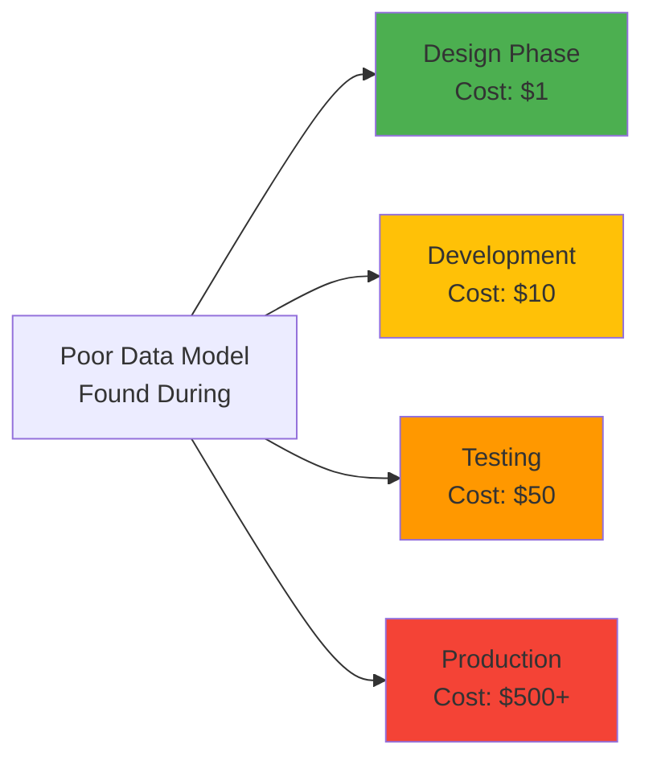
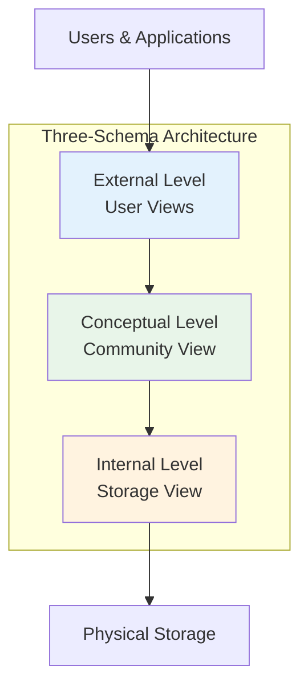
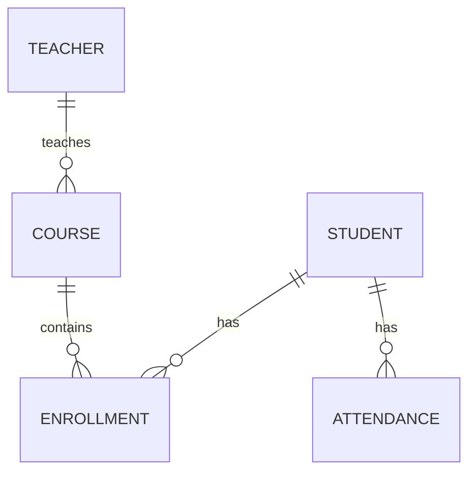
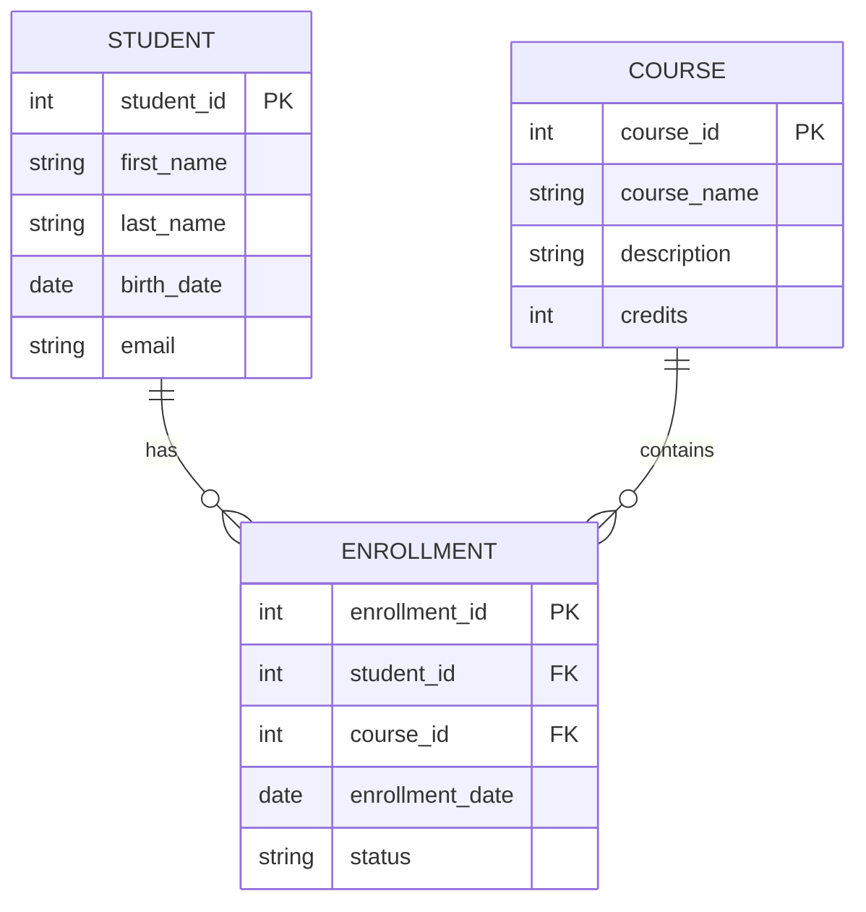
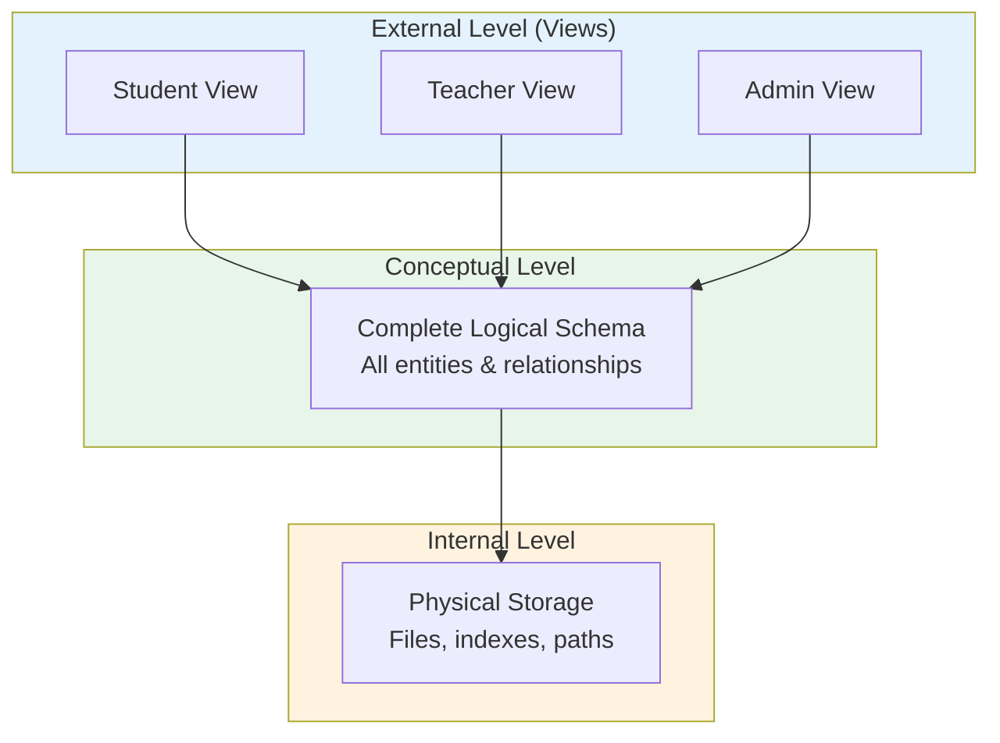

# 6.1 Data Modeling Fundamentals

[← Back to Chapter 6 README](./chapter-06-README.md) | [Next: 6.2 ER Basics →](./6_2-er-basics.md)

---

## 📖 Introduction

**Data modeling** is the process of creating a visual representation of an information system's data and the relationships between data elements. It's like creating a blueprint for how your application will store, organize, and retrieve information.

Before you write a single line of code or SQL, you need to understand what data your system requires, how that data relates, and how it should be organized for efficient storage and retrieval.

**Why This Matters:**
- Data outlasts applications - your data model may serve multiple systems
- Poor data design causes 60% of database performance problems
- Well-designed databases reduce development time by 30-40%
- Data models communicate structure to all stakeholders

---

## 🎯 Learning Objectives

After completing this section, you will be able to:

- ✅ Define data modeling and explain its importance
- ✅ Distinguish between conceptual, logical, and physical data models
- ✅ Explain the three-schema architecture (ANSI-SPARC)
- ✅ Identify when to use different types of data models
- ✅ Connect data modeling to the software development lifecycle

---

## What Is Data Modeling?

### Definition

**Data modeling** is the process of analyzing and defining all the different data your organization collects and produces, as well as the relationships between those data elements.

Think of it as **architecture for data** - just as architects create blueprints before construction, database designers create data models before building databases.

### A Simple Analogy

Imagine designing a library system:

**Without data modeling:**
"We need to track books and who borrowed them."

**With data modeling:**
```
BOOK has: ISBN, Title, Author(s), Publisher, Publication Year, Genre, Location
MEMBER has: ID, Name, Address, Phone, Email, Membership Date, Status
LOAN has: Book, Member, Borrow Date, Due Date, Return Date, Fines
```

The difference? With data modeling, you've systematically identified every piece of information needed and how they connect.

---

## Why Data Modeling Matters

### The Cost of Poor Data Design



### Real-World Failure: Healthcare Records Migration

**The Scenario:**
A hospital merged with another healthcare system and needed to combine patient records.

**The Problem:**
- Hospital A stored patient names as: `FirstName`, `LastName`
- Hospital B stored names as: `FullName` (single field)
- Hospital A used date format: MM/DD/YYYY
- Hospital B used format: DD-MON-YYYY

**The Result:**
- 18 months of manual data cleaning
- $4.2 million in consulting fees
- 23% of records required manual review
- Patient safety incidents due to mismatched records

**The Lesson:**
Proper data modeling upfront prevents expensive problems later.

### Success Story: Netflix

**The Challenge:**
Stream video to 200+ million subscribers with personalized recommendations.

**The Data Model:**
Netflix designed a sophisticated data model that:
- Separates user preferences from viewing history
- Links content with multiple categories, actors, directors
- Enables real-time recommendation calculations
- Supports A/B testing of different algorithms

**The Result:**
- Personalized experience for each user
- 80% of watched content comes from recommendations
- Billions in value from data-driven decisions

---

## Types of Data Models

### The Three-Level Architecture

Data modeling operates at three levels of abstraction:



### 1. Conceptual Data Model (High-Level)

**Purpose:** Communicate with business stakeholders

**Characteristics:**
- Shows major entities and relationships
- Uses business terminology, not technical terms
- Independent of any database technology
- Easy for non-technical people to understand

**Example - School System:**



**When to Use:**
- Initial stakeholder meetings
- Business requirement validation
- High-level project documentation
- Executive presentations

### 2. Logical Data Model (Middle-Level)

**Purpose:** Define data structure without implementation details

**Characteristics:**
- Shows all entities, attributes, and relationships
- Includes primary and foreign keys
- Defines data types conceptually (text, number, date)
- Still independent of specific DBMS

**Example - School System:**



**When to Use:**
- Detailed design phase
- Communication with development team
- Input for physical design
- Documentation of business rules

### 3. Physical Data Model (Low-Level)

**Purpose:** Define actual database implementation

**Characteristics:**
- Specific to database platform (MySQL, PostgreSQL, etc.)
- Includes exact data types, sizes, constraints
- Defines indexes, partitions, storage details
- Ready for SQL generation

**Example - School System (MySQL):**

```sql
CREATE TABLE student (
    student_id INT AUTO_INCREMENT PRIMARY KEY,
    first_name VARCHAR(50) NOT NULL,
    last_name VARCHAR(50) NOT NULL,
    birth_date DATE NOT NULL,
    email VARCHAR(100) UNIQUE NOT NULL,
    created_at TIMESTAMP DEFAULT CURRENT_TIMESTAMP,
    INDEX idx_student_email (email),
    INDEX idx_student_name (last_name, first_name)
);

CREATE TABLE course (
    course_id INT AUTO_INCREMENT PRIMARY KEY,
    course_name VARCHAR(100) NOT NULL,
    description TEXT,
    credits TINYINT NOT NULL CHECK (credits BETWEEN 1 AND 6)
);

CREATE TABLE enrollment (
    enrollment_id INT AUTO_INCREMENT PRIMARY KEY,
    student_id INT NOT NULL,
    course_id INT NOT NULL,
    enrollment_date DATE NOT NULL DEFAULT (CURRENT_DATE),
    status ENUM('active', 'completed', 'withdrawn') DEFAULT 'active',
    FOREIGN KEY (student_id) REFERENCES student(student_id),
    FOREIGN KEY (course_id) REFERENCES course(course_id),
    UNIQUE KEY unique_enrollment (student_id, course_id)
);
```

**When to Use:**
- Database implementation
- Performance optimization
- Database administration
- Migration planning

### Comparison of Model Types

| Aspect | Conceptual | Logical | Physical |
|--------|------------|---------|----------|
| **Audience** | Business stakeholders | Analysts & developers | DBAs & developers |
| **Detail Level** | High-level | Medium | Highly detailed |
| **Entities** | Major entities only | All entities | All tables |
| **Attributes** | Few/none | All attributes | Columns with types |
| **Keys** | Not shown | PKs and FKs | Complete with indexes |
| **Technology** | Independent | Independent | Specific platform |

---

## The Three-Schema Architecture (ANSI-SPARC)

The **ANSI-SPARC** (American National Standards Institute - Standards Planning and Requirements Committee) architecture defines three levels of database abstraction:



### External Level (User Views)

**What users see** - Different views for different users

**Example - School System:**

**Student View:**
```
StudentProfile: Name, Email, Major, GPA
MyEnrollments: CourseName, Instructor, Grade, Status
MySchedule: Day, Time, Room, CourseName
```

**Teacher View:**
```
MyCourses: CourseName, Room, Schedule
ClassRoster: StudentName, Email, Grade
Attendance: StudentName, Date, Status
```

**Administrator View:**
```
AllStudents: Complete student information
AllCourses: All course details
Reports: Enrollment stats, grade distributions
```

### Conceptual Level (Community View)

**What the organization sees** - Complete logical structure

This is the **single source of truth** that:
- Contains all data elements
- Shows all relationships
- Is independent of storage details
- Serves as the reference model

### Internal Level (Storage View)

**How data is actually stored** - Physical implementation

- File organization (heap, clustered, indexed)
- Index structures (B-tree, hash, bitmap)
- Storage allocation
- Access paths
- Compression methods

### Benefits of Three-Schema Architecture

| Benefit | Explanation |
|---------|-------------|
| **Data Independence** | Physical changes don't affect logical model |
| **Multiple Views** | Different users see different perspectives |
| **Security** | Users only see what they need |
| **Flexibility** | Easy to modify without breaking applications |
| **Standardization** | Common model for entire organization |

---

## Data Modeling in the SDLC

### Where Data Modeling Fits


### Phase-by-Phase Data Modeling

| SDLC Phase | Data Modeling Activity | Deliverable |
|------------|----------------------|-------------|
| **Requirements** | Identify data needs | Data requirements list |
| **Analysis** | Conceptual modeling | Conceptual ER diagram |
| **Design** | Logical modeling | Logical ER diagram |
| **Design** | Physical modeling | Database schema |
| **Implementation** | Create database | SQL scripts |
| **Testing** | Validate model | Test data sets |

### Example: School System Data Evolution

**Requirements Phase:**
```
- Store student information
- Track course enrollments
- Record grades
- Monitor attendance
```

**Analysis Phase (Conceptual):**
```
Entities: Student, Course, Enrollment, Grade, Attendance
Relationships: Students enroll in Courses, Students receive Grades
```

**Design Phase (Logical):**
```
STUDENT (student_id, first_name, last_name, email, birth_date)
COURSE (course_id, name, description, credits)
ENROLLMENT (student_id, course_id, date, status)
GRADE (student_id, course_id, assignment, score)
```

**Implementation Phase (Physical):**
```sql
CREATE TABLE student (
    student_id INT PRIMARY KEY,
    first_name VARCHAR(50) NOT NULL,
    ...
);
```

---

## Data Model Components Preview

Before diving into detailed modeling, let's preview the key components:

### Entities (Tables)

**Definition:** A thing or object that the organization wants to track

**Examples:**
- Student, Teacher, Course, Department
- Order, Product, Customer, Supplier
- Patient, Doctor, Appointment, Prescription

### Attributes (Columns)

**Definition:** Properties or characteristics of an entity

**Examples:**
- Student: student_id, name, email, birth_date
- Course: course_id, name, credits, description

### Relationships

**Definition:** Associations between entities

**Examples:**
- Student **enrolls in** Course
- Teacher **teaches** Course
- Department **contains** Teacher

### Keys

**Definition:** Attributes that uniquely identify records

**Types:**
- **Primary Key:** Unique identifier for each record
- **Foreign Key:** Reference to another table's primary key
- **Candidate Key:** Alternative unique identifiers

---

## School System: Data Requirements

Let's preview the data requirements for our ongoing case study:

### User Data
- **Students:** Registration info, contact details, academic records
- **Teachers:** Employment info, qualifications, assignments
- **Administrators:** Access levels, department assignments
- **Parents:** Contact info, linked children

### Academic Data
- **Courses:** Name, description, credits, prerequisites
- **Classes:** Section, schedule, room, teacher
- **Enrollments:** Student-class relationships
- **Grades:** Assignments, scores, final grades

### Operational Data
- **Attendance:** Daily records, excuses
- **Schedule:** Time slots, room assignments
- **Communication:** Messages, notifications

### Sample Data Needs Analysis

| Use Case | Data Required |
|----------|--------------|
| Register Student | Name, DOB, address, parent info |
| Enroll in Course | Student ID, course ID, section |
| Record Attendance | Student ID, date, status, notes |
| Submit Grade | Student ID, assignment, score, date |
| Generate Report Card | All grades for student by term |

---

## Key Takeaways

✅ **Data modeling is essential planning**
- Creates blueprint before building
- Saves time and money long-term
- Enables communication with stakeholders

✅ **Three levels of abstraction**
- Conceptual: Business understanding
- Logical: Detailed structure
- Physical: Implementation specifics

✅ **Three-schema architecture provides independence**
- External views for different users
- Conceptual model as single source of truth
- Internal model for physical storage

✅ **Data modeling spans the SDLC**
- Starts during requirements
- Evolves through design
- Guides implementation

✅ **Good data models have clear components**
- Entities (things we track)
- Attributes (properties)
- Relationships (connections)
- Keys (identifiers)

---

## Self-Check Questions

Test your understanding:

1. **What is the main difference between conceptual and logical data models?**
   <details>
   <summary>Click to reveal answer</summary>
   Conceptual models show high-level entities and relationships for business stakeholders, while logical models include all attributes, data types, and keys for technical design - both are technology-independent.
   </details>

2. **Why is the three-schema architecture important?**
   <details>
   <summary>Click to reveal answer</summary>
   It provides data independence - changes to physical storage don't affect applications, different users can have different views, and there's a single conceptual truth that everyone references.
   </details>

3. **At which SDLC phase should you create a conceptual data model?**
   <details>
   <summary>Click to reveal answer</summary>
   During the Analysis phase, after gathering requirements. The conceptual model validates your understanding of data needs with stakeholders before detailed design begins.
   </details>

4. **What's the difference between the External and Internal levels?**
   <details>
   <summary>Click to reveal answer</summary>
   External level shows user-specific views (what they can see), while Internal level deals with physical storage (how data is actually stored on disk).
   </details>

5. **Why did the hospital data migration fail?**
   <details>
   <summary>Click to reveal answer</summary>
   No common data model - different field structures (FirstName/LastName vs FullName) and date formats made merging data extremely difficult and expensive.
   </details>

---

## Practice Exercise

**Scenario:** An online bookstore wants to track books, customers, and orders.

**Task 1:** List 5 entities this system would need.

<details>
<summary>Click for answer</summary>

1. **Book** - Products being sold
2. **Customer** - People buying books
3. **Order** - Purchase transactions
4. **OrderItem** - Individual books in an order
5. **Author** - Writers of books

Bonus: Category, Publisher, Review, Address
</details>

**Task 2:** For the "Book" entity, list 6 attributes.

<details>
<summary>Click for answer</summary>

1. **ISBN** - Unique identifier
2. **Title** - Book name
3. **Price** - Current selling price
4. **PublicationDate** - When published
5. **StockQuantity** - How many in inventory
6. **Description** - Book summary

Bonus: PageCount, Publisher, Language, Format
</details>

**Task 3:** Identify one relationship and describe it.

<details>
<summary>Click for answer</summary>

**Customer places Order**
- One customer can place many orders
- Each order belongs to exactly one customer
- This is a one-to-many relationship

Or: **Author writes Book** (many-to-many - one author can write multiple books, one book can have multiple authors)
</details>

---

## What's Next?

Now that you understand the fundamentals of data modeling, we'll dive into the specifics:

**Section 6.2: Entity-Relationship Basics**
- What entities are and how to identify them
- Types of attributes (simple, composite, derived, multivalued)
- Basic ER diagram notation
- School System entities identification

---

## 📚 Additional Reading

**Books:**
- "Database Design for Mere Mortals" by Michael Hernandez - Excellent introduction
- "Data Modeling Essentials" by Graeme Simsion - Comprehensive guide

**Online Resources:**
- Lucidchart's Database Design Guide
- Visual Paradigm ER Diagram Tutorial
- w3schools SQL Tutorial

---

**Previous:** [← Chapter 6 Overview](./chapter-06-README.md)

**Next:** [Section 6.2: Entity-Relationship Basics →](./6_2-er-basics.md)

---

*Last Updated: December 2024*  
*Estimated Reading Time: 30 minutes*  
*Prerequisites: Chapter 4 (OOP concepts)*
