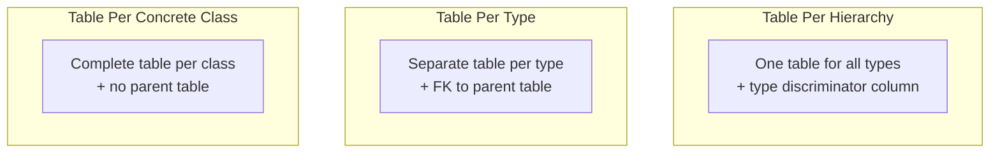
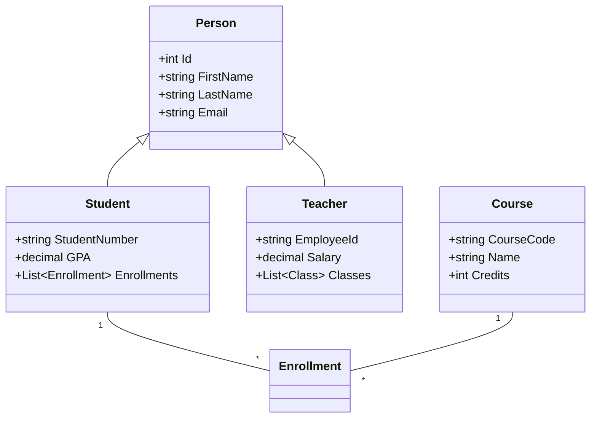

# 6.10 Object-Relational Mapping

[← Previous: 6.9 ER to Relational Mapping](./6_9-er-to-relational.md) | [Back to Chapter 6](./chapter-06-README.md) | [Next: 6.11 NoSQL Introduction →](./6_11-nosql-introduction.md)

---

## 📖 Introduction

**Object-Relational Mapping (ORM)** bridges the gap between object-oriented programming and relational databases. It allows developers to work with database data as objects rather than writing SQL queries directly.

---

## 🎯 Learning Objectives

- ✅ Understand the object-relational impedance mismatch
- ✅ Map class diagrams to database tables
- ✅ Handle inheritance in database design
- ✅ Understand ORM patterns and tools

---

## The Impedance Mismatch Problem

### Object World vs. Relational World

| Aspect | Objects (OOP) | Relational (DB) |
|--------|---------------|-----------------|
| **Structure** | Classes with methods | Tables with rows |
| **Identity** | Object reference | Primary key |
| **Relationships** | Object references | Foreign keys |
| **Inheritance** | Class hierarchy | No native support |
| **Encapsulation** | Private data | All columns visible |
| **Behavior** | Methods | Stored procedures |

### The Challenge

```
Object Model:                     Relational Model:
┌─────────────┐                   ┌─────────────────────┐
│   Student   │                   │      student        │
├─────────────┤                   ├─────────────────────┤
│ -id         │      ???          │ student_id (PK)     │
│ -name       │  ==========>      │ name                │
│ -courses[]  │                   │ ... (no arrays!)    │
│ +enroll()   │                   │                     │
└─────────────┘                   └─────────────────────┘
```

---

## Class to Table Mapping Rules

### Rule 1: Class → Table

Each class becomes a table; attributes become columns.

**Class:**
```csharp
public class Student {
    public int Id { get; set; }
    public string FirstName { get; set; }
    public string LastName { get; set; }
    public string Email { get; set; }
    public decimal GPA { get; set; }
}
```

**Table:**
```sql
CREATE TABLE student (
    id INT PRIMARY KEY AUTO_INCREMENT,
    first_name VARCHAR(50),
    last_name VARCHAR(50),
    email VARCHAR(100),
    gpa DECIMAL(3,2)
);
```

### Rule 2: Association → Foreign Key

Object references become foreign keys.

**Classes:**
```csharp
public class Student {
    public int Id { get; set; }
    public string Name { get; set; }
    public Department Department { get; set; }  // Reference
}

public class Department {
    public int Id { get; set; }
    public string Name { get; set; }
    public List<Student> Students { get; set; }  // Collection
}
```

**Tables:**
```sql
CREATE TABLE department (
    id INT PRIMARY KEY,
    name VARCHAR(100)
);

CREATE TABLE student (
    id INT PRIMARY KEY,
    name VARCHAR(100),
    department_id INT,  -- FK replaces object reference
    FOREIGN KEY (department_id) REFERENCES department(id)
);
```

### Rule 3: Many-to-Many → Junction Table

Collections on both sides require a junction table.

**Classes:**
```csharp
public class Student {
    public List<Course> Courses { get; set; }
}

public class Course {
    public List<Student> Students { get; set; }
}
```

**Tables:**
```sql
CREATE TABLE enrollment (
    student_id INT,
    course_id INT,
    enrollment_date DATE,
    PRIMARY KEY (student_id, course_id),
    FOREIGN KEY (student_id) REFERENCES student(id),
    FOREIGN KEY (course_id) REFERENCES course(id)
);
```

---

## Mapping Inheritance

### Three Strategies



### Strategy 1: Table Per Hierarchy (TPH)

**One table with discriminator column:**

```sql
CREATE TABLE person (
    id INT PRIMARY KEY,
    person_type VARCHAR(20) NOT NULL,  -- 'student', 'teacher'
    first_name VARCHAR(50),
    last_name VARCHAR(50),
    -- Student fields
    student_number VARCHAR(20),
    gpa DECIMAL(3,2),
    -- Teacher fields
    employee_id VARCHAR(20),
    salary DECIMAL(10,2)
);
```

**Pros:** Simple queries, no JOINs
**Cons:** Many NULL values

### Strategy 2: Table Per Type (TPT)

**Separate tables with shared primary key:**

```sql
CREATE TABLE person (
    id INT PRIMARY KEY,
    first_name VARCHAR(50),
    last_name VARCHAR(50)
);

CREATE TABLE student (
    id INT PRIMARY KEY,
    student_number VARCHAR(20),
    gpa DECIMAL(3,2),
    FOREIGN KEY (id) REFERENCES person(id)
);

CREATE TABLE teacher (
    id INT PRIMARY KEY,
    employee_id VARCHAR(20),
    salary DECIMAL(10,2),
    FOREIGN KEY (id) REFERENCES person(id)
);
```

**Pros:** No NULL values, normalized
**Cons:** Requires JOINs

### Strategy 3: Table Per Concrete Class (TPC)

**Complete duplicate in each table:**

```sql
CREATE TABLE student (
    id INT PRIMARY KEY,
    first_name VARCHAR(50),  -- Duplicated
    last_name VARCHAR(50),   -- Duplicated
    student_number VARCHAR(20),
    gpa DECIMAL(3,2)
);

CREATE TABLE teacher (
    id INT PRIMARY KEY,
    first_name VARCHAR(50),  -- Duplicated
    last_name VARCHAR(50),   -- Duplicated
    employee_id VARCHAR(20),
    salary DECIMAL(10,2)
);
```

**Pros:** No JOINs, simple per-type queries
**Cons:** Duplication, can't query all persons easily

---

## ORM Tools Overview

### Popular ORM Frameworks

| Language | ORM Tool | Description |
|----------|----------|-------------|
| **C#/.NET** | Entity Framework | Microsoft's ORM |
| **Java** | Hibernate | Most popular Java ORM |
| **Python** | SQLAlchemy, Django ORM | Flexible ORMs |
| **JavaScript** | Sequelize, TypeORM | Node.js ORMs |
| **PHP** | Doctrine, Eloquent | Laravel's ORM |

### Entity Framework Example

```csharp
// Define model classes
public class Student {
    public int Id { get; set; }
    public string Name { get; set; }
    public virtual ICollection<Enrollment> Enrollments { get; set; }
}

public class Course {
    public int Id { get; set; }
    public string Name { get; set; }
    public virtual ICollection<Enrollment> Enrollments { get; set; }
}

public class Enrollment {
    public int StudentId { get; set; }
    public int CourseId { get; set; }
    public string Grade { get; set; }
    public virtual Student Student { get; set; }
    public virtual Course Course { get; set; }
}

// Usage - ORM generates SQL automatically
var students = context.Students
    .Include(s => s.Enrollments)
    .Where(s => s.Name.Contains("Ahmed"))
    .ToList();
```

### Generated SQL

```sql
SELECT s.*, e.*
FROM student s
LEFT JOIN enrollment e ON s.id = e.student_id
WHERE s.name LIKE '%Ahmed%';
```

---

## School System ORM Mapping

### Class Diagram to Database



### Mapping Decisions

| Class Element | Database Mapping |
|--------------|------------------|
| Person hierarchy | TPT (separate tables) |
| Student.Enrollments | enrollment table with student_id FK |
| Course.Enrollments | enrollment table with course_id FK |
| Teacher.Classes | class table with teacher_id FK |

---

## Key Takeaways

✅ **ORM bridges objects and tables** - handles the impedance mismatch

✅ **Classes → Tables, Properties → Columns, References → FKs**

✅ **Inheritance strategies:**
- TPH: One table, discriminator column
- TPT: Separate tables, shared key (recommended)
- TPC: Complete tables, no inheritance in DB

✅ **ORM tools generate SQL** - focus on objects, not queries

---

## Self-Check Questions

1. **What is the impedance mismatch?**
   <details>
   <summary>Click to reveal answer</summary>
   The differences between object-oriented concepts (classes, inheritance, references) and relational concepts (tables, no inheritance, foreign keys) that make direct mapping challenging.
   </details>

2. **How do you map a one-to-many relationship in ORM?**
   <details>
   <summary>Click to reveal answer</summary>
   The "many" side class has a FK property and reference to the "one" side. The "one" side has a collection navigation property.
   </details>

3. **Which inheritance strategy would you choose for a frequently queried hierarchy?**
   <details>
   <summary>Click to reveal answer</summary>
   TPH (Table Per Hierarchy) - single table queries are faster with no JOINs, though it has NULL columns.
   </details>

---

**Previous:** [← 6.9 ER to Relational Mapping](./6_9-er-to-relational.md)

**Next:** [6.11 NoSQL Introduction →](./6_11-nosql-introduction.md)

---

*Estimated Reading Time: 35 minutes*
