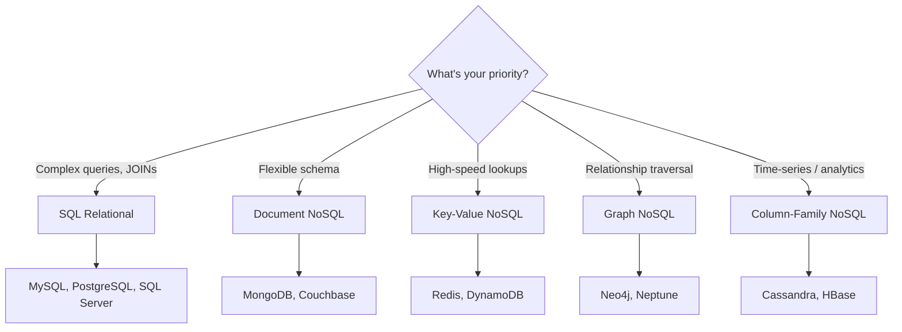
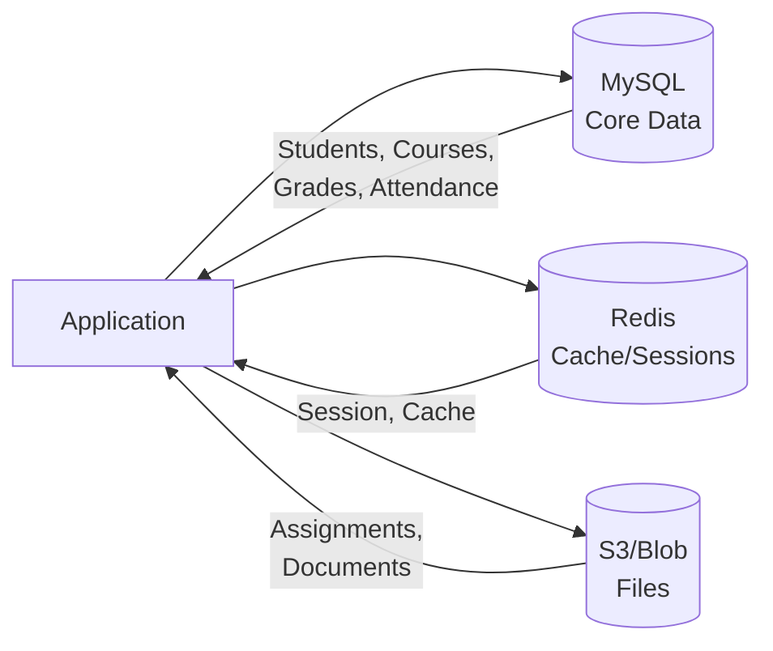

# 6.11 NoSQL Introduction

[← Previous: 6.10 Object-Relational Mapping](./6_10-object-relational-mapping.md) | [Back to Chapter 6](./chapter-06-README.md) | [Next: 6.12 Hands-On Activities →](./6_12-hands-on-activities.md)

---

## 📖 Introduction

While relational databases dominate enterprise applications, **NoSQL** (Not Only SQL) databases offer alternatives for specific use cases. Understanding when to use each is essential for modern software designers.

---

## 🎯 Learning Objectives

- ✅ Understand why NoSQL databases exist
- ✅ Compare the four main NoSQL types
- ✅ Know when to use NoSQL vs. relational databases
- ✅ Recognize trade-offs in database selection

---

## Why NoSQL?

### Limitations of Relational Databases

| Challenge | Relational DB Issue |
|-----------|---------------------|
| **Big Data** | Scaling to billions of rows is expensive |
| **Unstructured Data** | Rigid schema doesn't fit all data |
| **Horizontal Scaling** | Difficult to distribute across servers |
| **Rapid Development** | Schema changes require migrations |
| **High Throughput** | JOINs become bottlenecks |

### The NoSQL Solution

NoSQL databases sacrifice some relational features for:
- **Scalability** - Distribute across many servers
- **Flexibility** - Schema-less or flexible schemas
- **Performance** - Optimized for specific access patterns
- **Availability** - Handle failures gracefully

---

## Types of NoSQL Databases

### 1. Document Databases

**Structure:** JSON-like documents
**Examples:** MongoDB, Couchbase, Firebase

**Student document:**
```json
{
  "_id": "S001",
  "name": "Ahmed Ali",
  "email": "ahmed@school.com",
  "enrollments": [
    {
      "course": "CS101",
      "grade": "A",
      "semester": "Fall 2024"
    },
    {
      "course": "CS102",
      "grade": "B",
      "semester": "Fall 2024"
    }
  ],
  "phones": ["555-1234", "555-5678"]
}
```

**Best For:** Content management, user profiles, catalogs
**Avoids:** Complex JOINs (data embedded in document)

### 2. Key-Value Stores

**Structure:** Simple key → value pairs
**Examples:** Redis, DynamoDB, Memcached

```
Key: "student:S001"
Value: {"name": "Ahmed", "email": "ahmed@school.com"}

Key: "session:abc123"  
Value: {"user_id": "S001", "expires": "2024-12-31"}
```

**Best For:** Caching, sessions, shopping carts
**Avoids:** Complex queries (only lookup by key)

### 3. Column-Family Stores

**Structure:** Columns grouped into families
**Examples:** Cassandra, HBase, ScyllaDB

```
Row Key: "S001"
Column Family: "personal"
  - first_name: "Ahmed"
  - last_name: "Ali"
  - email: "ahmed@school.com"

Column Family: "academic"
  - gpa: 3.8
  - major: "Computer Science"
  - advisor: "Dr. Hassan"
```

**Best For:** Time-series data, analytics, write-heavy workloads
**Avoids:** Transactions across rows

### 4. Graph Databases

**Structure:** Nodes and relationships
**Examples:** Neo4j, Amazon Neptune, ArangoDB

```
(Ahmed:Student)-[:ENROLLED_IN]->(CS101:Course)
(Ahmed:Student)-[:FRIENDS_WITH]->(Sara:Student)
(Dr.Omar:Teacher)-[:TEACHES]->(CS101:Course)
(Ahmed:Student)-[:HAS_PARENT]->(Mr.Ali:Parent)
```

**Best For:** Social networks, recommendations, fraud detection
**Avoids:** Tabular data with simple relationships

---

## Comparison Summary

| Type | Data Model | Query Pattern | Example Use |
|------|-----------|---------------|-------------|
| **Document** | JSON documents | Flexible queries | CMS, profiles |
| **Key-Value** | Key → Value | Lookup by key | Cache, sessions |
| **Column-Family** | Column groups | Scan, aggregate | Analytics, logs |
| **Graph** | Nodes + edges | Traverse relationships | Social, recommendations |

---

## SQL vs. NoSQL Decision Guide



### Choose Relational (SQL) When:

- ✅ Data is structured with clear relationships
- ✅ ACID transactions are required
- ✅ Complex queries with JOINs
- ✅ Data integrity is critical
- ✅ Team knows SQL

### Choose NoSQL When:

- ✅ Schema will change frequently
- ✅ Need horizontal scaling
- ✅ Data is semi-structured or unstructured
- ✅ High write throughput required
- ✅ Specific access pattern (key lookup, graph traversal)

---

## School System: Database Choice

### Why Relational for School System?

| Requirement | Why SQL Works |
|------------|---------------|
| Student-Course-Grade relationships | Well-defined JOINs |
| Data integrity (grades, attendance) | ACID transactions |
| Complex reports (transcripts, GPA) | SQL aggregation |
| Regulatory compliance | Audit trails |
| Stable schema | Grades, courses rarely change structure |

### Potential NoSQL Additions

| Data | NoSQL Choice | Reason |
|------|--------------|--------|
| Session data | Redis | Fast key-value lookup |
| Activity logs | Cassandra | High write volume |
| Student connections | Neo4j | Social features |
| Document storage | MongoDB | Variable document types |

### Hybrid Architecture



---

## Key Takeaways

✅ **NoSQL solves specific problems** - Not a replacement for SQL

✅ **Four main types:**
- Document (flexible JSON)
- Key-Value (simple lookups)
- Column-Family (analytics)
- Graph (relationships)

✅ **Choose based on:**
- Data structure
- Query patterns
- Scale requirements
- Consistency needs

✅ **Most systems use both** - Hybrid architectures are common

---

## Self-Check Questions

1. **When would you choose MongoDB over MySQL?**
   <details>
   <summary>Click to reveal answer</summary>
   When data has varying structure (some records have different fields), schema changes frequently, you need to embed related data, or you're building a content management system.
   </details>

2. **What type of NoSQL is best for social network friend connections?**
   <details>
   <summary>Click to reveal answer</summary>
   Graph database (like Neo4j) - optimized for traversing relationships like "friends of friends" which would require many JOINs in SQL.
   </details>

3. **Why is Redis used for session storage?**
   <details>
   <summary>Click to reveal answer</summary>
   Key-value stores like Redis provide extremely fast lookups by key (session ID), store data in memory, and can expire data automatically.
   </details>

---

**Previous:** [← 6.10 Object-Relational Mapping](./6_10-object-relational-mapping.md)

**Next:** [6.12 Hands-On Activities →](./6_12-hands-on-activities.md)

---

*Estimated Reading Time: 30 minutes*
