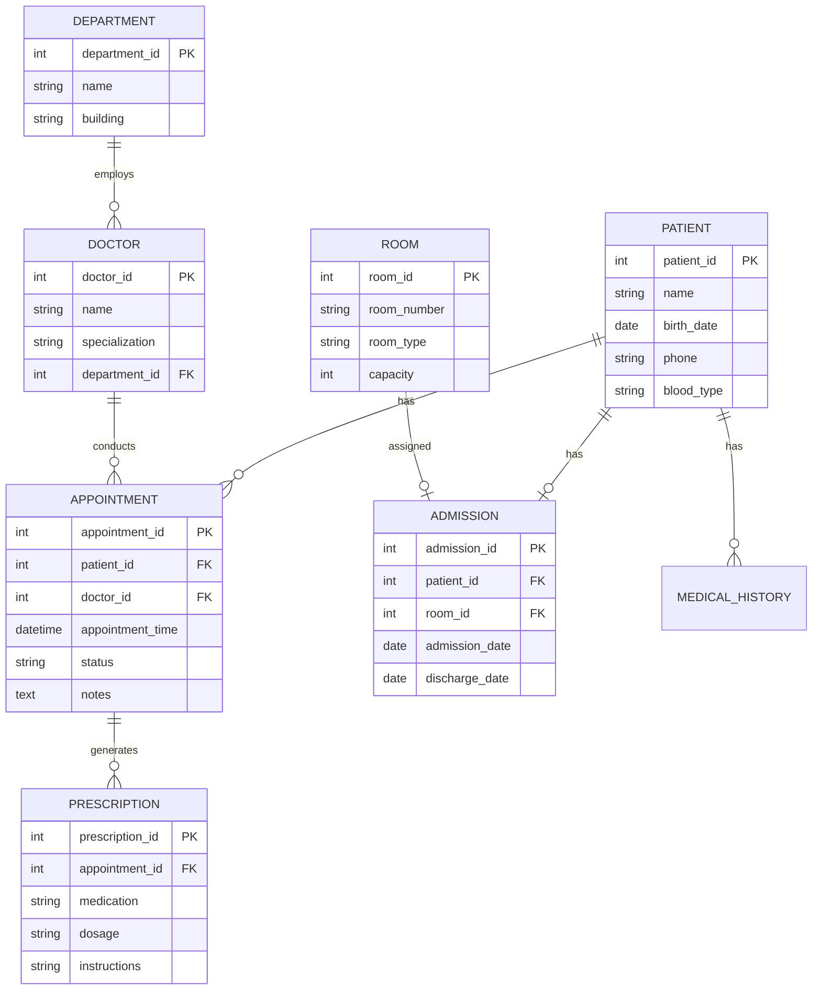
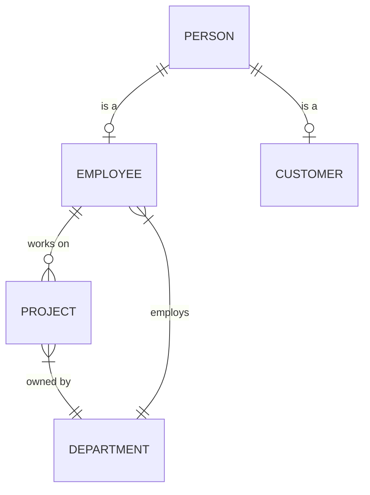

# 6.12 Hands-On Activities

[← Previous: 6.11 NoSQL Introduction](./6_11-nosql-introduction.md) | [Back to Chapter 6](./chapter-06-README.md) | [Next: 6.13 Chapter Summary →](./6_13-chapter-summary.md)

---

## 📖 Introduction

Practice is essential for mastering database design. These seven activities will help you apply the concepts from this chapter to real scenarios.

---

## Activity 1: Entity Identification (15 min)

### Scenario: Online Bookstore

**Requirements:**
- Customers can browse and purchase books
- Books have authors (multiple authors possible)
- Customers can write reviews
- Books belong to categories
- Customers have shipping addresses
- Track order history with items and quantities

### Task

1. List all entities
2. For each entity, list 5 attributes
3. Identify primary keys
4. Mark which attributes could be NULL

<details>
<summary>Click for Solution</summary>

**Entities and Attributes:**

| Entity | Attributes | PK |
|--------|------------|-----|
| CUSTOMER | customer_id, name, email, password, registration_date | customer_id |
| BOOK | book_id, isbn, title, price, stock_quantity | book_id |
| AUTHOR | author_id, name, biography, birth_year, nationality | author_id |
| CATEGORY | category_id, name, description, parent_category_id | category_id |
| ORDER | order_id, customer_id, order_date, total, status | order_id |
| ORDER_ITEM | order_id, book_id, quantity, unit_price | (order_id, book_id) |
| REVIEW | review_id, customer_id, book_id, rating, comment, review_date | review_id |
| ADDRESS | address_id, customer_id, street, city, country, is_default | address_id |
| BOOK_AUTHOR | book_id, author_id | (book_id, author_id) |

**Nullable Attributes:**
- AUTHOR.biography, birth_year
- CATEGORY.parent_category_id
- REVIEW.comment
</details>

---

## Activity 2: ER Diagram Creation (30 min)

### Scenario: Hospital Management

**Requirements:**
- Patients have appointments with doctors
- Doctors belong to departments
- Patients can be admitted to rooms
- Prescriptions are given during appointments
- Track medical history

### Task

Draw a complete ER diagram with:
- Entities with attributes
- Relationships with cardinality
- Primary and foreign keys

<details>
<summary>Click for Solution</summary>


</details>

---

## Activity 3: Normalization Exercise (25 min)

### Scenario: Normalize This Table

**STUDENT_COURSE_DATA (Unnormalized):**

| sid | sname | phone | cid | cname | instructor | dept | grade |
|-----|-------|-------|-----|-------|------------|------|-------|
| 1 | Ali | 555-1234, 555-5678 | C1 | Math | Dr. Hassan | Science | A |
| 1 | Ali | 555-1234, 555-5678 | C2 | Physics | Dr. Omar | Science | B |
| 2 | Sara | 555-9999 | C1 | Math | Dr. Hassan | Science | A |
| 2 | Sara | 555-9999 | C3 | English | Dr. Fatima | Arts | B+ |

### Task

1. Convert to 1NF
2. Convert to 2NF
3. Convert to 3NF
4. Show all tables with their columns

<details>
<summary>Click for Solution</summary>

**Step 1 - 1NF:** Remove multivalued phone

**STUDENT:** (sid, sname)
**STUDENT_PHONE:** (sid, phone)
**ENROLLMENT:** (sid, cid, cname, instructor, dept, grade)

**Step 2 - 2NF:** Remove partial dependencies (PK: sid, cid)

- cname, instructor, dept depend only on cid → move to COURSE

**STUDENT:** (sid, sname)
**STUDENT_PHONE:** (sid, phone)
**COURSE:** (cid, cname, instructor, dept)
**ENROLLMENT:** (sid, cid, grade)

**Step 3 - 3NF:** Remove transitive dependencies

- instructor → dept (transitive through instructor)
- Move instructor-dept relationship

**Final 3NF Tables:**

```sql
STUDENT (sid PK, sname)
STUDENT_PHONE (sid FK, phone) -- PK: sid, phone
INSTRUCTOR (instructor_id PK, instructor_name, dept_id FK)
DEPARTMENT (dept_id PK, dept_name)
COURSE (cid PK, cname, instructor_id FK)
ENROLLMENT (sid FK, cid FK, grade) -- PK: sid, cid
```
</details>

---

## Activity 4: Keys and Constraints (20 min)

### Task

Write SQL CREATE TABLE statements for a Library System with:

1. **MEMBER** - member_id, name, email (unique), membership_type, join_date
2. **BOOK** - book_id, isbn (unique), title, copies_available (must be >= 0)
3. **LOAN** - loan_id, member_id, book_id, loan_date, due_date, return_date

Include:
- Primary keys
- Foreign keys with appropriate ON DELETE actions
- CHECK constraints
- DEFAULT values
- NOT NULL where appropriate

<details>
<summary>Click for Solution</summary>

```sql
CREATE TABLE member (
    member_id INT PRIMARY KEY AUTO_INCREMENT,
    name VARCHAR(100) NOT NULL,
    email VARCHAR(100) UNIQUE NOT NULL,
    membership_type VARCHAR(20) DEFAULT 'standard'
        CHECK (membership_type IN ('standard', 'premium', 'student')),
    join_date DATE DEFAULT (CURRENT_DATE),
    max_books INT DEFAULT 5
);

CREATE TABLE book (
    book_id INT PRIMARY KEY AUTO_INCREMENT,
    isbn VARCHAR(20) UNIQUE NOT NULL,
    title VARCHAR(200) NOT NULL,
    author VARCHAR(100),
    copies_available INT DEFAULT 1 CHECK (copies_available >= 0),
    total_copies INT DEFAULT 1 CHECK (total_copies >= 1)
);

CREATE TABLE loan (
    loan_id INT PRIMARY KEY AUTO_INCREMENT,
    member_id INT NOT NULL,
    book_id INT NOT NULL,
    loan_date DATE DEFAULT (CURRENT_DATE),
    due_date DATE NOT NULL,
    return_date DATE,
    status VARCHAR(20) DEFAULT 'active'
        CHECK (status IN ('active', 'returned', 'overdue')),
    
    FOREIGN KEY (member_id) REFERENCES member(member_id)
        ON DELETE RESTRICT,  -- Can't delete member with active loans
    FOREIGN KEY (book_id) REFERENCES book(book_id)
        ON DELETE RESTRICT,  -- Can't delete book with loan history
    
    CHECK (due_date >= loan_date),
    CHECK (return_date IS NULL OR return_date >= loan_date)
);

-- Index for common queries
CREATE INDEX idx_loan_member ON loan(member_id);
CREATE INDEX idx_loan_status ON loan(status);
```
</details>

---

## Activity 5: ER to Relational Mapping (20 min)

### Given ER Diagram



### Task

Map this ER diagram to relational tables. Show:
1. All tables with columns
2. All primary keys
3. All foreign keys
4. Your choice of inheritance strategy (explain why)

<details>
<summary>Click for Solution</summary>

**Inheritance Strategy: Table Per Type (TPT)**
- Chosen because Employee and Customer have distinct attributes
- Allows querying all persons when needed

```sql
-- Supertype
CREATE TABLE person (
    person_id INT PRIMARY KEY AUTO_INCREMENT,
    first_name VARCHAR(50) NOT NULL,
    last_name VARCHAR(50) NOT NULL,
    email VARCHAR(100) UNIQUE,
    phone VARCHAR(20)
);

-- Subtype: Employee
CREATE TABLE employee (
    person_id INT PRIMARY KEY,
    employee_number VARCHAR(20) UNIQUE NOT NULL,
    hire_date DATE NOT NULL,
    department_id INT NOT NULL,
    salary DECIMAL(10,2),
    FOREIGN KEY (person_id) REFERENCES person(person_id),
    FOREIGN KEY (department_id) REFERENCES department(department_id)
);

-- Subtype: Customer
CREATE TABLE customer (
    person_id INT PRIMARY KEY,
    customer_number VARCHAR(20) UNIQUE NOT NULL,
    registration_date DATE DEFAULT (CURRENT_DATE),
    credit_limit DECIMAL(10,2),
    FOREIGN KEY (person_id) REFERENCES person(person_id)
);

-- Department
CREATE TABLE department (
    department_id INT PRIMARY KEY AUTO_INCREMENT,
    name VARCHAR(100) NOT NULL,
    budget DECIMAL(12,2)
);

-- Project
CREATE TABLE project (
    project_id INT PRIMARY KEY AUTO_INCREMENT,
    name VARCHAR(100) NOT NULL,
    department_id INT NOT NULL,
    start_date DATE,
    end_date DATE,
    FOREIGN KEY (department_id) REFERENCES department(department_id)
);

-- M:N: Employee works on Project
CREATE TABLE employee_project (
    employee_id INT NOT NULL,
    project_id INT NOT NULL,
    role VARCHAR(50),
    hours_per_week INT,
    PRIMARY KEY (employee_id, project_id),
    FOREIGN KEY (employee_id) REFERENCES employee(person_id),
    FOREIGN KEY (project_id) REFERENCES project(project_id)
);
```
</details>

---

## Activity 6: Design Review (15 min)

### Scenario

Review this database design and identify problems:

```sql
CREATE TABLE student (
    id INT PRIMARY KEY,
    name VARCHAR(100),
    courses VARCHAR(500),  -- "CS101, CS102, MA201"
    advisor_name VARCHAR(100),
    advisor_email VARCHAR(100),
    advisor_phone VARCHAR(20)
);
```

### Task

1. List at least 5 design problems
2. Propose a corrected design

<details>
<summary>Click for Solution</summary>

**Problems:**

1. **1NF Violation:** `courses` is a comma-separated list (not atomic)
2. **Redundancy:** Advisor info repeated for each student
3. **Update Anomaly:** Changing advisor email requires many updates
4. **No Foreign Key:** Advisor not properly linked
5. **Missing Constraints:** No NOT NULL, no UNIQUE
6. **No Separate Advisor Entity:** Advisor should be its own table
7. **Missing Attributes:** student_number, enrollment_date, etc.

**Corrected Design:**

```sql
CREATE TABLE advisor (
    advisor_id INT PRIMARY KEY AUTO_INCREMENT,
    name VARCHAR(100) NOT NULL,
    email VARCHAR(100) UNIQUE NOT NULL,
    phone VARCHAR(20)
);

CREATE TABLE student (
    student_id INT PRIMARY KEY AUTO_INCREMENT,
    student_number VARCHAR(20) UNIQUE NOT NULL,
    name VARCHAR(100) NOT NULL,
    email VARCHAR(100) UNIQUE,
    advisor_id INT,
    FOREIGN KEY (advisor_id) REFERENCES advisor(advisor_id)
);

CREATE TABLE course (
    course_id INT PRIMARY KEY AUTO_INCREMENT,
    course_code VARCHAR(10) UNIQUE NOT NULL,
    name VARCHAR(100) NOT NULL
);

CREATE TABLE enrollment (
    student_id INT NOT NULL,
    course_id INT NOT NULL,
    enrollment_date DATE DEFAULT (CURRENT_DATE),
    PRIMARY KEY (student_id, course_id),
    FOREIGN KEY (student_id) REFERENCES student(student_id),
    FOREIGN KEY (course_id) REFERENCES course(course_id)
);
```
</details>

---

## Activity 7: Complete Database Design (45 min)

### Scenario: Event Management System

**Requirements:**
- Organizers create events (conferences, workshops, seminars)
- Events have sessions with speakers
- Attendees register for events
- Track attendance at sessions
- Speakers have bios and topics
- Venues have rooms with capacity
- Events can span multiple days

### Deliverables

1. Entity list with attributes
2. ER diagram
3. Relational schema (CREATE TABLE statements)
4. Sample INSERT statements (3 per table)

<details>
<summary>Click for Solution Outline</summary>

**Entities:**
- ORGANIZER (organizer_id, name, email, phone)
- EVENT (event_id, name, description, start_date, end_date, organizer_id, venue_id)
- VENUE (venue_id, name, address, city)
- ROOM (room_id, venue_id, name, capacity)
- SESSION (session_id, event_id, room_id, title, start_time, end_time, speaker_id)
- SPEAKER (speaker_id, name, email, bio, topics)
- ATTENDEE (attendee_id, name, email, phone, organization)
- REGISTRATION (registration_id, attendee_id, event_id, registration_date, amount_paid)
- SESSION_ATTENDANCE (attendee_id, session_id, check_in_time)

**Key Relationships:**
- EVENT belongs to ORGANIZER (N:1)
- EVENT held at VENUE (N:1)
- SESSION part of EVENT (N:1)
- SESSION in ROOM (N:1)
- SESSION has SPEAKER (N:1 or M:N for multiple speakers)
- ATTENDEE registers for EVENT (M:N via REGISTRATION)
- ATTENDEE attends SESSION (M:N via SESSION_ATTENDANCE)

The full solution would include complete CREATE TABLE statements with all constraints and sample data.
</details>

---

## Submission Checklist

Before submitting your activities:

- [ ] All entities identified with appropriate attributes
- [ ] Primary keys selected (preferably surrogate)
- [ ] Foreign keys properly defined
- [ ] Cardinality and participation documented
- [ ] Tables normalized to at least 3NF
- [ ] Appropriate constraints (NOT NULL, CHECK, UNIQUE)
- [ ] Referential actions considered
- [ ] Diagrams are clear and professional

---

**Previous:** [← 6.11 NoSQL Introduction](./6_11-nosql-introduction.md)

**Next:** [6.13 Chapter Summary →](./6_13-chapter-summary.md)

---

*Estimated Time: 90 minutes total*
