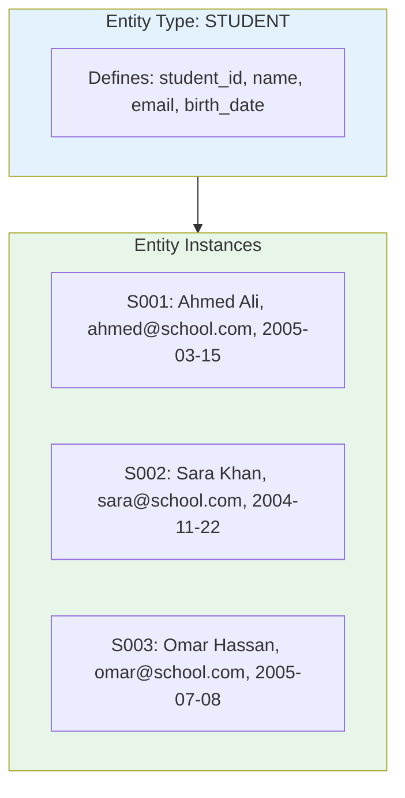
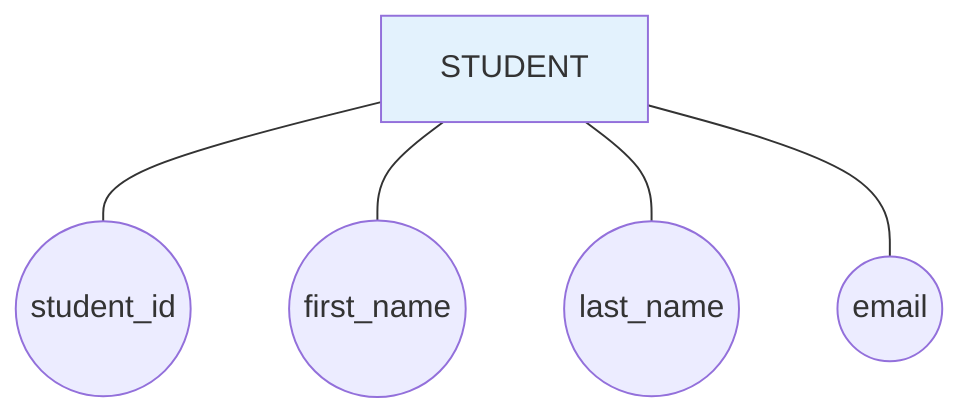
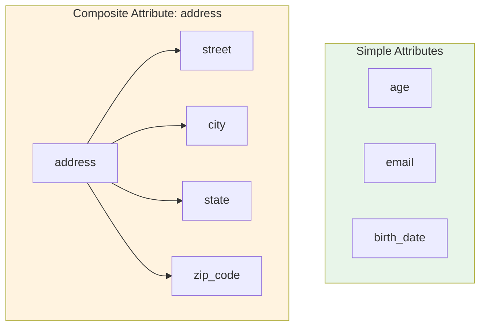
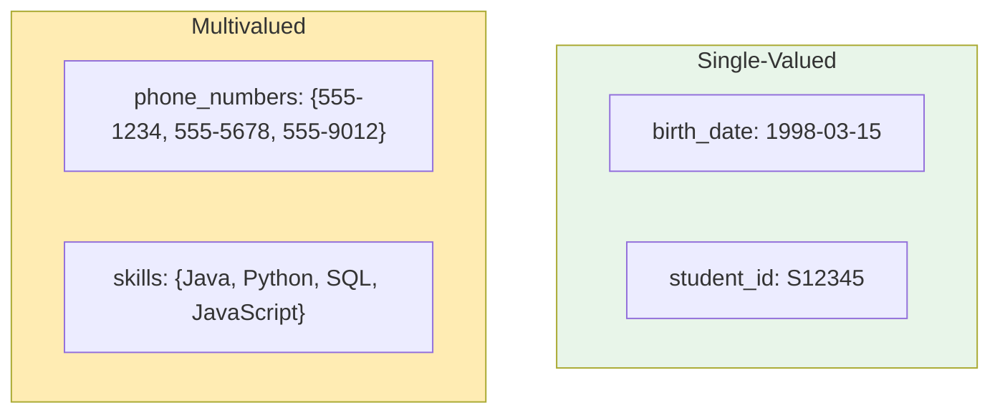
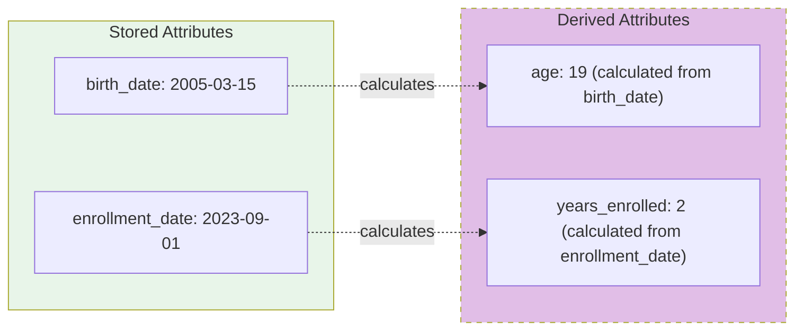
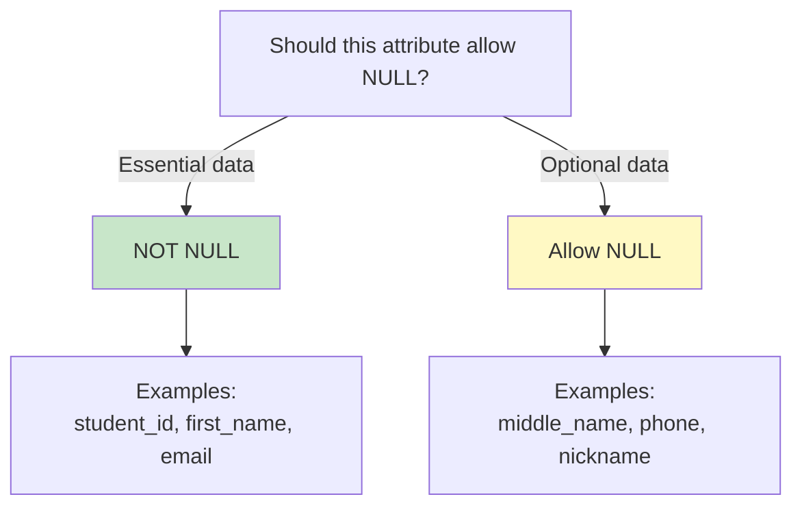
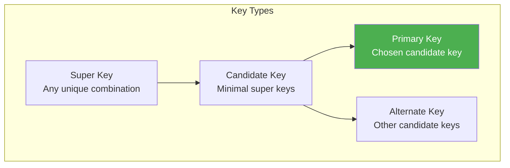
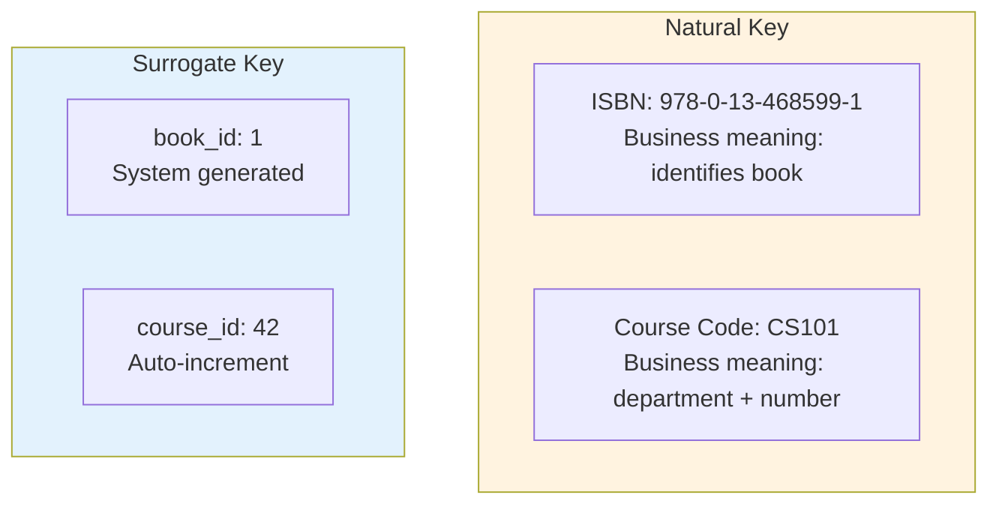
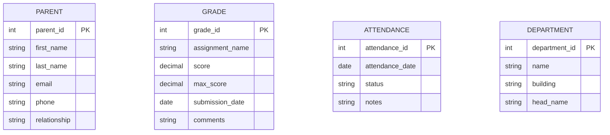

# 6.2 Entity-Relationship Basics

[← Previous: 6.1 Data Modeling Fundamentals](./6_1-data-modeling-fundamentals.md) | [Back to Chapter 6](./chapter-06-README.md) | [Next: 6.3 Relationships and Cardinality →](./6_3-relationships-cardinality.md)

---

## 📖 Introduction

The **Entity-Relationship (ER) Model** is the most widely used approach for conceptual and logical database design. Introduced by Peter Chen in 1976, it provides a graphical notation that's easy to understand for both technical and non-technical stakeholders.

In this section, you'll learn the fundamental building blocks of ER modeling: **entities** (the things we track) and **attributes** (the properties of those things).

---

## 🎯 Learning Objectives

After completing this section, you will be able to:

- ✅ Define and identify entities from requirements
- ✅ Distinguish between entity types and entity instances
- ✅ Classify attributes (simple, composite, derived, multivalued)
- ✅ Understand attribute domains and null values
- ✅ Draw entities with attributes using ER notation
- ✅ Identify candidate keys and select primary keys

---

## What Is an Entity?

### Definition

An **entity** is a thing or object in the real world with an independent existence. It can be:
- **Physical:** A person, place, or thing (Student, Building, Book)
- **Conceptual:** An event, concept, or abstraction (Course, Appointment, Account)

### Entity Type vs. Entity Instance

**Entity Type (Class):** The general category or template
**Entity Instance (Object):** A specific occurrence of that type



### Identifying Entities from Requirements

**Technique: Noun Extraction**

Read through requirements and highlight nouns:

**Example Requirement:**
"The **school** needs to track **students** enrolled in **courses**. Each **teacher** is assigned to teach multiple **classes**. **Parents** can view their **children**'s **grades** and **attendance** records."

**Candidate Entities:**
| Noun | Entity? | Reason |
|------|---------|--------|
| School | Maybe | Only one school? Context entity |
| Students | ✅ Yes | Multiple instances, need to track |
| Courses | ✅ Yes | Multiple instances, need to track |
| Teacher | ✅ Yes | Multiple instances, need to track |
| Classes | ✅ Yes | Course offerings, need to track |
| Parents | ✅ Yes | Multiple instances, need to track |
| Children | ❌ No | Same as Students |
| Grades | ✅ Yes | Need to track multiple grades |
| Attendance | ✅ Yes | Need to track daily records |

### Entity Identification Heuristics

Ask these questions to determine if something is an entity:

| Question | If Yes → Entity |
|----------|-----------------|
| Does the organization need to store information about it? | ✅ |
| Are there multiple instances? | ✅ |
| Does it have descriptive properties (attributes)? | ✅ |
| Does it exist independently? | ✅ |
| Does it have a unique identifier? | ✅ |
| Is it important to the business? | ✅ |

### Common Entity Categories

| Category | Examples |
|----------|----------|
| **People** | Student, Teacher, Customer, Employee |
| **Places** | Building, Room, Branch, Location |
| **Things** | Book, Product, Equipment, Vehicle |
| **Events** | Enrollment, Order, Appointment, Payment |
| **Concepts** | Course, Account, Department, Project |

---

## What Is an Attribute?

### Definition

An **attribute** is a property or characteristic that describes an entity.

**Entity:** STUDENT
**Attributes:** student_id, first_name, last_name, birth_date, email, phone, address

### Attribute Representation in ER Diagrams

**Chen Notation:**


**Crow's Foot Notation (More Common):**
```
┌──────────────────────────┐
│         STUDENT          │
├──────────────────────────┤
│ PK student_id            │
│    first_name            │
│    last_name             │
│    birth_date            │
│    email                 │
│    phone                 │
└──────────────────────────┘
```

---

## Types of Attributes

### 1. Simple vs. Composite Attributes

**Simple (Atomic) Attribute:** Cannot be divided further
- Examples: age, student_id, email, birth_date

**Composite Attribute:** Can be divided into smaller sub-parts
- Examples: full_name (first_name + last_name), address (street, city, state, zip)



**Design Decision: When to use Composite?**

| Use Composite When | Use Simple When |
|-------------------|-----------------|
| Need to query sub-parts separately | Always use whole value |
| Different parts have different rules | Value is atomic by nature |
| Parts may be optional | Splitting adds no value |
| Example: Address components | Example: Email address |

### 2. Single-Valued vs. Multivalued Attributes

**Single-Valued:** Has exactly one value per entity instance
- Examples: birth_date (one birthday), student_id (one ID)

**Multivalued:** Can have multiple values per entity instance
- Examples: phone_numbers (home, mobile, work), degrees (BS, MS, PhD)



**⚠️ Important:** In relational databases, multivalued attributes usually become separate tables!

```sql
-- Instead of storing multiple phones in one column:
-- ❌ phone_numbers: "555-1234, 555-5678"

-- Create a separate table:
-- ✅ 
CREATE TABLE student_phone (
    student_id INT,
    phone_type VARCHAR(20),  -- 'home', 'mobile', 'work'
    phone_number VARCHAR(20),
    PRIMARY KEY (student_id, phone_type),
    FOREIGN KEY (student_id) REFERENCES student(student_id)
);
```

### 3. Stored vs. Derived Attributes

**Stored Attribute:** Value is stored directly in the database
- Examples: birth_date, enrollment_date, price

**Derived Attribute:** Value is calculated from other attributes
- Examples: age (from birth_date), total_price (from quantity × price)



**Design Decision: Store or Derive?**

| Store When | Derive When |
|------------|-------------|
| Value is expensive to calculate | Calculation is simple |
| Value changes infrequently | Value changes frequently |
| Historical accuracy needed | Always need current value |
| Example: year_end_gpa | Example: current_age |

### 4. Key Attributes

**Key Attribute:** Uniquely identifies each entity instance

**Example:**
- STUDENT: **student_id** (unique for each student)
- COURSE: **course_code** (like "CS101")
- TEACHER: **employee_id** (unique for each teacher)

---

## Attribute Domains

### What Is a Domain?

A **domain** is the set of all possible values an attribute can take.

| Attribute | Domain |
|-----------|--------|
| student_id | Positive integers (1-999999) |
| first_name | Alphabetic characters (1-50 chars) |
| email | Valid email format |
| birth_date | Dates (1990-01-01 to 2020-12-31) |
| gender | {'M', 'F', 'Other'} |
| gpa | Decimal (0.00 to 4.00) |
| status | {'active', 'graduated', 'withdrawn', 'suspended'} |

### Domain Constraints

Domains help enforce **data integrity**:

```sql
-- Domain constraints in SQL
CREATE TABLE student (
    student_id INT CHECK (student_id > 0),
    first_name VARCHAR(50) NOT NULL,
    email VARCHAR(100) CHECK (email LIKE '%@%.%'),
    birth_date DATE CHECK (birth_date > '1990-01-01'),
    gender CHAR(1) CHECK (gender IN ('M', 'F', 'O')),
    gpa DECIMAL(3,2) CHECK (gpa BETWEEN 0.00 AND 4.00),
    status VARCHAR(20) DEFAULT 'active' 
        CHECK (status IN ('active', 'graduated', 'withdrawn', 'suspended'))
);
```

---

## Null Values

### What Is NULL?

**NULL** represents an unknown or missing value. It is NOT the same as:
- Zero (0)
- Empty string ("")
- False
- Space (" ")

### Types of NULL

| Type | Meaning | Example |
|------|---------|---------|
| **Unknown** | Value exists but is unknown | middle_name (person has one, we don't know it) |
| **Not Applicable** | Value doesn't apply | spouse_name (for unmarried person) |
| **Not Available** | Value exists but not yet captured | final_grade (semester not finished) |

### NULL Design Considerations



**Best Practice:** Default to NOT NULL unless you have a specific reason to allow NULL values.

---

## Keys

### Types of Keys



### Definitions

| Key Type | Definition | Example (STUDENT) |
|----------|------------|-------------------|
| **Super Key** | Any set of attributes that uniquely identifies | {student_id}, {email}, {student_id, name}, {student_id, email, name} |
| **Candidate Key** | Minimal super key (no redundant attributes) | {student_id}, {email} |
| **Primary Key** | The chosen candidate key | student_id |
| **Alternate Key** | Candidate keys not chosen as primary | email |

### Choosing a Primary Key

**Good Primary Key Characteristics:**

| Characteristic | Explanation |
|---------------|-------------|
| **Unique** | No duplicates allowed |
| **Not NULL** | Must always have a value |
| **Immutable** | Shouldn't change over time |
| **Simple** | Single attribute if possible |
| **System-generated** | Auto-increment is reliable |

**Primary Key Comparison:**

| Option | Pros | Cons | Verdict |
|--------|------|------|---------|
| student_id (auto-increment) | Always unique, immutable | No business meaning | ✅ Best choice |
| email | Unique, meaningful | Can change | ❌ Don't use |
| SSN/National ID | Unique | Privacy concerns, might change | ❌ Don't use |
| name + birth_date | Meaningful | Can have duplicates | ❌ Don't use |

### Natural vs. Surrogate Keys

**Natural Key:** Has business meaning
- Example: ISBN for books, employee_number assigned by HR

**Surrogate Key:** System-generated, no business meaning
- Example: auto-increment ID



**When to Use Which?**

| Use Natural Key | Use Surrogate Key |
|-----------------|-------------------|
| Stable, won't change | Value might change |
| Well-established standard (ISBN) | No standard identifier |
| Small, simple value | Complex composite key |
| Meaningful queries | Foreign key references |

---

## ER Notation Comparison

### Chen Notation

Original notation by Peter Chen (1976):

```
     ┌─────────┐
     │ STUDENT │
     └────┬────┘
          │
    ┌─────┼─────┐
    │     │     │
   (id)  (name) (email)
    ◎     ○      ○
    
◎ = Primary key (underlined)
○ = Regular attribute
```

### Crow's Foot Notation (Most Common)

```
┌────────────────────────┐
│        STUDENT         │
├────────────────────────┤
│ PK student_id: INT     │
│    first_name: VARCHAR │
│    last_name: VARCHAR  │
│    email: VARCHAR      │
│    birth_date: DATE    │
└────────────────────────┘
```

### Barker Notation (Oracle)

```
╔════════════════════════╗
║        STUDENT         ║
╠════════════════════════╣
║ # student_id           ║
║ * first_name           ║
║ * last_name            ║
║ o middle_name          ║
║ * email                ║
╚════════════════════════╝

# = Primary key
* = Mandatory (NOT NULL)
o = Optional (NULL allowed)
```

### IDEF1X Notation

```
┌─────────────────────────┐
│         STUDENT         │
├─────────────────────────┤
│ student_id (PK)         │
├─────────────────────────┤
│ first_name              │
│ last_name               │
│ email                   │
│ birth_date              │
└─────────────────────────┘
```

**In this course, we primarily use Crow's Foot notation as it's the most widely used in industry.**

---

## School System Entities

Let's identify the entities for our School Management System:

### Core Entities

```mermaid
erDiagram
    STUDENT {
        int student_id PK
        string first_name
        string last_name
        date birth_date
        string email
        string phone
        string address
        date enrollment_date
        string status
    }
    
    TEACHER {
        int teacher_id PK
        string first_name
        string last_name
        string email
        string phone
        date hire_date
        string department
        decimal salary
    }
    
    COURSE {
        int course_id PK
        string course_code
        string name
        string description
        int credits
        string department
    }
    
    CLASS {
        int class_id PK
        string section
        string semester
        int year
        string room
        string schedule
    }
```

### Supporting Entities



### Entity Documentation Table

| Entity | Description | Estimated Rows | Key |
|--------|-------------|----------------|-----|
| STUDENT | Enrolled students | 500-2000 | student_id |
| TEACHER | Teaching staff | 50-200 | teacher_id |
| COURSE | Course catalog | 100-500 | course_id |
| CLASS | Course offerings | 200-1000 | class_id |
| PARENT | Student guardians | 500-3000 | parent_id |
| GRADE | Assessment records | 10000+ | grade_id |
| ATTENDANCE | Daily attendance | 50000+ | attendance_id |
| DEPARTMENT | Academic depts | 10-30 | department_id |

---

## Key Takeaways

✅ **Entities are things we track**
- Physical or conceptual objects
- Must have multiple instances
- Must have properties (attributes)

✅ **Attributes describe entities**
- Simple vs. Composite
- Single-valued vs. Multivalued
- Stored vs. Derived
- Key attributes uniquely identify

✅ **Domains define valid values**
- Enforce data integrity
- Document business rules

✅ **NULL means unknown/missing**
- Different from zero or empty
- Use sparingly, prefer NOT NULL

✅ **Primary keys are essential**
- Choose surrogate keys for most entities
- Keep keys simple and immutable

---

## Self-Check Questions

1. **What's the difference between an entity type and an entity instance?**
   <details>
   <summary>Click to reveal answer</summary>
   Entity type is the template/category (like "Student"), while entity instance is a specific occurrence (like "Ahmed Ali, student ID S001").
   </details>

2. **Give an example of a composite attribute and its components.**
   <details>
   <summary>Click to reveal answer</summary>
   Address is a composite attribute with components: street_address, city, state, zip_code, country.
   </details>

3. **Why do we avoid using email as a primary key?**
   <details>
   <summary>Click to reveal answer</summary>
   Emails can change (people switch providers, get married, etc.). Primary keys should be immutable to maintain referential integrity.
   </details>

4. **When would you store a derived attribute instead of calculating it?**
   <details>
   <summary>Click to reveal answer</summary>
   Store when: calculation is expensive, value rarely changes, or you need historical accuracy (like GPA at graduation). Derive when: calculation is simple and you always need current value (like age).
   </details>

5. **How do you handle multivalued attributes in a relational database?**
   <details>
   <summary>Click to reveal answer</summary>
   Create a separate table with a foreign key relationship. For example, a student_phone table linked to student by student_id.
   </details>

---

## Practice Exercise

**Scenario:** Design entities for a Library System

**Task 1:** Identify 5 entities and list 5 attributes for each.

<details>
<summary>Click for answer</summary>

1. **BOOK**
   - book_id (PK, surrogate)
   - isbn (alternate key)
   - title
   - publication_year
   - total_copies

2. **MEMBER**
   - member_id (PK)
   - first_name
   - last_name
   - email
   - membership_date

3. **AUTHOR**
   - author_id (PK)
   - name
   - birth_year
   - nationality
   - biography

4. **LOAN**
   - loan_id (PK)
   - borrow_date
   - due_date
   - return_date
   - status

5. **CATEGORY**
   - category_id (PK)
   - name
   - description
   - parent_category_id
   - display_order
</details>

**Task 2:** Identify one multivalued attribute and show how to handle it.

<details>
<summary>Click for answer</summary>

**Multivalued:** A book can have multiple authors

**Solution:** Create an intermediary table

```sql
CREATE TABLE book_author (
    book_id INT,
    author_id INT,
    author_order INT,  -- First author, second author, etc.
    PRIMARY KEY (book_id, author_id),
    FOREIGN KEY (book_id) REFERENCES book(book_id),
    FOREIGN KEY (author_id) REFERENCES author(author_id)
);
```
</details>

**Task 3:** Identify one derived attribute.

<details>
<summary>Click for answer</summary>

**Derived:** `overdue_days` - calculated from `due_date` and current date

```sql
-- Instead of storing, calculate:
SELECT 
    loan_id,
    DATEDIFF(CURRENT_DATE, due_date) AS overdue_days
FROM loan
WHERE return_date IS NULL 
  AND due_date < CURRENT_DATE;
```
</details>

---

## What's Next?

Now that you understand entities and attributes, we'll explore the connections between entities:

**Section 6.3: Relationships and Cardinality**
- How entities relate to each other
- One-to-one, one-to-many, many-to-many
- Cardinality and participation constraints
- Drawing relationships in ER diagrams

---

**Previous:** [← 6.1 Data Modeling Fundamentals](./6_1-data-modeling-fundamentals.md)

**Next:** [6.3 Relationships and Cardinality →](./6_3-relationships-cardinality.md)

---

*Last Updated: December 2024*  
*Estimated Reading Time: 35 minutes*
