# 6.3 Relationships and Cardinality

[← Previous: 6.2 ER Basics](./6_2-er-basics.md) | [Back to Chapter 6](./chapter-06-README.md) | [Next: 6.4 Advanced ER Concepts →](./6_4-advanced-er-concepts.md)

---

## 📖 Introduction

Entities don't exist in isolation - they're connected through **relationships**. A student **enrolls in** courses. A teacher **teaches** classes. A parent **has** children. Understanding and properly modeling these relationships is crucial for database design.

In this section, you'll learn how to identify, classify, and document relationships between entities, including the critical concepts of **cardinality** and **participation**.

---

## 🎯 Learning Objectives

After completing this section, you will be able to:

- ✅ Define relationships between entities
- ✅ Identify relationship types (one-to-one, one-to-many, many-to-many)
- ✅ Apply cardinality constraints correctly
- ✅ Understand participation (total vs. partial)
- ✅ Use Crow's Foot notation for relationships
- ✅ Identify relationships from requirements

---

## What Is a Relationship?

### Definition

A **relationship** is an association or connection between two or more entities that is meaningful to the business.

**Examples:**
- Student **enrolls in** Course
- Teacher **teaches** Class
- Employee **works for** Department
- Order **contains** Products

### Relationship Representation

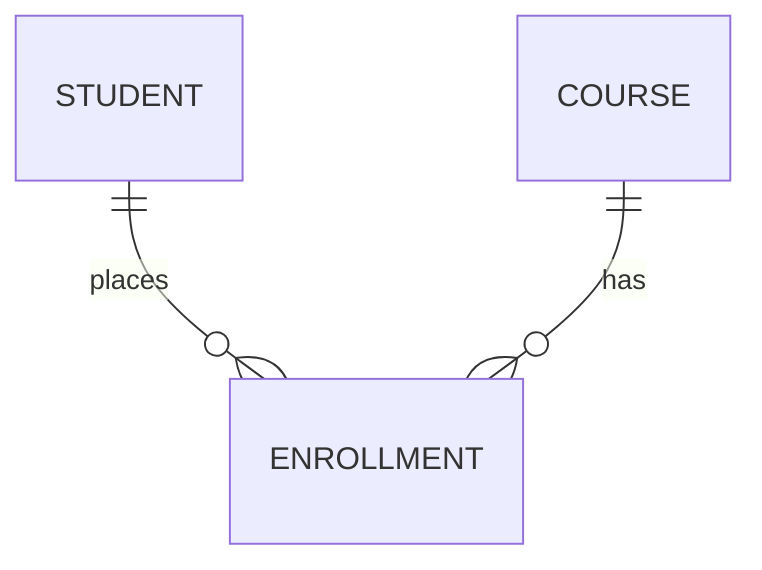

The diamond or line connecting entities represents the relationship.

### Relationship Components

Every relationship has:

| Component | Description | Example |
|-----------|-------------|---------|
| **Name** | Verb describing the association | "enrolls in", "teaches", "contains" |
| **Degree** | Number of entities involved | Binary (2), Ternary (3), Unary (1) |
| **Cardinality** | How many instances can participate | 1:1, 1:N, M:N |
| **Participation** | Must entities participate? | Total or Partial |

---

## Relationship Degree

### Binary Relationships (Most Common)

**Definition:** Involves exactly two entity types

```mermaid
erDiagram
    STUDENT ||--o{ ENROLLMENT : places
    TEACHER ||--o{ CLASS : teaches
    EMPLOYEE }|--|| DEPARTMENT : works_in
```

**Examples:**
- Student - Enrollment
- Teacher - Class  
- Employee - Department

### Unary Relationships (Recursive)

**Definition:** An entity is related to itself

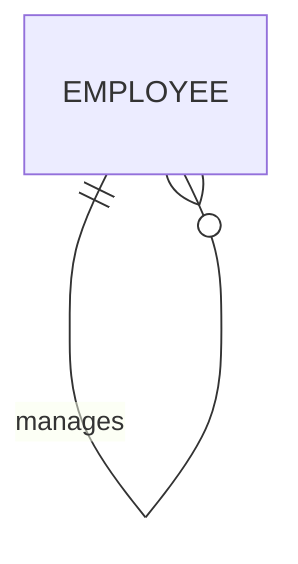

**Examples:**
- Employee **manages** Employee (supervisor relationship)
- Person **is married to** Person
- Category **is subcategory of** Category

### Ternary Relationships

**Definition:** Involves three entity types

**Example:** Supplier supplies Part to Project

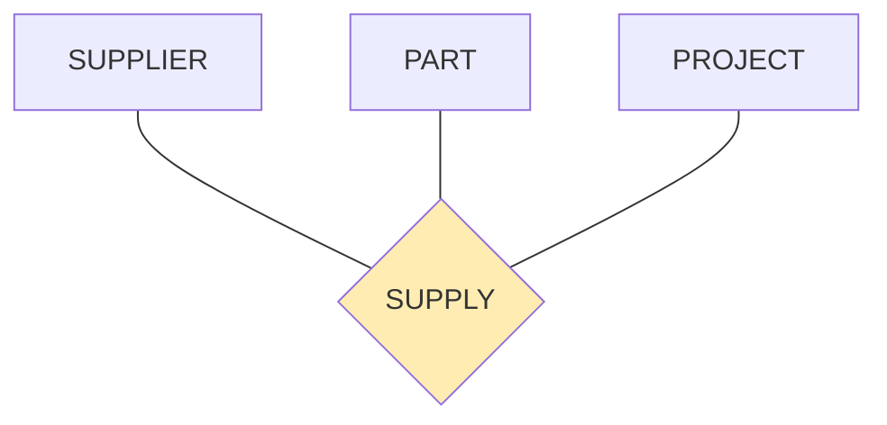

**Note:** Ternary relationships are often decomposed into multiple binary relationships for simplicity.

---

## Cardinality Constraints

### What Is Cardinality?

**Cardinality** specifies the maximum number of relationship instances an entity can participate in.

Think of it as answering: "How many?"

### The Three Cardinality Types

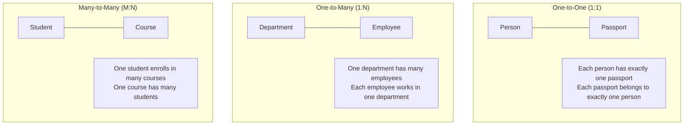

### 1. One-to-One (1:1)

**Definition:** Each instance of Entity A is associated with at most one instance of Entity B, and vice versa.

**Examples:**
- Person — Passport (one person, one passport)
- Employee — Parking Spot (one employee, one spot)
- Country — Capital City (one country, one capital)

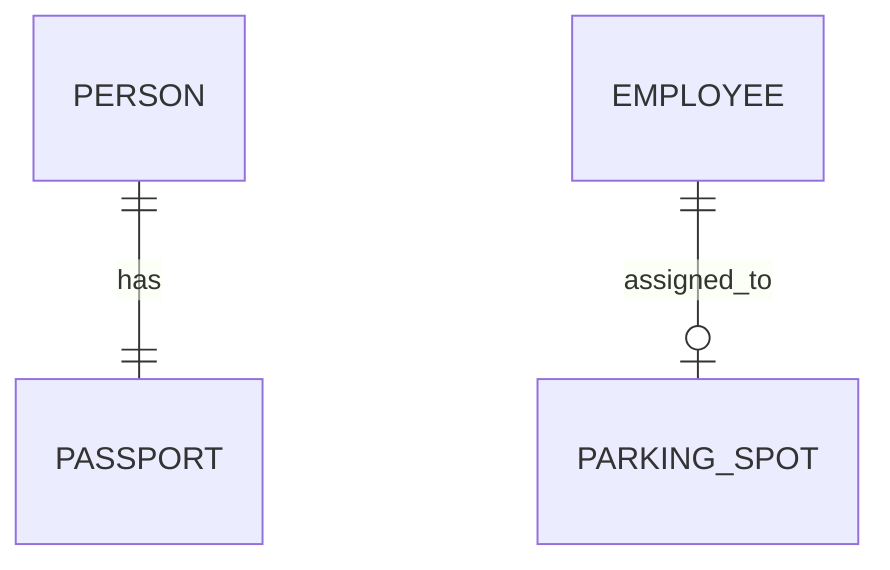

**Implementation:** Usually merge into one table or add foreign key to either side.

```sql
-- Option 1: Merge (if always together)
CREATE TABLE person (
    person_id INT PRIMARY KEY,
    name VARCHAR(100),
    passport_number VARCHAR(20) UNIQUE,
    passport_issue_date DATE
);

-- Option 2: Separate table with FK
CREATE TABLE parking_spot (
    spot_id INT PRIMARY KEY,
    location VARCHAR(50),
    employee_id INT UNIQUE,  -- UNIQUE enforces 1:1
    FOREIGN KEY (employee_id) REFERENCES employee(employee_id)
);
```

### 2. One-to-Many (1:N)

**Definition:** Each instance of Entity A can be associated with many instances of Entity B, but each instance of B is associated with at most one instance of A.

**Examples:**
- Department — Employees (one dept, many employees)
- Customer — Orders (one customer, many orders)
- Teacher — Classes (one teacher, many classes per semester)

```mermaid
erDiagram
    DEPARTMENT ||--o{ EMPLOYEE : employs
    CUSTOMER ||--o{ ORDER : places
    TEACHER ||--o{ CLASS : teaches
```

**Implementation:** Foreign key goes on the "many" side.

```sql
CREATE TABLE employee (
    employee_id INT PRIMARY KEY,
    name VARCHAR(100),
    department_id INT,  -- FK on the "many" side
    FOREIGN KEY (department_id) REFERENCES department(department_id)
);
```

### 3. Many-to-Many (M:N)

**Definition:** Each instance of Entity A can be associated with many instances of Entity B, and vice versa.

**Examples:**
- Student — Course (students enroll in multiple courses, courses have multiple students)
- Author — Book (authors write multiple books, books have multiple authors)
- Employee — Project (employees work on projects, projects have teams)

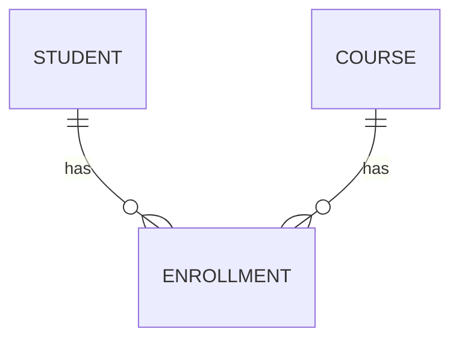

**Implementation:** Requires a **junction table** (associative entity).

```sql
-- Junction table for Student-Course M:N
CREATE TABLE enrollment (
    enrollment_id INT PRIMARY KEY,
    student_id INT NOT NULL,
    course_id INT NOT NULL,
    enrollment_date DATE,
    grade CHAR(2),
    FOREIGN KEY (student_id) REFERENCES student(student_id),
    FOREIGN KEY (course_id) REFERENCES course(course_id),
    UNIQUE (student_id, course_id)  -- Prevents duplicate enrollments
);
```

---

## Crow's Foot Notation

### The Symbols

```
|       One (and only one)
||      One (mandatory)
O       Zero
<       Many
>       Many (pointing other direction)

Combinations:
||--||  One to One (both mandatory)
||--o|  One to Zero-or-One
||--o{  One to Zero-or-Many  
||--|{  One to One-or-Many
}o--o{  Zero-or-Many to Zero-or-Many
```

### Visual Guide

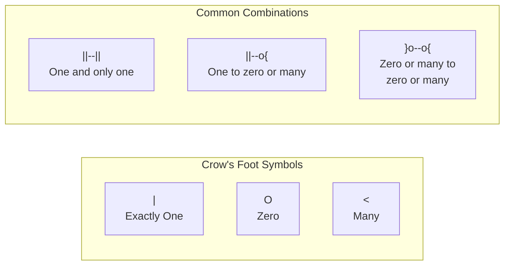

### Reading Crow's Foot Diagrams

Read from each entity's perspective:

```
DEPARTMENT ||--o{ EMPLOYEE
```

**From DEPARTMENT:** "One department *has* zero or many employees"
**From EMPLOYEE:** "Each employee *belongs to* exactly one department"

### Complete Notation Reference

| Symbol | Meaning | Example Reading |
|--------|---------|-----------------|
| `\|\|` | Exactly one (mandatory) | "must have exactly one" |
| `\|o` | Zero or one (optional) | "may have at most one" |
| `\|{` | One or many (mandatory) | "must have at least one" |
| `o{` | Zero or many (optional) | "may have any number" |

---

## Participation Constraints

### What Is Participation?

**Participation** specifies whether ALL instances of an entity must participate in a relationship.

### Total vs. Partial Participation

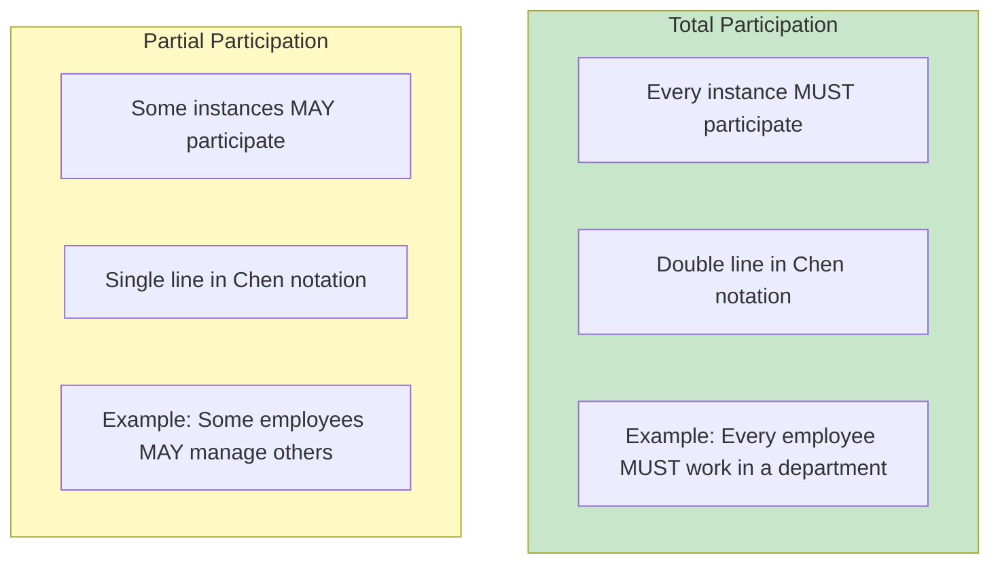

### Examples

**Total Participation:**
- Every EMPLOYEE must work for a DEPARTMENT (can't have an employee without a department)
- Every ORDER must be placed by a CUSTOMER (can't have an orphan order)
- Every ENROLLMENT must link to a STUDENT and COURSE

**Partial Participation:**
- A DEPARTMENT may or may not have a manager (new department)
- An EMPLOYEE may or may not have subordinates (not everyone is a manager)
- A CUSTOMER may or may not have placed orders yet (new customer)

### Notation in Crow's Foot

| Participation | Near-side Symbol | Example |
|--------------|------------------|---------|
| **Total (Mandatory)** | `\|\|` or `\|{` | EMPLOYEE must have DEPARTMENT |
| **Partial (Optional)** | `o\|` or `o{` | EMPLOYEE may have PARKING_SPOT |

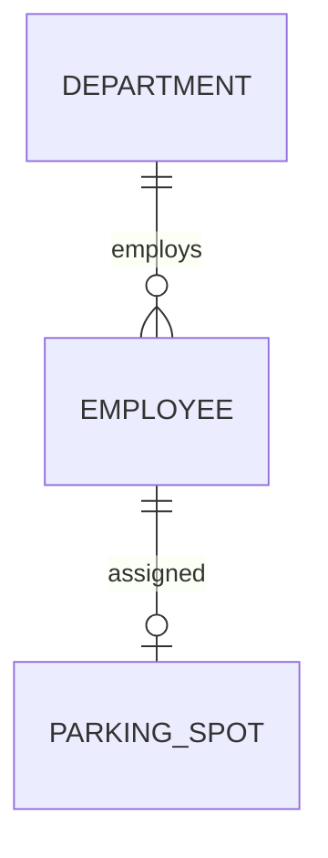

Reading:
- Employee to Department: TOTAL (||) - every employee must have a department
- Employee to Parking Spot: PARTIAL (o|) - parking spot is optional

---

## Identifying Relationships from Requirements

### Technique: Verb Extraction

**Step 1:** Highlight verbs in requirements
**Step 2:** Determine which entities they connect
**Step 3:** Classify cardinality
**Step 4:** Determine participation

### Example: School System Requirements

**Requirements:**
1. "Each **student enrolls in** one or more courses each semester."
2. "A **teacher teaches** multiple classes but may teach zero during sabbatical."
3. "Every **class belongs to** exactly one course."
4. "A **parent has** one or more children (students) at the school."
5. "Each **grade is assigned to** exactly one student for one assignment."

**Relationship Extraction:**

| Verb Phrase | Entity A | Entity B | Cardinality | Participation |
|-------------|----------|----------|-------------|---------------|
| enrolls in | Student | Course | M:N | Total (student), Partial (course) |
| teaches | Teacher | Class | 1:N | Partial (teacher), Total (class) |
| belongs to | Class | Course | N:1 | Total (class), Partial (course) |
| has | Parent | Student | 1:N | Total (both) |
| assigned to | Grade | Student | N:1 | Total (grade), Partial (student) |

### Common Relationship Patterns

| Pattern | Description | Example |
|---------|-------------|---------|
| **Hierarchical** | Parent-child structure | Department → Employee |
| **Network** | Many-to-many connections | Student ↔ Course |
| **Recursive** | Self-referencing | Employee manages Employee |
| **Associative** | M:N with attributes | Enrollment (Student-Course with grade) |

---

## School System Relationships

### Complete ER Diagram with Relationships

```mermaid
erDiagram
    STUDENT ||--o{ ENROLLMENT : has
    COURSE ||--o{ CLASS : offers
    CLASS ||--o{ ENROLLMENT : contains
    TEACHER ||--o{ CLASS : teaches
    DEPARTMENT ||--o{ TEACHER : employs
    DEPARTMENT ||--o{ COURSE : offers
    STUDENT ||--o{ ATTENDANCE : has
    CLASS ||--o{ ATTENDANCE : records
    STUDENT ||--o{ GRADE : receives
    STUDENT }|--|| PARENT : has
    ENROLLMENT ||--o{ GRADE : contains
```

### Relationship Documentation Table

| Relationship | Entity A | Entity B | Cardinality | A Participation | B Participation |
|--------------|----------|----------|-------------|-----------------|-----------------|
| has | STUDENT | ENROLLMENT | 1:N | Partial | Total |
| offers | COURSE | CLASS | 1:N | Partial | Total |
| contains | CLASS | ENROLLMENT | 1:N | Partial | Total |
| teaches | TEACHER | CLASS | 1:N | Partial | Total |
| employs | DEPARTMENT | TEACHER | 1:N | Partial | Total |
| offers | DEPARTMENT | COURSE | 1:N | Partial | Total |
| has | STUDENT | ATTENDANCE | 1:N | Partial | Total |
| records | CLASS | ATTENDANCE | 1:N | Total | Total |
| receives | STUDENT | GRADE | 1:N | Partial | Total |
| has | STUDENT | PARENT | N:1 | Total | Total |

### Relationship Descriptions

**Student - Enrollment (1:N):**
- A student can have many enrollments (different courses, different semesters)
- Each enrollment belongs to exactly one student
- Partial on student side (new student may not be enrolled yet)

**Course - Class (1:N):**
- A course can have multiple class sections (CS101-A, CS101-B)
- Each class is one section of exactly one course
- Partial on course side (some courses may not run this semester)

**Teacher - Class (1:N):**
- A teacher can teach multiple classes
- Each class has exactly one teacher (primary instructor)
- Partial on teacher side (sabbatical, administrative duties)

**Student - Parent (N:1):**
- A student has one parent record (primary contact)
- A parent can have multiple student children
- Total on both sides (all students must have parent contact)

---

## Junction Tables (Associative Entities)

### When to Use Junction Tables

Any **many-to-many** relationship requires a junction table.

### Junction Table Anatomy

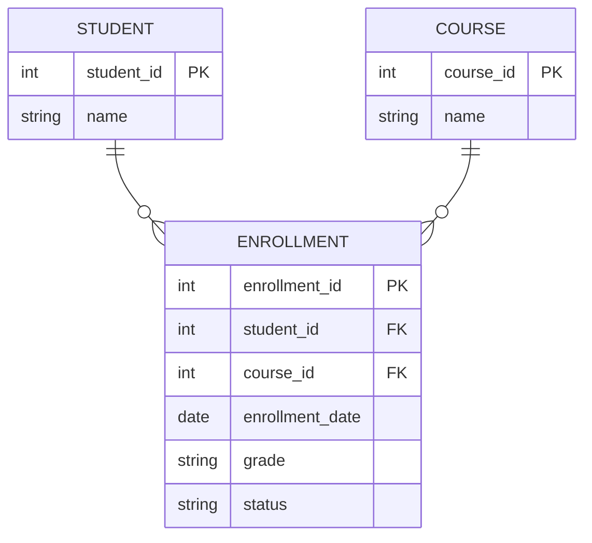

### Junction Table Best Practices

| Practice | Explanation |
|----------|-------------|
| **Add surrogate PK** | Even though composite key works, surrogate is cleaner |
| **Add attributes** | Junction tables often have their own data (date, status) |
| **Meaningful name** | Use business term (ENROLLMENT) not technical (STUDENT_COURSE) |
| **Both FKs NOT NULL** | Must connect to both entities |
| **Consider unique constraint** | Prevent duplicate combinations |

### SQL Implementation

```sql
-- Many-to-Many: Student enrolls in Course
CREATE TABLE enrollment (
    enrollment_id INT PRIMARY KEY AUTO_INCREMENT,
    student_id INT NOT NULL,
    course_id INT NOT NULL,
    semester VARCHAR(20) NOT NULL,
    enrollment_date DATE DEFAULT (CURRENT_DATE),
    grade CHAR(2),
    status ENUM('active', 'completed', 'withdrawn') DEFAULT 'active',
    
    FOREIGN KEY (student_id) REFERENCES student(student_id),
    FOREIGN KEY (course_id) REFERENCES course(course_id),
    
    UNIQUE KEY unique_enrollment (student_id, course_id, semester)
);
```

---

## Common Relationship Mistakes

### Mistake 1: Wrong Cardinality

**❌ Wrong:** "Student has one Course" (ignoring that students take multiple courses)

**✅ Correct:** Student enrolls in many Courses (M:N relationship)

### Mistake 2: Missing Junction Table

**❌ Wrong:** Trying to store multiple course IDs in student table
```sql
-- DON'T DO THIS
CREATE TABLE student (
    student_id INT,
    course_ids VARCHAR(100)  -- "101,102,103" - BAD!
);
```

**✅ Correct:** Create proper junction table
```sql
CREATE TABLE enrollment (
    student_id INT,
    course_id INT,
    PRIMARY KEY (student_id, course_id)
);
```

### Mistake 3: Ignoring Participation

**❌ Wrong:** Not considering whether entities must participate

**✅ Correct:** Document participation constraints
- Can we have a course with no students? (Yes → partial)
- Can we have a student with no enrollments? (Yes → partial)
- Can we have a grade without a student? (No → total)

### Mistake 4: Redundant Relationships

**❌ Wrong:** Creating direct relationship when path exists through other entities


The dotted line is redundant - we can find student's courses through enrollment.

---

## Key Takeaways

✅ **Relationships connect entities**
- Named with verbs (enrolls, teaches, contains)
- Binary relationships are most common

✅ **Cardinality defines "how many"**
- 1:1 - One to one
- 1:N - One to many (most common)
- M:N - Many to many (needs junction table)

✅ **Participation defines "must or may"**
- Total - ALL instances must participate
- Partial - SOME instances may participate

✅ **Crow's Foot notation is industry standard**
- `||` means mandatory one
- `o` means optional (zero)
- `{` means many

✅ **Junction tables resolve M:N**
- Always create separate table
- Can have own attributes
- Use meaningful names

---

## Self-Check Questions

1. **What cardinality exists between Teacher and Department?**
   <details>
   <summary>Click to reveal answer</summary>
   Many-to-One (N:1) - Many teachers belong to one department, but each teacher belongs to exactly one department.
   </details>

2. **When would you use a 1:1 relationship?**
   <details>
   <summary>Click to reveal answer</summary>
   When each instance of A maps to exactly one instance of B. Examples: Person-Passport, Employee-ParkingSpot. Often, 1:1 entities can be merged into one table.
   </details>

3. **What does total participation mean?**
   <details>
   <summary>Click to reveal answer</summary>
   Every instance of the entity MUST participate in the relationship. For example, every enrollment MUST have a student - you can't have an orphan enrollment.
   </details>

4. **How do you implement M:N in a relational database?**
   <details>
   <summary>Click to reveal answer</summary>
   Create a junction (associative) table that contains foreign keys to both entities, plus any attributes that belong to the relationship itself (like enrollment_date, grade).
   </details>

5. **Read this: `CUSTOMER ||--o{ ORDER`. What does it mean?**
   <details>
   <summary>Click to reveal answer</summary>
   "One customer may have zero or many orders. Each order belongs to exactly one customer." The || on Customer side means mandatory (order must have customer), o{ on Order side means optional many (customer may have zero or more orders).
   </details>

---

## Practice Exercise

**Scenario:** Online Store Database

**Task 1:** Identify the cardinality for these relationships:

| Entity A | Relationship | Entity B | Cardinality? |
|----------|-------------|----------|--------------|
| Customer | places | Order | ? |
| Order | contains | Product | ? |
| Product | belongs to | Category | ? |
| Category | has subcategory | Category | ? |

<details>
<summary>Click for answers</summary>

| Entity A | Relationship | Entity B | Cardinality |
|----------|-------------|----------|--------------|
| Customer | places | Order | 1:N (one customer, many orders) |
| Order | contains | Product | M:N (one order has many products, one product in many orders) |
| Product | belongs to | Category | N:1 (many products, one category) |
| Category | has subcategory | Category | 1:N recursive |
</details>

**Task 2:** Draw the ER diagram for Order-Product M:N relationship, including the junction table with attributes.

<details>
<summary>Click for answer</summary>

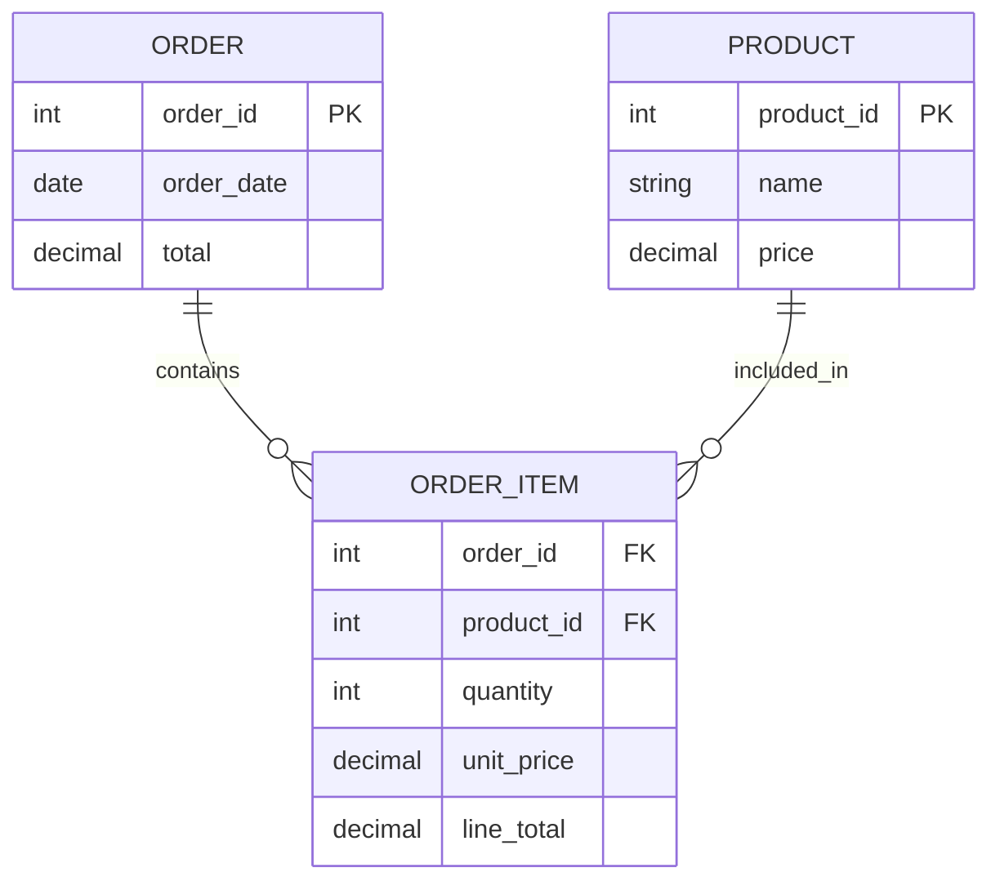

The junction table ORDER_ITEM has its own attributes: quantity, unit_price, line_total.
</details>

**Task 3:** Determine participation (Total/Partial) for each side:

| Relationship | Entity A | Entity B | A Participation | B Participation |
|-------------|----------|----------|-----------------|-----------------|
| Customer-Order | Customer | Order | ? | ? |
| Order-Product (via OrderItem) | Order | Product | ? | ? |

<details>
<summary>Click for answer</summary>

| Relationship | Entity A | Entity B | A Participation | B Participation |
|-------------|----------|----------|-----------------|-----------------|
| Customer-Order | Customer | Order | Partial (customer may have no orders) | Total (every order must have customer) |
| Order-Product | Order | Product | Total (order must have products) | Partial (product may not be in any order) |
</details>

---

## What's Next?

Now that you understand basic relationships, we'll explore advanced concepts:

**Section 6.4: Advanced ER Concepts**
- Weak entities and identifying relationships
- Generalization and specialization (inheritance in ER)
- Aggregation
- Enhanced ER (EER) concepts

---

**Previous:** [← 6.2 ER Basics](./6_2-er-basics.md)

**Next:** [6.4 Advanced ER Concepts →](./6_4-advanced-er-concepts.md)

---

*Last Updated: December 2024*  
*Estimated Reading Time: 40 minutes*
