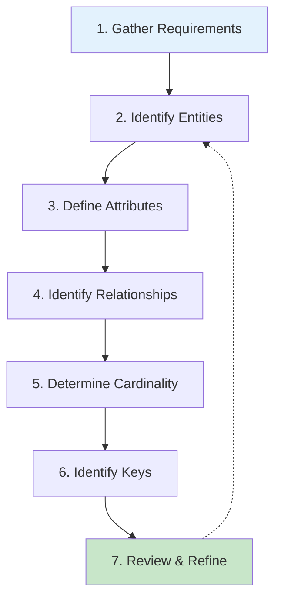
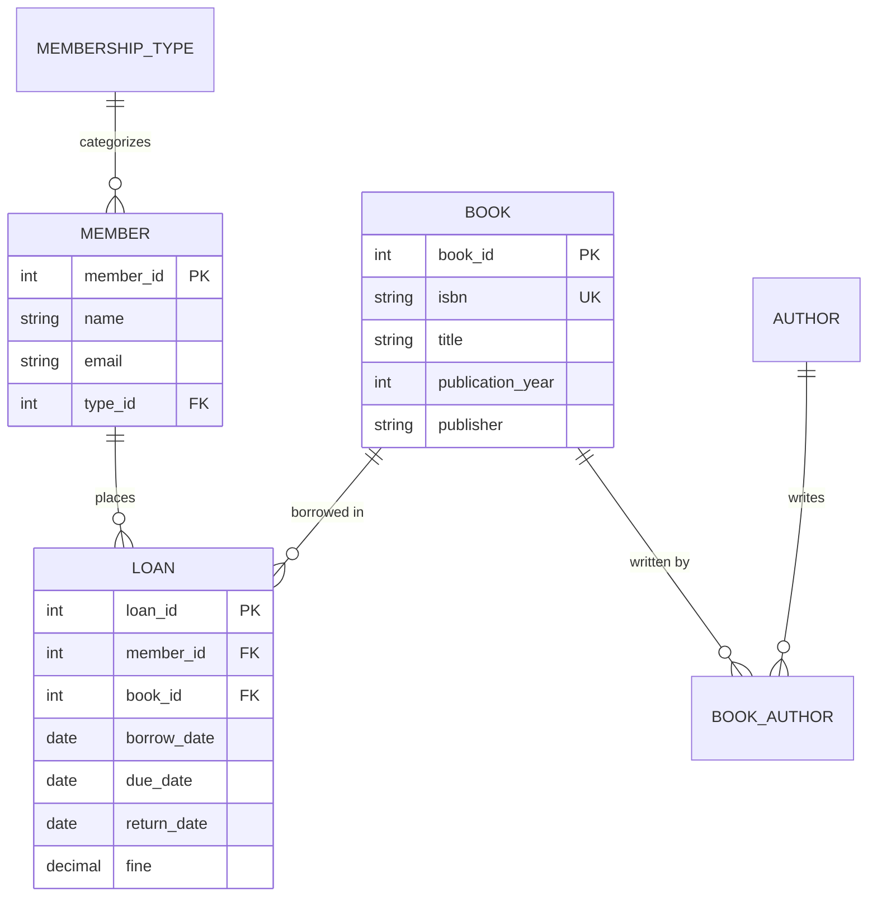

# 6.5 ER Diagram Design

[← Previous: 6.4 Advanced ER Concepts](./6_4-advanced-er-concepts.md) | [Back to Chapter 6](./chapter-06-README.md) | [Next: 6.6 Normalization Fundamentals →](./6_6-normalization-fundamentals.md)

---

## 📖 Introduction

Now that you understand entities, attributes, relationships, and advanced concepts, it's time to put it all together. This section provides a **step-by-step methodology** for creating ER diagrams from requirements, culminating in the complete School Management System database design.

---

## 🎯 Learning Objectives

After completing this section, you will be able to:

- ✅ Follow a systematic process for ER diagram creation
- ✅ Extract entities and relationships from requirements
- ✅ Create professional ER diagrams using proper notation
- ✅ Validate ER diagrams against requirements
- ✅ Apply design patterns and best practices

---

## ER Design Methodology

### The 7-Step Process



---

## Step 1: Gather Requirements

### School System Requirements Summary

**Functional Requirements:**
1. Register students with personal information and parent/guardian contacts
2. Manage teacher assignments to departments and classes
3. Create courses with credits and prerequisites
4. Schedule class sections each semester with rooms and times
5. Enroll students in classes and track enrollment status
6. Record attendance daily for each class
7. Manage grades for assignments, exams, and final grades
8. Generate report cards and transcripts

**Data Requirements:**
- Store 500-2000 students
- Track 50-200 teachers
- Manage 100-500 courses
- Handle 200-1000 class sections per year
- Record thousands of grades and attendance records

---

## Step 2: Identify Entities

### Noun Extraction

From requirements, highlight nouns:

| Noun | Entity? | Reasoning |
|------|---------|-----------|
| Students | ✅ Yes | Need to track multiple, has properties |
| Personal information | ❌ No | Attributes of Student |
| Parent/guardian | ✅ Yes | Separate entity with own properties |
| Teachers | ✅ Yes | Need to track multiple |
| Departments | ✅ Yes | Teachers belong to departments |
| Classes | ✅ Yes | Course offerings |
| Courses | ✅ Yes | Course catalog entries |
| Semesters | Maybe | Could be attribute or entity |
| Rooms | Maybe | Could be attribute of Class |
| Grades | ✅ Yes | Many grades per student |
| Attendance | ✅ Yes | Daily records |
| Assignments | ✅ Yes | Grades are for assignments |

### Final Entity List

| Entity | Description | Type |
|--------|-------------|------|
| PERSON | Base for all people | Supertype |
| STUDENT | Enrolled learners | Subtype |
| TEACHER | Instructors | Subtype |
| PARENT | Student guardians | Subtype |
| DEPARTMENT | Academic departments | Strong |
| COURSE | Course catalog | Strong |
| CLASS | Course sections | Strong (or Weak) |
| ENROLLMENT | Student-class link | Associative |
| ASSIGNMENT | Graded work | Weak |
| GRADE | Student scores | Associative |
| ATTENDANCE | Daily presence | Associative |

---

## Step 3: Define Attributes

### Core Entities with Attributes

**PERSON (Supertype):**
```
person_id (PK), first_name, last_name, email, phone, address, birth_date
```

**STUDENT:**
```
person_id (PK/FK), student_number (UK), enrollment_date, grade_level, status
```

**TEACHER:**
```
person_id (PK/FK), employee_id (UK), hire_date, qualification, salary
```

**DEPARTMENT:**
```
department_id (PK), name, building, phone, head_teacher_id (FK)
```

**COURSE:**
```
course_id (PK), course_code (UK), name, description, credits, department_id (FK)
```

**CLASS:**
```
class_id (PK), course_id (FK), section, semester, year, room, schedule, teacher_id (FK), capacity
```

**ENROLLMENT:**
```
enrollment_id (PK), student_id (FK), class_id (FK), enrollment_date, status, final_grade
```

**ASSIGNMENT:**
```
assignment_id (PK), class_id (FK), title, description, due_date, max_points, assignment_type
```

**GRADE:**
```
grade_id (PK), enrollment_id (FK), assignment_id (FK), score, submission_date, comments
```

**ATTENDANCE:**
```
attendance_id (PK), enrollment_id (FK), attendance_date, status, notes
```

---

## Step 4: Identify Relationships

### Relationship Matrix

| Entity A | Relationship | Entity B |
|----------|-------------|----------|
| PERSON | is a | STUDENT |
| PERSON | is a | TEACHER |
| PERSON | is a | PARENT |
| DEPARTMENT | employs | TEACHER |
| DEPARTMENT | offers | COURSE |
| COURSE | has sections | CLASS |
| TEACHER | teaches | CLASS |
| STUDENT | has | ENROLLMENT |
| CLASS | contains | ENROLLMENT |
| CLASS | has | ASSIGNMENT |
| ENROLLMENT | has | GRADE |
| ASSIGNMENT | is graded in | GRADE |
| ENROLLMENT | has | ATTENDANCE |
| PARENT | guardian of | STUDENT |

---

## Step 5: Determine Cardinality

### Complete Cardinality Analysis

| Relationship | Card. | A Part. | B Part. | Explanation |
|-------------|-------|---------|---------|-------------|
| DEPARTMENT-TEACHER | 1:N | Partial | Total | Dept may have no teachers; teacher must have dept |
| DEPARTMENT-COURSE | 1:N | Partial | Total | Dept may offer no courses; course must have dept |
| COURSE-CLASS | 1:N | Partial | Total | Course may have no sections; class must have course |
| TEACHER-CLASS | 1:N | Partial | Total | Teacher may teach 0 classes; class must have teacher |
| STUDENT-ENROLLMENT | 1:N | Partial | Total | Student may have 0 enrollments; enrollment needs student |
| CLASS-ENROLLMENT | 1:N | Partial | Total | Class may have 0 students; enrollment needs class |
| CLASS-ASSIGNMENT | 1:N | Total | Total | Class must have assignments; assignment needs class |
| ENROLLMENT-GRADE | 1:N | Partial | Total | Enrollment may have 0 grades; grade needs enrollment |
| ASSIGNMENT-GRADE | 1:N | Partial | Total | Assignment may have 0 grades; grade needs assignment |
| ENROLLMENT-ATTENDANCE | 1:N | Partial | Total | Enrollment may have 0 records; attendance needs enrollment |
| PARENT-STUDENT | 1:N | Total | Total | Parent must have students; student must have parent |

---

## Step 6: Identify Keys

### Primary Keys

| Entity | Primary Key | Type |
|--------|-------------|------|
| PERSON | person_id | Surrogate |
| STUDENT | person_id | Shared (inherits from PERSON) |
| TEACHER | person_id | Shared |
| DEPARTMENT | department_id | Surrogate |
| COURSE | course_id | Surrogate |
| CLASS | class_id | Surrogate |
| ENROLLMENT | enrollment_id | Surrogate |
| ASSIGNMENT | assignment_id | Surrogate |
| GRADE | grade_id | Surrogate |
| ATTENDANCE | attendance_id | Surrogate |

### Alternate Keys (Unique)

| Entity | Alternate Key |
|--------|---------------|
| STUDENT | student_number |
| TEACHER | employee_id |
| COURSE | course_code |
| CLASS | (course_id, section, semester, year) |
| ENROLLMENT | (student_id, class_id) |

### Foreign Keys

| Table | Foreign Key | References |
|-------|-------------|------------|
| STUDENT | person_id | PERSON.person_id |
| TEACHER | person_id | PERSON.person_id |
| TEACHER | department_id | DEPARTMENT.department_id |
| COURSE | department_id | DEPARTMENT.department_id |
| CLASS | course_id | COURSE.course_id |
| CLASS | teacher_id | TEACHER.person_id |
| ENROLLMENT | student_id | STUDENT.person_id |
| ENROLLMENT | class_id | CLASS.class_id |
| ASSIGNMENT | class_id | CLASS.class_id |
| GRADE | enrollment_id | ENROLLMENT.enrollment_id |
| GRADE | assignment_id | ASSIGNMENT.assignment_id |
| ATTENDANCE | enrollment_id | ENROLLMENT.enrollment_id |

---

## Step 7: Complete ER Diagram

### School Management System - Full ER Diagram

```mermaid
erDiagram
    PERSON ||--o| STUDENT : "is a"
    PERSON ||--o| TEACHER : "is a"
    PERSON ||--o| PARENT : "is a"
    
    DEPARTMENT ||--o{ TEACHER : employs
    DEPARTMENT ||--o{ COURSE : offers
    
    COURSE ||--o{ CLASS : "has sections"
    TEACHER ||--o{ CLASS : teaches
    
    STUDENT ||--o{ ENROLLMENT : has
    CLASS ||--o{ ENROLLMENT : contains
    
    CLASS ||--|{ ASSIGNMENT : has
    
    ENROLLMENT ||--o{ GRADE : has
    ASSIGNMENT ||--o{ GRADE : "graded in"
    
    ENROLLMENT ||--o{ ATTENDANCE : has
    
    PARENT ||--|{ STUDENT : "guardian of"
    
    PERSON {
        int person_id PK
        string first_name
        string last_name
        string email
        string phone
        date birth_date
    }
    
    STUDENT {
        int person_id PK_FK
        string student_number UK
        date enrollment_date
        string grade_level
        string status
    }
    
    TEACHER {
        int person_id PK_FK
        string employee_id UK
        int department_id FK
        date hire_date
        string qualification
        decimal salary
    }
    
    PARENT {
        int person_id PK_FK
        string relationship
        boolean is_primary
    }
    
    DEPARTMENT {
        int department_id PK
        string name
        string building
        int head_teacher_id FK
    }
    
    COURSE {
        int course_id PK
        string course_code UK
        string name
        string description
        int credits
        int department_id FK
    }
    
    CLASS {
        int class_id PK
        int course_id FK
        string section
        string semester
        int year
        string room
        string schedule
        int teacher_id FK
        int capacity
    }
    
    ENROLLMENT {
        int enrollment_id PK
        int student_id FK
        int class_id FK
        date enrollment_date
        string status
        string final_grade
    }
    
    ASSIGNMENT {
        int assignment_id PK
        int class_id FK
        string title
        string description
        date due_date
        int max_points
        string type
    }
    
    GRADE {
        int grade_id PK
        int enrollment_id FK
        int assignment_id FK
        decimal score
        date submission_date
        string comments
    }
    
    ATTENDANCE {
        int attendance_id PK
        int enrollment_id FK
        date attendance_date
        string status
        string notes
    }
```

---

## ER Design Best Practices

### Do's ✅

| Practice | Reason |
|----------|--------|
| Use surrogate primary keys | Stable, simple, efficient |
| Name entities with singular nouns | STUDENT not STUDENTS |
| Use meaningful relationship names | "teaches" not "rel1" |
| Document all constraints | Future reference |
| Normalize before finalizing | Reduce redundancy |

### Don'ts ❌

| Avoid | Reason |
|-------|--------|
| Multivalued attributes in columns | Violates 1NF |
| Redundant relationships | Increases complexity |
| Missing foreign keys | Breaks integrity |
| Overly generic entities | Hard to understand |
| Design by SQL | Conceptual first |

---

## Design Validation Checklist

Before finalizing your ER diagram:

- [ ] Every entity has a primary key
- [ ] All relationships have cardinality defined
- [ ] Participation constraints are documented
- [ ] No redundant relationships exist
- [ ] Multivalued attributes are separate tables
- [ ] Derived attributes are identified
- [ ] Foreign keys are properly defined
- [ ] Entity names are singular and meaningful
- [ ] Attribute names follow naming convention
- [ ] Design supports all use cases

---

## Key Takeaways

✅ **Follow the 7-step methodology** for consistent results

✅ **Extract entities from requirements** using noun analysis

✅ **Document everything** - cardinality, participation, constraints

✅ **Validate against use cases** before implementation

✅ **Use proper notation** (Crow's Foot is industry standard)

---

## Practice Exercise

**Scenario:** Design an ER diagram for a Library System

**Requirements:**
1. Track books with ISBN, title, authors, publisher, year
2. Members can borrow multiple books
3. Track due dates and return dates
4. Members have borrowing limits based on membership type
5. Fine calculation for overdue books

**Task:** Create the entity list, attributes, and ER diagram.

<details>
<summary>Click for solution</summary>

**Entities:** BOOK, MEMBER, LOAN, AUTHOR, MEMBERSHIP_TYPE

**Key Relationships:**
- AUTHOR writes BOOK (M:N)
- MEMBER has MEMBERSHIP_TYPE (N:1)
- MEMBER borrows BOOK via LOAN (M:N)


</details>

---

**Previous:** [← 6.4 Advanced ER Concepts](./6_4-advanced-er-concepts.md)

**Next:** [6.6 Normalization Fundamentals →](./6_6-normalization-fundamentals.md)

---

*Estimated Reading Time: 45 minutes*
