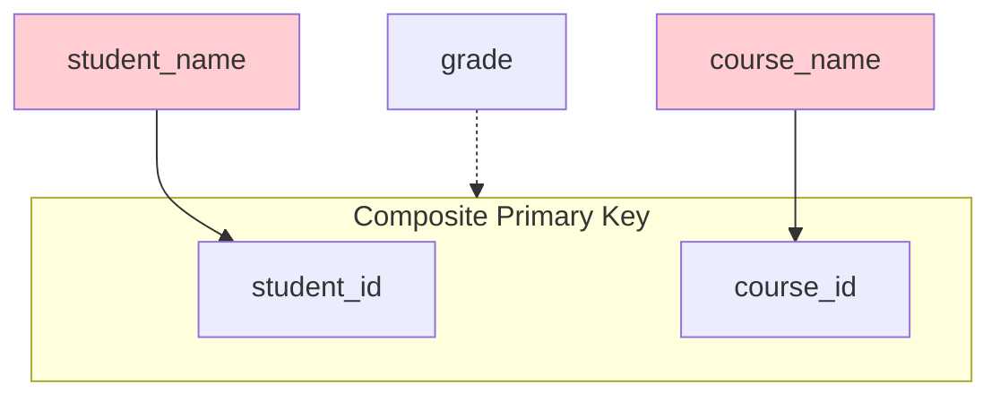
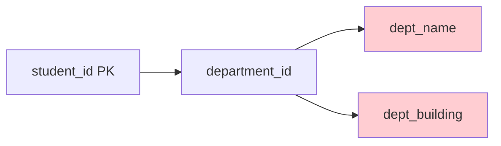

# 6.6 Normalization Fundamentals

[← Previous: 6.5 ER Diagram Design](./6_5-er-diagram-design.md) | [Back to Chapter 6](./chapter-06-README.md) | [Next: 6.7 Advanced Normalization →](./6_7-advanced-normalization.md)

---

## 📖 Introduction

**Normalization** is the process of organizing database tables to minimize data redundancy and dependency. It's like organizing a messy closet - putting similar items together and eliminating duplicates.

Poor normalization leads to **anomalies** - problems that occur when inserting, updating, or deleting data. Good normalization creates efficient, consistent databases.

---

## 🎯 Learning Objectives

After completing this section, you will be able to:

- ✅ Explain why normalization is important
- ✅ Identify and fix insertion, update, and deletion anomalies
- ✅ Apply First Normal Form (1NF)
- ✅ Apply Second Normal Form (2NF)
- ✅ Apply Third Normal Form (3NF)
- ✅ Normalize database tables step-by-step

---

## Why Normalize?

### The Problem: Data Anomalies

Consider this **unnormalized** student enrollment table:

| student_id | student_name | course_id | course_name | teacher_name | dept_name |
|------------|--------------|-----------|-------------|--------------|-----------|
| S001 | Ahmed Ali | CS101 | Programming | Dr. Omar | Computer Science |
| S001 | Ahmed Ali | CS102 | Databases | Dr. Sara | Computer Science |
| S002 | Sara Khan | CS101 | Programming | Dr. Omar | Computer Science |
| S002 | Sara Khan | MA201 | Calculus | Dr. Hassan | Mathematics |

### Three Types of Anomalies

#### 1. Update Anomaly

**Problem:** If Dr. Omar's name changes, we must update MULTIPLE rows.

```
Before: Dr. Omar teaches CS101 (appears in 2 rows)
Change: Dr. Omar → Dr. Omar Hassan
Risk: Update one row, forget another → inconsistent data!
```

#### 2. Insertion Anomaly

**Problem:** Can't add a new course without a student enrolled.

```
Want to add: CS103 "Networks" taught by Dr. Ali
Can't add: No student_id for the row!
```

#### 3. Deletion Anomaly

**Problem:** Deleting a student may lose course information.

```
Delete: S002 (Sara Khan) 
Lost: MA201 "Calculus" info if Sara was the only student!
```

### The Solution: Normalization


---

## Normal Forms Overview

| Normal Form | Requirement | Fixes |
|-------------|-------------|-------|
| **1NF** | Atomic values, no repeating groups | Flat structure |
| **2NF** | 1NF + No partial dependencies | Removes partial redundancy |
| **3NF** | 2NF + No transitive dependencies | Removes indirect redundancy |
| **BCNF** | 3NF + Every determinant is a key | Handles special cases |

---

## First Normal Form (1NF)

### Definition

A table is in **1NF** if:
1. All columns contain **atomic** (indivisible) values
2. No **repeating groups** or arrays
3. Each row is unique (has a primary key)

### 1NF Violations and Fixes

#### Violation 1: Non-Atomic Values

**❌ NOT in 1NF:**

| student_id | name | phone_numbers |
|------------|------|---------------|
| S001 | Ahmed | 555-1234, 555-5678 |
| S002 | Sara | 555-9012 |

**Problem:** Multiple phone numbers in one cell.

**✅ Fixed (1NF):**

**Option A: Separate rows**
| student_id | name | phone_number |
|------------|------|--------------|
| S001 | Ahmed | 555-1234 |
| S001 | Ahmed | 555-5678 |
| S002 | Sara | 555-9012 |

**Option B: Separate table (Better)**
| student_id | phone_type | phone_number |
|------------|------------|--------------|
| S001 | home | 555-1234 |
| S001 | mobile | 555-5678 |
| S002 | mobile | 555-9012 |

#### Violation 2: Repeating Groups

**❌ NOT in 1NF:**

| student_id | name | course1 | grade1 | course2 | grade2 | course3 | grade3 |
|------------|------|---------|--------|---------|--------|---------|--------|
| S001 | Ahmed | CS101 | A | CS102 | B | NULL | NULL |
| S002 | Sara | CS101 | B | MA201 | A | EN101 | B |

**Problem:** Repeated column groups, wastes space with NULLs.

**✅ Fixed (1NF):**

| student_id | name | course_id | grade |
|------------|------|-----------|-------|
| S001 | Ahmed | CS101 | A |
| S001 | Ahmed | CS102 | B |
| S002 | Sara | CS101 | B |
| S002 | Sara | MA201 | A |
| S002 | Sara | EN101 | B |

### 1NF Checklist

- [ ] Every cell contains a single value
- [ ] No arrays or comma-separated lists
- [ ] No repeating column groups
- [ ] Primary key exists
- [ ] Column names are unique

---

## Second Normal Form (2NF)

### Definition

A table is in **2NF** if:
1. It's in 1NF
2. Every non-key attribute depends on the **entire** primary key (no partial dependencies)

**Note:** 2NF only applies to tables with **composite primary keys**.

### Understanding Partial Dependency

**Partial Dependency:** When a non-key attribute depends on only PART of a composite key.



- `grade` depends on BOTH student_id AND course_id ✅
- `student_name` depends only on student_id ❌ (Partial!)
- `course_name` depends only on course_id ❌ (Partial!)

### 2NF Example

**❌ NOT in 2NF:**

**ENROLLMENT** (student_id, course_id, student_name, student_email, course_name, credits, grade)

| student_id | course_id | student_name | student_email | course_name | credits | grade |
|------------|-----------|--------------|---------------|-------------|---------|-------|
| S001 | CS101 | Ahmed Ali | ahmed@email.com | Programming | 3 | A |
| S001 | CS102 | Ahmed Ali | ahmed@email.com | Databases | 3 | B |
| S002 | CS101 | Sara Khan | sara@email.com | Programming | 3 | B |

**Partial Dependencies:**
- student_name, student_email → depend only on student_id
- course_name, credits → depend only on course_id

**✅ Fixed (2NF):**

**STUDENT** (student_id, student_name, student_email)
| student_id | student_name | student_email |
|------------|--------------|---------------|
| S001 | Ahmed Ali | ahmed@email.com |
| S002 | Sara Khan | sara@email.com |

**COURSE** (course_id, course_name, credits)
| course_id | course_name | credits |
|-----------|-------------|---------|
| CS101 | Programming | 3 |
| CS102 | Databases | 3 |

**ENROLLMENT** (student_id, course_id, grade)
| student_id | course_id | grade |
|------------|-----------|-------|
| S001 | CS101 | A |
| S001 | CS102 | B |
| S002 | CS101 | B |

### 2NF Checklist

- [ ] Table is in 1NF
- [ ] If composite PK, check each non-key attribute
- [ ] Does it depend on ALL parts of the key?
- [ ] Move partial dependencies to new tables

---

## Third Normal Form (3NF)

### Definition

A table is in **3NF** if:
1. It's in 2NF
2. No **transitive dependencies** (non-key depends on non-key)

### Understanding Transitive Dependency

**Transitive Dependency:** When a non-key attribute depends on another non-key attribute.

```
A → B → C (A determines B, B determines C)
Therefore: A transitively determines C
```



- student_id → department_id (direct) ✅
- department_id → dept_name (non-key → non-key) ❌
- student_id → dept_name (transitive) ❌

### 3NF Example

**❌ NOT in 3NF:**

**STUDENT** (student_id, name, department_id, dept_name, dept_building)

| student_id | name | department_id | dept_name | dept_building |
|------------|------|---------------|-----------|---------------|
| S001 | Ahmed | D01 | Computer Science | Building A |
| S002 | Sara | D01 | Computer Science | Building A |
| S003 | Omar | D02 | Mathematics | Building B |

**Transitive Dependencies:**
- department_id → dept_name
- department_id → dept_building

**Problems:**
- Update anomaly: Change "Building A" requires multiple updates
- Redundancy: "Computer Science" repeated for every CS student

**✅ Fixed (3NF):**

**STUDENT** (student_id, name, department_id)
| student_id | name | department_id |
|------------|------|---------------|
| S001 | Ahmed | D01 |
| S002 | Sara | D01 |
| S003 | Omar | D02 |

**DEPARTMENT** (department_id, dept_name, dept_building)
| department_id | dept_name | dept_building |
|---------------|-----------|---------------|
| D01 | Computer Science | Building A |
| D02 | Mathematics | Building B |

### 3NF Checklist

- [ ] Table is in 2NF
- [ ] For each non-key attribute:
  - Does it depend only on the primary key?
  - Does it NOT depend on other non-key attributes?
- [ ] Move transitive dependencies to new tables

---

## Normalization Step-by-Step

### Complete Example: School Enrollment

**Starting Table (Unnormalized):**

| student_id | student_name | student_email | phone_numbers | course_id | course_name | dept_id | dept_name | teacher_id | teacher_name | grade |
|------------|--------------|---------------|---------------|-----------|-------------|---------|-----------|------------|--------------|-------|
| S001 | Ahmed | ahmed@mail.com | 555-1234, 555-5678 | CS101 | Programming | D01 | CS | T01 | Dr. Omar | A |
| S001 | Ahmed | ahmed@mail.com | 555-1234, 555-5678 | CS102 | Databases | D01 | CS | T02 | Dr. Sara | B |
| S002 | Sara | sara@mail.com | 555-9012 | CS101 | Programming | D01 | CS | T01 | Dr. Omar | B |

### Step 1: Convert to 1NF

**Problem:** phone_numbers is not atomic.

**Solution:** Create separate phone table.

**STUDENT_PHONE:**
| student_id | phone_number |
|------------|--------------|
| S001 | 555-1234 |
| S001 | 555-5678 |
| S002 | 555-9012 |

**Main Table (1NF):**
| student_id | student_name | student_email | course_id | course_name | dept_id | dept_name | teacher_id | teacher_name | grade |
|------------|--------------|---------------|-----------|-------------|---------|-----------|------------|--------------|-------|
| S001 | Ahmed | ahmed@mail.com | CS101 | Programming | D01 | CS | T01 | Dr. Omar | A |
| S001 | Ahmed | ahmed@mail.com | CS102 | Databases | D01 | CS | T02 | Dr. Sara | B |
| S002 | Sara | sara@mail.com | CS101 | Programming | D01 | CS | T01 | Dr. Omar | B |

### Step 2: Convert to 2NF

**PK:** (student_id, course_id)

**Check each non-key attribute:**
- student_name → depends on student_id only (Partial!)
- student_email → depends on student_id only (Partial!)
- course_name → depends on course_id only (Partial!)
- dept_id → depends on course_id only (Partial!)
- dept_name → depends on dept_id (not even on PK directly)
- teacher_id → depends on course_id only (Partial!)
- teacher_name → depends on teacher_id (not on PK)
- grade → depends on both (OK!)

**Solution:** Create separate tables.

**STUDENT:**
| student_id | student_name | student_email |
|------------|--------------|---------------|
| S001 | Ahmed | ahmed@mail.com |
| S002 | Sara | sara@mail.com |

**COURSE:**
| course_id | course_name | dept_id | teacher_id |
|-----------|-------------|---------|------------|
| CS101 | Programming | D01 | T01 |
| CS102 | Databases | D01 | T02 |

**ENROLLMENT (2NF):**
| student_id | course_id | grade |
|------------|-----------|-------|
| S001 | CS101 | A |
| S001 | CS102 | B |
| S002 | CS101 | B |

### Step 3: Convert to 3NF

**Check COURSE table for transitive dependencies:**
- dept_id → dept_name (If we add it back, this would be transitive)
- teacher_id → teacher_name (same issue)

**Solution:** Ensure DEPARTMENT and TEACHER are separate.

**DEPARTMENT:**
| dept_id | dept_name |
|---------|-----------|
| D01 | Computer Science |

**TEACHER:**
| teacher_id | teacher_name |
|------------|--------------|
| T01 | Dr. Omar |
| T02 | Dr. Sara |

**Final 3NF Schema:**

```mermaid
erDiagram
    STUDENT ||--o{ ENROLLMENT : has
    COURSE ||--o{ ENROLLMENT : has
    DEPARTMENT ||--o{ COURSE : offers
    TEACHER ||--o{ COURSE : teaches
    STUDENT ||--o{ STUDENT_PHONE : has
    
    STUDENT {
        int student_id PK
        string student_name
        string student_email
    }
    
    COURSE {
        int course_id PK
        string course_name
        int dept_id FK
        int teacher_id FK
    }
    
    ENROLLMENT {
        int student_id PK_FK
        int course_id PK_FK
        string grade
    }
    
    DEPARTMENT {
        int dept_id PK
        string dept_name
    }
    
    TEACHER {
        int teacher_id PK
        string teacher_name
    }
    
    STUDENT_PHONE {
        int student_id PK_FK
        string phone_number PK
    }
```

---

## Quick Normalization Reference

### Dependency Types

| Type | Definition | Fix |
|------|------------|-----|
| **Partial** | Non-key depends on part of composite key | Split: attributes go to table with their determinant |
| **Transitive** | Non-key depends on another non-key | Split: create new table for the dependency |

### Normal Form Summary

| NF | Key Rule | Memory Aid |
|----|----------|------------|
| **1NF** | Atomic values | "One value per cell" |
| **2NF** | No partial deps | "Whole key or nothing" |
| **3NF** | No transitive deps | "Nothing but the key" |

### The 3NF Mantra

> "Every non-key attribute must provide a fact about **the key**, **the whole key**, and **nothing but the key**."

- **The key** → Must depend on PK (1NF gives us PK)
- **The whole key** → No partial dependencies (2NF)
- **Nothing but the key** → No transitive dependencies (3NF)

---

## Key Takeaways

✅ **Normalization eliminates anomalies**
- Update anomalies (inconsistent data)
- Insertion anomalies (can't add data)
- Deletion anomalies (lose data unintentionally)

✅ **1NF: Atomic values and no repeating groups**

✅ **2NF: No partial dependencies** (for composite keys)

✅ **3NF: No transitive dependencies** (non-key → non-key)

✅ **Follow the process systematically:**
1. Make atomic (1NF)
2. Remove partial deps (2NF)
3. Remove transitive deps (3NF)

---

## Self-Check Questions

1. **What type of anomaly occurs when deleting a student removes course information?**
   <details>
   <summary>Click to reveal answer</summary>
   Deletion anomaly - unintended loss of information when deleting a row.
   </details>

2. **What is a partial dependency?**
   <details>
   <summary>Click to reveal answer</summary>
   When a non-key attribute depends on only part of a composite primary key, not the entire key.
   </details>

3. **Give an example of a transitive dependency.**
   <details>
   <summary>Click to reveal answer</summary>
   student_id → department_id → dept_name. Student determines department_id, and department_id determines dept_name. So student_id transitively determines dept_name through department_id.
   </details>

4. **If a table has a single-column primary key, can it have partial dependencies?**
   <details>
   <summary>Click to reveal answer</summary>
   No! Partial dependencies only occur with composite primary keys. A single-column PK is already "whole."
   </details>

---

## Practice Exercise

**Normalize this table to 3NF:**

**ORDER_DATA:**
| order_id | order_date | customer_id | customer_name | customer_city | product_id | product_name | category | quantity | unit_price |
|----------|------------|-------------|---------------|---------------|------------|--------------|----------|----------|------------|
| O001 | 2024-01-15 | C01 | Ahmed | Cairo | P01 | Laptop | Electronics | 2 | 1000 |
| O001 | 2024-01-15 | C01 | Ahmed | Cairo | P02 | Mouse | Electronics | 5 | 25 |
| O002 | 2024-01-16 | C02 | Sara | Alexandria | P01 | Laptop | Electronics | 1 | 1000 |

<details>
<summary>Click for solution</summary>

**Step 1 (1NF):** Already in 1NF (atomic values)

**Step 2 (2NF):** PK = (order_id, product_id)
- customer_id, customer_name, customer_city, order_date → order_id only
- product_name, category, unit_price → product_id only
- quantity → both (OK)

**Step 3 (3NF):** Check transitive dependencies
- customer_id → customer_name, customer_city

**Final Tables:**

**CUSTOMER:**
| customer_id | customer_name | customer_city |
|-------------|---------------|---------------|
| C01 | Ahmed | Cairo |
| C02 | Sara | Alexandria |

**PRODUCT:**
| product_id | product_name | category | unit_price |
|------------|--------------|----------|------------|
| P01 | Laptop | Electronics | 1000 |
| P02 | Mouse | Electronics | 25 |

**ORDER:**
| order_id | order_date | customer_id |
|----------|------------|-------------|
| O001 | 2024-01-15 | C01 |
| O002 | 2024-01-16 | C02 |

**ORDER_ITEM:**
| order_id | product_id | quantity |
|----------|------------|----------|
| O001 | P01 | 2 |
| O001 | P02 | 5 |
| O002 | P01 | 1 |

</details>

---

**Previous:** [← 6.5 ER Diagram Design](./6_5-er-diagram-design.md)

**Next:** [6.7 Advanced Normalization →](./6_7-advanced-normalization.md)

---

*Estimated Reading Time: 40 minutes*
