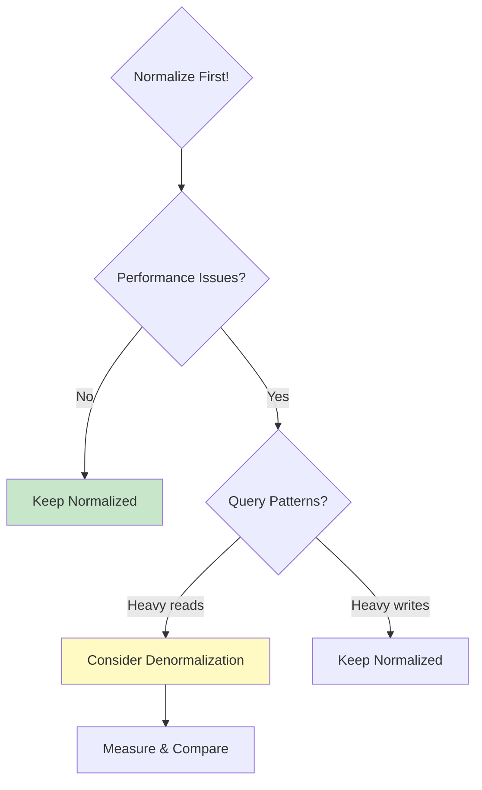

# 6.7 Advanced Normalization

[← Previous: 6.6 Normalization Fundamentals](./6_6-normalization-fundamentals.md) | [Back to Chapter 6](./chapter-06-README.md) | [Next: 6.8 Keys and Constraints →](./6_8-keys-constraints.md)

---

## 📖 Introduction

While 3NF is sufficient for most database designs, there are situations requiring **Boyce-Codd Normal Form (BCNF)** or even higher normal forms. This section also covers **denormalization** - intentionally violating normal forms for performance.

---

## 🎯 Learning Objectives

After completing this section, you will be able to:

- ✅ Apply Boyce-Codd Normal Form (BCNF)
- ✅ Understand when BCNF differs from 3NF
- ✅ Recognize when denormalization is appropriate
- ✅ Apply denormalization techniques strategically
- ✅ Balance normalization with performance needs

---

## Boyce-Codd Normal Form (BCNF)

### Definition

A table is in **BCNF** if:
1. It's in 3NF
2. For every functional dependency X → Y, X must be a **superkey**

In simpler terms: Every determinant must be a candidate key.

### When BCNF Differs from 3NF

BCNF is stricter than 3NF. A table can be in 3NF but NOT in BCNF when there are multiple overlapping candidate keys.

### BCNF Example

**Scenario:** Students enroll in courses, and each course-student combination has exactly one tutor.

**STUDENT_TUTOR:**
| student_id | course_id | tutor_id |
|------------|-----------|----------|
| S001 | CS101 | T01 |
| S001 | CS102 | T02 |
| S002 | CS101 | T01 |
| S002 | CS102 | T03 |

**Business Rules:**
- Each student takes each course with exactly one tutor
- Each tutor teaches only one course

**Functional Dependencies:**
1. (student_id, course_id) → tutor_id
2. tutor_id → course_id (Each tutor teaches one course!)

**Check 3NF:**
- Is in 3NF (no partial or transitive deps on non-key)

**Check BCNF:**
- FD: tutor_id → course_id
- Is tutor_id a superkey? NO!
- **NOT in BCNF!**

**Problem:** If tutor T01's course changes, we must update multiple rows.

**Solution - Decompose:**

**STUDENT_TUTOR:**
| student_id | tutor_id |
|------------|----------|
| S001 | T01 |
| S001 | T02 |
| S002 | T01 |
| S002 | T03 |

**TUTOR_COURSE:**
| tutor_id | course_id |
|----------|-----------|
| T01 | CS101 |
| T02 | CS102 |
| T03 | CS102 |

Now every determinant is a key in its table. ✅

### 3NF vs. BCNF Summary

| Aspect | 3NF | BCNF |
|--------|-----|------|
| Every determinant is a superkey | Not required | Required |
| Handles overlapping candidate keys | May have redundancy | Eliminates redundancy |
| Practical use | Most cases | Special cases |
| Can always achieve? | Yes | Sometimes loses FDs |

---

## Fourth Normal Form (4NF)

### Multi-valued Dependencies

A **multi-valued dependency** (MVD) exists when one attribute determines a set of values independently.

### 4NF Example

**STUDENT_SKILLS_HOBBIES:**
| student_id | skill | hobby |
|------------|-------|-------|
| S001 | Java | Reading |
| S001 | Java | Chess |
| S001 | Python | Reading |
| S001 | Python | Chess |
| S002 | SQL | Photography |

**Problem:** Student S001 has 2 skills and 2 hobbies = 4 rows!
Skills and hobbies are independent - no relationship between them.

**Solution - Decompose:**

**STUDENT_SKILL:**
| student_id | skill |
|------------|-------|
| S001 | Java |
| S001 | Python |
| S002 | SQL |

**STUDENT_HOBBY:**
| student_id | hobby |
|------------|-------|
| S001 | Reading |
| S001 | Chess |
| S002 | Photography |

---

## Denormalization

### What Is Denormalization?

**Denormalization** is the intentional introduction of redundancy to improve query performance.

> "Normalize until it hurts, then denormalize until it works."

### When to Denormalize



### Denormalization Techniques

#### 1. Storing Derived/Calculated Values

**Normalized:**
```sql
-- Calculate total every time
SELECT o.order_id, SUM(oi.quantity * oi.unit_price) as total
FROM orders o
JOIN order_items oi ON o.order_id = oi.order_id
GROUP BY o.order_id;
```

**Denormalized:**
```sql
-- Store total in orders table
CREATE TABLE orders (
    order_id INT PRIMARY KEY,
    customer_id INT,
    order_total DECIMAL(10,2)  -- Calculated field stored
);
```

**Trade-off:** Faster reads, but must update total when items change.

#### 2. Duplicating Foreign Key Data

**Normalized:** Query requires JOIN

```sql
-- Get student enrollments with course names
SELECT e.*, c.course_name
FROM enrollment e
JOIN course c ON e.course_id = c.course_id
WHERE e.student_id = 'S001';
```

**Denormalized:** Store course_name in enrollment

```sql
CREATE TABLE enrollment (
    enrollment_id INT PRIMARY KEY,
    student_id INT,
    course_id INT,
    course_name VARCHAR(100),  -- Duplicated!
    grade CHAR(2)
);
```

**Trade-off:** No JOIN needed, but course_name must be updated everywhere if it changes.

#### 3. Pre-computed Aggregates

**Normalized:**
```sql
-- Count students per department (expensive for reports)
SELECT d.dept_name, COUNT(s.student_id) as student_count
FROM department d
LEFT JOIN student s ON d.dept_id = s.dept_id
GROUP BY d.dept_id;
```

**Denormalized:**
```sql
CREATE TABLE department (
    dept_id INT PRIMARY KEY,
    dept_name VARCHAR(100),
    student_count INT DEFAULT 0  -- Pre-computed
);
```

**Trade-off:** Fast reports, but must maintain count on student inserts/deletes.

### Denormalization Decision Matrix

| Factor | Normalize | Denormalize |
|--------|-----------|-------------|
| **Read/Write Ratio** | More writes | More reads |
| **Query Complexity** | Simple queries | Complex JOINs |
| **Data Consistency** | Critical | Can tolerate slight delay |
| **Storage Cost** | Limited | Not a concern |
| **Update Frequency** | Frequent | Infrequent |

### Implementing Denormalization Safely

#### Use Triggers to Maintain Consistency

```sql
-- Auto-update order_total when items change
CREATE TRIGGER update_order_total
AFTER INSERT ON order_items
FOR EACH ROW
BEGIN
    UPDATE orders
    SET order_total = (
        SELECT SUM(quantity * unit_price)
        FROM order_items
        WHERE order_id = NEW.order_id
    )
    WHERE order_id = NEW.order_id;
END;
```

#### Use Materialized Views

```sql
-- Create materialized view for department stats
CREATE MATERIALIZED VIEW dept_stats AS
SELECT 
    d.dept_id,
    d.dept_name,
    COUNT(s.student_id) as student_count,
    AVG(s.gpa) as avg_gpa
FROM department d
LEFT JOIN student s ON d.dept_id = s.dept_id
GROUP BY d.dept_id, d.dept_name;

-- Refresh periodically
REFRESH MATERIALIZED VIEW dept_stats;
```

---

## School System: Normalization Decisions

### Fully Normalized Design

```mermaid
erDiagram
    STUDENT ||--o{ ENROLLMENT : has
    CLASS ||--o{ ENROLLMENT : contains
    ENROLLMENT ||--o{ GRADE : has
    
    STUDENT {
        int student_id PK
        string name
        decimal gpa
    }
    
    ENROLLMENT {
        int enrollment_id PK
        int student_id FK
        int class_id FK
        string final_grade
    }
    
    GRADE {
        int grade_id PK
        int enrollment_id FK
        int assignment_id FK
        decimal score
    }
```

### Strategic Denormalizations

| Denormalization | Reason | Implementation |
|-----------------|--------|----------------|
| Store `gpa` in STUDENT | Frequently displayed, expensive to calculate | Trigger on grade changes |
| Store `final_grade` in ENROLLMENT | Report card generation | Calculated at semester end |
| Store `student_count` in CLASS | Dashboard display | Trigger on enrollment changes |
| Cache `course_name` in reports | Historical accuracy | Copy at report generation |

### When NOT to Denormalize

❌ **Don't denormalize:**
- Data that changes frequently
- Small tables (JOINs are cheap)
- When consistency is critical (financial data)
- Without measuring actual performance
- Before identifying real bottlenecks

---

## Key Takeaways

✅ **BCNF is stricter than 3NF**
- Every determinant must be a superkey
- Handles overlapping candidate keys

✅ **4NF eliminates multi-valued dependencies**
- Independent multi-valued facts go in separate tables

✅ **Denormalization trades integrity for performance**
- Only after proving performance need
- Use triggers/views to maintain consistency

✅ **Normalize first, denormalize strategically**
- Start normalized
- Measure actual queries
- Denormalize specific bottlenecks

---

## Self-Check Questions

1. **What's the difference between 3NF and BCNF?**
   <details>
   <summary>Click to reveal answer</summary>
   BCNF requires every determinant to be a superkey. 3NF allows non-superkey determinants if the dependent is a prime attribute (part of some candidate key).
   </details>

2. **When is denormalization appropriate?**
   <details>
   <summary>Click to reveal answer</summary>
   When read performance is critical, query patterns involve expensive JOINs, data changes infrequently, and you've measured actual performance issues.
   </details>

3. **How do you maintain consistency in denormalized data?**
   <details>
   <summary>Click to reveal answer</summary>
   Use database triggers to auto-update denormalized values, or use materialized views that refresh periodically.
   </details>

---

## Practice Exercise

**Should you denormalize?**

Scenario: E-commerce site with:
- 1 million orders per day
- Product names change rarely
- Frequent "order history" queries that JOIN 5 tables
- Compliance requires accurate historical records

<details>
<summary>Click for analysis</summary>

**Analysis:**
- High read volume → Supports denormalization
- Product names rarely change → Safe to duplicate
- Complex JOINs → Denormalization would help
- Historical accuracy needed → Store snapshot at order time!

**Recommendation:** 
Denormalize order_items to include `product_name` and `price_at_purchase` - store the values AS THEY WERE when the order was placed. This is both a performance optimization AND a business requirement (showing what customer actually paid).

```sql
CREATE TABLE order_item (
    item_id INT PRIMARY KEY,
    order_id INT,
    product_id INT,
    product_name_snapshot VARCHAR(200),  -- Captured at order
    price_at_purchase DECIMAL(10,2),     -- Captured at order
    quantity INT
);
```
</details>

---

**Previous:** [← 6.6 Normalization Fundamentals](./6_6-normalization-fundamentals.md)

**Next:** [6.8 Keys and Constraints →](./6_8-keys-constraints.md)

---

*Estimated Reading Time: 35 minutes*
