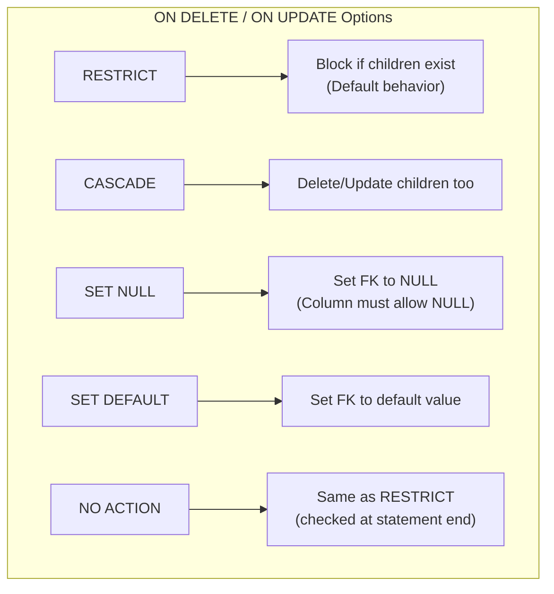

# 6.8 Keys and Constraints

[← Previous: 6.7 Advanced Normalization](./6_7-advanced-normalization.md) | [Back to Chapter 6](./chapter-06-README.md) | [Next: 6.9 ER to Relational Mapping →](./6_9-er-to-relational.md)

---

## 📖 Introduction

**Constraints** are rules enforced by the database to maintain data integrity. They prevent invalid data from entering your database and ensure relationships remain consistent. This section covers all types of keys and constraints you'll use in database design.

---

## 🎯 Learning Objectives

After completing this section, you will be able to:

- ✅ Implement all key types (Primary, Foreign, Unique, Composite)
- ✅ Apply constraint types (NOT NULL, CHECK, DEFAULT)
- ✅ Design referential integrity rules
- ✅ Handle cascading operations appropriately
- ✅ Create indexes for performance

---

## Key Types

### Primary Key (PK)

**Definition:** Uniquely identifies each row in a table.

**Rules:**
- Must be unique across all rows
- Cannot contain NULL values
- Only one per table
- Should not change after creation

```sql
-- Single column primary key
CREATE TABLE student (
    student_id INT PRIMARY KEY AUTO_INCREMENT,
    name VARCHAR(100) NOT NULL
);

-- Alternative syntax
CREATE TABLE student (
    student_id INT NOT NULL,
    name VARCHAR(100) NOT NULL,
    PRIMARY KEY (student_id)
);
```

### Composite Primary Key

**Definition:** Primary key consisting of multiple columns.

```sql
CREATE TABLE enrollment (
    student_id INT NOT NULL,
    class_id INT NOT NULL,
    enrollment_date DATE,
    grade CHAR(2),
    PRIMARY KEY (student_id, class_id)
);
```

**Use when:**
- Junction tables (M:N relationships)
- Weak entities
- Natural composite identifiers

### Foreign Key (FK)

**Definition:** A column that references a primary key in another table.

**Purpose:**
- Establishes relationships between tables
- Enforces referential integrity
- Prevents orphan records

```sql
CREATE TABLE enrollment (
    enrollment_id INT PRIMARY KEY,
    student_id INT NOT NULL,
    class_id INT NOT NULL,
    FOREIGN KEY (student_id) REFERENCES student(student_id),
    FOREIGN KEY (class_id) REFERENCES class(class_id)
);
```

### Unique Key (UK)

**Definition:** Ensures all values in a column are distinct.

**Difference from Primary Key:**
- Can have multiple unique constraints per table
- Can contain ONE NULL value (in most databases)

```sql
CREATE TABLE student (
    student_id INT PRIMARY KEY,
    email VARCHAR(100) UNIQUE,           -- Unique constraint
    student_number VARCHAR(20) UNIQUE,   -- Another unique constraint
    name VARCHAR(100)
);
```

### Alternate Key

**Definition:** A candidate key that wasn't chosen as the primary key.

```sql
CREATE TABLE student (
    student_id INT PRIMARY KEY,            -- Chosen as PK
    student_number VARCHAR(20) UNIQUE,     -- Alternate key
    national_id VARCHAR(15) UNIQUE,        -- Another alternate key
    name VARCHAR(100)
);
```

---

## Constraint Types

### NOT NULL

**Definition:** Column must have a value (cannot be empty).

```sql
CREATE TABLE student (
    student_id INT PRIMARY KEY,
    first_name VARCHAR(50) NOT NULL,      -- Required
    last_name VARCHAR(50) NOT NULL,       -- Required
    middle_name VARCHAR(50),              -- Optional (NULL allowed)
    email VARCHAR(100) NOT NULL           -- Required
);
```

### DEFAULT

**Definition:** Provides a default value if none is specified.

```sql
CREATE TABLE enrollment (
    enrollment_id INT PRIMARY KEY,
    student_id INT NOT NULL,
    class_id INT NOT NULL,
    enrollment_date DATE DEFAULT (CURRENT_DATE),
    status VARCHAR(20) DEFAULT 'active',
    grade CHAR(2) DEFAULT NULL
);
```

### CHECK

**Definition:** Validates that values meet specific conditions.

```sql
CREATE TABLE student (
    student_id INT PRIMARY KEY,
    name VARCHAR(100) NOT NULL,
    gpa DECIMAL(3,2) CHECK (gpa >= 0.00 AND gpa <= 4.00),
    age INT CHECK (age >= 5 AND age <= 100),
    status VARCHAR(20) CHECK (status IN ('active', 'graduated', 'withdrawn'))
);

CREATE TABLE grade (
    grade_id INT PRIMARY KEY,
    score DECIMAL(5,2) CHECK (score >= 0),
    max_score DECIMAL(5,2) CHECK (max_score > 0),
    CHECK (score <= max_score)  -- Cross-column check
);
```

### UNIQUE

**Definition:** Ensures column values are distinct.

```sql
CREATE TABLE course (
    course_id INT PRIMARY KEY,
    course_code VARCHAR(10) UNIQUE,
    name VARCHAR(100),
    UNIQUE (name)  -- Alternative syntax
);

-- Composite unique constraint
CREATE TABLE class (
    class_id INT PRIMARY KEY,
    course_id INT,
    section CHAR(1),
    semester VARCHAR(20),
    year INT,
    UNIQUE (course_id, section, semester, year)
);
```

---

## Referential Integrity

### What Is Referential Integrity?

Ensures that relationships between tables remain valid:
- FK value must match an existing PK value
- Cannot delete parent if children exist (by default)

### Referential Actions



### Examples

```sql
-- CASCADE: Delete student → Delete all their enrollments
CREATE TABLE enrollment (
    enrollment_id INT PRIMARY KEY,
    student_id INT NOT NULL,
    class_id INT NOT NULL,
    FOREIGN KEY (student_id) REFERENCES student(student_id)
        ON DELETE CASCADE
        ON UPDATE CASCADE
);

-- SET NULL: Delete teacher → Set class teacher_id to NULL
CREATE TABLE class (
    class_id INT PRIMARY KEY,
    course_id INT NOT NULL,
    teacher_id INT,  -- Must allow NULL!
    FOREIGN KEY (teacher_id) REFERENCES teacher(teacher_id)
        ON DELETE SET NULL
);

-- RESTRICT: Can't delete department if courses exist
CREATE TABLE course (
    course_id INT PRIMARY KEY,
    department_id INT NOT NULL,
    FOREIGN KEY (department_id) REFERENCES department(department_id)
        ON DELETE RESTRICT
);
```

### Choosing Referential Actions

| Scenario | Recommended Action |
|----------|-------------------|
| **Weak entity** (order_item → order) | CASCADE |
| **Optional relationship** (class → teacher) | SET NULL |
| **Critical reference** (invoice → customer) | RESTRICT |
| **Soft delete system** | RESTRICT (handle in app) |

---

## Indexes

### What Is an Index?

An **index** is a data structure that improves query speed by providing quick access to rows based on column values. Think of it like a book's index.

### When to Create Indexes

| Create Index | Avoid Index |
|-------------|-------------|
| Primary/Foreign keys | Columns rarely queried |
| Columns in WHERE clauses | Columns with few unique values |
| Columns in JOIN conditions | Small tables |
| Columns in ORDER BY | Frequently updated columns |

### Index Types

```sql
-- Single column index
CREATE INDEX idx_student_email ON student(email);

-- Composite index (order matters!)
CREATE INDEX idx_enrollment_date ON enrollment(student_id, enrollment_date);

-- Unique index
CREATE UNIQUE INDEX idx_course_code ON course(course_code);
```

### Index Best Practices

1. **PKs and FKs are automatically indexed** (in most databases)
2. **Order matters in composite indexes:** (A, B, C) helps queries on A, (A,B), or (A,B,C), but NOT on B or C alone
3. **Don't over-index:** Each index slows down INSERT/UPDATE
4. **Analyze query patterns:** Index columns used in WHERE and JOIN

---

## School System Constraints

### Complete Student Table

```sql
CREATE TABLE student (
    student_id INT PRIMARY KEY AUTO_INCREMENT,
    person_id INT NOT NULL UNIQUE,
    student_number VARCHAR(20) NOT NULL UNIQUE,
    enrollment_date DATE NOT NULL DEFAULT (CURRENT_DATE),
    grade_level VARCHAR(20) NOT NULL 
        CHECK (grade_level IN ('freshman', 'sophomore', 'junior', 'senior')),
    gpa DECIMAL(3,2) DEFAULT 0.00 
        CHECK (gpa >= 0.00 AND gpa <= 4.00),
    status VARCHAR(20) DEFAULT 'active' 
        CHECK (status IN ('active', 'graduated', 'withdrawn', 'suspended')),
    
    FOREIGN KEY (person_id) REFERENCES person(person_id)
        ON DELETE RESTRICT,
    
    INDEX idx_student_status (status),
    INDEX idx_student_grade (grade_level)
);
```

### Complete Enrollment Table

```sql
CREATE TABLE enrollment (
    enrollment_id INT PRIMARY KEY AUTO_INCREMENT,
    student_id INT NOT NULL,
    class_id INT NOT NULL,
    enrollment_date DATE NOT NULL DEFAULT (CURRENT_DATE),
    status VARCHAR(20) DEFAULT 'active' 
        CHECK (status IN ('active', 'completed', 'withdrawn', 'failed')),
    final_grade CHAR(2) 
        CHECK (final_grade IN ('A+', 'A', 'A-', 'B+', 'B', 'B-', 
                               'C+', 'C', 'C-', 'D+', 'D', 'F', 'W', 'I')),
    
    FOREIGN KEY (student_id) REFERENCES student(student_id)
        ON DELETE CASCADE,
    FOREIGN KEY (class_id) REFERENCES class(class_id)
        ON DELETE RESTRICT,
    
    UNIQUE KEY unique_enrollment (student_id, class_id),
    INDEX idx_enrollment_status (status)
);
```

### Complete Grade Table

```sql
CREATE TABLE grade (
    grade_id INT PRIMARY KEY AUTO_INCREMENT,
    enrollment_id INT NOT NULL,
    assignment_id INT NOT NULL,
    score DECIMAL(5,2) NOT NULL CHECK (score >= 0),
    submission_date DATETIME DEFAULT CURRENT_TIMESTAMP,
    late_submission BOOLEAN DEFAULT FALSE,
    comments TEXT,
    
    FOREIGN KEY (enrollment_id) REFERENCES enrollment(enrollment_id)
        ON DELETE CASCADE,
    FOREIGN KEY (assignment_id) REFERENCES assignment(assignment_id)
        ON DELETE CASCADE,
    
    UNIQUE KEY unique_grade (enrollment_id, assignment_id),
    
    -- Cross-table constraint (would need trigger in real implementation)
    -- CHECK (score <= (SELECT max_points FROM assignment WHERE assignment_id = grade.assignment_id))
);
```

---

## Key Takeaways

✅ **Primary keys uniquely identify rows**
- One per table, NOT NULL, shouldn't change

✅ **Foreign keys enforce relationships**
- Reference another table's primary key

✅ **Constraints maintain data integrity**
- NOT NULL, CHECK, DEFAULT, UNIQUE

✅ **Referential actions handle deletions/updates**
- CASCADE, SET NULL, RESTRICT

✅ **Indexes improve query performance**
- Create for frequently queried columns

---

## Self-Check Questions

1. **What's the difference between UNIQUE and PRIMARY KEY?**
   <details>
   <summary>Click to reveal answer</summary>
   PRIMARY KEY: one per table, no NULLs allowed. UNIQUE: multiple per table, can have one NULL (usually).
   </details>

2. **When would you use ON DELETE CASCADE?**
   <details>
   <summary>Click to reveal answer</summary>
   For dependent entities where child records have no meaning without the parent (e.g., order_items when order is deleted).
   </details>

3. **Why not index every column?**
   <details>
   <summary>Click to reveal answer</summary>
   Indexes slow down INSERT, UPDATE, and DELETE operations because the index must be maintained. Only index columns frequently used in WHERE, JOIN, or ORDER BY.
   </details>

---

**Previous:** [← 6.7 Advanced Normalization](./6_7-advanced-normalization.md)

**Next:** [6.9 ER to Relational Mapping →](./6_9-er-to-relational.md)

---

*Estimated Reading Time: 35 minutes*
