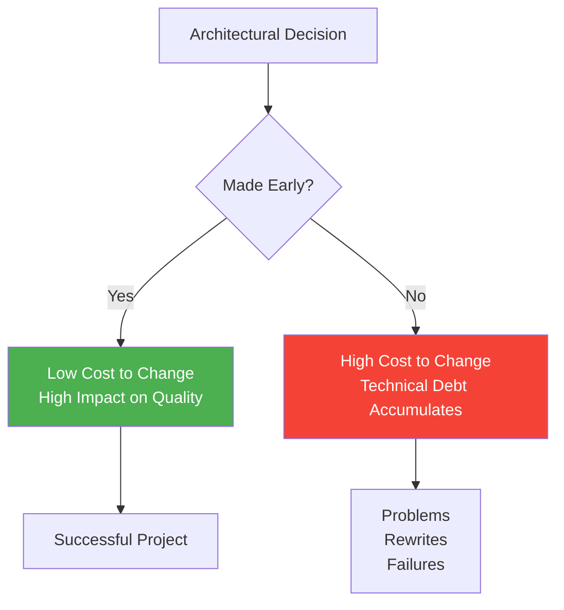
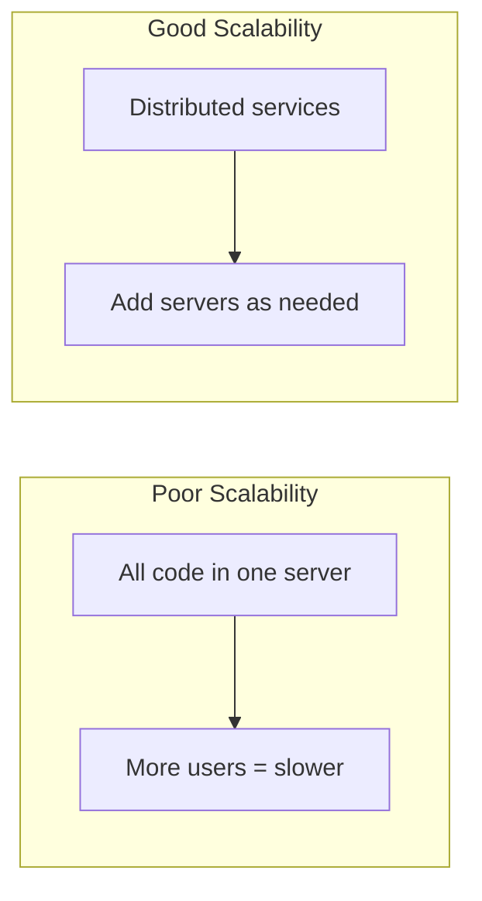
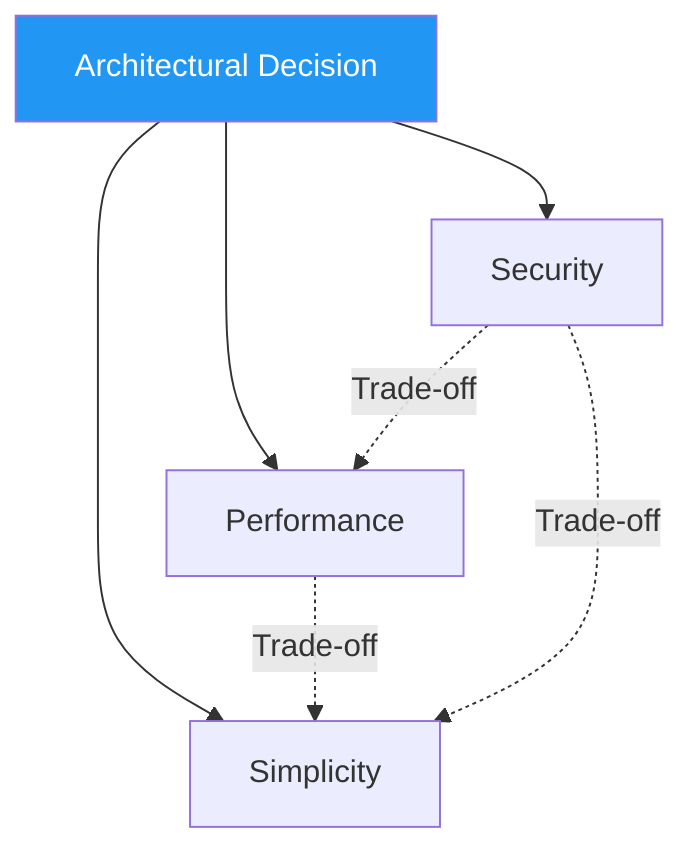
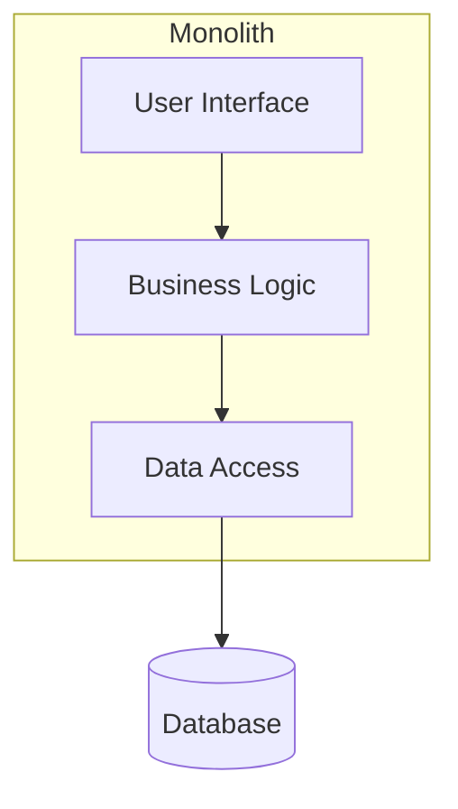
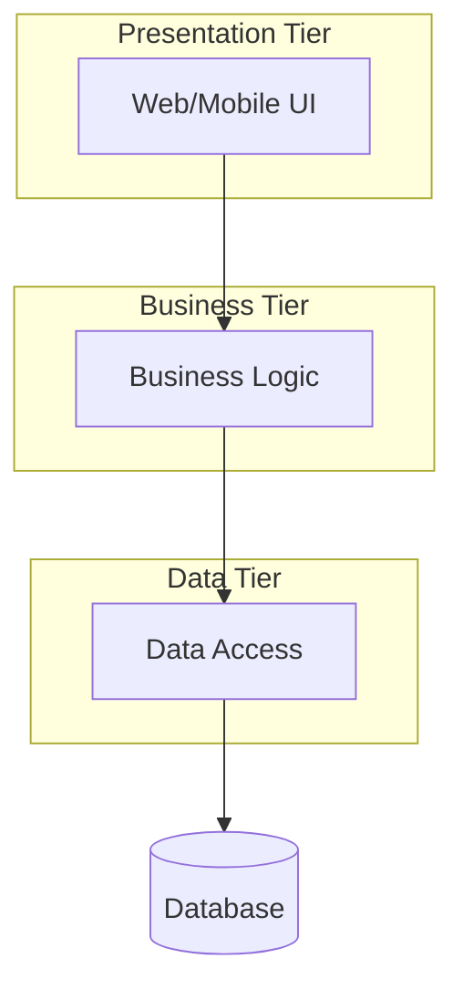
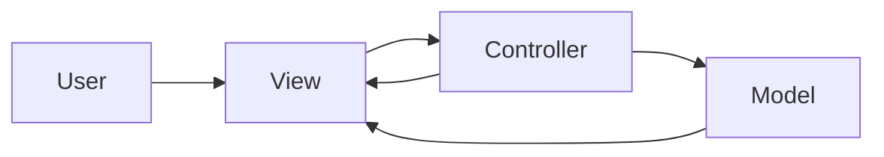
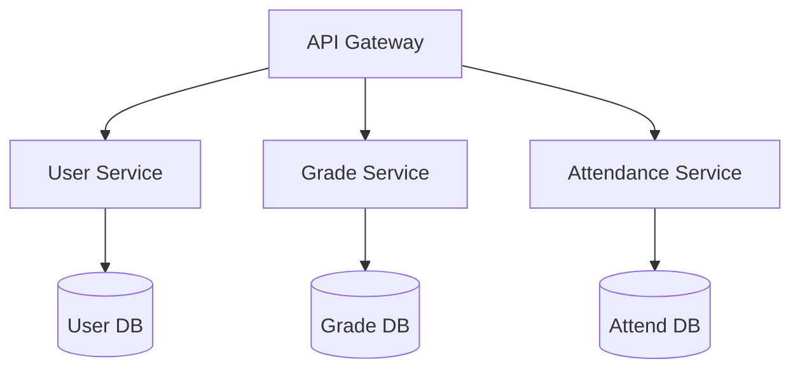
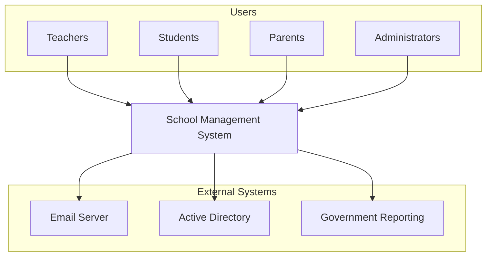
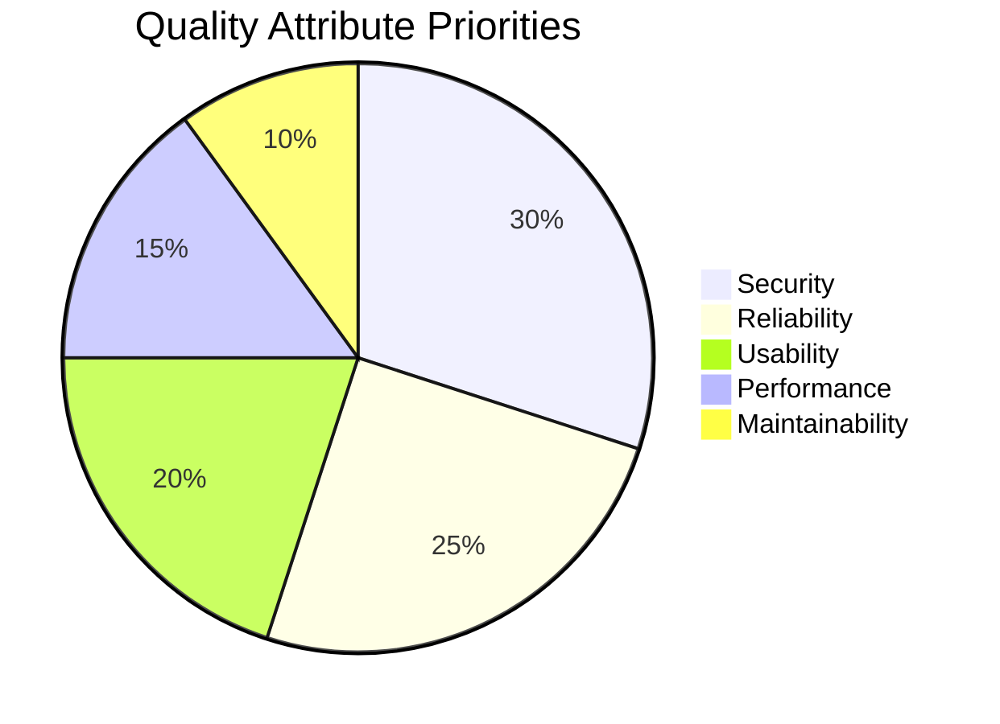

# 7.1 Architecture Fundamentals

[← Back to Chapter 7](./chapter-07-README.md) | [Next: 7.2 Layered Architecture →](./7_2-layered-architecture.md)

---

## Learning Objectives

- Define software architecture and explain its importance
- Distinguish between architecture and design
- Identify the key quality attributes that architecture addresses
- Understand architectural drivers and constraints

**Estimated Time:** 25 minutes

---

## What is Software Architecture?

### Definition

**Software Architecture** is the high-level structure of a software system that defines:
- The major **components** of the system
- The **relationships** between those components
- The **principles** and guidelines for system design and evolution

Think of it like building architecture: before constructing a building, architects create blueprints showing where walls go, how rooms connect, and where utilities run. Software architecture serves the same purpose for software systems.

### A Simple Analogy

Consider building a house:

| House Construction | Software Development |
|-------------------|---------------------|
| Blueprints | Architecture diagrams |
| Foundation | Core framework/platform |
| Load-bearing walls | Critical components |
| Rooms | Modules/services |
| Plumbing/electrical | Data flow/communication |
| Interior design | User interface |

**Key Insight:** You can change the paint color (UI) easily, but moving load-bearing walls (core architecture) requires significant effort and planning.

---

## Why Architecture Matters

### The Cost of Architectural Decisions

### Real-World Example: Twitter's Architecture Evolution

**2006 - Original Architecture (Ruby on Rails Monolith):**
- Simple, fast to develop
- Worked well for small user base
- Problems emerged at scale

**2009 - The "Fail Whale" Era:**
- 500 million tweets per day
- System crashed frequently
- Monolithic architecture couldn't scale

**2012+ - Service-Oriented Architecture:**
- Broke into 100+ microservices
- Each service scales independently
- 99.97% uptime achieved

**Lesson:** Twitter spent years and millions rewriting their architecture. Starting with the right architecture (or one that can evolve) saves enormous cost.

---

## Architecture vs. Design vs. Implementation

These terms are often confused. Here's the distinction:

| Aspect | Architecture | Design | Implementation |
|--------|--------------|--------|----------------|
| **Scope** | System-wide structure | Component-level structure | Code-level details |
| **Focus** | Major components & interactions | Classes, interfaces, algorithms | Functions, variables, syntax |
| **Decisions** | Which patterns? How many tiers? | Which design patterns? Class relationships? | Which loops? Variable names? |
| **Changes** | Expensive to change | Moderate cost to change | Relatively cheap to change |
| **Who?** | Architects, senior devs | Designers, developers | All developers |

### Example: School Management System

**Architecture Decision:**
"We will use a three-tier architecture with a web frontend, API backend, and relational database."

**Design Decision:**
"The GradeService class will implement the IGradeService interface and use the Repository pattern for data access."

**Implementation Decision:**
"We'll use a foreach loop to calculate the average grade from the list of scores."

---

## Key Quality Attributes

Architecture decisions directly impact these quality attributes (often called "-ilities"):

### 1. Scalability

**Definition:** The system's ability to handle growth.

**School System Example:**
- Bad: All processing on one server → fails during report card week
- Good: Separate grade calculation service that can scale independently

### 2. Maintainability

**Definition:** How easy is it to modify, fix, or enhance the system?

**School System Example:**
- Bad: Grade calculation mixed with UI code → changing calculation breaks display
- Good: Grade logic in separate layer → modify without touching UI

### 3. Security

**Definition:** Protection against unauthorized access and data breaches.

**School System Example:**
- Bad: Direct database access from UI → SQL injection vulnerabilities
- Good: All access through authenticated API layer → controlled access

### 4. Performance

**Definition:** Response time, throughput, and resource utilization.

**School System Example:**
- Bad: Regenerate entire report on every request → slow response
- Good: Cache common queries, generate reports in background

### 5. Testability

**Definition:** How easy is it to test the system?

**School System Example:**
- Bad: Business logic embedded in UI → can't test without UI
- Good: Logic in separate services → unit test independently

### Quality Attribute Trade-offs

**Important:** You can't maximize all quality attributes. Architecture is about making informed trade-offs based on priorities.

| If You Prioritize... | You Might Sacrifice... |
|---------------------|----------------------|
| Maximum Security | Some performance (encryption overhead) |
| High Performance | Some maintainability (optimized code is complex) |
| Simplicity | Some scalability (simple doesn't always scale) |

---

## Architectural Drivers

These factors **drive** your architectural decisions:

### 1. Functional Requirements

What the system must do:
- "Process 10,000 grade entries per hour"
- "Support real-time attendance tracking"

### 2. Non-Functional Requirements

Quality attributes (from Chapter 2):
- "99.9% uptime during school hours"
- "Response time under 2 seconds"

### 3. Constraints

Limitations you must work within:
- Budget: "Maximum $5,000 for hosting"
- Technology: "Must integrate with existing Active Directory"
- Regulatory: "Must comply with FERPA data privacy"

### 4. Stakeholder Concerns

Different stakeholders care about different things:

| Stakeholder | Primary Concern |
|-------------|-----------------|
| End Users | Performance, usability |
| Developers | Maintainability, clarity |
| Operations | Deployability, monitoring |
| Management | Cost, time to market |
| Security Team | Data protection, compliance |

---

## Common Architectural Styles

Here's a preview of patterns we'll cover in detail:

### 1. Monolithic Architecture

**Characteristics:**
- Single deployable unit
- All code in one codebase
- Simple to develop initially
- Can be hard to scale

### 2. Layered (N-Tier) Architecture

**Characteristics:**
- Organized in horizontal layers
- Each layer has specific responsibility
- Clear separation of concerns
- Most common enterprise pattern

### 3. MVC (Model-View-Controller)

**Characteristics:**
- Separates data, UI, and logic
- Popular for web applications
- Supports multiple views of same data

### 4. Microservices

**Characteristics:**
- Multiple small, independent services
- Each service has its own database
- Complex but highly scalable
- Best for large systems

---

## Architecture Documentation

### Why Document Architecture?

- **Communication:** Share understanding across team
- **Decision Record:** Remember why choices were made
- **Onboarding:** Help new team members understand system
- **Evolution:** Guide future development

### Key Architecture Documents

| Document | Purpose |
|----------|---------|
| **Context Diagram** | Shows system in its environment |
| **Component Diagram** | Major components and relationships |
| **Deployment Diagram** | How software maps to hardware |
| **Architecture Decision Records (ADRs)** | Why decisions were made |

### Simple Context Diagram: School System

---

## School Management System: Architectural Drivers

Let's identify the drivers for our case study:

### Functional Requirements
- Manage student enrollment and records
- Track attendance across all classes
- Record and calculate grades
- Generate report cards
- Enable parent-teacher communication

### Non-Functional Requirements
- Support 1,000 concurrent users
- 99.9% availability during school hours
- Response time < 2 seconds
- FERPA compliant data handling

### Constraints
- Must run on school's existing infrastructure
- Budget: Limited IT budget
- Integration: Existing student database
- Timeline: Ready for next school year

### Quality Attribute Priorities

**Decision:** Given these priorities, a **Layered Architecture with MVC** is appropriate—simple enough for the team, secure with proper layer isolation, and reliable for a school environment.

---

## Key Takeaways

✅ **Architecture is the high-level structure** of your system—the major components and how they interact

✅ **Architecture decisions are expensive to change** later—make them thoughtfully

✅ **Quality attributes drive architecture** choices—you must prioritize and make trade-offs

✅ **Different styles suit different needs**—there's no "best" architecture, only appropriate ones

✅ **Document your architecture**—for communication, onboarding, and future evolution

---

## Self-Check Questions

1. **What is the difference between architecture and design?**
   

   
Click to reveal answer

   Architecture deals with system-wide structure (major components, their relationships, and principles). Design deals with component-level details (classes, interfaces, algorithms). Architecture is harder to change than design.
   

2. **Name three quality attributes that architecture impacts.**
   

   
Click to reveal answer

   Any three of: Scalability, Maintainability, Security, Performance, Testability, Reliability, Usability, Portability.
   

3. **Why did Twitter have to rewrite their architecture?**
   

   
Click to reveal answer

   Their monolithic Ruby on Rails architecture couldn't handle the scale (500 million tweets/day). They rewrote to microservices where each service could scale independently.
   

4. **What are architectural drivers?**
   

   
Click to reveal answer

   Factors that influence architectural decisions: functional requirements, non-functional requirements, constraints (budget, technology, regulations), and stakeholder concerns.
   

---

## What's Next?

Now that you understand architecture fundamentals, we'll explore specific patterns:

**Section 7.2:** The Layered (N-Tier) Architecture—the most common pattern for business applications

---

**Previous:** [← Chapter 7 Overview](./chapter-07-README.md)

**Next:** [7.2 Layered Architecture →](./7_2-layered-architecture.md)

---

*Estimated Reading Time: 25 minutes*
