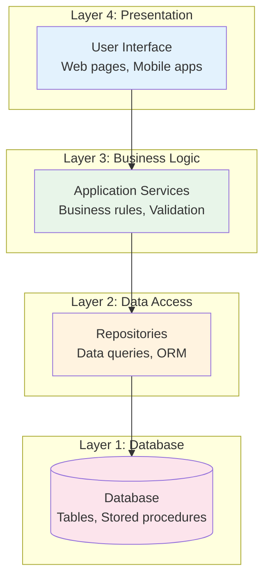
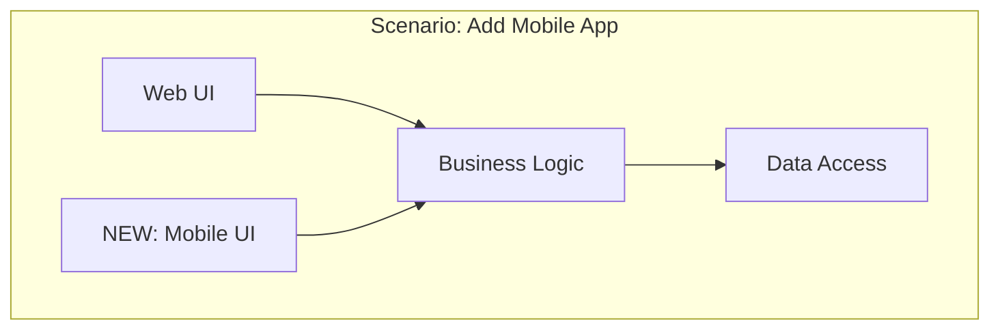
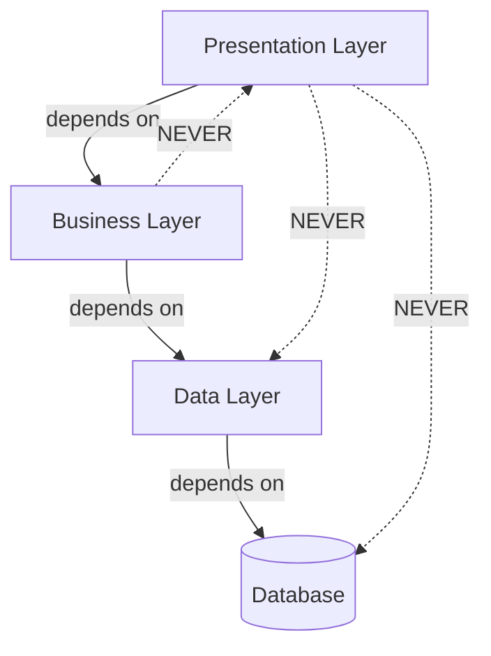
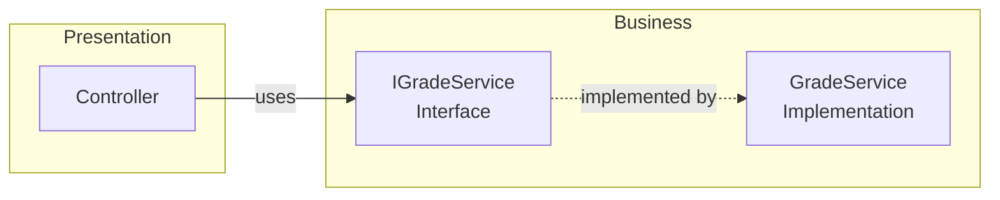
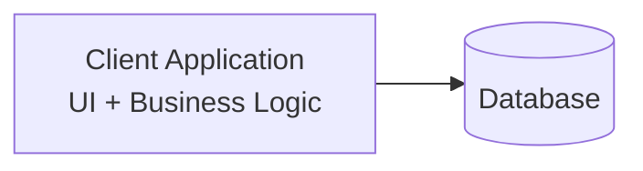
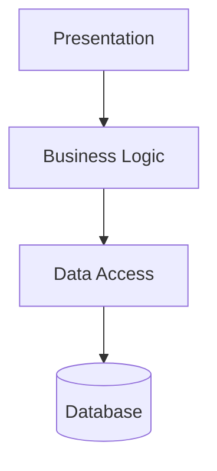
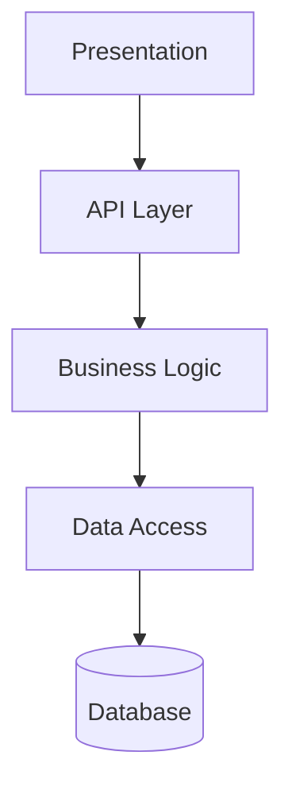
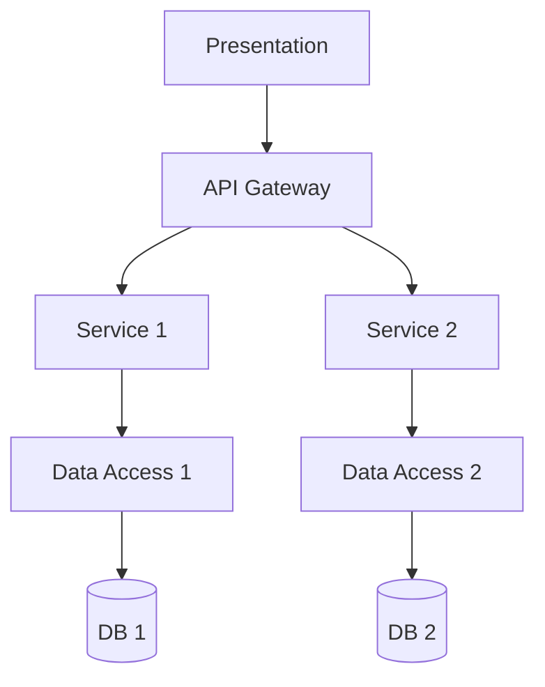
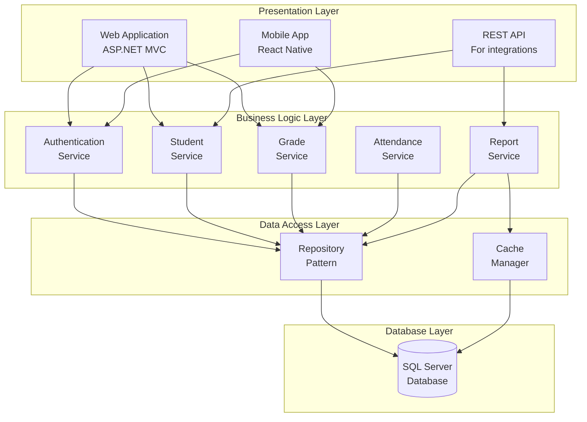

# 7.2 Layered (N-Tier) Architecture

[← Previous: 7.1 Architecture Fundamentals](./7_1-architecture-fundamentals.md) | [Back to Chapter 7](./chapter-07-README.md) | [Next: 7.3 MVC Pattern →](./7_3-mvc-pattern.md)

---

## Learning Objectives

- Understand the layered architecture pattern and its benefits
- Identify the responsibilities of each layer in an N-tier system
- Apply separation of concerns to organize code
- Design a layered architecture for a business application

**Estimated Time:** 30 minutes

---

## What is Layered Architecture?

### Definition

**Layered Architecture** (also called **N-Tier Architecture**) organizes a system into horizontal layers, where each layer has a specific responsibility and only communicates with adjacent layers.

Think of it like a multi-story building:
- Each floor has a purpose (offices, parking, retail)
- You typically move between adjacent floors
- Changes to one floor don't affect others

### The Basic Structure



**Key Rule:** Each layer only depends on the layer directly below it. The Presentation layer never talks directly to the Database.

---

## The Standard Three-Tier Model

The most common configuration is three tiers:

### Tier 1: Presentation Layer

**Responsibility:** Display information to users and collect their input.

**Contains:**
- User interface components (forms, buttons, menus)
- Input validation (is the email format correct?)
- Display formatting (show date as "January 5, 2026")
- Navigation logic

**Does NOT contain:**
- Business rules
- Database queries
- Data calculations

### Tier 2: Business Logic Layer (BLL)

**Responsibility:** Implement business rules and application logic.

**Contains:**
- Business rules ("Students can only enroll in 6 courses")
- Calculations (GPA calculation, attendance percentage)
- Workflow logic (what happens after grade submission?)
- Authorization rules (can this user do this action?)

**Does NOT contain:**
- UI code
- Direct database queries
- HTML/CSS/JavaScript

### Tier 3: Data Access Layer (DAL)

**Responsibility:** Communicate with the database.

**Contains:**
- Database queries (SELECT, INSERT, UPDATE, DELETE)
- Object-Relational Mapping (ORM)
- Connection management
- Data caching

**Does NOT contain:**
- Business rules
- UI logic
- User-facing error messages

---

## Why Use Layered Architecture?

### Benefits

| Benefit | Explanation |
|---------|-------------|
| **Separation of Concerns** | Each layer handles one aspect of the application |
| **Maintainability** | Changes to one layer don't affect others |
| **Testability** | Test each layer independently |
| **Reusability** | Business logic can serve multiple UIs |
| **Team Organization** | Different teams can work on different layers |

### Example: Changing the UI



**With layered architecture:** Add new UI, reuse existing business logic.

**Without layered architecture:** Rewrite everything for mobile.

---

## Code Example: School Grade System

Let's see how the same functionality looks across layers:

### Layer 3: Presentation (UI)

```csharp
// GradeController.cs - Handles HTTP requests
public class GradeController : Controller
{
    private readonly IGradeService _gradeService;
    
    public GradeController(IGradeService gradeService)
    {
        _gradeService = gradeService;  // Injected dependency
    }
    
    // Display grade entry form
    public IActionResult EnterGrade(int studentId, int courseId)
    {
        var model = new GradeEntryViewModel
        {
            StudentId = studentId,
            CourseId = courseId
        };
        return View(model);
    }
    
    // Process submitted grade
    [HttpPost]
    public IActionResult SaveGrade(GradeEntryViewModel model)
    {
        if (!ModelState.IsValid)
            return View(model);
            
        // UI doesn't calculate - just calls business layer
        _gradeService.RecordGrade(
            model.StudentId, 
            model.CourseId, 
            model.Score
        );
        
        return RedirectToAction("Success");
    }
}
```

**Notice:** The controller doesn't contain grade calculation logic—it delegates to the service.

### Layer 2: Business Logic

```csharp
// GradeService.cs - Contains business rules
public class GradeService : IGradeService
{
    private readonly IGradeRepository _gradeRepo;
    private readonly IStudentRepository _studentRepo;
    
    public GradeService(IGradeRepository gradeRepo, IStudentRepository studentRepo)
    {
        _gradeRepo = gradeRepo;
        _studentRepo = studentRepo;
    }
    
    public void RecordGrade(int studentId, int courseId, decimal score)
    {
        // Business rule: Score must be 0-100
        if (score < 0 || score > 100)
            throw new BusinessException("Score must be between 0 and 100");
        
        // Business rule: Student must be enrolled
        if (!_studentRepo.IsEnrolled(studentId, courseId))
            throw new BusinessException("Student not enrolled in this course");
        
        // Create grade entity
        var grade = new Grade
        {
            StudentId = studentId,
            CourseId = courseId,
            Score = score,
            RecordedDate = DateTime.Now
        };
        
        // Delegate to data layer
        _gradeRepo.Save(grade);
        
        // Business logic: Update student's GPA
        UpdateStudentGPA(studentId);
    }
    
    public decimal CalculateGPA(int studentId)
    {
        var grades = _gradeRepo.GetByStudent(studentId);
        
        // Business rule: GPA calculation
        decimal totalPoints = 0;
        int courseCount = 0;
        
        foreach (var grade in grades)
        {
            totalPoints += ConvertToGradePoints(grade.Score);
            courseCount++;
        }
        
        return courseCount > 0 ? totalPoints / courseCount : 0;
    }
    
    private decimal ConvertToGradePoints(decimal score)
    {
        // Business rule: Grade point conversion
        if (score >= 90) return 4.0m;
        if (score >= 80) return 3.0m;
        if (score >= 70) return 2.0m;
        if (score >= 60) return 1.0m;
        return 0.0m;
    }
}
```

**Notice:** All business rules live here—validation, calculations, workflows.

### Layer 1: Data Access

```csharp
// GradeRepository.cs - Database operations only
public class GradeRepository : IGradeRepository
{
    private readonly SchoolDbContext _context;
    
    public GradeRepository(SchoolDbContext context)
    {
        _context = context;
    }
    
    public void Save(Grade grade)
    {
        _context.Grades.Add(grade);
        _context.SaveChanges();
    }
    
    public Grade GetById(int id)
    {
        return _context.Grades.Find(id);
    }
    
    public IEnumerable<Grade> GetByStudent(int studentId)
    {
        return _context.Grades
            .Where(g => g.StudentId == studentId)
            .ToList();
    }
    
    public IEnumerable<Grade> GetByCourse(int courseId)
    {
        return _context.Grades
            .Where(g => g.CourseId == courseId)
            .ToList();
    }
}
```

**Notice:** Only database operations here—no business logic, no UI concerns.

---

## Layer Communication Rules

### The Dependency Direction



**Rules:**
1. Upper layers depend on lower layers
2. Lower layers never depend on upper layers
3. Layers should not skip levels

### Using Interfaces for Loose Coupling



**Why interfaces?** The Presentation layer depends on the interface, not the concrete class. This allows:
- Easy testing (mock the interface)
- Easy replacement (swap implementations)
- Loose coupling between layers

---

## Variations: Two-Tier to N-Tier

### Two-Tier (Client-Server)



**Use when:** Simple applications, desktop apps, prototypes

**Problems:** Business logic duplicated if multiple clients

### Three-Tier (Most Common)



**Use when:** Most business applications, web apps

### Four-Tier (With API Layer)



**Use when:** Multiple client types (web, mobile, third-party)

### N-Tier (Multiple Service Layers)



**Use when:** Large enterprise systems, microservices

---

## School Management System: Layered Architecture

Let's apply layered architecture to our case study:



### Layer Responsibilities

| Layer | Components | Responsibilities |
|-------|------------|------------------|
| **Presentation** | Web app, Mobile app, API | User interaction, input validation, display |
| **Business Logic** | Service classes | Business rules, calculations, workflows |
| **Data Access** | Repositories, Cache | Database operations, caching |
| **Database** | SQL Server | Data storage, integrity |

---

## Common Mistakes

### ❌ Mistake 1: Business Logic in the UI

```csharp
// BAD: Business rule in controller
public IActionResult SaveGrade(GradeViewModel model)
{
    // This should be in Business Layer!
    if (model.Score < 60)
    {
        SendFailureNotification(model.StudentId);
    }
    
    _context.Grades.Add(grade);  // Direct DB access!
    _context.SaveChanges();
}
```

**Problem:** Logic duplicated if you add mobile app.

### ❌ Mistake 2: Skipping Layers

```csharp
// BAD: Presentation directly accessing Data Layer
public class GradeController
{
    private readonly SchoolDbContext _context;  // Should use service!
    
    public IActionResult GetGrades()
    {
        var grades = _context.Grades.ToList();  // Bypasses business layer
        return View(grades);
    }
}
```

**Problem:** No place for business rules or validation.

### ❌ Mistake 3: Data Layer Knowing Business Rules

```csharp
// BAD: Business rule in repository
public class GradeRepository
{
    public void Save(Grade grade)
    {
        // This belongs in Business Layer!
        if (grade.Score < 60)
        {
            grade.Status = "Failing";
        }
        
        _context.Grades.Add(grade);
    }
}
```

**Problem:** Data layer should only handle data operations.

---

## Key Takeaways

✅ **Layered architecture separates concerns** into distinct horizontal layers

✅ **Three tiers is most common:** Presentation → Business Logic → Data Access

✅ **Each layer has ONE job:** UI displays, Business calculates, Data stores

✅ **Layers only talk to adjacent layers**—never skip levels

✅ **Use interfaces** for loose coupling between layers

✅ **Business logic belongs in the business layer**—not UI, not database

---

## Self-Check Questions

1. **What are the three standard layers in a three-tier architecture?**
   <details>
   <summary>Click to reveal answer</summary>
   Presentation Layer (UI), Business Logic Layer (BLL), and Data Access Layer (DAL).
   </details>

2. **Why shouldn't the Presentation layer access the database directly?**
   <details>
   <summary>Click to reveal answer</summary>
   Because it bypasses business rules and validation in the Business Logic Layer. Also, if you need multiple UIs, each would need its own database code.
   </details>

3. **Where should GPA calculation logic be placed?**
   <details>
   <summary>Click to reveal answer</summary>
   In the Business Logic Layer (e.g., GradeService). It's a business rule, not a UI concern or a database operation.
   </details>

4. **What is the benefit of using interfaces between layers?**
   <details>
   <summary>Click to reveal answer</summary>
   Loose coupling—upper layers depend on interfaces, not implementations. This enables easier testing (mock interfaces), easier replacement of implementations, and parallel development.
   </details>

---

## Practice Exercise

**Scenario:** You're designing a Library Management System with these features:
- Users can search for books
- Users can borrow and return books
- Librarians can add new books
- System tracks which books are overdue

**Task:** Create a layer diagram showing:
1. What components belong in each layer
2. Which services would exist in the Business Logic layer
3. What repositories would exist in the Data Access layer

<details>
<summary>Click for sample answer</summary>

```
Presentation Layer:
- Web Application (user searches, borrow requests)
- Librarian Dashboard (add books, view reports)
- API (for mobile app)

Business Logic Layer:
- BookService (search, add books)
- BorrowingService (borrow, return, calculate due dates)
- UserService (member management)
- NotificationService (overdue alerts)

Data Access Layer:
- BookRepository
- BorrowingRepository
- UserRepository

Database:
- Books, Users, Borrowings tables
```

</details>

---

**Previous:** [← 7.1 Architecture Fundamentals](./7_1-architecture-fundamentals.md)

**Next:** [7.3 MVC Pattern →](./7_3-mvc-pattern.md)

---

*Estimated Reading Time: 30 minutes*
