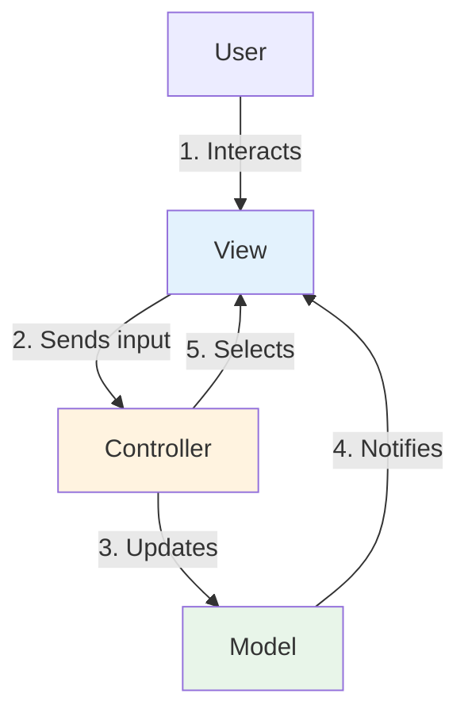
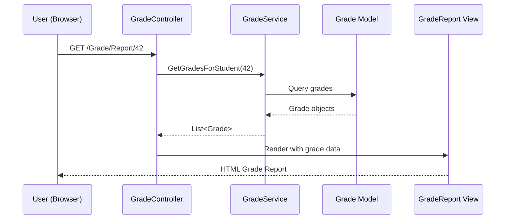
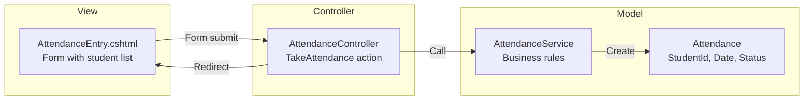
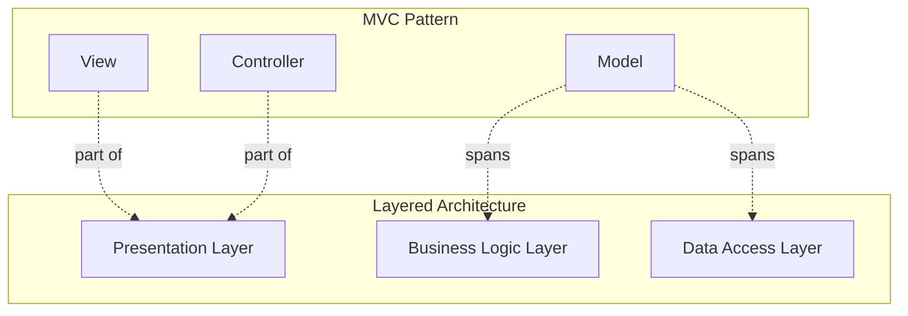
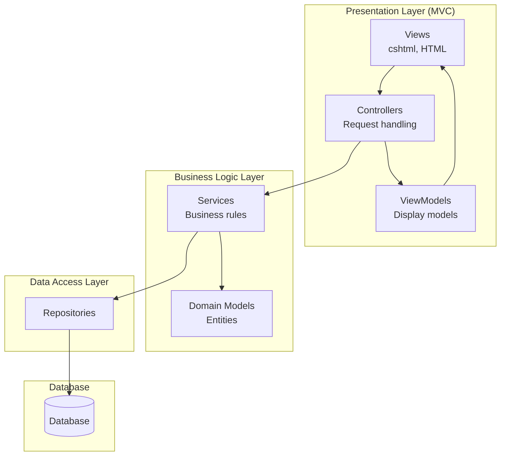

# 7.3 MVC Pattern

[← Previous: 7.2 Layered Architecture](./7_2-layered-architecture.md) | [Back to Chapter 7](./chapter-07-README.md) | [Next: 7.4 MVVM and Other Patterns →](./7_4-mvvm-other-patterns.md)

---

## Learning Objectives

- Understand the Model-View-Controller pattern and its components
- Identify how MVC separates concerns in web applications
- Trace the request-response flow in an MVC application
- Apply MVC concepts to the School Management System

**Estimated Time:** 30 minutes

---

## What is MVC?

### Definition

**Model-View-Controller (MVC)** is an architectural pattern that separates an application into three interconnected components:

- **Model:** Data and business logic
- **View:** User interface (what users see)
- **Controller:** Handles user input and coordinates Model and View

### The MVC Triangle



### A Simple Analogy: Restaurant

| MVC Component | Restaurant Equivalent |
|---------------|----------------------|
| **Model** | Kitchen (prepares food, has recipes) |
| **View** | Table setting & menu (what customer sees) |
| **Controller** | Waiter (takes orders, delivers food) |

The waiter (Controller) takes your order (user input), tells the kitchen (Model) what to prepare, and serves the food on the table (View).

---

## The Three Components

### Model

**Purpose:** Manages data, logic, and rules of the application.

**Responsibilities:**
- Represent data structures (Student, Grade, Course)
- Contain business logic and validation
- Handle data access (often with repository pattern)
- Notify views of data changes

**Example:**

```csharp
// Student.cs - Model class
public class Student
{
    public int Id { get; set; }
    public string FirstName { get; set; }
    public string LastName { get; set; }
    public string Email { get; set; }
    public DateTime EnrollmentDate { get; set; }
    public decimal GPA { get; set; }
    
    // Business logic in model
    public string FullName => $"{FirstName} {LastName}";
    
    public bool IsOnProbation => GPA < 2.0m;
}
```

### View

**Purpose:** Displays data to the user.

**Responsibilities:**
- Present data from the model
- Collect user input
- Define the visual layout
- No business logic!

**Example:**

```html
<!-- StudentDetails.cshtml - View template -->
@model Student

<div class="student-card">
    <h2>@Model.FullName</h2>
    <p>Email: @Model.Email</p>
    <p>GPA: @Model.GPA.ToString("F2")</p>
    
    @if (Model.IsOnProbation)
    {
        <span class="warning">Academic Probation</span>
    }
    
    <a href="/Student/Edit/@Model.Id">Edit</a>
</div>
```

### Controller

**Purpose:** Handles user requests and coordinates Model and View.

**Responsibilities:**
- Receive user input (HTTP requests)
- Process input (call appropriate services)
- Update models as needed
- Select and return appropriate view

**Example:**

```csharp
// StudentController.cs - Controller class
public class StudentController : Controller
{
    private readonly IStudentService _studentService;
    
    public StudentController(IStudentService studentService)
    {
        _studentService = studentService;
    }
    
    // GET: /Student/Details/5
    public IActionResult Details(int id)
    {
        // 1. Get data from model/service
        var student = _studentService.GetById(id);
        
        if (student == null)
            return NotFound();
        
        // 2. Pass to view
        return View(student);
    }
    
    // POST: /Student/Edit/5
    [HttpPost]
    public IActionResult Edit(int id, StudentEditViewModel model)
    {
        // 1. Validate input
        if (!ModelState.IsValid)
            return View(model);
        
        // 2. Update model
        _studentService.Update(id, model);
        
        // 3. Redirect to appropriate view
        return RedirectToAction("Details", new { id });
    }
}
```

---

## MVC Request Flow

Let's trace a complete request through the MVC pattern:

### Example: Viewing a Student's Grade Report



### Step-by-Step Breakdown

| Step | Component | Action |
|------|-----------|--------|
| 1 | Browser | User clicks "View Grades" link |
| 2 | Router | Maps URL to GradeController.Report |
| 3 | Controller | Receives request with studentId=42 |
| 4 | Service | Controller calls GradeService |
| 5 | Model | Service retrieves Grade objects |
| 6 | Controller | Receives grade data |
| 7 | View | Controller passes data to View |
| 8 | Browser | View renders HTML and sends to browser |

---

## MVC in Popular Frameworks

MVC is implemented in many web frameworks:

| Framework | Language | Notes |
|-----------|----------|-------|
| **ASP.NET MVC** | C# | Microsoft's implementation |
| **Spring MVC** | Java | Enterprise Java standard |
| **Ruby on Rails** | Ruby | "Convention over configuration" |
| **Laravel** | PHP | Popular PHP framework |
| **Django** | Python | Uses MTV (Model-Template-View) |

### Framework Example: ASP.NET MVC

```
SchoolSystem/
├── Controllers/
│   ├── StudentController.cs
│   ├── GradeController.cs
│   └── CourseController.cs
├── Models/
│   ├── Student.cs
│   ├── Grade.cs
│   └── Course.cs
├── Views/
│   ├── Student/
│   │   ├── Index.cshtml
│   │   ├── Details.cshtml
│   │   └── Edit.cshtml
│   ├── Grade/
│   │   ├── Report.cshtml
│   │   └── Entry.cshtml
│   └── Shared/
│       └── _Layout.cshtml
└── Services/
    ├── StudentService.cs
    └── GradeService.cs
```

---

## School Management System: MVC Design

Let's apply MVC to key features of our School Management System:

### Feature: Attendance Entry



### Code Structure

**Model:**
```csharp
public class Attendance
{
    public int Id { get; set; }
    public int StudentId { get; set; }
    public int ClassSessionId { get; set; }
    public DateTime Date { get; set; }
    public AttendanceStatus Status { get; set; }  // Present, Absent, Tardy, Excused
    
    public virtual Student Student { get; set; }
}

public enum AttendanceStatus
{
    Present,
    Absent,
    Tardy,
    Excused
}
```

**Controller:**
```csharp
public class AttendanceController : Controller
{
    private readonly IAttendanceService _attendanceService;
    private readonly IClassService _classService;
    
    [Authorize(Roles = "Teacher")]
    public IActionResult TakeAttendance(int classId)
    {
        var students = _classService.GetStudentsInClass(classId);
        var model = new AttendanceEntryViewModel
        {
            ClassId = classId,
            Date = DateTime.Today,
            Students = students
        };
        return View(model);
    }
    
    [HttpPost]
    [Authorize(Roles = "Teacher")]
    public IActionResult SaveAttendance(AttendanceEntryViewModel model)
    {
        if (!ModelState.IsValid)
            return View("TakeAttendance", model);
        
        _attendanceService.RecordAttendance(model.ClassId, model.Date, model.Entries);
        
        return RedirectToAction("ClassDashboard", new { classId = model.ClassId });
    }
}
```

**View:**
```html
@model AttendanceEntryViewModel

<h2>Take Attendance - @Model.ClassName</h2>
<p>Date: @Model.Date.ToShortDateString()</p>

<form method="post" asp-action="SaveAttendance">
    <input type="hidden" asp-for="ClassId" />
    <input type="hidden" asp-for="Date" />
    
    <table class="table">
        <thead>
            <tr>
                <th>Student</th>
                <th>Status</th>
            </tr>
        </thead>
        <tbody>
            @for (int i = 0; i < Model.Students.Count; i++)
            {
                <tr>
                    <td>@Model.Students[i].FullName</td>
                    <td>
                        <select asp-for="Entries[i].Status">
                            <option value="Present">Present</option>
                            <option value="Absent">Absent</option>
                            <option value="Tardy">Tardy</option>
                            <option value="Excused">Excused</option>
                        </select>
                        <input type="hidden" asp-for="Entries[i].StudentId" />
                    </td>
                </tr>
            }
        </tbody>
    </table>
    
    <button type="submit" class="btn btn-primary">Save Attendance</button>
</form>
```

---

## MVC vs. Layered Architecture

How does MVC relate to layered architecture?



**Key Insight:** MVC operates within the Presentation layer, organizing how UI code is structured. The Model often connects to services in the Business Logic layer.

### Combined View



---

## Benefits and Limitations

### Benefits of MVC

| Benefit | Explanation |
|---------|-------------|
| **Separation of Concerns** | UI, logic, and data handling are separated |
| **Parallel Development** | Teams can work on V, M, C independently |
| **Testability** | Controllers and Models can be unit tested |
| **Multiple Views** | Same model, different views (web, mobile, API) |
| **Industry Standard** | Widely understood pattern |

### Limitations of MVC

| Limitation | Explanation |
|------------|-------------|
| **Complexity** | Overkill for very simple applications |
| **Learning Curve** | New developers need to understand the pattern |
| **Controller Bloat** | Controllers can become too large |
| **Tight Coupling** | View and Controller often tightly coupled |

---

## Common MVC Mistakes

### ❌ Mistake 1: Fat Controllers

```csharp
// BAD: Too much logic in controller
public IActionResult CalculateGrades(int studentId)
{
    var grades = _context.Grades.Where(g => g.StudentId == studentId).ToList();
    
    // All this should be in a service!
    decimal total = 0;
    foreach (var grade in grades)
    {
        total += grade.Score * grade.Course.Credits;
    }
    var gpa = total / grades.Sum(g => g.Course.Credits);
    
    // More calculation...
    // More calculation...
    
    return View(new GpaViewModel { GPA = gpa });
}
```

**Fix:** Move logic to services. Controllers should be thin.

### ❌ Mistake 2: Business Logic in Views

```html
<!-- BAD: Calculation in view -->
@{
    decimal gpa = 0;
    foreach (var grade in Model.Grades)
    {
        gpa += ConvertToPoints(grade.Score);  // Business logic!
    }
    gpa /= Model.Grades.Count;
}

<p>GPA: @gpa</p>
```

**Fix:** Calculate in Model or Service, pass result to View.

### ❌ Mistake 3: Direct Database Access in Controller

```csharp
// BAD: Controller accessing database directly
public class StudentController : Controller
{
    private readonly SchoolDbContext _context;  // Should use service!
    
    public IActionResult List()
    {
        var students = _context.Students.ToList();  // Direct DB access
        return View(students);
    }
}
```

**Fix:** Use services that encapsulate data access.

---

## Key Takeaways

✅ **MVC separates** user interface (View), user interaction (Controller), and data/logic (Model)

✅ **Controllers should be thin**—delegate business logic to services

✅ **Views should only display**—no calculations or business rules

✅ **Models can span layers**—domain models in business layer, view models for UI

✅ **MVC works within layered architecture**—it organizes the Presentation layer

---

## Self-Check Questions

1. **What are the three components of MVC and their responsibilities?**
   <details>
   <summary>Click to reveal answer</summary>
   Model: Data and business logic. View: User interface display. Controller: Handles input, coordinates Model and View.
   </details>

2. **In the restaurant analogy, what role does the Controller play?**
   <details>
   <summary>Click to reveal answer</summary>
   The waiter—takes orders from customers (user input), communicates with the kitchen (Model), and delivers food to the table (View).
   </details>

3. **Why shouldn't business logic be placed in Views?**
   <details>
   <summary>Click to reveal answer</summary>
   Views should only display data. Business logic in views makes code hard to test, maintain, and reuse. The logic can't be shared if you add another view (mobile app).
   </details>

4. **How does MVC relate to layered architecture?**
   <details>
   <summary>Click to reveal answer</summary>
   MVC operates within the Presentation layer of a layered architecture. Views and Controllers are presentation concerns. Models often connect to the Business Logic layer through services.
   </details>

---

**Previous:** [← 7.2 Layered Architecture](./7_2-layered-architecture.md)

**Next:** [7.4 MVVM and Other Patterns →](./7_4-mvvm-other-patterns.md)

---

*Estimated Reading Time: 30 minutes*
