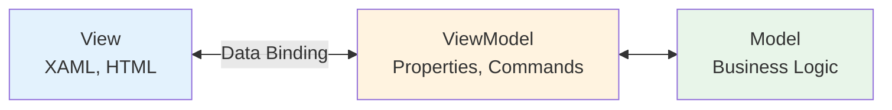
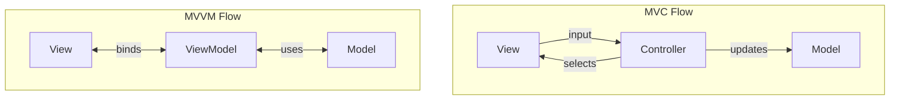
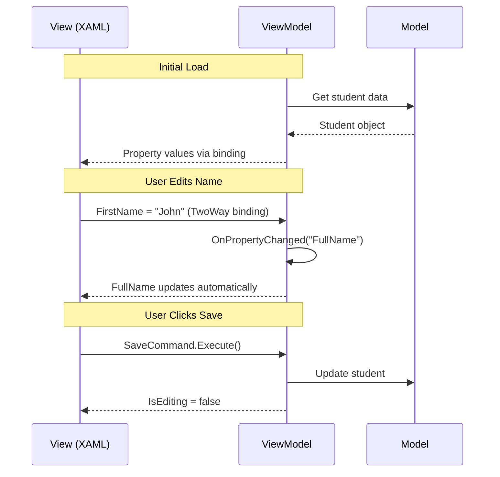
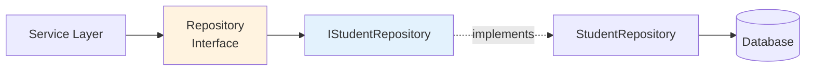
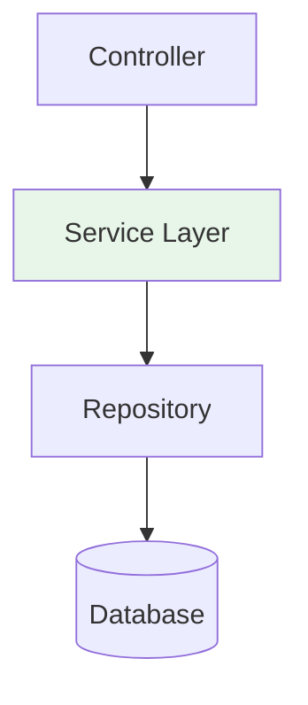
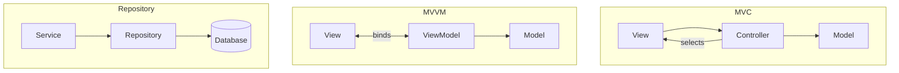
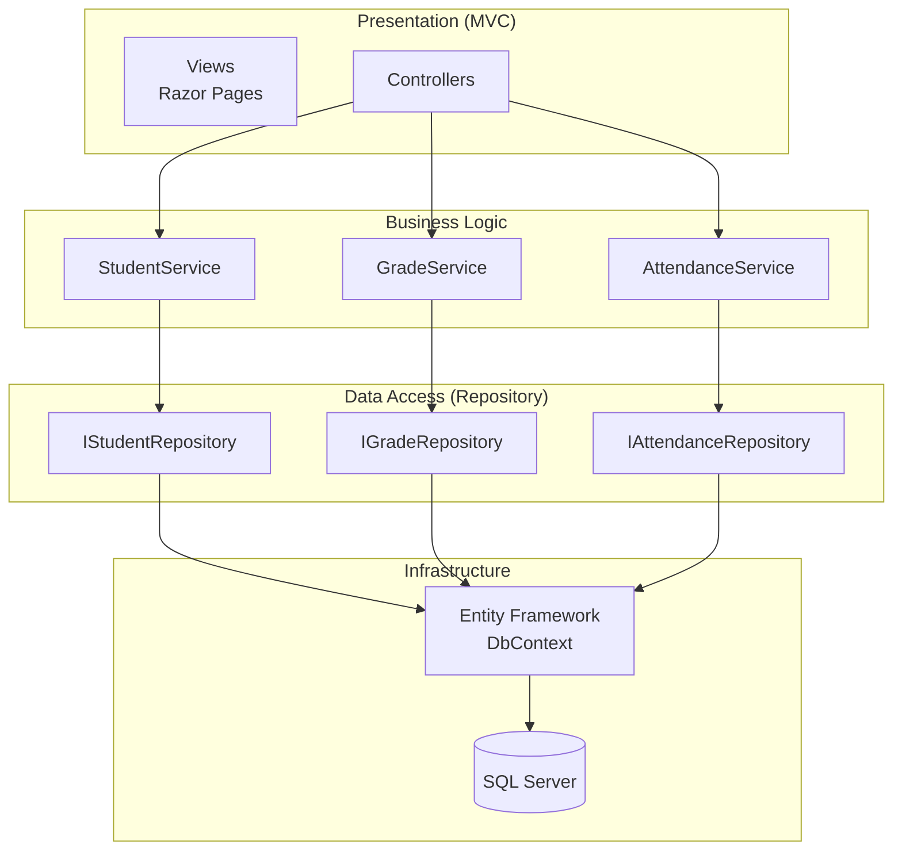

# 7.4 MVVM and Other Patterns

[← Previous: 7.3 MVC Pattern](./7_3-mvc-pattern.md) | [Back to Chapter 7](./chapter-07-README.md) | [Next: 7.5 Choosing an Architecture →](./7_5-choosing-architecture.md)

---

## Learning Objectives

- Understand the MVVM pattern and its use in modern applications
- Learn the Repository pattern for data access abstraction
- Recognize when to use each pattern
- Compare MVC, MVVM, and other common patterns

**Estimated Time:** 25 minutes

---

## MVVM Pattern

### What is MVVM?

**Model-View-ViewModel (MVVM)** is an architectural pattern that evolved from MVC, specifically designed for modern UI frameworks with data binding capabilities.



### The Three Components

| Component | Responsibility | Example |
|-----------|----------------|---------|
| **Model** | Business logic and data | Student class, GradeService |
| **View** | UI layout and design | XAML page, HTML template |
| **ViewModel** | UI state and behavior | StudentViewModel with properties |

### Key Difference from MVC

**MVC:** Controller receives input, manipulates model, selects view.

**MVVM:** View binds directly to ViewModel. No controller needed—data binding handles updates automatically.



---

## MVVM Code Example

### Model

```csharp
// Student.cs - Domain model (same as before)
public class Student
{
    public int Id { get; set; }
    public string FirstName { get; set; }
    public string LastName { get; set; }
    public decimal GPA { get; set; }
}
```

### ViewModel

```csharp
// StudentViewModel.cs - UI state and behavior
public class StudentViewModel : INotifyPropertyChanged
{
    private readonly IStudentService _studentService;
    private Student _student;
    private bool _isEditing;
    
    public event PropertyChangedEventHandler PropertyChanged;
    
    // Properties that View binds to
    public string FullName => $"{_student.FirstName} {_student.LastName}";
    
    public string FirstName
    {
        get => _student.FirstName;
        set
        {
            _student.FirstName = value;
            OnPropertyChanged(nameof(FirstName));
            OnPropertyChanged(nameof(FullName));  // Also notify FullName changed
        }
    }
    
    public string LastName
    {
        get => _student.LastName;
        set
        {
            _student.LastName = value;
            OnPropertyChanged(nameof(LastName));
            OnPropertyChanged(nameof(FullName));
        }
    }
    
    public decimal GPA => _student.GPA;
    
    public bool IsOnProbation => _student.GPA < 2.0m;
    
    public bool IsEditing
    {
        get => _isEditing;
        set
        {
            _isEditing = value;
            OnPropertyChanged(nameof(IsEditing));
        }
    }
    
    // Commands that View can trigger
    public ICommand SaveCommand { get; }
    public ICommand EditCommand { get; }
    
    public StudentViewModel(IStudentService studentService)
    {
        _studentService = studentService;
        SaveCommand = new RelayCommand(Save, CanSave);
        EditCommand = new RelayCommand(() => IsEditing = true);
    }
    
    public void Load(int studentId)
    {
        _student = _studentService.GetById(studentId);
        OnPropertyChanged(nameof(FullName));
        OnPropertyChanged(nameof(GPA));
    }
    
    private void Save()
    {
        _studentService.Update(_student);
        IsEditing = false;
    }
    
    private bool CanSave() => IsEditing && !string.IsNullOrEmpty(FirstName);
    
    protected void OnPropertyChanged(string propertyName)
    {
        PropertyChanged?.Invoke(this, new PropertyChangedEventArgs(propertyName));
    }
}
```

### View (XAML for WPF/MAUI)

```xml
<!-- StudentView.xaml -->
<Page x:Class="SchoolApp.Views.StudentView">
    <StackPanel DataContext="{Binding StudentViewModel}">
        
        <!-- Display mode -->
        <TextBlock Text="{Binding FullName}" 
                   Visibility="{Binding IsEditing, Converter={StaticResource InverseBool}}"/>
        
        <!-- Edit mode -->
        <StackPanel Visibility="{Binding IsEditing}">
            <TextBox Text="{Binding FirstName, Mode=TwoWay}"/>
            <TextBox Text="{Binding LastName, Mode=TwoWay}"/>
        </StackPanel>
        
        <TextBlock Text="{Binding GPA, StringFormat='GPA: {0:F2}'}"/>
        
        <TextBlock Text="Academic Probation" 
                   Foreground="Red"
                   Visibility="{Binding IsOnProbation}"/>
        
        <Button Content="Edit" Command="{Binding EditCommand}"/>
        <Button Content="Save" Command="{Binding SaveCommand}"/>
        
    </StackPanel>
</Page>
```

### How Data Binding Works



---

## When to Use MVVM vs. MVC

| Choose MVVM When... | Choose MVC When... |
|--------------------|--------------------|
| Building desktop apps (WPF, MAUI) | Building web applications |
| Using frameworks with data binding | Server-rendered HTML pages |
| Complex UI state management | Simpler request-response model |
| Need testable UI logic | Team familiar with MVC |
| Mobile apps (Xamarin, MAUI) | REST APIs |

### Platform Recommendations

| Platform | Recommended Pattern |
|----------|---------------------|
| ASP.NET Web Apps | MVC |
| WPF Desktop | MVVM |
| .NET MAUI Mobile | MVVM |
| React/Angular | Component-based (similar to MVVM) |
| REST APIs | MVC or just Controllers |

---

## Repository Pattern

### What is the Repository Pattern?

The **Repository Pattern** abstracts data access, providing a collection-like interface for accessing domain objects.



### Why Use Repository?

| Benefit | Explanation |
|---------|-------------|
| **Abstraction** | Service layer doesn't know about database details |
| **Testability** | Mock repository for unit tests |
| **Consistency** | Standard way to access all entities |
| **Flexibility** | Switch databases without changing services |

### Repository Interface

```csharp
// IRepository.cs - Generic repository interface
public interface IRepository<T> where T : class
{
    T GetById(int id);
    IEnumerable<T> GetAll();
    IEnumerable<T> Find(Expression<Func<T, bool>> predicate);
    void Add(T entity);
    void Update(T entity);
    void Delete(T entity);
}

// IStudentRepository.cs - Specific repository with extra methods
public interface IStudentRepository : IRepository<Student>
{
    IEnumerable<Student> GetByClass(int classId);
    IEnumerable<Student> GetOnProbation();
    Student GetByEmail(string email);
}
```

### Repository Implementation

```csharp
// StudentRepository.cs
public class StudentRepository : IStudentRepository
{
    private readonly SchoolDbContext _context;
    
    public StudentRepository(SchoolDbContext context)
    {
        _context = context;
    }
    
    public Student GetById(int id)
    {
        return _context.Students.Find(id);
    }
    
    public IEnumerable<Student> GetAll()
    {
        return _context.Students.ToList();
    }
    
    public IEnumerable<Student> Find(Expression<Func<Student, bool>> predicate)
    {
        return _context.Students.Where(predicate).ToList();
    }
    
    public void Add(Student entity)
    {
        _context.Students.Add(entity);
        _context.SaveChanges();
    }
    
    public void Update(Student entity)
    {
        _context.Students.Update(entity);
        _context.SaveChanges();
    }
    
    public void Delete(Student entity)
    {
        _context.Students.Remove(entity);
        _context.SaveChanges();
    }
    
    // Specific methods
    public IEnumerable<Student> GetByClass(int classId)
    {
        return _context.Students
            .Where(s => s.Enrollments.Any(e => e.ClassId == classId))
            .ToList();
    }
    
    public IEnumerable<Student> GetOnProbation()
    {
        return _context.Students
            .Where(s => s.GPA < 2.0m)
            .ToList();
    }
    
    public Student GetByEmail(string email)
    {
        return _context.Students.FirstOrDefault(s => s.Email == email);
    }
}
```

### Using Repository in Services

```csharp
// StudentService.cs - Uses repository, not DbContext
public class StudentService : IStudentService
{
    private readonly IStudentRepository _studentRepo;
    private readonly IEmailService _emailService;
    
    public StudentService(IStudentRepository studentRepo, IEmailService emailService)
    {
        _studentRepo = studentRepo;
        _emailService = emailService;
    }
    
    public Student GetById(int id)
    {
        return _studentRepo.GetById(id);
    }
    
    public void UpdateGPA(int studentId, decimal newGPA)
    {
        var student = _studentRepo.GetById(studentId);
        
        bool wasOnProbation = student.GPA < 2.0m;
        student.GPA = newGPA;
        bool nowOnProbation = newGPA < 2.0m;
        
        _studentRepo.Update(student);
        
        // Business rule: notify if entering probation
        if (!wasOnProbation && nowOnProbation)
        {
            _emailService.SendProbationNotice(student);
        }
    }
}
```

---

## Other Common Patterns

### Service Layer Pattern

**Purpose:** Encapsulates business logic in service classes.



We've been using this throughout—GradeService, StudentService, etc.

### Unit of Work Pattern

**Purpose:** Maintains a list of objects affected by a business transaction and coordinates writing changes.

```csharp
public interface IUnitOfWork : IDisposable
{
    IStudentRepository Students { get; }
    IGradeRepository Grades { get; }
    IAttendanceRepository Attendance { get; }
    
    int SaveChanges();  // Commit all changes at once
}
```

**Use when:** You need multiple repositories to share a transaction.

### Dependency Injection

**Purpose:** Provide dependencies to a class rather than having it create them.

```csharp
// Without DI - hard to test
public class GradeService
{
    private readonly GradeRepository _repo = new GradeRepository();  // Tightly coupled!
}

// With DI - easy to test and swap implementations
public class GradeService
{
    private readonly IGradeRepository _repo;
    
    public GradeService(IGradeRepository repo)  // Injected
    {
        _repo = repo;
    }
}
```

**All modern frameworks support DI:** ASP.NET Core, Spring, Angular, etc.

---

## Pattern Comparison Summary



| Pattern | Purpose | Key Mechanism |
|---------|---------|---------------|
| **MVC** | Separate UI from logic | Controller orchestrates |
| **MVVM** | Separate UI with data binding | ViewModel + binding |
| **Repository** | Abstract data access | Interface for data ops |
| **Service Layer** | Encapsulate business logic | Service classes |
| **Dependency Injection** | Loose coupling | Constructor injection |

---

## School Management System: Combined Patterns

Here's how these patterns work together in our system:



---

## Key Takeaways

✅ **MVVM uses data binding** to connect View and ViewModel—no controller needed

✅ **Repository pattern abstracts** database access behind an interface

✅ **Use MVVM for desktop/mobile** apps with data binding frameworks

✅ **Use MVC for web applications** with server-side rendering

✅ **Patterns can be combined**—MVC + Repository + Service Layer is common

✅ **Dependency Injection** enables loose coupling and testability

---

## Self-Check Questions

1. **What is the main difference between MVC and MVVM?**
   <details>
   <summary>Click to reveal answer</summary>
   MVC uses a Controller to handle input and coordinate View/Model. MVVM uses data binding between View and ViewModel—the View binds directly to ViewModel properties, and changes propagate automatically.
   </details>

2. **When would you choose MVVM over MVC?**
   <details>
   <summary>Click to reveal answer</summary>
   When building desktop applications (WPF), mobile apps (MAUI/Xamarin), or any platform with strong data binding support. MVC is better for traditional web applications.
   </details>

3. **What is the purpose of the Repository pattern?**
   <details>
   <summary>Click to reveal answer</summary>
   To abstract data access behind an interface, providing a collection-like way to access domain objects. This allows testing with mock repositories and flexibility to change data sources.
   </details>

4. **Why is Dependency Injection important for these patterns?**
   <details>
   <summary>Click to reveal answer</summary>
   DI allows loose coupling—classes receive their dependencies rather than creating them. This enables testing (inject mocks), flexibility (swap implementations), and cleaner code.
   </details>

---

**Previous:** [← 7.3 MVC Pattern](./7_3-mvc-pattern.md)

**Next:** [7.5 Choosing an Architecture →](./7_5-choosing-architecture.md)

---

*Estimated Reading Time: 25 minutes*
