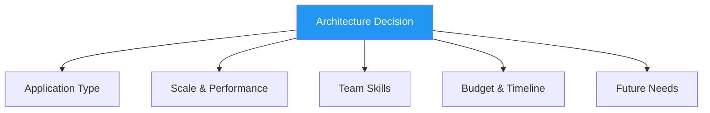
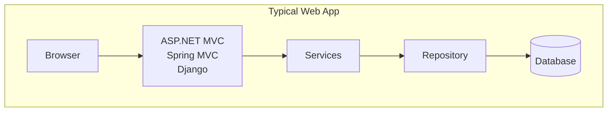
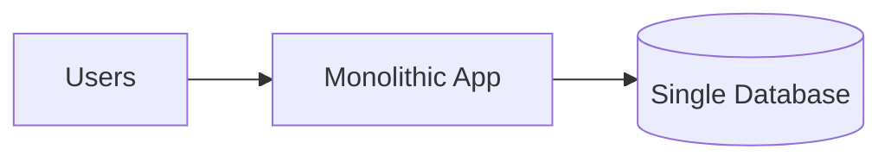
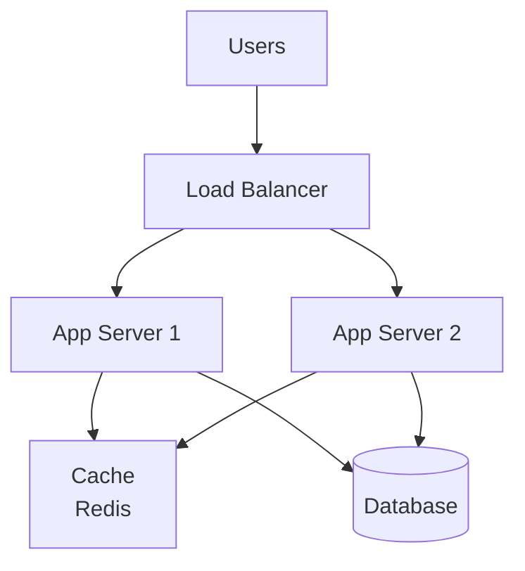
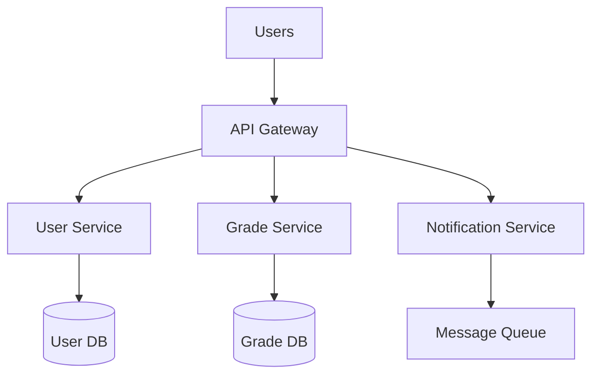
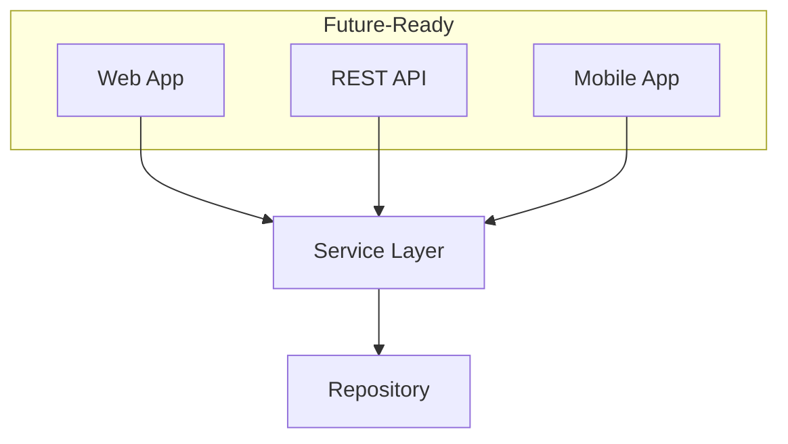
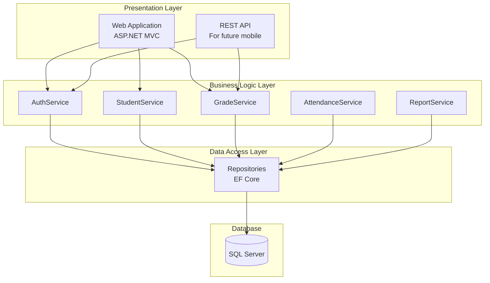
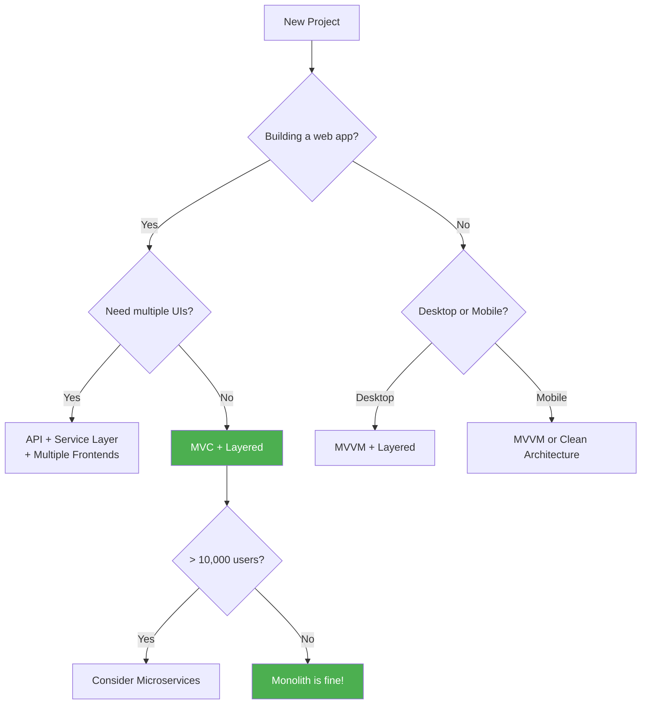

# 7.5 Choosing an Architecture

[← Previous: 7.4 MVVM and Other Patterns](./7_4-mvvm-other-patterns.md) | [Back to Chapter 7](./chapter-07-README.md) | [Next: 7.6 Hands-On Activities →](./7_6-hands-on-activities.md)

---

## Learning Objectives

- Apply a decision framework for selecting architectures
- Understand trade-offs between different patterns
- Match architectural patterns to application types
- Make informed architectural decisions for projects

**Estimated Time:** 20 minutes

---

## The Architecture Decision Framework

Choosing an architecture isn't about picking the "best" pattern—it's about selecting the **most appropriate** one for your specific situation.

### Decision Factors



---

## Factor 1: Application Type

### Web Application (Server-Rendered)

**Recommended:** MVC + Layered Architecture



**Examples:** E-commerce sites, admin portals, content management

### Desktop Application

**Recommended:** MVVM + Layered Architecture

**Examples:** Point-of-sale systems, data entry applications, productivity tools

### Mobile Application

**Recommended:** MVVM or Clean Architecture

**Examples:** iOS/Android apps, cross-platform apps

### REST API / Microservice

**Recommended:** Layered Architecture (Controllers → Services → Repository)

**Examples:** Backend APIs, microservices, integrations

### Quick Reference Table

| Application Type | Primary Pattern | Supporting Patterns |
|-----------------|-----------------|---------------------|
| Web App (MPA) | MVC | Layered, Repository |
| Web App (SPA) | API + Frontend Framework | Layered, Repository |
| Desktop App | MVVM | Layered, Repository |
| Mobile App | MVVM | Clean Architecture |
| REST API | Layered | Repository, Service Layer |
| Enterprise System | Layered / SOA | Repository, DI |

---

## Factor 2: Scale and Performance

### Small Scale (< 100 users)

**Architecture:** Simple Monolith



- Single deployment unit
- Simple to develop and maintain
- Lowest infrastructure cost

### Medium Scale (100-10,000 users)

**Architecture:** Layered Monolith with Caching



- Multiple app servers for load distribution
- Caching for frequently accessed data
- Single database (possibly with read replicas)

### Large Scale (10,000+ users)

**Architecture:** Distributed / Microservices



- Independent services that scale separately
- Each service has its own database
- Complex but highly scalable

### Scale Decision Matrix

| Users | Requests/sec | Recommended Architecture |
|-------|-------------|-------------------------|
| < 100 | < 10 | Simple Monolith |
| 100-1,000 | 10-100 | Layered Monolith |
| 1,000-10,000 | 100-1,000 | Monolith + Caching + Load Balancing |
| 10,000+ | 1,000+ | Consider Microservices |

**Important:** Start simple! You can always evolve your architecture as you grow. Don't over-engineer for scale you may never reach.

---

## Factor 3: Team Skills

### Team Assessment Questions

1. What patterns is the team familiar with?
2. What frameworks does the team know?
3. How experienced is the team with distributed systems?
4. What is the team's testing maturity?

### Skill-Based Recommendations

| Team Skill Level | Recommended Approach |
|-----------------|---------------------|
| **Junior** | Simple MVC, avoid microservices |
| **Mid-Level** | MVC + Repository, consider MVVM |
| **Senior** | Any pattern appropriate to needs |
| **Mixed** | Well-documented patterns, established frameworks |

**Warning:** An architecture the team can't implement correctly is worse than a simpler one they can execute well.

---

## Factor 4: Budget and Timeline

### Timeline Impact

| Timeline | Recommendation |
|----------|----------------|
| **< 3 months** | Simple architecture, proven frameworks |
| **3-6 months** | Standard layered architecture |
| **6+ months** | Can consider more complex patterns |

### Budget Considerations

| Budget | Architecture Impact |
|--------|---------------------|
| **Limited** | Monolith, single database, minimal services |
| **Moderate** | Layered, possible cloud services |
| **Large** | Can afford microservices infrastructure |

---

## Factor 5: Future Needs

### Questions to Consider

1. Will we need multiple UI types (web, mobile, API)?
2. Are different parts likely to scale differently?
3. Will different teams own different features?
4. How often will the system change?

### Future-Proofing Strategies

**Prepare for Multiple UIs:**


Even if you start with just web, building with services makes adding mobile/API easier later.

**Prepare for Scale:**
- Use interfaces and dependency injection
- Keep business logic out of controllers
- Design for horizontal scaling (stateless servers)

---

## Architecture Decision Record (ADR)

Document your decisions for future reference:

### ADR Template

```markdown
# ADR-001: System Architecture Selection

## Status
Accepted

## Context
We need to design the architecture for the School Management System.
- Expected users: 500 (teachers, students, parents)
- Team: 3 developers, familiar with ASP.NET MVC
- Timeline: 6 months to MVP
- Budget: Limited infrastructure budget

## Decision
We will use a **Three-Tier Layered Architecture with MVC**:
- Presentation: ASP.NET Core MVC
- Business Logic: Service classes
- Data Access: Repository pattern with Entity Framework

## Rationale
1. Team is experienced with MVC—reduces learning curve
2. 500 users doesn't require microservices complexity
3. Layered approach allows future API addition
4. Repository pattern enables unit testing

## Consequences
**Positive:**
- Faster development with familiar patterns
- Clear separation of concerns
- Testable architecture

**Negative:**
- Scaling will require code changes later
- All features deploy together

## Alternatives Considered
- Microservices: Rejected due to complexity for team size
- Simple monolith: Rejected due to need for testability
```

---

## School Management System: Architecture Decision

Let's apply the framework to our case study:

### Analysis

| Factor | Assessment |
|--------|-----------|
| **Type** | Web application (school portal) |
| **Scale** | ~1,000 users (students, parents, teachers) |
| **Team** | Small team, ASP.NET experience |
| **Budget** | School budget (limited) |
| **Future** | May need mobile app, parent portal |

### Decision: Layered Architecture + MVC



### Justification

1. **Why Layered?** Clear separation, team familiarity, testable
2. **Why MVC?** Web-focused, ASP.NET experience, industry standard
3. **Why not Microservices?** Scale doesn't require it, team too small
4. **Future-ready?** Service layer allows API addition for mobile

---

## Common Mistakes to Avoid

### ❌ Over-Engineering

**Problem:** Building for Netflix scale when you have 100 users.

**Solution:** Start simple, evolve as needed. YAGNI (You Aren't Gonna Need It).

### ❌ Resume-Driven Development

**Problem:** Choosing technologies because they look good on a resume.

**Solution:** Choose what's appropriate for the project, not what's trendy.

### ❌ Ignoring Team Skills

**Problem:** Choosing architecture the team can't implement.

**Solution:** Consider team experience. Training time is real cost.

### ❌ No Documentation

**Problem:** Architecture decisions are forgotten, repeated debates.

**Solution:** Write ADRs. Document the WHY, not just the WHAT.

---

## Quick Decision Guide



---

## Key Takeaways

✅ **Consider all factors:** Application type, scale, team, budget, future needs

✅ **Start simple:** A working simple architecture beats an incomplete complex one

✅ **Match team skills:** Architecture the team can't implement is worthless

✅ **Document decisions:** Write ADRs to record why choices were made

✅ **Plan for evolution:** Design for change, but don't over-engineer

✅ **There's no "best" architecture:** Only the most appropriate for your situation

---

## Self-Check Questions

1. **What five factors should influence your architecture decision?**
   <details>
   <summary>Click to reveal answer</summary>
   Application type, scale/performance needs, team skills, budget/timeline, and future needs.
   </details>

2. **Why shouldn't a small team with 500 users choose microservices?**
   <details>
   <summary>Click to reveal answer</summary>
   Microservices add complexity (multiple deployments, inter-service communication, distributed debugging) that isn't justified for small scale. A monolith is simpler to develop, deploy, and maintain.
   </details>

3. **What is an Architecture Decision Record (ADR)?**
   <details>
   <summary>Click to reveal answer</summary>
   A document that records an architectural decision, including context, the decision made, rationale, consequences, and alternatives considered. It helps future team members understand why choices were made.
   </details>

4. **What pattern would you recommend for a desktop application?**
   <details>
   <summary>Click to reveal answer</summary>
   MVVM (Model-View-ViewModel) because desktop frameworks like WPF and MAUI have strong data binding support that works well with MVVM.
   </details>

---

**Previous:** [← 7.4 MVVM and Other Patterns](./7_4-mvvm-other-patterns.md)

**Next:** [7.6 Hands-On Activities →](./7_6-hands-on-activities.md)

---

*Estimated Reading Time: 20 minutes*
