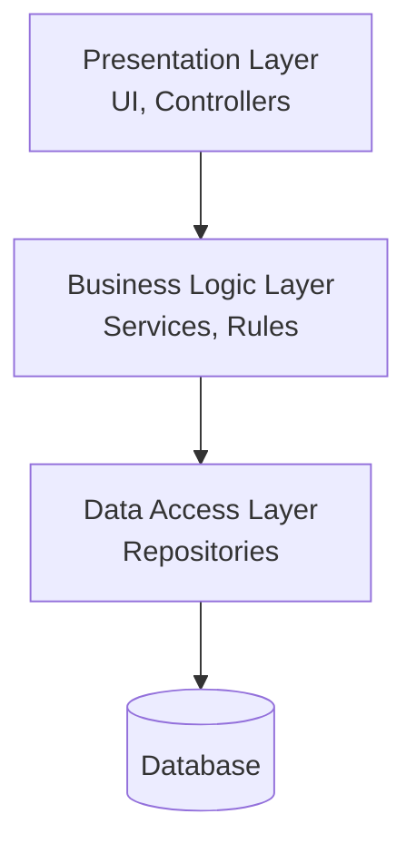

# 7.7 Chapter Summary

[← Previous: 7.6 Hands-On Activities](./7_6-hands-on-activities.md) | [Back to Chapter 7](./chapter-07-README.md)

---

## Chapter Overview

In this chapter, you learned about software architecture—the high-level structure that determines how your system is organized and how its parts work together.

**Key Topics Covered:**
- Architecture fundamentals and quality attributes
- Layered (N-Tier) architecture
- MVC and MVVM patterns
- Repository pattern
- Choosing the right architecture

---

## Key Concepts Summary

### What is Software Architecture?

Architecture defines the major **components** of a system, their **relationships**, and the **principles** governing the design.

**Key Point:** Architecture decisions are expensive to change later—make them thoughtfully.

### Quality Attributes

Architecture decisions impact these "-ilities":

| Attribute | Question It Answers |
|-----------|---------------------|
| Scalability | Can it handle growth? |
| Maintainability | Can we modify it easily? |
| Security | Is data protected? |
| Performance | Is it fast enough? |
| Testability | Can we test it? |

### Layered Architecture

**Rules:**
- Each layer has ONE responsibility
- Layers only talk to adjacent layers
- Business logic belongs in the Business Layer

### MVC Pattern

| Component | Responsibility |
|-----------|----------------|
| **Model** | Data and business logic |
| **View** | Display to user |
| **Controller** | Handle input, coordinate M and V |

**Best for:** Web applications

### MVVM Pattern

| Component | Responsibility |
|-----------|----------------|
| **Model** | Data and business logic |
| **View** | UI (binds to ViewModel) |
| **ViewModel** | UI state and behavior |

**Best for:** Desktop and mobile apps with data binding

### Repository Pattern

Abstracts data access behind an interface:
- Service calls repository interface
- Repository handles database operations
- Enables testing with mock repositories

### Choosing Architecture

Consider these factors:
1. **Application type** (web, desktop, mobile, API)
2. **Scale** (users, requests)
3. **Team skills** (what patterns they know)
4. **Budget/timeline**
5. **Future needs** (mobile app, API, scaling)

**Rule:** Start simple, evolve as needed!

---

## Quick Reference Card

### Layer Responsibilities

| Layer | Contains | Does NOT Contain |
|-------|----------|------------------|
| **Presentation** | UI, Controllers, Views | Business rules, DB queries |
| **Business Logic** | Services, Calculations, Rules | UI code, Direct DB access |
| **Data Access** | Repositories, Queries | Business rules, UI code |

### Pattern Selection Guide

| Building... | Use... |
|-------------|--------|
| Web app | MVC + Layered |
| Desktop app | MVVM + Layered |
| Mobile app | MVVM |
| REST API | Layered (Controller → Service → Repository) |
| 10K+ users | Consider microservices |

### Common Mistakes

| Mistake | Solution |
|---------|----------|
| Business logic in UI | Move to Service layer |
| Controller too big | Extract to Services |
| Skipping layers | Always go through proper layers |
| Over-engineering | Start simple, evolve later |

---

## Chapter Quiz

Test your understanding with these 10 questions:

### Question 1
What is the primary purpose of software architecture?

A) To write code faster  
B) To define the high-level structure and organization of a system  
C) To create user interfaces  
D) To manage databases  

Answer

**B) To define the high-level structure and organization of a system**

Architecture determines major components, their relationships, and design principles.

### Question 2
In a three-tier architecture, where should GPA calculation logic be placed?

A) Presentation Layer  
B) Business Logic Layer  
C) Data Access Layer  
D) Database  

Answer

**B) Business Logic Layer**

Calculations and business rules belong in the Business Logic Layer (services).

### Question 3
What is the main difference between MVC and MVVM?

A) MVC is for web, MVVM is for databases  
B) MVC uses a Controller, MVVM uses data binding with ViewModel  
C) MVVM is newer and always better  
D) There is no difference  

Answer

**B) MVC uses a Controller, MVVM uses data binding with ViewModel**

MVC has a Controller that orchestrates. MVVM uses two-way data binding between View and ViewModel.

### Question 4
What is the Repository pattern used for?

A) Creating user interfaces  
B) Abstracting data access behind an interface  
C) Calculating business logic  
D) Routing HTTP requests  

Answer

**B) Abstracting data access behind an interface**

Repository provides a collection-like interface for data access, enabling testing and flexibility.

### Question 5
Which architecture would you recommend for a small blog with 50 users?

A) Microservices  
B) Complex distributed system  
C) Simple monolith  
D) Service-oriented architecture  

Answer

**C) Simple monolith**

For small scale, simplicity wins. Microservices would be over-engineering.

### Question 6
What is a quality attribute in software architecture?

A) The number of lines of code  
B) A characteristic like scalability, security, or performance  
C) The programming language used  
D) The team size  

Answer

**B) A characteristic like scalability, security, or performance**

Quality attributes (often called "-ilities") are properties the system must have.

### Question 7
Why shouldn't the Presentation layer access the database directly?

A) It's too slow  
B) It bypasses business rules and makes the code hard to maintain  
C) It's not possible technically  
D) The database doesn't allow it  

Answer

**B) It bypasses business rules and makes the code hard to maintain**

Direct access skips validation and business logic, and couples UI to database structure.

### Question 8
What is an Architecture Decision Record (ADR)?

A) A database table  
B) A document recording architectural decisions and their rationale  
C) A type of UML diagram  
D) A testing tool  

Answer

**B) A document recording architectural decisions and their rationale**

ADRs help future team members understand why decisions were made.

### Question 9
Which pattern is best for a desktop application with complex data entry forms?

A) MVC  
B) Simple monolith  
C) MVVM  
D) Microservices  

Answer

**C) MVVM**

Desktop frameworks (WPF, MAUI) have data binding that works well with MVVM.

### Question 10
What does "separation of concerns" mean in architecture?

A) Keeping team members separate  
B) Each component handles one specific responsibility  
C) Using multiple databases  
D) Separating development and production environments  

Answer

**B) Each component handles one specific responsibility**

Separation of concerns means each layer/component has a single, focused responsibility.

---

## Score Interpretation

| Score | Level | Recommendation |
|-------|-------|----------------|
| 9-10 | Excellent | Ready for the next chapter! |
| 7-8 | Good | Review missed concepts briefly |
| 5-6 | Fair | Re-read relevant sections |
| Below 5 | Needs Work | Review chapter and redo activities |

---

## Learning Checklist

Before moving to the next chapter, ensure you can:

- [ ] Define software architecture and explain why it matters
- [ ] List at least 4 quality attributes and explain each
- [ ] Draw a three-tier layered architecture diagram
- [ ] Explain the responsibilities of each layer
- [ ] Describe the MVC pattern and its components
- [ ] Describe the MVVM pattern and when to use it
- [ ] Explain the Repository pattern and its benefits
- [ ] Choose an appropriate architecture for a given scenario
- [ ] Write an Architecture Decision Record (ADR)

---

## Chapter Deliverables

For your course project, you should produce:

1. **Architectural Diagram** - Visual representation of your system's layers/components
2. **Layer Specification** - Document describing each layer's responsibility
3. **Pattern Justification** - Brief explanation of why you chose specific patterns
4. **ADR** - At least one Architecture Decision Record

---

## Connections to Other Chapters

| Chapter | Connection |
|---------|------------|
| **Chapter 4 (OO Analysis)** | Classes become Models in MVC/MVVM |
| **Chapter 5 (UML)** | Component diagrams show architecture |
| **Chapter 6 (Database)** | Data layer connects to your schema |
| **Chapter 8 (Detailed Design)** | Architecture guides component design |

---

## Further Reading

**Books:**
- "Clean Architecture" by Robert C. Martin
- "Software Architecture in Practice" by Bass, Clements, Kazman
- "Patterns of Enterprise Application Architecture" by Martin Fowler

**Online Resources:**
- Microsoft Architecture Guides: docs.microsoft.com/architecture
- Martin Fowler's Blog: martinfowler.com
- Architecture Decision Records: adr.github.io

---

## What's Next?

**Chapter 8: Detailed Component Design** will dive deeper into:
- Designing individual components
- Interface design
- Design patterns (Gang of Four)
- API design

The architecture you've designed in this chapter provides the foundation for detailed component design.

---

## Key Takeaways to Remember

1. **Architecture = Structure** - Major components and their relationships

2. **Layers Separate Concerns** - UI, logic, and data each have their place

3. **MVC for Web, MVVM for Desktop/Mobile** - Match pattern to platform

4. **Repository Abstracts Data** - Enables testing and flexibility

5. **Start Simple** - Don't over-engineer; evolve as needed

6. **Document Decisions** - Write ADRs so future you understands why

---

**Course Home:** [← Back to Course Overview](../software-analysis-design-course.md)

**Previous Chapter:** [← Chapter 6: Database Design](./chapter-06-README.md)

**Next Chapter:** [Chapter 8: Detailed Component Design →](./chapter-08-README.md)

---

*Chapter Version: 1.0*  
*Last Updated: January 2026*  
*Total Chapter Study Time: 3-4 hours*
