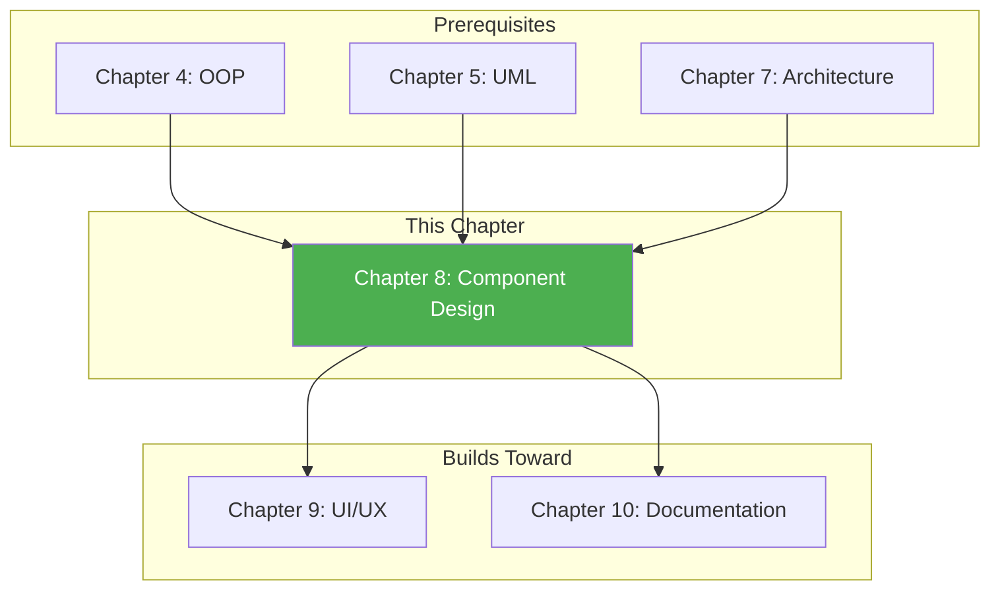

# Chapter 8: Detailed Design and Component Design

**Course:** Software Analysis and Design  
**Target Audience:** Software Development Diploma Students  
**Chapter Duration:** 4-5 hours  
**Prerequisites:** Chapter 7 (Architectural Design Patterns)

---

## 📋 Chapter Overview

Welcome to Chapter 8! This chapter takes you from high-level architecture (Chapter 7) down to the detailed component level. You'll learn how to break systems into manageable, reusable components, design clean interfaces, and apply design principles that make code maintainable and extensible.

**Why This Matters:**
While architecture defines the big picture, detailed design determines how easy your code will be to understand, test, and modify. Poor component design leads to "spaghetti code" that's impossible to maintain—costing companies millions in technical debt.

By the end of this chapter, you'll understand:
- How to decompose systems into cohesive, loosely-coupled components
- The SOLID principles and when to apply each one
- Common design patterns and the problems they solve
- How to design clear APIs and interfaces
- Best practices for error handling and logging

---

## 🎯 Learning Objectives

By completing this chapter, you will be able to:

1. **Decompose** complex systems into manageable components with clear responsibilities
2. **Evaluate** component quality using cohesion and coupling metrics
3. **Apply** SOLID principles to create maintainable, extensible designs
4. **Implement** appropriate design patterns for common problems
5. **Design** clean interfaces and APIs with proper contracts
6. **Create** implementation-ready component specifications
7. **Handle** errors and exceptions using established patterns
8. **Plan** logging and monitoring strategies for production systems

---

## 📚 Chapter Contents

### Core Content Sections

| Section | Title | Pages | Time | Topics |
|---------|-------|-------|------|--------|
| **[8.1](./8_1-component-fundamentals.md)** | Component Design Fundamentals | 5 | 30 min | What are components, characteristics, decomposition strategies |
| **[8.2](./8_2-cohesion-coupling.md)** | Cohesion and Coupling | 5 | 35 min | Cohesion types, coupling types, measuring quality, refactoring |
| **[8.3](./8_3-solid-principles.md)** | SOLID Principles | 8 | 45 min | SRP, OCP, LSP, ISP, DIP with examples |
| **[8.4](./8_4-design-patterns-creational.md)** | Creational Design Patterns | 6 | 35 min | Singleton, Factory, Builder, Abstract Factory |
| **[8.5](./8_5-design-patterns-structural-behavioral.md)** | Structural & Behavioral Patterns | 7 | 40 min | Adapter, Decorator, Facade, Observer, Strategy, Command |
| **[8.6](./8_6-interface-api-design.md)** | Interface and API Design | 6 | 40 min | API design principles, contracts, documentation, versioning |
| **[8.7](./8_7-error-handling-logging.md)** | Error Handling and Logging | 5 | 30 min | Exception design, logging levels, monitoring strategies |
| **[8.8](./8_8-hands-on-activities.md)** | Hands-on Activities | 5 | 50 min | Pattern implementation, refactoring exercises, API design |
| **[8.9](./8_9-chapter-summary.md)** | Summary & Assessment | 4 | 30 min | Recap, quiz, assignments, next steps |

**Total:** ~51 pages | ~5.5 hours

---

## 🗺️ Learning Path

```mermaid
graph LR
    A[8.1: Component<br/>Fundamentals] --> B[8.2: Cohesion &<br/>Coupling]
    B --> C[8.3: SOLID<br/>Principles]
    C --> D[8.4: Creational<br/>Patterns]
    D --> E[8.5: Structural &<br/>Behavioral]
    E --> F[8.6: Interface &<br/>API Design]
    F --> G[8.7: Error Handling<br/>& Logging]
    G --> H[8.8: Hands-on<br/>Activities]
    H --> I[8.9: Summary &<br/>Assessment]
    
    style A fill:#e3f2fd
    style B fill:#e3f2fd
    style C fill:#fff3e0
    style D fill:#e8f5e9
    style E fill:#e8f5e9
    style F fill:#fce4ec
    style G fill:#fce4ec
    style H fill:#fff9c4
    style I fill:#e0f2f1
```



---

## 📖 How to Use This Chapter

### For Students

1. **Build on Chapter 7**: Detailed design works within your architectural decisions
2. **Code Along**: The design patterns are best learned by implementing them
3. **Refactor Existing Code**: Take your previous projects and apply SOLID principles
4. **Create Pattern Library**: Build a personal collection of pattern implementations
5. **Practice API Design**: Design interfaces before implementing—think contract first

### For Instructors

1. **Show Bad Code First**: Let students experience the pain of poor design before teaching solutions
2. **Live Refactoring**: Walk through refactoring sessions applying each principle
3. **Pattern Exercises**: Have students identify patterns in popular open-source projects
4. **Code Reviews**: Use peer review to evaluate component design quality
5. **Real APIs**: Show examples from actual APIs (Stripe, Twitter, etc.)

---

## ⏱️ Suggested Teaching Schedule

### **Session 1: Foundations & Principles (2 hours)**
- **0:00-0:30** - Section 8.1: Component Fundamentals
- **0:30-1:05** - Section 8.2: Cohesion and Coupling
- **1:05-1:15** - *Break*
- **1:15-2:00** - Section 8.3: SOLID Principles (first half)

### **Session 2: SOLID & Patterns (2 hours)**
- **0:00-0:30** - Section 8.3: SOLID Principles (completion)
- **0:30-1:05** - Section 8.4: Creational Patterns
- **1:05-1:15** - *Break*
- **1:15-1:55** - Section 8.5: Structural & Behavioral Patterns
- **1:55-2:00** - Review and homework assignment

### **Session 3: APIs & Production Concerns (1.5 hours)**
- **0:00-0:40** - Section 8.6: Interface and API Design
- **0:40-1:10** - Section 8.7: Error Handling and Logging
- **1:10-1:30** - Q&A and review

### **Session 4: Practice & Assessment (1.5 hours - can be separate)**
- **0:00-0:50** - Section 8.8: Hands-on Activities
- **0:50-1:00** - *Break*
- **1:00-1:30** - Section 8.9: Summary & Assessment

---

## 🎓 Prerequisites Check

Before starting this chapter, ensure you understand:

- [x] Software architecture patterns (Chapter 7)
- [x] Layered architecture and MVC/MVVM
- [x] Object-oriented principles (Chapter 4)
- [x] UML class and sequence diagrams (Chapter 5)
- [x] Basic programming in C# or similar OOP language

**Missing these?** Review Chapter 4 (OOP), Chapter 5 (UML), and Chapter 7 (Architecture) before proceeding.

---

## 🛠️ Required Tools & Resources

### Essential Tools (Free)

1. **IDE/Code Editor**:
   - Visual Studio (Community Edition) for C#
   - VS Code with C# extension
   - JetBrains Rider (free for students)

2. **Diagramming**:
   - Draw.io - for component and class diagrams
   - Lucidchart - for API design visualization
   - Mermaid - for quick diagrams in markdown

3. **API Documentation**:
   - Swagger/OpenAPI - for API specification
   - Postman - for API testing
   - SwaggerHub (free tier) - for collaboration

### Code Resources

Download before starting:
- ✅ Design Pattern Code Examples (C#)
- ✅ Refactoring Exercise Project
- ✅ API Design Template
- ✅ Component Specification Template

---

## 📦 Chapter Materials & Files

All files for this chapter:

### Core Content Files (Markdown)
1. `8_1-component-fundamentals.md` - Component concepts and decomposition
2. `8_2-cohesion-coupling.md` - Measuring component quality
3. `8_3-solid-principles.md` - The five SOLID principles in depth
4. `8_4-design-patterns-creational.md` - Singleton, Factory, Builder
5. `8_5-design-patterns-structural-behavioral.md` - Adapter, Decorator, Observer, Strategy
6. `8_6-interface-api-design.md` - API design principles and contracts
7. `8_7-error-handling-logging.md` - Exception patterns and logging strategies
8. `8_8-hands-on-activities.md` - Practical exercises
9. `8_9-chapter-summary.md` - Summary, quiz, and next steps

### Presentation Files
10. `chapter-08-presentation.json` - Complete slide deck (30+ slides, 60 min)

### Code Examples
11. `/examples/design-patterns/` - Pattern implementations in C#
12. `/examples/refactoring/` - Before/after refactoring examples

### Templates
13. `component-specification-template.md` - Template for component specs
14. `api-design-template.md` - Template for API documentation

---

## 🔗 Connection to Other Chapters



### Key Connections

| From Chapter | What You'll Use |
|--------------|-----------------|
| **Chapter 4 (OOP)** | Classes, inheritance, polymorphism concepts |
| **Chapter 5 (UML)** | Class diagrams, sequence diagrams |
| **Chapter 7 (Architecture)** | Architectural patterns provide context for component design |

| To Chapter | How This Prepares You |
|------------|----------------------|
| **Chapter 9 (UI/UX)** | Well-designed components make UI implementation cleaner |
| **Chapter 10 (Documentation)** | Component specifications become part of technical docs |

---

## 📊 Assessment Overview

### Assessment Components

1. **Component Design Quiz** (20%)
   - Cohesion/coupling identification
   - SOLID principle application
   - Pattern recognition

2. **Pattern Implementation** (30%)
   - Implement 3 design patterns
   - Must include unit tests
   - Code must follow SOLID principles

3. **API Design Exercise** (25%)
   - Design RESTful API for given requirements
   - Include OpenAPI specification
   - Document error handling approach

4. **Refactoring Project** (25%)
   - Take provided legacy code
   - Apply SOLID principles
   - Improve cohesion and reduce coupling
   - Document design decisions

### Portfolio Deliverable

**Main Deliverable:** Component Design Specification Document

**For School Management System - Grade Management Module:**
- Component decomposition diagram
- 5+ component specifications with interfaces
- At least 3 design patterns applied with justification
- API design for grade operations
- Error handling strategy
- 15-20 pages professional documentation

**Grading Criteria:**
- Component quality (cohesion/coupling) (25%)
- Pattern selection and application (25%)
- Interface design clarity (20%)
- SOLID compliance (20%)
- Documentation quality (10%)

---

## 🔑 Key Concepts Preview

### Design Principles Acronyms

**SOLID:**
- **S**ingle Responsibility Principle
- **O**pen/Closed Principle
- **L**iskov Substitution Principle
- **I**nterface Segregation Principle
- **D**ependency Inversion Principle

**Additional Principles:**
- **DRY** - Don't Repeat Yourself
- **KISS** - Keep It Simple, Stupid
- **YAGNI** - You Aren't Gonna Need It

### Design Patterns by Category

```
Creational              Structural              Behavioral
-----------             ----------              ----------
Singleton               Adapter                 Observer
Factory Method          Decorator               Strategy
Abstract Factory        Facade                  Command
Builder                 Composite               State
Prototype               Bridge                  Template Method
```

---

## 💡 Learning Tips

**For This Chapter:**

1. **Code Every Pattern**: Reading about patterns isn't enough—implement each one yourself

2. **Spot Bad Code First**: Learn to recognize design smells before learning fixes

3. **One Principle at a Time**: Master SRP before moving to OCP, etc.

4. **Real-World Examples**: Look at how popular frameworks implement these patterns

5. **Refactor Incrementally**: Don't rewrite—improve step by step

6. **Draw Before Code**: Sketch component diagrams before writing any code

---

## ❓ FAQ

**Q: Why so many design patterns? Do I need to memorize them all?**
A: No! Focus on understanding the problems they solve. You'll naturally remember patterns you use frequently. The Gang of Four book has 23 patterns—we cover the most practical ones.

**Q: Is SOLID only for object-oriented languages?**
A: The principles were designed for OOP, but the concepts apply broadly. Separation of concerns and dependency management matter in any paradigm.

**Q: How detailed should component specifications be?**
A: Detailed enough that another developer can implement the component without asking questions. Include interface signatures, behaviors, and edge cases.

**Q: When do design patterns become over-engineering?**
A: When they add complexity without solving a real problem. If you're using a pattern "just in case," you're probably over-engineering. Follow YAGNI!

**Q: How do I know if my cohesion/coupling is good enough?**
A: If you can explain what a component does in one sentence, it's probably cohesive. If you can change one component without modifying others, coupling is probably low.

---

## 🌟 Industry Relevance

### Why This Matters for Your Career

**Software Developer:**
- Code review skills to evaluate design quality
- Ability to refactor legacy code professionally
- Understanding patterns used in frameworks you'll work with

**Technical Lead:**
- Guide team toward maintainable designs
- Make component boundary decisions
- Establish coding standards based on SOLID

**Software Architect:**
- Bridge between architecture and implementation
- Design system interfaces and contracts
- Evaluate technical debt and refactoring needs

### Real-World Applications

**Netflix:**
- Uses microservice components with clear API contracts
- Observer pattern throughout their reactive systems
- Circuit breaker pattern for resilience

**Amazon:**
- API-first design philosophy
- Strict interface contracts between services
- Factory patterns for cloud resource creation

---

## 📊 Progress Tracker

Track your progress through the chapter:

- [ ] 8.1 - Component Fundamentals
- [ ] 8.2 - Cohesion and Coupling
- [ ] 8.3 - SOLID Principles
- [ ] 8.4 - Creational Patterns
- [ ] 8.5 - Structural & Behavioral Patterns
- [ ] 8.6 - Interface and API Design
- [ ] 8.7 - Error Handling and Logging
- [ ] 8.8 - Hands-on Activities
- [ ] 8.9 - Chapter Summary & Assessment

**Completion Status:** 0/9 sections

---

## 🔄 Integration with Course Project

Throughout this chapter, you'll continue developing the **School Management System**:

**Chapter 8 Deliverables for Course Project:**

1. **Component Decomposition**: Break down Grade Management into components
2. **Interface Specifications**: Define contracts between components
3. **Pattern Application**: Apply at least 3 design patterns with justification
4. **API Design**: Create RESTful API specification for grade operations
5. **Error Handling Strategy**: Document exception handling approach

This component design will guide implementation and connect to UI design (Chapter 9) and final documentation (Chapter 10).

---

## 🚀 Ready to Begin?

Component design is where architecture meets code. Master these skills and you'll:
- Write code that's easy to understand and modify
- Apply industry-standard design patterns effectively
- Design APIs that other developers love to use
- Reduce technical debt before it accumulates
- Create systems that can evolve with changing requirements

**Let's build well-designed components!**

### 👉 **[Proceed to Section 8.1: Component Design Fundamentals →](./8_1-component-fundamentals.md)**

---

**Previous Chapter:** [← Chapter 7: Architectural Design Patterns](../chapter-07/chapter-07-README.md)

**Next Chapter:** [Chapter 9: UI/UX Design →](../chapter-09/chapter-09-README.md)

**Course Home:** [Back to Course Overview](../README.md)

---

*Last Updated: January 2026*  
*Version: 1.0*  
*Estimated Study Time: 5-6 hours*  
*Hands-on Practice: 3-4 hours*
