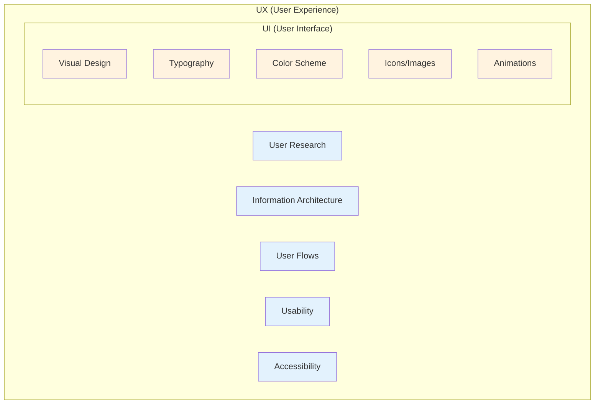
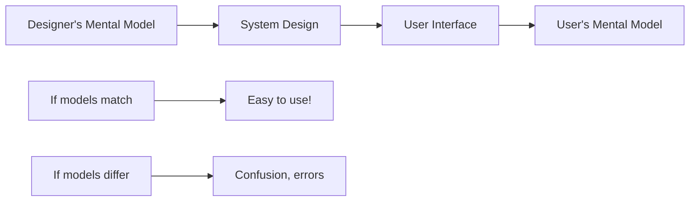
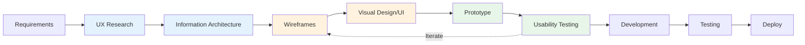

# 9.1 UI/UX Fundamentals

**Learning Objectives:**
- Understand the difference between UI and UX
- Explain why UI/UX matters for software success
- Recognize the psychology behind user behavior
- Apply mental models to interface design

**Estimated Time:** 35 minutes

---

## What Are UI and UX?

### Definitions

People often use "UI" and "UX" interchangeably, but they're different (though related) concepts.

**User Interface (UI):** The visual elements users interact with—buttons, icons, typography, colors, layouts, animations. UI is what you *see* and *touch*.

**User Experience (UX):** The overall experience a user has with a product—how it *feels* to use, whether it solves their problems efficiently, and whether they enjoy the process. UX encompasses everything that affects the user's perception.

### The Coffee Shop Analogy

Think of a coffee shop:

| Aspect | UI (Visual/Physical) | UX (Experience) |
|--------|---------------------|-----------------|
| **Menu** | Font, colors, layout on the board | Can I easily find what I want? |
| **Counter** | Materials, height, design | Is it comfortable to order from? |
| **Cup** | Logo design, cup material | Does it keep my coffee warm? Does it feel good in my hand? |
| **Overall** | How beautiful the shop looks | Did I enjoy my visit? Will I come back? |

**Key Insight:** You can have beautiful UI but terrible UX (pretty but confusing), or plain UI but great UX (simple but effective).

### UI vs. UX in Software



**UI is a subset of UX.** You can't have good UX without decent UI, but great UI alone doesn't guarantee good UX.

---

## Why UI/UX Matters

### The Cost of Bad UX

**Studies show:**
- 88% of users won't return after a bad experience
- 70% of projects fail due to lack of user acceptance
- Users form opinions about a website in 0.05 seconds
- Poor usability costs businesses ~$2.6 billion annually in the US alone

### Real-World Examples

#### ❌ Bad UX: Healthcare.gov (2013 Launch)

**What Happened:**
- Confusing navigation, users couldn't find enrollment
- Forms required data in specific formats without clear guidance
- Error messages were technical and unhelpful
- System crashed under load

**Result:**
- Only 6 people signed up on day one (goal was millions)
- Public embarrassment, political fallout
- $1.7 billion spent, massive remediation needed

**UI/UX Lessons:**
- Clear navigation is critical
- Forms need validation and helpful error messages
- Test with real users before launch
- Performance is part of UX

#### ✅ Good UX: Duolingo

**What They Do Right:**
- Clear visual hierarchy—users know what to do next
- Immediate feedback on every action
- Gamification makes learning feel rewarding
- Progressive disclosure—complexity increases gradually
- Consistent design patterns throughout

**Result:**
- 500+ million downloads
- Users stick with the app (rare for education apps)
- Industry leader in language learning

---

## The Psychology of Users

Understanding *why* users behave certain ways helps you design better interfaces.

### Cognitive Load

**Definition:** The amount of mental effort required to use a system.

**Types of Cognitive Load:**

| Type | Description | Example |
|------|-------------|---------|
| **Intrinsic** | Inherent complexity of the task | Filing taxes is complicated |
| **Extraneous** | Complexity added by poor design | Confusing tax software |
| **Germane** | Effort spent learning the system | Learning software shortcuts |

**Goal:** Minimize extraneous load. Let users focus on their task, not fighting your interface.

**Techniques to Reduce Cognitive Load:**

1. **Chunking**: Group related items (phone numbers: 555-123-4567)
2. **Progressive Disclosure**: Show only what's needed now
3. **Recognition over Recall**: Show options rather than requiring memory
4. **Consistency**: Same patterns throughout the system

### School System Example: Grade Entry

**High Cognitive Load (Bad):**
```
┌─────────────────────────────────────────────────────────────────┐
│ Enter student ID: _______  Enter class code: _______           │
│ Enter assignment ID: _______  Enter date (YYYY-MM-DD): _______ │
│ Enter score: _______  Enter weight (%): _______                │
│ Enter category code (HW/QZ/TS/FN): _______                     │
│ Comments (max 500 chars): ________________________________      │
│                          [Submit] [Clear] [Cancel]              │
└─────────────────────────────────────────────────────────────────┘
```

**Problems:**
- Users must remember codes (HW, QZ, TS, FN)
- Date format must be known
- No context for which student/class
- All fields shown at once

**Low Cognitive Load (Good):**
```
┌─────────────────────────────────────────────────────────────────┐
│ Grade Entry: Math 101 - Period 3                    📅 Jan 18  │
├─────────────────────────────────────────────────────────────────┤
│ Assignment: [Dropdown: Homework 5 ▼]                            │
│ Category:   Homework (10%)                                      │
├─────────────────────────────────────────────────────────────────┤
│ Student              │ Score (0-100) │ Status                   │
│ ─────────────────────│───────────────│─────────────────────────│
│ Adams, John          │ [85]          │ ✓ Saved                  │
│ Brown, Emma          │ [92]          │ ✓ Saved                  │
│ Chen, David          │ [  ]          │ Not entered              │
│ ...                  │               │                          │
├─────────────────────────────────────────────────────────────────┤
│         [Save All]   [Add Comment to Selected]                  │
└─────────────────────────────────────────────────────────────────┘
```

**Improvements:**
- Context shown (which class, which date)
- Dropdown instead of codes to remember
- All students visible at once
- Immediate feedback on save status

---

## Mental Models

### What Are Mental Models?

**Definition:** A user's internal understanding of how something works. Users bring expectations based on past experiences.

**Example:** When you see a shopping cart icon 🛒, you expect it to show items you've selected for purchase. That's a mental model from years of online shopping.

### Designer's Model vs. User's Model



**The Goal:** Design interfaces that match users' existing mental models, or clearly teach new ones.

### Examples of Mental Model Mismatches

**Example 1: File System**

*Designer's Model:* Files exist in a hierarchical folder structure  
*New User's Model:* I saved it somewhere, I should be able to search for it  
*Solution:* Both folder navigation AND search functionality

**Example 2: School Grade Calculation**

*Teacher's Model:* "Grades are weighted by category—tests count more than homework"  
*Student's Model:* "My grade is just the average of my scores"  
*Solution:* Show how the grade is calculated, with weights visible

### Leveraging Familiar Patterns

Users don't start from scratch—they bring expectations from:

| Source | Expected Patterns |
|--------|-------------------|
| **Other Apps** | Navigation in top bar, settings in gear icon ⚙️ |
| **Physical World** | Toggle switches on/off, sliders for ranges |
| **Operating System** | Close button top-right (Windows) or top-left (Mac) |
| **Industry** | E-commerce: cart, checkout flow, confirmation email |

**Best Practice:** Use familiar patterns unless you have a very good reason not to. Innovation should improve UX, not confuse users.

---

## The Elements of UX

### The UX Honeycomb

Peter Morville's UX Honeycomb describes seven factors that define user experience:

```
        ┌─────────┐
       ╱ Useful  ╲
      ╱───────────╲
     ╱   Usable    ╲
    ╱───────────────╲
   │    Desirable    │
   ├─────────────────┤
   │    Findable     │
   ├─────────────────┤
   │   Accessible    │
   ├─────────────────┤
   │    Credible     │
    ╲───────────────╱
     ╲  Valuable   ╱
      ╲───────────╱
```

| Factor | Question | School System Example |
|--------|----------|----------------------|
| **Useful** | Does it solve a real problem? | Teachers need faster grade entry |
| **Usable** | Is it easy to use? | Can enter grades in under 1 minute |
| **Desirable** | Is it pleasant to use? | Clean, modern interface |
| **Findable** | Can users find what they need? | Navigation is intuitive |
| **Accessible** | Can everyone use it? | Works with screen readers |
| **Credible** | Do users trust it? | Data is secure, backed up |
| **Valuable** | Does it provide value to users AND business? | Saves time, reduces errors |

---

## UI/UX in the Software Development Lifecycle

### Where UI/UX Fits



### UI/UX Activities by SDLC Phase

| Phase | UI/UX Activities |
|-------|------------------|
| **Requirements** | User research, personas, user stories |
| **Analysis** | User flows, task analysis, information architecture |
| **Design** | Wireframes, mockups, prototypes, style guides |
| **Implementation** | UI development, component libraries, design system |
| **Testing** | Usability testing, accessibility testing, A/B testing |
| **Deployment** | User feedback collection, analytics setup |
| **Maintenance** | Ongoing UX improvements based on data |

---

## UI/UX Roles and Collaboration

### Who Does What?

| Role | Focus | Creates |
|------|-------|---------|
| **UX Researcher** | Understanding users | Personas, research reports, usability findings |
| **UX Designer** | User flows, experience | Wireframes, user journeys, information architecture |
| **UI Designer** | Visual design | Mockups, style guides, icons, illustrations |
| **Interaction Designer** | Behavior, animation | Prototypes, micro-interactions, transitions |
| **Developer** | Implementation | Working code, accessible components |

**Note:** In smaller teams, one person often wears multiple hats. As a developer, you may do wireframes. As a BA, you may create prototypes.

### Developer-Designer Collaboration

**Common Friction Points:**

| Issue | Solution |
|-------|----------|
| "This design is impossible to code" | Involve developers in design reviews early |
| "The implementation doesn't match the design" | Use shared design systems/component libraries |
| "We need to change this, but design won't budge" | Regular communication, explain constraints |
| "Design is slow, we're blocked" | Parallel work with low-fi wireframes first |

**Best Practices:**
1. **Shared vocabulary** - Learn design terminology
2. **Design handoff tools** - Figma, Zeplin provide code-friendly specs
3. **Design systems** - Consistent components benefit both sides
4. **Regular check-ins** - Don't wait until design is "done"

---

## School Management System: UI/UX Context

Let's preview the UI/UX work we'll develop throughout this chapter:

### Key User Groups (Personas Preview)

| Persona | Primary Needs | UI/UX Considerations |
|---------|---------------|---------------------|
| **Teacher** | Fast grade entry, quick attendance | Efficiency, keyboard shortcuts, bulk actions |
| **Student** | View grades, submit work | Clear information, mobile-friendly |
| **Parent** | Monitor child's progress | Simple navigation, notifications |
| **Admin** | Reports, system management | Power features, data visualization |

### Key Screens to Design

1. **Login/Dashboard** - First impression, quick access to key features
2. **Grade Book (Teacher)** - Bulk entry, filtering, calculation display
3. **Grade View (Student)** - Clear display, trend visualization
4. **Assignment Submission** - Drag-drop upload, confirmation
5. **Schedule View** - Calendar, list views, mobile optimization
6. **Reports** - Data visualization, export options

### UI/UX Challenges

| Challenge | Why It Matters |
|-----------|----------------|
| **Multiple user types** | Different needs, different interfaces |
| **Various devices** | Teachers on desktop, students on phones |
| **Accessibility** | Legal requirement, diverse users |
| **Data density** | Lots of grades/students to display |
| **Time sensitivity** | Attendance must be quick during class |

---

## Key Takeaways

✅ **UI is what users see; UX is how they feel**
- UI: visual elements, aesthetics
- UX: entire experience, including ease of use

✅ **Bad UX costs real money**
- Users leave, projects fail, rework is expensive
- Healthcare.gov: $1.7B lesson in UX importance

✅ **Design for how users think**
- Minimize cognitive load
- Match mental models
- Use familiar patterns

✅ **Seven facets of good UX**
- Useful, usable, desirable, findable
- Accessible, credible, valuable

✅ **UI/UX is a team effort**
- Developers, designers, analysts collaborate
- Learn the shared vocabulary
- Involve each other early

---

## Self-Check Questions

Test your understanding:

1. **What's the main difference between UI and UX?**
   <details>
   <summary>Click to reveal answer</summary>
   UI refers to the visual elements users interact with (buttons, colors, layouts). UX refers to the overall experience—how easy and pleasant it is to accomplish tasks. UI is a subset of UX.
   </details>

2. **Why is cognitive load important in interface design?**
   <details>
   <summary>Click to reveal answer</summary>
   High cognitive load makes users tired and frustrated, leading to errors and abandonment. Good design minimizes unnecessary mental effort (extraneous load) so users can focus on their actual task.
   </details>

3. **What is a mental model, and why does it matter?**
   <details>
   <summary>Click to reveal answer</summary>
   A mental model is a user's internal understanding of how something works. If the interface matches users' mental models, they can use it intuitively. Mismatches cause confusion and errors.
   </details>

4. **Name three of the seven factors in the UX Honeycomb.**
   <details>
   <summary>Click to reveal answer</summary>
   Any three of: Useful, Usable, Desirable, Findable, Accessible, Credible, Valuable.
   </details>

5. **Why should developers care about UI/UX?**
   <details>
   <summary>Click to reveal answer</summary>
   Developers implement designs and make UI decisions during development. Understanding UX helps build better products, communicate with designers, and catch issues early. Plus, poor UX leads to rework.
   </details>

---

## Practice Exercise

**Scenario:** You're designing a school attendance system for teachers.

**Task:** Identify potential UI/UX issues with this interface and suggest improvements:

```
┌─────────────────────────────────────────────────────────────┐
│ ATTENDANCE ENTRY SYSTEM v2.3.1                              │
├─────────────────────────────────────────────────────────────┤
│ Enter Class Code: [_______]  Enter Date: [__/__/____]       │
│                                                              │
│ Student List:                                                │
│ ○ Absent  ○ Present  ○ Tardy  ○ Excused                     │
│ Enter Student ID to mark: [_______] [SUBMIT]                │
│                                                              │
│ Last submission: Student 10452 marked Present at 08:23:15   │
│ Total marked today: 0 of (unknown)                          │
│                                                              │
│ [HELP]  [LOGOUT]  [ADMIN PANEL]                             │
└─────────────────────────────────────────────────────────────┘
```

<details>
<summary>Click for sample answer</summary>

**Issues Identified:**

1. **High Cognitive Load**
   - Teacher must remember class codes and student IDs
   - Manual date entry format is error-prone

2. **Poor Mental Model Match**
   - Teachers think in terms of class rosters, not individual ID submissions
   - One student at a time is slow for 30 students

3. **Missing Context**
   - No class name displayed
   - "Unknown" total is unhelpful
   - No student names visible

4. **Poor Feedback**
   - Only shows last submission, not overall progress
   - No confirmation of what's been marked

5. **Usability Issues**
   - Version number wastes space (users don't care)
   - Date format unclear (MM/DD or DD/MM?)

**Improved Design:**
- Show class roster with all student names
- Default to today's date, auto-select current period
- Checkboxes or toggle for each student
- "Mark All Present" button with exceptions
- Progress bar: "24/30 students marked"
- Real-time save, visual confirmation

</details>

---

## What's Next?

Now that you understand the fundamentals of UI and UX, we'll explore:

**Section 9.2:** The User-Centered Design Process - A systematic approach to designing great experiences

**Section 9.3:** Information Architecture - How to organize content so users can find what they need

**Section 9.4:** Wireframing - Creating visual blueprints before committing to code

---

## 📚 Additional Reading

**Books:**
- "Don't Make Me Think" by Steve Krug - Classic, quick read
- "The Design of Everyday Things" by Don Norman - Psychology of design
- "100 Things Every Designer Needs to Know About People" by Susan Weinschenk

**Online Resources:**
- Nielsen Norman Group (nngroup.com) - UX research and articles
- Laws of UX (lawsofux.com) - Design principles explained
- Material Design Guidelines (material.io) - Google's design system

**Videos:**
- "The first secret of great design" - Tony Fadell (TED Talk)
- NNGroup YouTube channel for UX tutorials

---

**Previous:** [← Chapter 9 Overview](./chapter-09-README.md)

**Next:** [Section 9.2: User-Centered Design Process →](./9_2-design-process.md)

**Course Home:** [Back to Course Overview](../README.md)

---

*Last Updated: January 2025*  
*Estimated Reading Time: 35 minutes*  
*Prerequisites: Chapter 8 (Detailed Design)*
