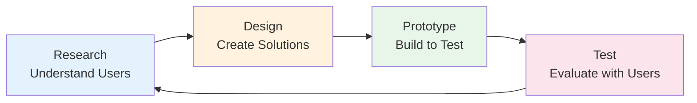
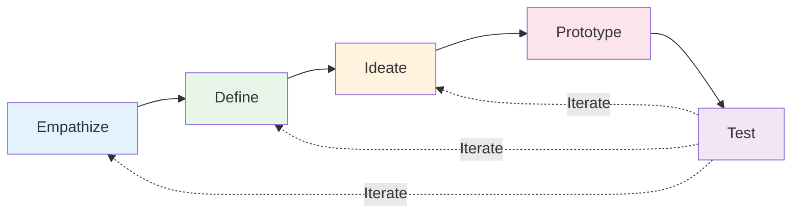
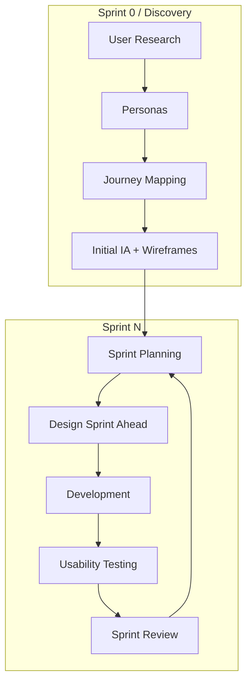

# 9.2 User-Centered Design Process

**Learning Objectives:**
- Understand the user-centered design (UCD) methodology
- Apply the four phases of the UCD cycle
- Use design thinking techniques in software projects
- Integrate UCD activities into Agile development

**Estimated Time:** 30 minutes

---

## What Is User-Centered Design?

### Definition

**User-Centered Design (UCD)** is a design philosophy and process that puts users at the center of every decision. Instead of designing what *we* think is best, we design based on what *users* actually need.

**Core Principle:** "You are not your user."

What seems obvious to you (the designer/developer) may be confusing to users. What you think is a minor annoyance might be a deal-breaker for users. UCD helps you discover these gaps.

### UCD vs. Traditional Design

| Approach | Focus | Process | Risk |
|----------|-------|---------|------|
| **Traditional** | Technology, features | Build, then show users | High—may not meet needs |
| **User-Centered** | User needs, goals | Research, design, test, iterate | Lower—validated with users |

### The Iterative Nature

UCD is not a one-time activity. It's a continuous cycle of learning and improving:



Each cycle improves the design based on real user feedback.

---

## The Four Phases of UCD

### Phase 1: Research (Understand)

**Goal:** Deeply understand who your users are, what they need, and how they currently work.

**Key Activities:**

| Activity | Description | Output |
|----------|-------------|--------|
| **User Interviews** | 1-on-1 conversations with potential users | Interview notes, quotes, insights |
| **Surveys** | Quantitative data from many users | Statistics, preferences, demographics |
| **Observation** | Watch users in their environment | Context, workarounds, pain points |
| **Competitive Analysis** | Study similar products | Feature comparison, gaps, opportunities |
| **Analytics Review** | Analyze existing system data | Usage patterns, drop-off points |

**Research Outputs:**

1. **User Personas** - Archetypal users representing key segments
2. **User Journey Maps** - Visualization of user's experience over time
3. **Problem Statements** - Clear definition of problems to solve
4. **Research Findings Report** - Documented insights

**School System Example:**

```
Research Activity: Teacher Interviews (5 teachers)

Key Findings:
1. Grade entry takes 30+ minutes per class
2. Teachers often enter grades on personal devices at home
3. Most frustrating: re-entering data after timeout
4. Wish list: bulk entry, auto-save, mobile access

Problem Statement:
"Teachers spend excessive time on grade entry because the 
current system requires individual student selection and 
doesn't save progress, causing repeated work and frustration."
```

### Phase 2: Design (Ideate)

**Goal:** Generate and evaluate solutions to the problems identified in research.

**Key Activities:**

| Activity | Description | Output |
|----------|-------------|--------|
| **Brainstorming** | Generate many ideas without judgment | Long list of potential solutions |
| **Sketching** | Quick visual exploration | Paper sketches, whiteboard drawings |
| **Information Architecture** | Organize content structure | Sitemaps, navigation flows |
| **Wireframing** | Low-fidelity screen layouts | Wireframe documents |
| **Design Critique** | Team review of designs | Feedback, iterations |

**Design Principles to Apply:**
- Solve the problems identified in research
- Keep it simple—add complexity only when justified
- Consider all user types identified
- Follow established design patterns when possible

**School System Example:**

```
Design Solution for Grade Entry Problem:

Idea 1: Spreadsheet-style bulk entry
- Show all students in a grid
- Tab between cells like Excel
- Auto-save every 30 seconds

Idea 2: Voice entry
- Teacher speaks grades: "John Adams, 85"
- System transcribes and confirms

Idea 3: Mobile-optimized with offline support
- Works on phone without internet
- Syncs when connection returns

Evaluation: Idea 1 chosen for v1 (simplest, solves main pain points)
           Idea 3 added to future roadmap
```

### Phase 3: Prototype (Build to Test)

**Goal:** Create testable representations of design solutions without full development.

**Prototype Fidelity Spectrum:**

```
Low Fidelity ────────────────────────────────> High Fidelity

Paper Sketches → Wireframes → Mockups → Interactive Prototypes → Working Code
    (hours)       (days)      (days)        (1-2 weeks)         (weeks)
```

| Fidelity | When to Use | Advantages |
|----------|-------------|------------|
| **Paper/Sketches** | Early exploration | Fast, free, easy to change |
| **Wireframes** | Structure validation | Focus on layout, not aesthetics |
| **Mockups** | Visual design validation | Shows final look, stakeholder buy-in |
| **Interactive** | Flow and usability testing | Realistic user experience |

**Prototyping Best Practices:**
- Start low-fidelity, increase only as needed
- Don't over-invest before user feedback
- Make it "good enough to test, not perfect"
- Focus prototype on key user flows

**School System Example:**

```
Prototype Plan for Grade Entry Redesign:

Week 1: Paper Prototype
- Sketch 3 variations of grade entry screen
- Quick hallway tests with 2 teachers
- Result: Spreadsheet layout preferred

Week 2: Digital Wireframe (Figma)
- Create clickable wireframe
- Test with 5 teachers
- Result: Add "Mark All as Zero" feature

Week 3: High-Fidelity Prototype
- Add real visual design
- Include error states, edge cases
- Ready for formal usability testing
```

### Phase 4: Test (Evaluate)

**Goal:** Validate designs with real users to find problems before development.

**Key Testing Methods:**

| Method | Description | Best For |
|--------|-------------|----------|
| **Usability Testing** | Users attempt tasks while observed | Finding interaction problems |
| **A/B Testing** | Compare two designs with metrics | Choosing between options |
| **Heuristic Evaluation** | Experts review against principles | Quick expert feedback |
| **Surveys/Questionnaires** | User satisfaction data | Quantitative feedback |

**Usability Testing Basics:**
1. Define tasks users should complete
2. Recruit 5-8 representative users
3. Have them attempt tasks while thinking aloud
4. Observe without helping
5. Document issues and severity
6. Iterate design based on findings

**School System Example:**

```
Usability Test: Grade Entry Prototype

Participants: 6 teachers (mix of tech comfort levels)

Task 1: Enter grades for 30 students
- 5/6 completed successfully
- 1 couldn't find "Save" button (below fold)
- Average time: 2:15 (vs. 30 min current system!)

Task 2: Find and edit a previously entered grade
- 6/6 completed
- 2 tried clicking student name (expected detail view)
- Add: clickable student names

Task 3: Export grades for report cards
- 4/6 completed
- Export button not noticed—add icon + label

Findings:
1. Move Save button above fold (HIGH priority)
2. Make student names clickable (MEDIUM)
3. Add icon to Export button (MEDIUM)
4. Overall: Design validates research—teachers love it!
```

---

## Design Thinking

### What Is Design Thinking?

**Design Thinking** is a problem-solving approach that emphasizes empathy, creativity, and iteration. It's closely related to UCD but adds specific frameworks.

**The Five Stages:**



| Stage | Activity | Mindset |
|-------|----------|---------|
| **Empathize** | Understand users deeply | Curiosity, observation |
| **Define** | Frame the problem clearly | Focus, clarity |
| **Ideate** | Generate many solutions | Creativity, no judgment |
| **Prototype** | Build to learn | Speed, experimentation |
| **Test** | Learn from users | Humility, openness |

### Design Thinking Techniques

**Empathize:**
- **Empathy Maps** - Visualize what users think, feel, say, do
- **Shadowing** - Follow users through their day
- **Interview for Emotion** - Ask "How did that make you feel?"

**Define:**
- **Problem Statement** - "How might we [solve problem] for [user] so that [outcome]?"
- **Point of View** - [User] needs [need] because [insight]
- **Prioritization Matrix** - Impact vs. Effort

**Ideate:**
- **Brainstorming** - Quantity over quality, no criticism
- **Worst Possible Idea** - Start with bad ideas to unlock creativity
- **SCAMPER** - Substitute, Combine, Adapt, Modify, Put to other uses, Eliminate, Reverse

**School System Example: Design Thinking**

```
EMPATHIZE:
Shadowed Ms. Johnson during grade entry:
- She sighs when opening the current system
- Keeps paper backup "just in case it crashes"
- Enters grades at home after kids' bedtime
- Says "I didn't become a teacher to do data entry"

DEFINE:
How might we make grade entry feel effortless for teachers
so that they can focus on teaching instead of administration?

IDEATE (Brainstorm):
- Voice-controlled entry
- Scan bubble sheets automatically
- AI predicts grades based on patterns
- Students enter their own scores (teacher approves)
- Mobile app with offline mode
- Import from Google Classroom
- One-click templates for common assignments

PROTOTYPE:
Built quick mockup of "Import from Google Classroom" integration

TEST:
Teachers: "This would save me hours every week!"
```

---

## UCD in Agile Development

### Integrating UCD with Scrum

UCD and Agile both value iteration and user feedback. Here's how they work together:



**Key Integration Points:**

| Agile Artifact | UCD Enhancement |
|----------------|-----------------|
| **User Stories** | Based on research findings and personas |
| **Acceptance Criteria** | Include usability criteria |
| **Definition of Done** | Include design review, accessibility check |
| **Sprint Review** | Include usability test results |
| **Retrospective** | Discuss UX wins and improvements |

### Dual-Track Agile

**Problem:** Designers need time ahead of developers, but Agile wants everyone working together.

**Solution:** Dual-Track Development

```
Discovery Track (Design):  ─────────────────────────────────────────────>
                            [Research] [Design Sprint N+1] [Design Sprint N+2]
                                              │                    │
                                              ▼                    ▼
Delivery Track (Dev):      ─────────────────────────────────────────────>
                                      [Build Sprint N]  [Build Sprint N+1]
```

**How It Works:**
- Design works 1-2 sprints ahead of development
- Designs are validated before development begins
- Developers have clear, tested designs to implement
- Continuous collaboration between tracks

---

## UCD Methods Quick Reference

### By Project Phase

| Phase | Methods | Time Investment |
|-------|---------|-----------------|
| **Project Start** | Stakeholder interviews, competitive analysis, personas | 1-2 weeks |
| **Requirements** | User research, journey mapping, problem definition | 1-2 weeks |
| **Design** | Wireframing, prototyping, design critique | 2-4 weeks |
| **Development** | Design handoff, component specs, style guide | Ongoing |
| **Testing** | Usability testing, accessibility audit, A/B testing | 1-2 weeks |
| **Post-Launch** | Analytics review, user feedback, iteration | Ongoing |

### By Budget/Time Constraints

| Constraint | Minimum UCD Activities |
|------------|----------------------|
| **Very Limited** | 5 user interviews, paper prototypes, hallway testing |
| **Moderate** | Full research sprint, digital wireframes, 5-user usability test |
| **Adequate** | Comprehensive research, hi-fi prototypes, multiple test rounds |
| **Ideal** | All the above + analytics, A/B testing, ongoing iteration |

---

## School Management System: UCD Plan

Let's create a UCD plan for our project:

### Discovery Phase (Week 1-2)

**Research Activities:**
- Interview 5 teachers, 5 students, 3 parents, 2 administrators
- Survey 50 teachers on current pain points
- Observe 3 teachers during grade entry
- Analyze competitor school systems

**Outputs:**
- 4 personas (Teacher, Student, Parent, Admin)
- User journey maps for key workflows
- Problem statements for each persona
- Research findings presentation

### Design Phase (Week 3-4)

**Design Activities:**
- Information architecture (sitemap, navigation)
- Wireframes for all major screens
- Design critique sessions
- Style guide development

**Outputs:**
- Sitemap document
- Wireframe package (Figma)
- Style guide
- Component library

### Prototype & Test Phase (Week 5-6)

**Prototyping Activities:**
- Interactive Figma prototype
- Key user flow animations
- Error state designs

**Testing Activities:**
- Usability testing with 6 users (mix of personas)
- Heuristic evaluation by team
- Accessibility audit

**Outputs:**
- Tested prototype
- Usability findings report
- Design iterations
- Development-ready specifications

---

## Key Takeaways

✅ **UCD puts users at the center**
- Research before designing
- Test before building
- Iterate based on feedback

✅ **Four phases of UCD**
- Research → Design → Prototype → Test
- Each phase builds on the previous
- It's a cycle, not a straight line

✅ **Design thinking adds empathy**
- Empathize → Define → Ideate → Prototype → Test
- Focus on understanding the problem deeply
- Generate many solutions before choosing

✅ **UCD works with Agile**
- Design works slightly ahead of development
- Usability testing validates before coding
- Both value iteration and feedback

✅ **Start simple, iterate**
- Any user research is better than none
- Paper prototypes are valuable
- Don't wait for perfect—learn and improve

---

## Self-Check Questions

Test your understanding:

1. **What is the core principle of User-Centered Design?**
   <details>
   <summary>Click to reveal answer</summary>
   "You are not your user." Design decisions should be based on user research and testing, not assumptions about what users want or need.
   </details>

2. **Name the four phases of the UCD process.**
   <details>
   <summary>Click to reveal answer</summary>
   Research (Understand), Design (Ideate), Prototype (Build to Test), Test (Evaluate). These form an iterative cycle.
   </details>

3. **Why should you start with low-fidelity prototypes?**
   <details>
   <summary>Click to reveal answer</summary>
   Low-fidelity prototypes are quick and cheap to create and change. They help you get early feedback before investing significant time in detailed designs. Changes are easier to make.
   </details>

4. **How does design thinking differ from traditional UCD?**
   <details>
   <summary>Click to reveal answer</summary>
   Design thinking adds specific frameworks and techniques, particularly emphasizing the "Empathize" and "Define" phases. It focuses heavily on understanding users emotionally and framing problems clearly before solving.
   </details>

5. **How do UCD and Agile work together?**
   <details>
   <summary>Click to reveal answer</summary>
   Design typically works 1-2 sprints ahead of development (dual-track). User research informs user stories, usability testing validates designs before development, and both approaches value iteration and user feedback.
   </details>

---

## Practice Exercise

**Scenario:** Your school management system needs a new "Assignment Submission" feature for students.

**Task:** Create a mini UCD plan:

1. **Research Phase:** List 3 questions you would ask students in interviews
2. **Design Phase:** Describe 2 different approaches you might explore
3. **Prototype Phase:** What fidelity of prototype would you create first and why?
4. **Test Phase:** Write 2 tasks you would give users during usability testing

<details>
<summary>Click for sample answer</summary>

**1. Research Questions:**
- "Walk me through how you currently submit assignments. What's frustrating?"
- "What happens when you need to submit something at the last minute?"
- "Have you ever submitted the wrong file? What happened?"

**2. Design Approaches:**
- **Approach A:** Drag-and-drop upload with progress bar and confirmation
- **Approach B:** Integration with Google Drive/OneDrive (select from cloud)

**3. Prototype:**
I would start with **paper sketches** because:
- Fast to create (minutes, not hours)
- Easy to iterate after quick feedback
- Focuses discussion on functionality, not aesthetics
- Can test 3-4 variations easily

Then move to **clickable wireframes** after validating the basic approach.

**4. Usability Test Tasks:**
- "You have completed your homework in a Word document. Please submit it for Math 101, Assignment 5."
- "You realized you submitted the wrong file. Find and replace your submission with the correct file."

</details>

---

## What's Next?

Now that you understand the UCD process, we'll dive into the specific skills:

**Section 9.3:** Information Architecture - How to organize content and navigation

**Section 9.4:** Wireframing - Creating visual blueprints for screens

**Section 9.5:** UI Design Principles - Rules for effective visual design

---

## 📚 Additional Reading

**Books:**
- "The User Experience Team of One" by Leah Buley - Practical UCD
- "Sprint" by Jake Knapp - Google's design sprint process
- "Just Enough Research" by Erika Hall - Practical research methods

**Online Resources:**
- IDEO Design Thinking (designthinking.ideo.com) - Free toolkit
- Google Design Sprint (designsprintkit.withgoogle.com) - Sprint methodology
- UX Collective (uxdesign.cc) - Articles and case studies

---

**Previous:** [← Section 9.1: UI/UX Fundamentals](./9_1-ui-ux-fundamentals.md)

**Next:** [Section 9.3: Information Architecture →](./9_3-information-architecture.md)

**Chapter Home:** [Back to Chapter 9 Overview](./chapter-09-README.md)

---

*Last Updated: January 2025*  
*Estimated Reading Time: 30 minutes*
