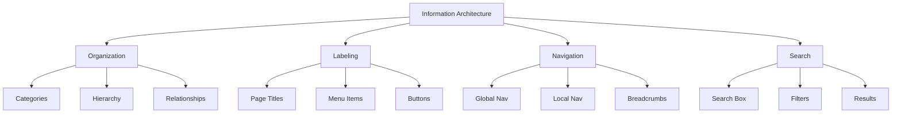
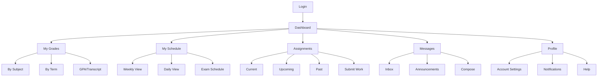
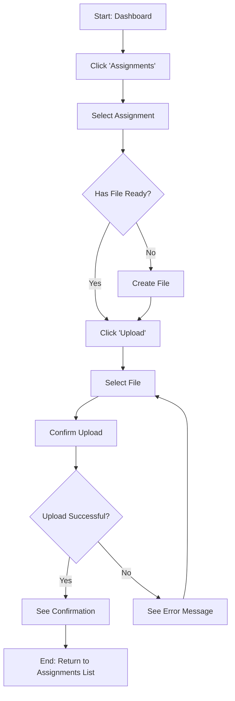

# 9.3 Information Architecture

**Learning Objectives:**
- Understand what information architecture is and why it matters
- Create site maps and navigation structures
- Apply card sorting techniques to organize content
- Design effective navigation patterns

**Estimated Time:** 35 minutes

---

## What Is Information Architecture?

### Definition

**Information Architecture (IA)** is the art and science of organizing, structuring, and labeling content in a way that helps users find what they need and complete tasks efficiently.

Think of IA as the blueprint of your application. Just as a building's floor plan determines how people move through physical space, IA determines how people move through your digital space.

### The Library Analogy

A library without organization would be useless—books piled randomly. Instead, libraries have:
- **Categories** (Fiction, Non-Fiction, Reference)
- **Subcategories** (Mystery, Science Fiction, Biography)
- **Call numbers** (specific location system)
- **Card catalog/Search** (ways to find things)
- **Signage** (navigation aids)

Your application needs the same thoughtful organization.

### Components of Information Architecture



| Component | Purpose | Example |
|-----------|---------|---------|
| **Organization** | How content is grouped | Grades grouped by subject |
| **Labeling** | What things are called | "Grade Book" vs. "Marks" vs. "Scores" |
| **Navigation** | How users move around | Menu, links, breadcrumbs |
| **Search** | How users find specific items | Search bar, filters |

---

## Why Information Architecture Matters

### Impact of Poor IA

**When IA fails:**
- Users can't find what they need
- Tasks take longer than necessary
- Users give up and leave
- Support requests increase
- Trust in the product decreases

**Real Statistics:**
- 50% of potential sales are lost because users can't find information
- Average user spends 25 seconds looking before giving up
- Well-designed IA can reduce support calls by 30%

### Signs of IA Problems

| Symptom | Likely IA Issue |
|---------|-----------------|
| "I can't find X" complaints | Poor navigation or labeling |
| Users using search for everything | Navigation not intuitive |
| High bounce rate on key pages | Content not where expected |
| Support questions about "where" | Category confusion |
| Users clicking back frequently | Wrong navigation paths |

---

## IA Tools and Techniques

### 1. Site Maps

**Definition:** A visual representation of all pages/screens and their relationships.

**Purpose:**
- Shows overall structure at a glance
- Identifies gaps and overlaps
- Helps team align on scope
- Serves as navigation reference

**Basic Site Map Notation:**

```
┌─────────────────────────────────────────────────────────────────┐
│                        Home / Dashboard                          │
└─────────────────────────┬───────────────────────────────────────┘
                          │
     ┌────────────────────┼────────────────────┬────────────────┐
     │                    │                    │                │
     ▼                    ▼                    ▼                ▼
┌─────────┐        ┌───────────┐        ┌───────────┐    ┌──────────┐
│ Grades  │        │ Schedule  │        │ Messages  │    │ Profile  │
└────┬────┘        └─────┬─────┘        └─────┬─────┘    └────┬─────┘
     │                   │                    │               │
     ├─► By Subject      ├─► Weekly View      ├─► Inbox       ├─► Settings
     ├─► By Term         ├─► Daily View       ├─► Compose     └─► Logout
     ├─► Transcript      └─► Calendar         └─► Announcements
     └─► GPA Calculator
```

**School System Site Map - Student Portal:**



### 2. User Flows

**Definition:** Step-by-step paths users take to complete specific tasks.

**Purpose:**
- Identifies all steps in a process
- Reveals unnecessary complexity
- Shows decision points
- Helps design navigation

**User Flow Example: Submit Assignment**



### 3. Card Sorting

**Definition:** A technique where users organize content items into groups that make sense to them.

**Types of Card Sorting:**

| Type | Description | When to Use |
|------|-------------|-------------|
| **Open** | Users create their own categories | Discovery, new product |
| **Closed** | Users sort into predefined categories | Validating existing IA |
| **Hybrid** | Predefined categories, can add new | Refining IA |

**How to Conduct Card Sorting:**

1. **Prepare cards** - Each content item on a card/sticky note
2. **Recruit participants** - 15-20 users recommended
3. **Run sessions** - In-person or using online tools (OptimalSort)
4. **Analyze results** - Look for patterns, agreement levels
5. **Create IA** - Based on how users naturally group items

**Card Sorting Example: School System**

```
Cards prepared:
- View grades by subject
- See GPA
- Download transcript
- Check class schedule
- View exam dates
- Submit homework
- See assignment due dates
- Read teacher messages
- School announcements
- Contact teacher
- Update profile
- Change password
- Notification settings

Common user groupings found:
GROUP 1: "Academic" - Grades, GPA, Transcript
GROUP 2: "Schedule" - Class schedule, Exam dates
GROUP 3: "Work" - Submit homework, Assignment due dates
GROUP 4: "Communication" - Teacher messages, Announcements, Contact
GROUP 5: "Account" - Profile, Password, Notifications
```

---

## Navigation Design

### Navigation Types

**1. Global Navigation**
- Present on every page
- Shows main sections
- Usually horizontal (top) or vertical (sidebar)

**2. Local Navigation**
- Within a section
- Shows subsections/pages
- Changes based on current section

**3. Contextual Navigation**
- Related content links
- "See also" or "Related" sections
- Embedded in content

**4. Utility Navigation**
- Account, Help, Settings, Logout
- Usually top-right corner
- Smaller, secondary

```
┌─────────────────────────────────────────────────────────────────┐
│  🏫 School System    [Utility: Help] [Settings] [Logout]        │ ← Utility Nav
├─────────────────────────────────────────────────────────────────┤
│  Dashboard  │  Grades  │  Schedule  │  Assignments  │  Messages  │ ← Global Nav
├────────────┬────────────────────────────────────────────────────┤
│            │                                                     │
│  Math      │  Grade Book: Math 101                              │
│  Science   │                                                     │
│  English   │  [Content Area]                                    │
│  History   │                                                     │
│            │  Related: View GPA | Download Report               │ ← Contextual
│  ↑         │                                                     │
│ Local Nav  │                                                     │
└────────────┴────────────────────────────────────────────────────┘
```

### Navigation Patterns

**Pattern 1: Top Navigation Bar**
- Best for: 5-8 main sections
- Pros: Visible, familiar, works on desktop
- Cons: Limited space, can crowd on mobile

**Pattern 2: Sidebar Navigation**
- Best for: Many sections, complex hierarchy
- Pros: More space, expandable sections
- Cons: Takes horizontal space, mobile challenges

**Pattern 3: Hamburger Menu**
- Best for: Mobile, secondary items
- Pros: Saves space, familiar on mobile
- Cons: Hidden (lower discoverability)

**Pattern 4: Tab Navigation**
- Best for: Switching between views of same content
- Pros: Clear current state, easy switching
- Cons: Limited to few tabs, same content level only

**Pattern 5: Breadcrumbs**
- Best for: Deep hierarchies
- Pros: Shows location, easy back-navigation
- Cons: Takes space, not for flat structures

### Navigation Best Practices

| Do | Don't |
|----|----|
| Use clear, familiar labels | Use jargon or clever names |
| Show current location clearly | Leave users guessing where they are |
| Keep depth shallow (3 levels max) | Bury content deeply |
| Maintain consistency across pages | Change navigation based on page |
| Test with users | Assume your structure makes sense |

---

## Labeling Systems

### Why Labels Matter

**A label is a user's wayfinding sign.** Good labels:
- Tell users exactly what to expect
- Match user vocabulary (not internal jargon)
- Are consistent throughout the system
- Are concise yet descriptive

### Common Labeling Mistakes

| Mistake | Example | Better |
|---------|---------|--------|
| **Jargon** | "SRS Viewer" | "Requirements Documents" |
| **Vague** | "Resources" | "Study Materials" |
| **Cute** | "The Zone" | "Student Portal" |
| **Inconsistent** | "Grades" here, "Marks" there | Pick one, use everywhere |
| **Ambiguous** | "Activity" | "Recent Assignments" |

### Testing Labels

**First-Click Testing:**
- Show users a task: "You want to see your grade in Math"
- Show them the navigation
- Record where they click first
- If most click the right place, label works

**School System Label Choices:**

| Option A | Option B | User Testing Result |
|----------|----------|---------------------|
| "Grade Book" | "My Grades" | "My Grades" (78%) |
| "Coursework" | "Assignments" | "Assignments" (91%) |
| "Communications" | "Messages" | "Messages" (85%) |
| "Timetable" | "Schedule" | "Schedule" (70%) |

---

## School Management System: IA Design

### Student Portal Information Architecture

**Sitemap:**

```
Student Portal
│
├── Dashboard
│   ├── Quick Stats (GPA, Upcoming Due)
│   ├── Recent Grades
│   └── Announcements
│
├── My Grades
│   ├── By Subject
│   │   ├── Math 101
│   │   ├── English 201
│   │   └── ...
│   ├── By Term
│   │   ├── Fall 2024
│   │   ├── Spring 2024
│   │   └── ...
│   └── GPA & Transcript
│       ├── GPA Calculator
│       └── Official Transcript Request
│
├── Schedule
│   ├── Weekly View (default)
│   ├── Daily View
│   └── Exam Schedule
│
├── Assignments
│   ├── Due Soon (default)
│   ├── All Assignments
│   │   ├── Filter: Subject
│   │   └── Filter: Status
│   └── Submit Work
│
├── Messages
│   ├── Inbox
│   ├── Sent
│   ├── Announcements
│   └── Compose
│
└── Profile
    ├── Account Settings
    ├── Notification Preferences
    └── Help & Support
```

**Primary Navigation Decisions:**

| Decision | Choice | Rationale |
|----------|--------|-----------|
| Navigation style | Top nav + sidebar | Clear global sections, room for local nav |
| Number of sections | 5 main sections | Manageable cognitive load |
| Default landing | Dashboard | Overview before diving into specific areas |
| Grade organization | By subject (default) | Most common user mental model |
| Assignment view | Due soon (default) | Highest priority for students |

**User Flow: View Grade for Specific Assignment**

```
Dashboard → My Grades → Math 101 → Homework 5 → Grade Detail
   (1)         (2)         (3)          (4)          (5)
```

Maximum 5 clicks to reach any grade detail—acceptable depth.

---

## IA Documentation

### What to Document

Your IA deliverables should include:

1. **Site Map**
   - Visual hierarchy of all sections
   - Page names and relationships
   - Annotation of user types/roles if different

2. **Navigation Specification**
   - Primary navigation items
   - Secondary navigation structure
   - Utility navigation items
   - Navigation behavior (hover, click, etc.)

3. **Content Inventory** (if redesigning existing system)
   - All current content items
   - Proposed location in new IA
   - Items to remove or merge

4. **Labeling Glossary**
   - Approved labels for all elements
   - Definitions/descriptions
   - Usage guidelines

### Example: Navigation Specification

```markdown
## Primary Navigation (Top Bar)

| Label | URL Path | Description |
|-------|----------|-------------|
| Dashboard | /dashboard | Student's home overview |
| My Grades | /grades | Grade viewing by subject/term |
| Schedule | /schedule | Class and exam schedules |
| Assignments | /assignments | View and submit assignments |
| Messages | /messages | Communication center |

## User Menu (Top Right)

| Label | Action |
|-------|--------|
| [Student Name] | Opens profile dropdown |
| → Settings | Navigate to /settings |
| → Help | Open help center |
| → Logout | End session |

## Breadcrumb Format

Format: Home > Section > Subsection > Page
Example: Dashboard > My Grades > Math 101 > Homework 5
```

---

## Key Takeaways

✅ **IA is the foundation of good UX**
- Without organization, users can't find content
- IA decisions affect everything built on top

✅ **Four components of IA**
- Organization: How content is grouped
- Labeling: What things are called
- Navigation: How users move around
- Search: How users find specific items

✅ **Use the right tools**
- Site maps show structure
- User flows show task paths
- Card sorting reveals user mental models

✅ **Navigation should be obvious**
- Show current location
- Use familiar patterns
- Keep hierarchy shallow (3 levels max)
- Test with users

✅ **Labels matter more than you think**
- Use user vocabulary, not jargon
- Be consistent throughout
- Test labels with users

---

## Self-Check Questions

Test your understanding:

1. **What are the four components of Information Architecture?**
   <details>
   <summary>Click to reveal answer</summary>
   Organization (how content is grouped), Labeling (what things are called), Navigation (how users move around), and Search (how users find specific items).
   </details>

2. **What is card sorting and when would you use it?**
   <details>
   <summary>Click to reveal answer</summary>
   Card sorting is a technique where users organize content items into groups that make sense to them. Use it to discover how users naturally categorize content (open sort) or validate an existing IA (closed sort).
   </details>

3. **What's the difference between global and local navigation?**
   <details>
   <summary>Click to reveal answer</summary>
   Global navigation is present on every page and shows main sections. Local navigation is within a section and shows subsections—it changes based on which section you're in.
   </details>

4. **Why is "Resources" a poor navigation label?**
   <details>
   <summary>Click to reveal answer</summary>
   It's too vague. Users can't tell what's under "Resources"—it could be anything. A more specific label like "Study Materials" or "Support Documents" sets clearer expectations.
   </details>

5. **What's the recommended maximum depth for navigation hierarchy?**
   <details>
   <summary>Click to reveal answer</summary>
   3 levels maximum. Deeper hierarchies make content hard to find and require too many clicks. If you need more depth, consider reorganizing or adding search.
   </details>

---

## Practice Exercise

**Scenario:** You're designing a teacher portal for the School Management System.

**Task:** Create a simple site map with:
- 5 main sections teachers would need
- 2-3 subsections under each main section
- Clear, user-friendly labels

<details>
<summary>Click for sample answer</summary>

**Teacher Portal Sitemap:**

```
Teacher Portal
│
├── Dashboard
│   ├── Today's Schedule
│   ├── Recent Activity
│   └── Alerts & Notifications
│
├── My Classes
│   ├── Class Rosters
│   ├── Attendance
│   └── Seating Charts
│
├── Grade Book
│   ├── Enter Grades
│   ├── View All Grades
│   └── Grade Reports
│
├── Assignments
│   ├── Create Assignment
│   ├── View Submissions
│   └── Assignment Calendar
│
└── Messages
    ├── Compose
    ├── Inbox
    └── Announcements
```

**Label Decisions:**
- "My Classes" instead of "Class Management" (simpler)
- "Grade Book" instead of "Assessment" (familiar teacher term)
- "Assignments" separate from "Grade Book" (different workflows)

</details>

---

## What's Next?

Now that you understand how to structure content, we'll learn to visualize it:

**Section 9.4:** Wireframing - Creating visual blueprints of your screens

**Section 9.5:** UI Design Principles - Rules for effective visual design

---

## 📚 Additional Reading

**Books:**
- "Information Architecture" by Louis Rosenfeld & Peter Morville - The foundational text
- "How to Make Sense of Any Mess" by Abby Covert - Accessible IA introduction

**Online Resources:**
- Nielsen Norman Group IA Articles (nngroup.com)
- The IA Institute (iainstitute.org)
- OptimalSort for online card sorting

**Tools:**
- OmniGraffle, Lucidchart, Figma - Sitemap creation
- OptimalSort, UserZoom - Card sorting
- Treejack - IA testing

---

**Previous:** [← Section 9.2: User-Centered Design Process](./9_2-design-process.md)

**Next:** [Section 9.4: Wireframing →](./9_4-wireframing.md)

**Chapter Home:** [Back to Chapter 9 Overview](./chapter-09-README.md)

---

*Last Updated: January 2025*  
*Estimated Reading Time: 35 minutes*
