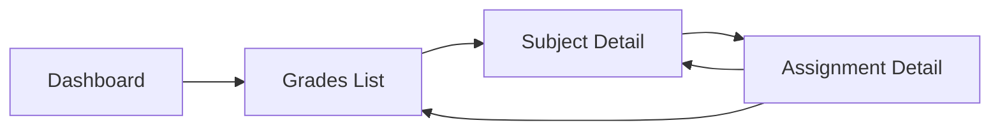

# 9.9 Prototyping

**Learning Objectives:**
- Understand prototype types and fidelity levels
- Create interactive prototypes in Figma
- Design user flows and transitions
- Test prototypes with users

**Estimated Time:** 35 minutes

---

## What Is Prototyping?

### Definition

A **prototype** is an interactive simulation of a product that allows users to experience the design before development.

**Key Difference from Wireframes:**
- Wireframes = Static layouts
- Prototypes = Interactive experiences

### Why Prototype?

- **Validate designs** before expensive development
- **Test user flows** and identify problems
- **Communicate** design intent clearly
- **Get stakeholder buy-in** with tangible demos
- **Reduce risk** of building the wrong thing

---

## Prototype Fidelity

| Fidelity | Appearance | Interactivity | Use Case |
|----------|------------|---------------|----------|
| **Low** | Sketchy, boxes | Click-through only | Concept testing |
| **Medium** | Wireframe style | Basic navigation | Flow validation |
| **High** | Final visual design | Realistic interactions | Usability testing |

### When to Use Each

```
Project Timeline:
─────────────────────────────────────────────────────────►

Lo-Fi          Mid-Fi              Hi-Fi
[Week 1-2]     [Week 3-4]          [Week 5-6]
Concept        Flow                Polish
Exploration    Validation          & Testing
```

---

## Figma Prototyping Basics

### Creating Connections

1. Select element (button, link, card)
2. Click prototype tab
3. Drag connector to destination frame
4. Set interaction type and animation

### Common Interactions

| Trigger | When Used |
|---------|-----------|
| **On Click** | Buttons, links, cards |
| **On Hover** | Tooltips, dropdowns (desktop) |
| **On Drag** | Sliders, swipe actions |
| **While Pressing** | Hold states |
| **After Delay** | Auto-advance, notifications |

### Animation Types

| Animation | Effect | Best For |
|-----------|--------|----------|
| **Instant** | No animation | Fast clicks |
| **Dissolve** | Fade transition | Page changes |
| **Move In/Out** | Slide from direction | Navigation |
| **Push** | Push content away | Drawer/panel |
| **Slide In/Out** | Element slides | Mobile nav |

---

## Building a Prototype

### Step 1: Create Key Screens

Start with the essential screens for your flow:
- Entry point (Dashboard, Login)
- Task screens (View, Create, Edit)
- Confirmation/Success states

### Step 2: Define User Flow

Map the path users take:



### Step 3: Add Interactions

Connect screens with appropriate triggers:

```
Dashboard
  │
  └── Click "View Grades" → Grades List (Dissolve)
      │
      └── Click subject row → Subject Detail (Move In Right)
          │
          └── Click assignment → Assignment Modal (Move In Up)
              │
              └── Click X → Close Modal (Move Out Down)
```

### Step 4: Add States

Create component variants for:
- Default state
- Hover state
- Active/Selected state
- Disabled state

---

## School System Prototype Example

### Flow: Submit Assignment

**Screens Needed:**
1. Assignments List
2. Assignment Detail
3. Upload State (with progress)
4. Confirmation

**Interactions:**

```
Screen 1: Assignments List
├── Click assignment row → Screen 2

Screen 2: Assignment Detail  
├── Click "Upload File" → File picker (native)
├── File selected → Screen 3

Screen 3: Upload Progress
├── Progress animation (0% → 100%)
├── After delay → Screen 4

Screen 4: Confirmation
├── Click "Done" → Screen 1
├── Click "View Submission" → Submission detail
```

**Prototype Annotations:**

```
┌─────────────────────────────────────────┐
│ Submit Assignment                        │
├─────────────────────────────────────────┤
│                                         │
│ Assignment: Problem Set 6               │
│ Due: Jan 25, 11:59 PM                   │
│                                         │
│ ┌─────────────────────────────────────┐ │
│ │                                     │ │
│ │     [  Drop file or Browse  ]       │─┼── Click triggers file dialog
│ │                                     │ │   Accepts: PDF, DOC, DOCX
│ └─────────────────────────────────────┘ │
│                                         │
│          [Submit Assignment]            │─── Disabled until file selected
│                                         │    Enabled: primary button style
└─────────────────────────────────────────┘
```

---

## Prototype Testing

### Testing with Users

1. **Recruit 5 users** - Different experience levels
2. **Define tasks** - Specific goals to accomplish
3. **Observe** - Watch without helping
4. **Ask questions** - "What did you expect to happen?"
5. **Document** - Record issues and severity

### Test Script Example

```markdown
## Assignment Submission Test

**Setup:**
- Show user the dashboard screen
- Explain they need to submit homework

**Task:**
"You've completed your Math homework and need to submit it. 
Please show me how you would do that."

**Observe:**
- Where do they click first?
- Any hesitation or confusion?
- Do they complete the task?

**Follow-up Questions:**
- Was anything confusing?
- What did you expect when you clicked [X]?
- How would you improve this?
```

### Common Findings

| Finding | Severity | Action |
|---------|----------|--------|
| User couldn't find upload button | High | Make more prominent |
| Confused by progress state | Medium | Add clearer messaging |
| Expected drag-drop to work | Low | Add to next iteration |

---

## Prototype Best Practices

### Do:
- Start simple, add complexity
- Test early and often
- Focus on key user flows
- Use realistic content
- Include error states

### Don't:
- Prototype everything
- Add unnecessary animations
- Use lorem ipsum
- Skip testing
- Treat prototype as final design

---

## Key Takeaways

✅ **Prototypes validate before building**
- Test flows and interactions
- Find problems early

✅ **Match fidelity to purpose**
- Lo-fi for exploration
- Hi-fi for usability testing

✅ **Focus on key flows**
- Don't prototype everything
- Cover critical paths

✅ **Test with real users**
- 5 users find most issues
- Observe, don't guide

---

## Self-Check Questions

1. **What's the difference between a wireframe and a prototype?**
   <details>
   <summary>Click to reveal answer</summary>
   Wireframes are static layouts showing structure. Prototypes are interactive, allowing users to click through and experience flows.
   </details>

2. **When should you use high-fidelity prototypes?**
   <details>
   <summary>Click to reveal answer</summary>
   For usability testing with realistic interactions, stakeholder presentations, and developer handoff when final design details matter.
   </details>

3. **How many users should you test a prototype with?**
   <details>
   <summary>Click to reveal answer</summary>
   5 users typically find 80% of usability issues. This is enough for iterative testing without requiring large recruitment.
   </details>

---

## Practice Exercise

Plan a prototype for the "View Grades" flow:

1. List the screens needed
2. Define the user flow (diagram)
3. Specify key interactions

<details>
<summary>Click for sample answer</summary>

**Screens:**
1. Dashboard (entry point)
2. Grades List (all subjects)
3. Subject Detail (Math 101)
4. Assignment Detail Modal

**Flow:**
```
Dashboard → Grades List → Subject Detail → Assignment Modal
    ↑           ↑              ↑               │
    └───────────┴──────────────┴───────────────┘
                    (Navigation back)
```

**Interactions:**
- Dashboard: Click "Grades" card → Grades List (Dissolve)
- Grades List: Click subject row → Subject Detail (Push Right)
- Subject Detail: Click assignment → Modal (Move In Up)
- Modal: Click X or outside → Close (Move Out Down)
- All: Click breadcrumb → Navigate to that level

</details>

---

**Previous:** [← Section 9.8: Responsive & Mobile-First Design](./9_8-responsive-design.md)

**Next:** [Section 9.10: Usability Testing →](./9_10-usability-testing.md)

**Chapter Home:** [Back to Chapter 9 Overview](./chapter-09-README.md)

---

*Last Updated: January 2025*  
*Estimated Reading Time: 35 minutes*
