# Chapter 9: User Interface and Experience Design

**Course:** Software Analysis and Design  
**Target Audience:** Software Development Diploma Students  
**Chapter Duration:** 4-5 hours  
**Prerequisites:** Chapter 8 (Detailed Design and Component Design)

---

## 📋 Chapter Overview

Welcome to Chapter 9! This chapter bridges the gap between technical design and what users actually see and interact with. You'll learn how to create interfaces that are not just functional, but intuitive, accessible, and delightful to use.

As developers and analysts, you may not become full-time designers, but you will work closely with them, review their work, implement their designs, and often need to make UI decisions yourself. Understanding UI/UX principles makes you a more effective team member and helps you build software that users actually want to use.

By the end of this chapter, you'll understand:
- How to apply user-centered design principles in your projects
- The process of creating wireframes and prototypes
- How to evaluate and improve user interfaces using established heuristics
- Accessibility requirements and how to meet them (WCAG guidelines)
- Responsive design techniques for multi-device support
- How to collaborate effectively with designers on your team

---

## 🎯 Learning Objectives

By completing this chapter, you will be able to:

1. **Explain** the principles of user-centered design and why they matter
2. **Create** information architecture diagrams showing content organization
3. **Design** wireframes for application screens using standard tools
4. **Apply** UI design principles (consistency, visibility, feedback, error prevention)
5. **Build** interactive prototypes to validate design decisions
6. **Evaluate** interfaces using Nielsen's 10 usability heuristics
7. **Implement** accessibility features following WCAG 2.1 guidelines
8. **Design** responsive layouts that work across devices
9. **Conduct** basic usability testing and interpret results
10. **Collaborate** with designers using shared terminology and tools

---

## 📚 Chapter Contents

### Core Content Sections

| Section | Title | Pages | Time | Topics |
|---------|-------|-------|------|--------|
| **[9.1](./9_1-ui-ux-fundamentals.md)** | UI/UX Fundamentals | 6 | 35 min | What is UI vs UX, user-centered design, psychology of users, mental models |
| **[9.2](./9_2-design-process.md)** | User-Centered Design Process | 5 | 30 min | Research, ideation, design, testing cycle, design thinking methodology |
| **[9.3](./9_3-information-architecture.md)** | Information Architecture | 5 | 35 min | Content organization, navigation patterns, sitemaps, card sorting |
| **[9.4](./9_4-wireframing.md)** | Wireframing | 6 | 40 min | Lo-fi to hi-fi wireframes, tools, component libraries, wireframe documentation |
| **[9.5](./9_5-design-principles.md)** | UI Design Principles | 6 | 40 min | Gestalt principles, visual hierarchy, consistency, feedback, affordances |
| **[9.6](./9_6-interaction-design.md)** | Interaction Design Patterns | 5 | 35 min | Common UI patterns, navigation, forms, search, notifications, microinteractions |
| **[9.7](./9_7-accessibility.md)** | Accessibility (WCAG) | 6 | 40 min | WCAG 2.1 guidelines, POUR principles, assistive technologies, testing |
| **[9.8](./9_8-responsive-design.md)** | Responsive & Mobile-First Design | 5 | 35 min | Breakpoints, fluid layouts, mobile patterns, progressive enhancement |
| **[9.9](./9_9-prototyping.md)** | Prototyping | 5 | 35 min | Interactive prototypes, tools (Figma), user flows, prototype testing |
| **[9.10](./9_10-usability-testing.md)** | Usability Testing | 5 | 35 min | Test planning, heuristic evaluation, user testing, analyzing results |
| **[9.11](./9_11-hands-on-activities.md)** | Hands-on Activities | 6 | 50 min | Wireframe creation, prototype building, heuristic evaluation, accessibility audit |
| **[9.12](./9_12-chapter-summary.md)** | Summary & Assessment | 4 | 25 min | Recap, quiz, assignments, next steps |

**Total:** ~64 pages | ~7 hours (including activities)

---

## 🗺️ Learning Path

```mermaid
graph LR
    A[9.1: UI/UX<br/>Fundamentals] --> B[9.2: Design<br/>Process]
    B --> C[9.3: Information<br/>Architecture]
    C --> D[9.4: Wireframing]
    D --> E[9.5: Design<br/>Principles]
    E --> F[9.6: Interaction<br/>Design]
    F --> G[9.7: Accessibility]
    G --> H[9.8: Responsive<br/>Design]
    H --> I[9.9: Prototyping]
    I --> J[9.10: Usability<br/>Testing]
    J --> K[9.11: Hands-on<br/>Activities]
    K --> L[9.12: Summary &<br/>Assessment]
    
    style A fill:#e3f2fd
    style B fill:#e3f2fd
    style C fill:#fff3e0
    style D fill:#fff3e0
    style E fill:#e8f5e9
    style F fill:#e8f5e9
    style G fill:#fce4ec
    style H fill:#fce4ec
    style I fill:#f3e5f5
    style J fill:#f3e5f5
    style K fill:#fff9c4
    style L fill:#e0f2f1
```

---

## 📖 How to Use This Chapter

### For Students

1. **Sequential Learning**: Follow sections in order—each builds on previous concepts
2. **Practice with Tools**: Download Figma (free) and follow along with exercises
3. **Analyze Real Apps**: Look critically at apps you use daily—apply what you learn
4. **Build Your Portfolio**: The wireframes and prototypes you create become portfolio pieces
5. **Case Study Focus**: Apply all techniques to the School Management System

### For Instructors

1. **Interactive Delivery**: This chapter benefits heavily from live demonstrations
2. **Tool Demonstrations**: Show Figma/wireframing tools in real-time
3. **Critique Sessions**: Review and discuss real application interfaces
4. **Guest Speakers**: Invite a UX designer to speak if possible
5. **Portfolio Reviews**: Help students see how these skills enhance their job applications

---

## ⏱️ Suggested Teaching Schedule

### **Session 1: Foundations (2 hours)**
- **0:00-0:35** - Section 9.1: UI/UX Fundamentals
- **0:35-1:05** - Section 9.2: User-Centered Design Process
- **1:05-1:15** - *Break*
- **1:15-1:50** - Section 9.3: Information Architecture
- **1:50-2:00** - Quick recap + Q&A

### **Session 2: Design Essentials (2 hours)**
- **0:00-0:40** - Section 9.4: Wireframing (with live demo)
- **0:40-1:20** - Section 9.5: UI Design Principles
- **1:20-1:30** - *Break*
- **1:30-2:00** - Section 9.6: Interaction Design Patterns

### **Session 3: Quality & Responsiveness (1.5 hours)**
- **0:00-0:40** - Section 9.7: Accessibility (WCAG)
- **0:40-1:15** - Section 9.8: Responsive & Mobile-First Design
- **1:15-1:30** - Review and discussion

### **Session 4: Prototyping & Testing (1.5 hours)**
- **0:00-0:35** - Section 9.9: Prototyping (with Figma demo)
- **0:35-1:10** - Section 9.10: Usability Testing
- **1:10-1:30** - Introduce chapter assignment

### **Session 5: Practice & Assessment (2 hours - can be separate)**
- **0:00-0:50** - Section 9.11: Hands-on Activities
- **0:50-1:00** - *Break*
- **1:00-1:30** - Section 9.12: Summary & Assessment
- **1:30-2:00** - Workshop: Begin wireframe assignment

---

## 🎓 Prerequisites Check

Before starting this chapter, ensure you understand:

- [x] Requirements gathering and documentation (Chapter 2)
- [x] Use case modeling and user workflows (Chapter 3)
- [x] System architecture concepts (Chapter 7)
- [x] Component design principles (Chapter 8)
- [x] The School Management System case study context

**Missing these?** Review Chapter 2 (requirements drive design) and Chapter 3 (use cases define user workflows).

---

## 🛠️ Required Tools & Resources

### Essential Tools (Free)

1. **Wireframing & Prototyping:**
   - Figma (free tier) - Primary tool for this course
   - Balsamiq (free trial) - Quick lo-fi wireframes
   - Draw.io/Diagrams.net - For information architecture diagrams

2. **Accessibility Testing:**
   - WAVE Web Accessibility Evaluator (browser extension)
   - axe DevTools (browser extension)
   - Color Contrast Analyzer (free tool)

3. **Prototyping:**
   - Figma prototyping features
   - InVision (free tier)
   - Marvel (free tier)

4. **Design Resources:**
   - Material Design documentation (Google)
   - Apple Human Interface Guidelines
   - UI pattern libraries

### Templates & Resources

Download before starting:
- ✅ Wireframe Component Library (Figma file)
- ✅ Information Architecture Template
- ✅ Usability Test Script Template
- ✅ Heuristic Evaluation Checklist
- ✅ Accessibility Audit Template
- ✅ Style Guide Template

---

## 📦 Chapter Materials & Files

All files for this chapter:

### Core Content Files (Markdown)
1. `9_1-ui-ux-fundamentals.md` - Understanding UI vs UX, user psychology
2. `9_2-design-process.md` - User-centered design methodology
3. `9_3-information-architecture.md` - Organizing content and navigation
4. `9_4-wireframing.md` - Creating wireframes from lo-fi to hi-fi
5. `9_5-design-principles.md` - Visual and interaction design principles
6. `9_6-interaction-design.md` - Common patterns and microinteractions
7. `9_7-accessibility.md` - WCAG guidelines and implementation
8. `9_8-responsive-design.md` - Mobile-first and responsive techniques
9. `9_9-prototyping.md` - Building interactive prototypes
10. `9_10-usability-testing.md` - Testing and evaluation methods
11. `9_11-hands-on-activities.md` - Practical exercises and workshops
12. `9_12-chapter-summary.md` - Summary, quiz, and next steps

### Presentation Files
13. `chapter-09-presentation-01.json` - Presentation Part 1 (60 min)
    - UI/UX fundamentals
    - Design process
    - Information architecture
    - Wireframing
    
14. `chapter-09-presentation-02.json` - Presentation Part 2 (60 min)
    - Design principles
    - Interaction patterns
    - Accessibility
    - Responsive design
    - Prototyping
    - Usability testing

### Supporting Files
15. `9_template-wireframe-specs.md` - Wireframe documentation template
16. `9_template-usability-test.md` - Usability test script template
17. `9_case-study-school-system-ui.md` - UI designs for course project

---

## 📊 Assessment Components

### Chapter Quiz (20%)
- 25 questions covering all sections
- Multiple choice and matching
- Heuristic identification questions
- Accessibility compliance scenarios

### Practical Exercises (30%)
1. **Heuristic Evaluation** (15%)
   - Evaluate an existing application using Nielsen's heuristics
   - Document 10+ usability issues with severity ratings
   - Propose solutions for each issue

2. **Accessibility Audit** (15%)
   - Test a website for WCAG 2.1 compliance
   - Document violations with screenshots
   - Provide remediation recommendations

### Wireframe & Prototype Project (50%)
- Create complete wireframes for School Management System Student Portal
- Build interactive prototype with navigation
- Include responsive versions (mobile + desktop)
- Document design decisions

### Grading Criteria (Wireframe Project)
- Completeness of screens (25%)
- Application of design principles (25%)
- Accessibility considerations (20%)
- Prototype interactivity (15%)
- Documentation quality (15%)

---

## 📊 Portfolio Deliverable

**Main Deliverable:** UI/UX Design Package

**For School Management System - Student Portal:**
- Information architecture diagram (sitemap)
- Low-fidelity wireframes (all screens)
- High-fidelity wireframes (key screens)
- Interactive prototype (Figma)
- Style guide (colors, typography, components)
- Accessibility compliance documentation
- Usability test results (if conducted)

**Grading Criteria:**
- Design quality and consistency (30%)
- Application of UI/UX principles (25%)
- Accessibility compliance (20%)
- Prototype functionality (15%)
- Documentation and presentation (10%)

---

## 🔗 Quick Navigation

**Start Learning:**
- 👉 **[Begin with Section 9.1: UI/UX Fundamentals](./9_1-ui-ux-fundamentals.md)**

**Jump to Specific Topics:**
- [Design Process](./9_2-design-process.md) - User-centered methodology
- [Information Architecture](./9_3-information-architecture.md) - Organizing content
- [Wireframing](./9_4-wireframing.md) - Creating visual blueprints
- [Design Principles](./9_5-design-principles.md) - Visual hierarchy and more
- [Accessibility](./9_7-accessibility.md) - WCAG guidelines
- [Prototyping](./9_9-prototyping.md) - Interactive mockups
- [Activities](./9_11-hands-on-activities.md) - Practice exercises

**Resources:**
- [Interaction Patterns](./9_6-interaction-design.md)
- [Responsive Design](./9_8-responsive-design.md)
- [Usability Testing](./9_10-usability-testing.md)
- [Summary & Quiz](./9_12-chapter-summary.md)

---

## 💡 Learning Tips

**For This Chapter:**

1. **Think Like a User**: Every design decision should answer "Does this help the user achieve their goal?"

2. **Sketch First**: Don't jump into Figma immediately. Paper sketches help you think without tool constraints.

3. **Study Good Design**: Notice what makes apps you love enjoyable. What makes frustrating apps frustrating?

4. **Get Feedback Early**: Show wireframes to others before investing in high-fidelity designs.

5. **Accessibility First**: It's much easier to build accessible from the start than to retrofit later.

6. **Mobile Matters**: Most users will access your system on phones. Design for that constraint first.

---

## ❓ FAQ

**Q: I'm not artistic. Can I still do UI design?**
A: Absolutely! UI/UX design is more about problem-solving than artistic talent. Wireframes are specifically meant to be simple—no artistic skill required.

**Q: Why do developers need to know design?**
A: You'll implement designs, review designs for feasibility, make quick design decisions, and communicate with designers. Understanding their language makes you more effective.

**Q: Which tool should I use for wireframing?**
A: Figma is the industry standard and free for students. Start there. Balsamiq is great for quick lo-fi wireframes.

**Q: How detailed should wireframes be?**
A: Start lo-fi (boxes and labels), then add detail. For class projects, high-fidelity wireframes showing real content and styling are expected.

**Q: Is accessibility really that important?**
A: Yes! About 15% of people have some disability. Plus, many countries legally require accessible software. It's also just good design.

**Q: What if I have limited time?**
A: Focus on wireframing (9.4), design principles (9.5), and accessibility (9.7). These are the highest-value sections for developers.

---

## 🎓 Real-World Connection

### Why This Matters for Your Career

**Software Developer:**
- Implement designs accurately from wireframes
- Make informed UI decisions when specs are ambiguous
- Communicate effectively with designers
- Build accessible applications (often legally required)

**Business Analyst:**
- Create wireframes to validate requirements with stakeholders
- Bridge the gap between users and technical teams
- Ensure solutions address real user needs
- Salary boost: BAs with UX skills earn 10-15% more

**Product Manager:**
- Validate product concepts with prototypes
- Conduct usability testing
- Make data-driven design decisions
- Communicate product vision visually

**Full-Stack Developer:**
- Build user interfaces that actually work well
- Understand frontend frameworks' design patterns
- Create consistent, accessible experiences
- Stand out in job market with UX awareness

---

## 🌟 Success Stories

**Case Study: Terrible vs. Excellent UI**

**United Airlines Check-In (2016) - Poor UI:**
- Confusing navigation, users couldn't find check-in
- Critical information hidden behind multiple clicks
- Error messages unclear, users gave up
- Result: Customer complaints, lost revenue, PR disaster

**Airbnb Search (2020 Redesign) - Excellent UI:**
- Clear visual hierarchy guides users naturally
- Progressive disclosure keeps interface simple
- Accessibility built in from the start
- Mobile-first approach works everywhere
- Result: 30% increase in bookings, industry awards

**Your designs will either frustrate or delight users. This chapter teaches you to delight.**

---

## 📊 Progress Tracker

Track your progress through the chapter:

- [ ] 9.1 - UI/UX Fundamentals
- [ ] 9.2 - User-Centered Design Process
- [ ] 9.3 - Information Architecture
- [ ] 9.4 - Wireframing
- [ ] 9.5 - UI Design Principles
- [ ] 9.6 - Interaction Design Patterns
- [ ] 9.7 - Accessibility (WCAG)
- [ ] 9.8 - Responsive & Mobile-First Design
- [ ] 9.9 - Prototyping
- [ ] 9.10 - Usability Testing
- [ ] 9.11 - Hands-on Activities
- [ ] 9.12 - Chapter Summary & Assessment

**Completion Status:** 0/12 sections

---

## 🔄 Integration with Course Project

Throughout this chapter, you'll continue developing the **School Management System**:

**Chapter 9 Deliverables for Course Project:**

1. **Information Architecture**: Site map and navigation structure
2. **Wireframes**: All major screens for Student Portal
   - Login/Dashboard
   - Grade viewing
   - Assignment submission
   - Schedule viewing
   - Profile management
3. **Interactive Prototype**: Clickable Figma prototype
4. **Style Guide**: Colors, typography, component library
5. **Accessibility Documentation**: WCAG compliance checklist

This UI/UX package will be combined with your SRS (Chapter 2), use cases (Chapter 3), UML diagrams (Chapter 5), database design (Chapter 6), architecture (Chapter 7), and component design (Chapter 8) for your final portfolio!

---

## 🚀 Ready to Begin?

Great user interfaces don't happen by accident—they're designed intentionally with users in mind. Master these skills and you'll:

- Create software that users actually enjoy using
- Save development time by validating designs before coding
- Build accessible applications that work for everyone
- Communicate effectively with designers and stakeholders
- Stand out in the job market with valuable UX skills

**Let's dive in!**

### 👉 **[Proceed to Section 9.1: UI/UX Fundamentals →](./9_1-ui-ux-fundamentals.md)**

---

**Previous Chapter:** [← Chapter 8: Detailed Design and Component Design](../chapter-08/chapter-08-README.md)

**Next Chapter:** [Chapter 10: Design Documentation and Communication →](../chapter-10/chapter-10-README.md)

**Course Home:** [Back to Course Overview](../README.md)

---

*Last Updated: January 2025*  
*Version: 1.0*
*Estimated Study Time: 6-7 hours*
*Hands-on Practice: 3-4 hours*
